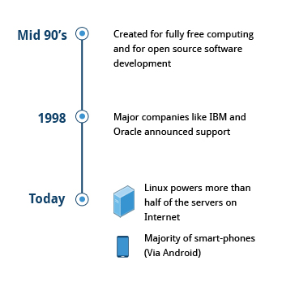
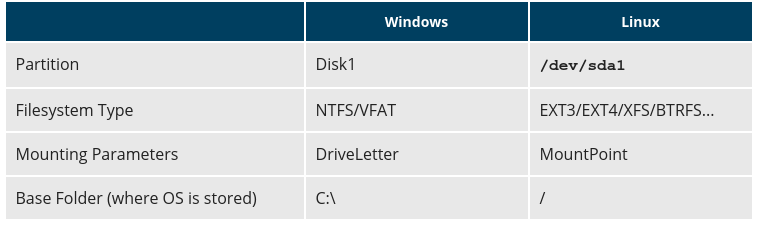
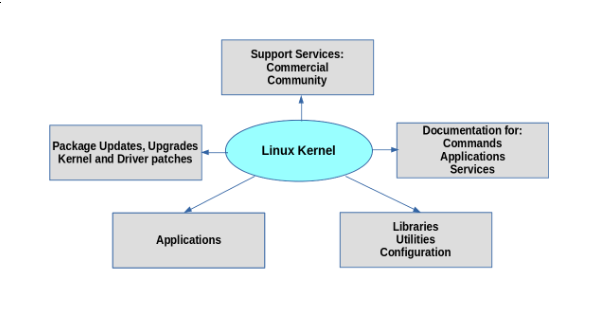
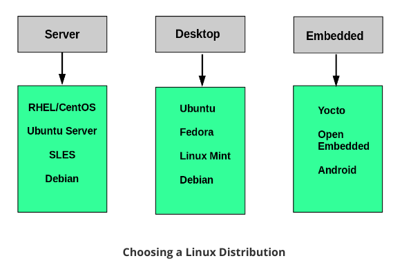

The Linux Foundation
====================

Des de la seva creació el 1991, Linux ha crescut fins a convertir-se en un dels actius més importants en les TIC. The Linux Foundation està associada amb els principals desenvolupadors i empreses del món per resoldre els problemes més complexos i, a la vegada, accelerar-ne el desenvolupament.

La missió de The Linux Foundation és **proporcionar experiència a qualsevol iniciativa que treballi per resoldre problemes complexos mitjançant la col·laboració de codi obert.** Proporciona les eines per escalar aquests projectes, tot oferint bones pràctiques de seguretat, governança, operacions i desenvolupament d’ecosistemes, formació i certificació, llicències i promoció.

Linux és el projecte de programari de codi obert més gran i més extens del món de la història. The Linux Foundation, de la mà de Linus Torvalds (el creador) i de Greg Kroah-Hartman (principal mantenidor del codi) **proporciona un espai neutre** on protegir i accelerar el desenvolupament del nucli Linux en els propers anys. L’èxit de Linux ha catalitzat el creixement a la comunitat de codi obert, demostrant que aquest tipus de desenvolupament és del tot rendible i, fins i tot, és més eficient que el desenvolupament de codi tancat. La fundació Linux és l’organització paraigua de molts projectes de codi obert que impulsen les empreses actuals, abastant tots els sectors de la indústria:

-  Big data i analítica: ODPi, R Consortium

-  Xarxa en xarxa: OpenDaylight, ONAP, OPNFV

-  Incrustat: Dronecode, Zephyr

-  Eines web: JS Foundation, Node.js

-  Cloud computing: Cloud Foundry, Cloud Native Computing Foundation, Open Container Initiative

-  Automoció: Linux Automotive Grade

-  Seguretat: la iniciativa d’infraestructura bàsica

-  Blockchain: Hyperledger

-  I molts més.

The Linux Foundation organitza a més múltiples esdeveniments i conferències arreu del món.

Història de Linux
=================

Linux és un sistema operatiu de codi obert, desenvolupat inicialment per PCs d’arquitectura Intel x86. Actualment ha estat portat a una llarga llista de plataformes de hardware, des de sistemes encastats fins als majors supercomputadors.

Linus Torvalds, mentre era estudiant de la Universitat de Hèlsinki (Finlàndia) el **1991** va iniciar el seu propi nucli del sistema operatiu. També va recollir i desenvolupar la resta d’elements essencials necessaris per construir un sistema operatiu complet amb el nucli al centre. No va passar gaire temps fins que es va anomenar com a nucli Linux.

El 1992, Linux es va tornar a llicenciar mitjançant la **Llicència Pública General (GPL)** per GNU (un projecte de la Free Software Foundation o FSF, que promou programari lliurement disponible), cosa que va permetre construir una comunitat mundial de desenvolupadors. Combinant el nucli amb altres components del sistema del projecte GNU, a mitjans dels anys 90 nombrosos altres desenvolupadors van crear sistemes complets anomenats distribucions Linux.

Les distribucions Linux creades a mitjans dels anys 90 van proporcionar les bases per a una informàtica totalment gratuïta (en el sentit de la llibertat, no de cost zero) i es van convertir en una força molt important del moviment de programari de codi obert. El 1998, grans empreses com IBM i Oracle van anunciar el seu suport a la plataforma Linux i també van iniciar grans esforços de desenvolupament.

Avui en dia, Linux gestiona més de la meitat dels servidors d’Internet, la majoria dels telèfons intel·ligents (a través del sistema Android, construït a sobre de Linux) i tots els supercomputadors més potents del món.

   Cronologia de l’evolució de Linux [fig_cron]

Filosofia Linux
===============

Linux beu directament del sistema operatiu UNIX. Linux va ser escrit per ser un sistema de codi obert per utilitzar-lo enlloc d’aquest, que en aquell moment estava dissenyat per a ordinadors molt més potents que els PC i era bastant car.

La principal característica dels sistemes operatius tipus UNIX és que els fitxers es guarden en un **sistema de fitxers jeràrquic**, amb el node superior del sistema arrel (root) o simplement "/". Sempre que és possible, **Linux fa que els seus components estiguin disponibles mitjançant fitxers o objectes que semblen fitxers**.

Els processos, dispositius i sockets de xarxa estan representats amb objectes semblants a fitxers i sovint es poden treballar amb les mateixes utilitats que s’utilitzen per als fitxers habituals. Linux és un sistema operatiu multiusuari completament multitasca (és a dir, múltiples fils d’execució simultàniament), amb processos de xarxa integrats i serveis coneguts com a daemons al món UNIX.

**Nota: Linux es va inspirar en UNIX, però no és UNIX.**

GNU/Linux
---------

Tot i que s’empren de forma indistinta, l’ecosistema GNU no és el mateix que Linux. GNU és l’ecosistema d’aplicacions que es coneixen com a lliures (llicenciades sota GNU/GPL) i que generalment es distribueixen juntament amb el sistema operatiu Linux. Així mateix, el nom Linux fa referència exclusivament al nucli del sistema operatiu i no forma part de l’ecosistema GNU. És per aquest motiu que els sistemes operatius que coneixem com a Linux són, en realitat, GNU/Linux.

Comunitat Linux
===============

Un dels principals avantatges dels projectes de codi obert és l’existència d’una comunitat d’usuaris entorn d’ells. Aquestes comunitats d’usuaris permeten:

-  Fer preguntes a fòrums de discussió

-  Subscriure’s a fils de correu

-  Apuntar-te a grups locals de la zona

La comunitat Linux és un ecosistema que consta de desenvolupadors, programadors, usuaris i venedors. Les formes més populars de contactar són:

-  Xats IRC

-  Plataformes i fòrums de discussió (Stackoverflow, Reddit etc)

-  Projectes col·laboratius allotjats a plataformes com GitHub

-  Llistes de correus com la Kernel Mailing List.

-  Events comunitaris (Hackatons, Install Fests, Open Source Summits etc.)

Terminologia bàsica
===================

D’ara en endavant farem servir certes expressions tècniques que cal conèixer mínimament per poder entendre el funcionament dels sistemes Linux.

#. Kernel: capa intermèdia entre el hardware i les aplicacions. Proporciona una capa d’abstracció que permet a les aplicacions actuar amb independència del hardware disponible.

#. Distribució: col·lecció de software que conforma un sistema operatiu Linux.

   .. figure:: figura2.png
      :alt: Esquema de les famílies de distribucions Linux [fig_2]
      :width: 120mm

      Esquema de les famílies de distribucions Linux [fig_2]

#. Bootloader: programa que arranca el sistema operatiu (GRUB, ISOLINUX)

#. Servei: programa que corre com un procés al background (servidors web, servidors NFS, servidors de rellotge, NTPs etc.)

#. Sistema de fitxers: mètode per organitzar i emmagatzemar fitxers.

#. Sistema de finestres X: subsistema gràfic per dibuixar finestres

   .. figure:: figura3.png
      :alt: Sistema de finestres X (*X Window System*) [fig_3]
      :width: 120mm

      Sistema de finestres X (*X Window System*) [fig_3]

#. Entorn d’escriptori: entorn concret d’interfície d’usuari al capdamunt del sistema.

#. Línia de comandes: interfície per escriure comandes per interactuar amb el sistema.

#. Shell: Intèrpret de línia de comandes. (bash, tcsh...)

   .. figure:: figura4.png
      :alt: Finestra amb una shell [fig_4]
      :width: 60mm

      Finestra amb una shell [fig_4]

Estructura del sistema de fitxers
=================================

Pensa en una nevera que disposa de múltiples prestatges que es poden utilitzar per guardar diversos articles. Aquests prestatges ajuden a organitzar els articles de queviures per forma, mida, tipus, etc. El mateix concepte s’aplica a un sistema de fitxers, que és la realització d’un mètode per emmagatzemar i organitzar col·leccions arbitràries de dades de forma usable per als humans. Els diferents tipus de sistemes de fitxers compatibles amb Linux:

-  Sistemes de fitxers de disc convencionals: ext2, ext3, ext4, XFS, Btrfs, JFS, NTFS, etc.

-  Sistemes de fitxers d’emmagatzematge flash: ubifs, JFFS2, YAFFS, etc.

-  Sistemes de fitxers de bases de dades

-  Sistemes de fitxers amb finalitat especial: procfs, sysfs, tmpfs, squashfs, debugfs, etc.

Aquesta secció descriurà el disseny del sistema de fitxers estàndard compartit per la majoria de les distribucions de Linux.

Particions i sistemes de fitxers
--------------------------------

Les particions són seccions d’un disc físicament contígües, mentre que un sistema de fitxers són formes de guardar i cercar fitxers dins un disc dur (generalment dins d’una partició).

   Comparació de les particions amb Windows i Linux [fig_7]

Estàndard de la jerarquia
-------------------------

Els sistemes de fitxers en Linux segueixen una plantilla predefinida anomenada Filesystem Hierarchy Standard (FHS) . Linux empra el caràcter ``/`` per separar el camí o path a diferència de Windows que empra ``\``. Els principals directoris que inclou Linux són:

-  ``/`` Arrel del sistema de fitxers.

-  ``/bin`` Binaris essencials

-  ``/boot`` Fitxers estàtics del bootloader

-  ``/dev`` Abstracció al sistema de fitxers dels dispositius connectats

-  ``/etc`` Fitxers de configuració del sistema

-  ``/home`` Directoris dels usuaris del sistema

-  ``/lib`` Llibreries compartides essencials i mòduls del kernel

-  ``/media`` Punt de muntatge per dispositius extraíbles (USBs, targetes etc.)

-  ``/mnt`` Punt de muntatge temporal per qualsevol sistema de fitxers

-  ``/opt`` Directori per aplicacions opcionals

-  ``/sbin`` Binaris de sistema

-  ``/srv`` Dades dels serveis oferits pel sistema

-  ``/tmp`` Fitxers temporals (s’esborren en reiniciar la màquina)

-  ``/usr`` Utilitats i aplicacions d’usuaris del sistema.

-  ``/var`` Fitxers variables

-  ``/root`` Directori home per l’usuari root

-  ``/proc`` Abstracció que fa el kernel en forma de fitxers de l’estat dels processos.

Distribucions Linux
===================

El kernel és el nucli del sistema, però una distribució consisteix, a més, de les **eines necessàries per les operacions bàsiques del sistema**: gestió de fitxers, gestió d’usuaris i gestió de paquest de software. Cadascuna d’aquestes eines normalment sol ser un projecte separat.

A diferència d’altres sistemes operatius com Windows o Mac OSX, la llibertat que ofereix l’ecosistema GNU/Linux permet que múltiples desenvolupadors **publiquin la seva versió específica de sistema operatiu**. Cadascun d’aquests sistemes operatius GNU/Linux poden incloure diferents versions del mateix programa o programes completament diferents, així com seguir distints tipus de filosofies.

Per exemple, la popular RHEL 7 es basa en un kernel antic (el 3.10) però és extremadament estable. Altres distribucions, com Ubuntu 19.04, ofereixen un kernel més modern però més inestable. La filosofia del primer és assegurar l’estabilitat del sistema mentre que la del segon és assegurar que l’usuari podrà gaudir d’aplicacions més recents. És responsabilitat de l’administrador escollir correctament la distribució que emprarà per desenvolupar el seu projecte.

   Composició d’una distribució Linux [fig_5]

Serveis associats a les distribucions Linux
-------------------------------------------

Algunes distribucions comercials solen oferir serveis extra, com ara suport tècnic, certificació de hardware i software, serveis de seguretat i patches entre d’altres. Aquestes distribucions comercials les ofereixen empreses com RedHat, SUSE i Canonical. Un exemple d’aquestes és Red Hat Enterprise Linux (RHEL), emprada normalment per insitucions i organitzacions. Com a alternativa a RHEL sense cost, existeix CentOS. Aquestes distribucions sense cost ni serveis associats solen anomenar-se versions community.

Instal·lació d’una distribució Linux
------------------------------------

A l’hora de triar quina distribució volem instal·lar pel projecte que volem desenvolupar, és important fer-nos unes quantes preguntes:

-  Quina és la principal funció del sistema? Servidor o escriptori?

-  Quins tipus de paquets són importants?

-  Quant d’espai necessitam?

-  Amb quina freqüència actualitzarem els paquets?

-  Quin és el cicle de suport?

-  Necessitam personalització del kernel?

-  Quin hardware empram?

-  Necessitam estabilitat a llarg termini? O preferim un sistema amb el darrer software?

   Objecte de cada distribució Linux [fig_6]

Planificació de les particions
~~~~~~~~~~~~~~~~~~~~~~~~~~~~~~

És important decidir si volem muntar alguns directoris a particions o discos diferents, ja sigui per evitar que un sol directori acabi comprometent tot el sistema omplint tot el disc com per tenir les dades ordenades. Generalment els instal·ladors ofereixen una distribució estàndard raonable, però alguns exemples de solucions més complexes solen ser separar el directori /home, el /var i el /swap.

Software a instal·lar
~~~~~~~~~~~~~~~~~~~~~

La majoria dels instal·ladors també ofereixen opcions per afegir categories de programari. Solen incloure’s aplicacions comunes (com el navegador web de Firefox i la suite d’oficines de LibreOffice), eines per a desenvolupadors (com els editors de text vi i emacs, que explorarem més endavant en aquest curs) i altres serveis populars, com ara les eines del servidor web d’Apache o La base de dades MySQL). A més, per a qualsevol sistema amb un escriptori gràfic, s’instal·la de manera predeterminada un escriptori (com ara GNOME o KDE).

Tots els instal·ladors configuren algunes funcions de seguretat inicials al nou sistema. Un pas bàsic consisteix a establir la contrasenya del superusuari (root) i configurar un usuari inicial. En alguns casos (com Ubuntu), només es configura un usuari inicial; L’inici de sessió directa no està configurat i l’accés root requereix iniciar la sessió com a usuari normal i després utilitzar sudo. Algunes distribucions també instal·laran marcs de seguretat més avançats, com SELinux o AppArmor. Per exemple, tots els sistemes basats en Red Hat, inclosos Fedora i CentOS, utilitzen sempre SELinux de manera predeterminada, i Ubuntu funciona amb AppArmor.

Font des d’on instal·lar
~~~~~~~~~~~~~~~~~~~~~~~~

Generalment, la majoria de distribucions s’ofereixen en dispositius extraíbles com ara memòries USBs, CDs o DVDs. Algunes distribucions ofereixen també la possibilitat d’arrancar una petita imatge i descarregar la resta per Internet.

Així mateix, hi ha multitud d’altres formes d’instal·lar un Linux, com ara mitjançant protocols de xarxa com PXE o amb sistemes de desplegament automàtic tipus Kickstart, AutoYAST etc.

EXERCICI PRÀCTIC - Instal·lació d’una distribució
=================================================

El procés d’instal·lació és molt semblant amb qualsevol distribució.

#. Descarregar el LiveCD de la distribució que volem instal·lar.

#. Guardar en un dispositiu extraíble la imatge del sistema que volem instal·lar. Per això, hem d’emprar aplicacions per gravar fitxers tipus ISO en USBs o CD-ROMs. Per exemple, en Linux emprarem el **Creador de discos d’arrancada (Startup Disk Creator)** o **Rufus** en Windows.

#. Arrancar la màquina amb aquesta imatge perquè finalment s’executi l’instal·lador.

#. Respondre a les qüestions de l’instal·lador.

Els següents vídeos mostren el procés:

-  `Ubuntu 18.04 <https://www.youtube.com/watch?v=DEySFBANzbw>`__

-  `Centos 7 <https://www.youtube.com/watch?v=_D7M-cCslB8>`__

-  `OpenSUSE <https://www.youtube.com/watch?v=iPGbtCj5pss>`__

L’exercici que es proposa es composa en dos:

-  Arrancar un sistema operatiu Live des d’un dispositiu USB

-  Instal·lar una distribució Linux a un entorn VirtualBox

::

   Text enclosed inside \texttt{verbatim} environment 
   is printed directly 
   and all \LaTeX{} commands are ignored.
