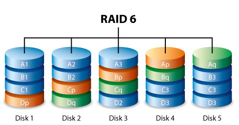

Particionament i formateig de discos
====================================

La partició i formateig dels discos durs disponibles és una part crítica en la instal·lació del sistema. És possible escollir diferents esquemes en funció de la mida del sistema, el nombre d’usuaris i les seves necessitats. Un altre ítem a tenir en compte és el tipus de maquinari de què es disposa: particularment, el tipus de bus de dades al qual el sistema d’emmagatzematge està connectat.

S’ha de tenir molta cura en configurar o modificar les taules de particions, ja que els errors d’aquest tipus poden ser molt destructius.

Tipus més comuns de discos
--------------------------

-  **IDE i EIDE** (Entorn de desenvolupament integrat i IDE millorat). Van ser l’estàndard en portàtils i PCs d’escriptori durant anys. Han quedat obsolets i són lents. Els controladors no estan disponibles en màquines actualitzades.

-  **SATA** (Serial ATA). Aquest tipus va ser creat per millorar el **Parallel ATA (PATA) o originalment IDE**. Tenien una millor velocitat de transferència de dades, cables més petits i eren detectats pel SO com dispositius **SCSI**. Això simplificà la reescriptura dels controladors. En comparació amb PATA, SATA ofereix un cable menor, substitució en calent i més rapidesa. Els més nous poden manejar fins a 16 GB/s, però el més comú són 3 GB/s i 6 GB/s.

-  **SCSI** (Small Computer Sistema Interface). Han estat el pilar dels servidors empresarials durant dècades. Mentre que poden tenir una capacitat menor que els **SATA**, són més ràpids i poden treballar en paral·lel molt millor seguint les configuracions RAID. Hi ha vàries versions d’SCSI: Fast, Wide, Ultra i UltraWide. Van des de taxes de transferència de 5 MB/s a taxes de 160 MB/s (UltraWide SCSI 3).

-  **SAS** (Serial Attached SCSI). Protocol PtP per reemplaçar SCSI. Taxes de transferència similars a SATA però rendiment general millor.

-  **USB** (Bus Universal en Sèrie). Solen incloure memòries i discs externs. El sistema els veu com dispositius SCSI. En la mateixa categoria hi ha les unitats **SSD** (dispositius d’estat sòlid) modernes. Tenen com a avantatge que són molt més ràpides, no inclouen components mecànics i són més eficients energèticament.

Geometria dels discos
---------------------

La geometria dels discos és un concepte antic dels discos giratoris. Es parla de:

#. Capçals (*heads*).

#. Cilindres

#. Pistes (*tracks*)

#. Sectors

Els discos giratoris es componen de varis plats. Cadascun dels plats és llegit per un **capçal**. Els **capçals** llegeixen una **pista** del plat a mesura que el disc gira.

Cada pista circular està dividida en blocs anomenats **sectors** de 512 bytes de mida. Un **cilindre** és un grup de pistes que està format per les pistes de cadascun dels plats. Vegeu la divisió a la figura `[fig_1] <#fig_1>`__.

.. figure:: figura1.png
   :alt: Divisió del disc dur. Vegeu com cada disc es divideix en varis plats, que a la vegada es divideixen en pistes i aquestes en sectors. Cada agrupació de pistes de la mateixa mida d’entre tots els plats és un cilindre. [fig_1]
   :width: 100mm

   Divisió del disc dur. Vegeu com cada disc es divideix en varis plats, que a la vegada es divideixen en pistes i aquestes en sectors. Cada agrupació de pistes de la mateixa mida d’entre tots els plats és un cilindre. [fig_1]

Aquesta estructura cada cop s’empra menys ja que els darrers dispositius **SSD** no fan servir aquesta divisió. A més, actualment els discs estan fabricats en sectors de fins a 4KB. Per sectors majors, els sistemes operatius encara no hi estan preparats.

Particionament
--------------

Com hem comentat altres cops, els discos es divideixen en **particions**. Són grups físicament contigus de sectors o cilindres.

Una de les particions **primàries** d’un disc pot ser designada com a partició **extesa**. Una partició extesa pot ser subdividida en particions **lògiques**.

**SCSI** i estàndards relacionats com **SATA** permeten fins a 15 particions de disc. En taules de particions DOS les particions 1-4 són primàries i exteses. Les particions 5-15 són lògiques. Només pot haver una partició extesa però aquesta pot ser dividida en particions lògiques. En taules de particions GPT (Guid Partition Table), més modernes, permeten més particions.

La primera unitat **SCSI o SATA** del sistema s’anomena **sda**. La segona **sdb** i així successivament. La primera unitat (``/dev/sda1``) fa referència a la primera partició. ``/dev/sda2`` faria referència a la segona.

Les particions exteses com ``/dev/sda3`` pot dividir-se en particions lògiques amb designacions numèriques com ``/dev/sda5, /dev/sda6`` etc.

Avantatges de particionar
-------------------------

Els avantatges de particionar són els següents:

-  **Separació** de dades i aplicacions d’usuari dels fitxers essencials del sistema operatiu. Aquests darrers poden ser només de lectura. Sovint el directori ``/home`` es posa a una partició separada.

-  **Dades compartides**. Múltiples SO poden emprar els mateixos sistemes de fitxers (p. ex. NFS).

-  **Seguretat**. L’administrador pot voler imposar quotes de disc a vàries parts del sistema.

-  **Mida**. Si algun directori s’omple del tot podria bloquejar el sistema. Si aquest directori es troba a una partició separada això no succeirà.

-  **Rendiment**. Pot ser interessant guardar dades que seran escrites o llegides de forma freqüent a discos més ràpids.

-  **Swap**. Es recomana tenir un espai d’intercanvi de RAM (swap) a una partició separada.

Un esquema comú consisteix en separar ``/``, de ``/boot`` (per fitxers d’arrancada), una partició de swap i una per a ``/home``.

Un desavantatge és que una vegada particionat el sistema redimensionar-lo és més complicat.

Taules de particions
--------------------

Les taules de particions són les taules mantingudes al disc pel sistema operatiu que descriuen les particions d’aquest disc. Els formats de taules de particions més emprats en Linux són les taules **MBR** o format **DOS** (PCs IBM compatibles) o el format més modern de **GUID Partition Table** o **GPT**.

MBR
~~~

En taules de particions MBR la taula del disc està continguda dins dels primers 512 bytes (però no són la seva totalitat). Aquests 512 bytes s’anomenen Registres d’Arrancada Principals (**MBR**). L’estructura està definida per una convenció i no depèn del SO.

L’MBR, a més d’incloure la taula de particions, inclou també codi màquina per arrancar el sistema com ara el GRUB. Així mateix, els dos darrers bytes de l’MBR són el *magic number*, un número per identificar el final de sector que sempre val ``0x55AA``. Podeu veure l’estructura de l’MBR a la figura `[fig_2] <#fig_2>`__.

.. figure:: figura2.png
   :alt: Estructura d’una taula de particions MBR [fig_2]
   :width: 100mm

   Estructura d’una taula de particions MBR [fig_2]

Només una partició d’un disc pot ser marcada com específica. Quan s’inicia el sistema, el carregador d’arrancada com ara el GRUB cerca aquesta partició. Cada entrada de la taula té 16 bytes de llarg i descriu una de les 4 particions primàries possibles. La informació de cada entrada de la taula es composa del bit d’actiu, direcció d’inici, codi de tipus de partició, número de sectors etc.

GPT
~~~

Els darrers sistemes operatius inclouen taules de particions GPT, més modernes, robustes i permeten més particions. Les taules de particions GPT no posen pràcticament límits en la quantitat de particions que poden crear-se. GPT fa servir un direccionament lògic anomenat LBA (Logical Block Addressing).

A l’LBA 0, GPT inclou una taula de particions MBR Protectiva inclosa als 512 primers bytes per tal d’oferir compatibilitat amb sistemes operatius que no suporten GPT. A l’LBA 1, GPT defineix la capçalera de la taula de particions. Aquesta defineix els blocs de disc que poden ser emprats per l’usuari i el número i mida de les entrades de particions que conformen la taula. Aquí es defineix el límit de particions que pot tenir el disc. En Windows Server 2003 són 128 entrades de partició reservades. Dels LBA 2 al 33, GPT inclou les entrades de la taula de particions. Vegeu la figura `[fig_3] <#fig_3>`__ per veure un esquema de les taules GPT.

   Estructura d’una taula de particions GPT [fig_3]

Noms de dispositiu de disc i nodes
----------------------------------

El kernel de Linux interactúa a baix nivell amb els discos a través de nodes (anomenats també descriptors, apuntadors etc.) de dispositius que normalment es troben al directori ``/dev/``. Els nodes dels dispositius són accedits a través de la infraestructura de sistema de fitxers virtual del kernel. Accedint de qualsevol altra manera (com ara directament) es pot destruir el sistema de fitxers completament.

Els nodes de dispositiu per a discos **SCSI** i **SATA** següents segueix una convenció de noms simple:

-  El primer disc dur és ``/dev/sda``.

-  El segon disc dur és ``/dev/sdb``.

-  etc.

Després s’enumeren així:

-  ``/dev/sdb1`` és la primera partició del segon disc.

-  ``/dev/sdc4`` és la quarta del tercer.

Generalment, un disc anomenat “sd” pot ser **SCSI** o **SATA**. En discos **IDE** s’anomenaven hd (com ara ``/dev/hda3`` o ``/dev/hdc1``.

Executant

::

    ls -l /dev

es mostraran els nodes de dispositiu disponibles.

Formatar un sistema de fitxers
~~~~~~~~~~~~~~~~~~~~~~~~~~~~~~

Per formatar un sistema de fitxers s’accedeix directament al node del dispositiu. Això se fa generalment amb l’eina ``mkfs`` apuntant al node. Normalment, hi ha vàries eines mkfs de la forma ``mkfs.ext4``, ``mkfs.ntfs``, ``mkfs.vfat`` etc.

Per exemple

::

    $ sudo mkfs.ext4 /dev/sda9

Més sobre els noms dels dispositius SCSI
~~~~~~~~~~~~~~~~~~~~~~~~~~~~~~~~~~~~~~~~

Per a dispositius SCSI, la designació de la unitat (a, b, c etc.) es basa en el número d’identificador del dispositiu SCSI i no en la seva posició del bus. Per exemple, si tinguéssim dues controladores SCSI una amb ID1 i una amb ID3 en la controladora 0; i un amb ID 2 i un altre amb ID 5 en la controladora 1:

-  ID 1 (en la controladora 0) seria /dev/sda

-  ID **3** (en la controladora 0) seria /dev/sdb

-  ID **2** (en la controladora 1) seria /dev/sdc

-  ID 5 (en la controladora 1) seria /dev/sdd

Ús de blkid i lsblk
-------------------

**blkid** és una eina per trobar dispositius de blocs i entregar informació sobre els seus atributs. Per exemple

::

    $ sudo blkid /dev/sda*
   dev/sda: PTTYPE="dos"
   /dev/sda1: LABEL="boot" \UUID="b0fa22fc-8882-4f1c-bc16-...
   /dev/sda10: UUID="JQshRp-Jxa5-0oiC-X1Oe-si8d-lRQD-48aYN...
   /dev/sda11: LABEL="RHEL7" UUID="b8beaf53-af11-4b14-9e7d...
   /dev/sda12: LABEL="SWAP" UUID="2b2603f9-a701-4f91-b284-...
   /dev/sda3: PTTYPE="dos"                                ...
   /dev/sda5: LABEL="RHEL6-64" UUID="89a3c451-847f-40a1-97...
   /dev/sda6: UUID="YJ2PA3-GSsm-m9rH-XNUM-Ca2X-fkju-OYtiO8...
   /dev/sda7: LABEL="RHEL7XFS" UUID="178d0092-4154-4688-af...
   /dev/sda8: UUID="NdnbYk-ACCB-9UTX-i3kc-rK0m-Fbht-KjJZwP...
   /dev/sda9: UUID="CMc2EP-ijCM-jA8V-ZH5M-B6AA-z0TD-ILMFFE...

**blkid** funcionarà solament amb dispositius que tenen dades. Una partició buida no generarà un identificador de blocs UUID.

**lsblk** fa el mateix i presenta els resultats en forma d’arbre:

::

    $ lsblk -i
   NAME              MAJ:MIN RM   SIZE RO  TYPE MOUNTPOINT
   sda                 8:0    0 465.8G  0  disk
   |-sda1              8:1    0   100M  0  part /boot_master
   |-sda3              8:3    0     1K  0  part
   |-sda5              8:5    0  11.7G  0  part /RHEL6-64
   |-sda6              8:6    0  36.2G  0  part
   | `-VG-dead       254:5    0    60G  0  lvm  /DEAD
   |-sda7              8:7    0    12G  0  part
   |-sda8              8:8    0 353.2G  0  part
   | |-VG-tmp        254:0    0     2G  0  lvm
   | |-VG-local      254:1    0    24G  0  lvm  /usr/local
   | |-VG-src        254:2    0    16G  0  lvm  /usr/src
   | |-VG-virtual    254:3    0   225G  0  lvm  /VIRTUAL
   | |-VG-iso_images 254:4    0    60G  0  lvm  /ISO_IMAGES
   | |-VG-dead       254:5    0    60G  0  lvm  /DEAD
   | |-VG-audio      254:6    0    12G  0  lvm
   | `-VG-pictures   254:7    0    12G  0  lvm  /PICTURES
   |-sda9              8:9    0  23.2G  0  part
   | |-VG-virtual    254:3    0   225G  0  lvm  /VIRTUAL
   | `-VG-dead       254:5    0    60G  0  lvm  /DEAD
   |-sda10             8:10   0  11.7G  0  part
   | |-VG-virtual    254:3    0   225G  0  lvm  /VIRTUAL
   | |-VG-dead       254:5    0    60G  0  lvm  /DEAD
   | `-VG-pictures   254:7    0    12G  0  lvm  /PICTURES
   |-sda11             8:11   0  15.7G  0  part /
   `-sda12             8:12   0     2G  0  part [SWAP]
   sr0                11:0    1  1024M  0  rom

Editar les taules de particions
-------------------------------

Fer còpia de seguretat d’una taula de particions
~~~~~~~~~~~~~~~~~~~~~~~~~~~~~~~~~~~~~~~~~~~~~~~~

Particionar i reparticionar discos són operacions delicades. Es poden fer còpies de seguretat i restaurar taules de particions convertint-les en fitxers. Per això, empram l’eina **dd** que copia dades a nivell de bloc.

Per exemple, per fer una còpia de seguretat d’una taula de particions farem:

::

    $ sudo dd if=/dev/sda of=mbrbackup bs=512 count=1

Això generarà una còpia de seguretat d’una taula de particions MBR del primer disc. Fixau-vos amb que només es copien els primers 512 bytes.

Per restaurar la taula de particions farem:

::

    $ sudo dd if=mbrbackup of=/dev/sda bs=512 count=1

Noti’s que les ordres esmentades copiaran solament la taula de partició primària; no es faran càrrec de qualsevol taula de partició que estigui emmagatzemada en altres particions (com particions esteses, per exemple).

**Nota**: modificar la taula de partició del disc podria eliminar tota la informació de tots els sistemes d’arxius en el disc (no hauria, però és millor ser previngut). Per tant, sempre és prudent fer una còpia de seguretat de tota la informació abans de realitzar qualsevol treball d’aquest tipus.

En particular, cal ser curós a l’usar dd: un error de mecanografia o una opció usada erròniament podria destruir la informació completa del disc. En qualsevol cas el millor és tenir una política de còpies de seguretat adequada.

Eines disponibles
~~~~~~~~~~~~~~~~~

-  **fdisk**. És un editor amb menú, però simple. És el més estàndard però també el més flexible.

-  **sfdisk**. Programa no interactiu per fer scripts.

-  **parted**. És el programa GNU per a manipular particions.

-  **gparted**. Interfície gràfica de parted. Així mateix gparted és també una distribució **Live CD** que permet rescatar sistemes i particionar discos no emprats. **Gparted** pot fer moltes més operacions. També pot moure, redimensionar, formatar etc.

**fdisk** es troba disponible sempre en qualsevol instal·lació Linux. Pot ser bona idea aprendre a emprar-lo. fdisk disposa d’una interfície de text en menú de text. S’inicia a un disc en particular fent:

::

    $ sudo fdisk /dev/sdb

Les principals comandes (d’una lletra que heu d’introduir) són:

-  m: desplega el menú

-  p: llista la taula de particions

-  n: crea una partició nova

-  d: elimina una partició

-  t: canvia el tipus de partició

-  w: escriu els canvis al disc

-  q: surt sense fer canvis

Només es guardaran els canvis si s’introdueix la lletra w. Abans, revisau que la taula que heu fet és correcta amb la lletra p. Si no vos en sortiu, sempre podeu sortir sense guardar amb q.

De vegades, el sistema no emprarà la nova taula fins al pròxim reinici. Tot i així, es pot emprar la comanda:

::

    $ sudo partprobe -s

per intentar llegir la taula de partició modificada. No obstant, això no sempre funciona de manera fiable i el millor és reiniciar abans de formatar particions noves i realitzar altres operacions, ja que barrejar particions o sobreposar una a una altra pot ser catastròfic.

En qualsevol moment és possible executar la següent comanda:

::

   $ cat /proc/partitions

per tal de visualitzar les particions que reconeix el sistema operatiu.

EXERCICI PRÀCTIC - Particionat
------------------------------

Realitzau els exercicis de LAB_9.1.pdf, LAB_9.2.pdf, LAB_9.3.pdf i LAB_9.4.pdf.

Xifrat de discos
================

Els sistemes d’arxius poden ser xifrats per protegir la informació d’accessos no autoritzats i d’intents de corrompre les dades que contenen. El xifrat pot ser triat en la instal·lació o ser incorporada més tard. Les distribucions de Linux fan servir sovint el mètode LUKS i porten a terme tasques de xifrat usant l’eina cryptsetup.

LUKS
----

Les distribucions modernes proveeixen un xifrat a nivell de dispositiu de bloc emprant **LUKS (Linux Unified Key Setup)**. És molt recomanat en sistemes portàtils com portàtils, tauletes o mòbils.

LUKS es basa en **cryptsetup**, una eina potent que també pot emrpar altres mètodes com **dm-crypt**, **loop-AES** i **TrueCrypt**.

LUKS emmagatzema tota la informació necessària a la capçalera de cada partició xifrada i, per tant, és simple migrar particions a altres discos o sistemes. També pot emprar-se per xifrar particions de swap.

cryptsetup
----------

Per xifrar un disc emprarem essencialment l’eina **cryptsetup**. Una vegada que els volums han sigut xifrats poden muntar-se i desmuntar-se amb les utilitats normals.

::

    cryptsetup [OPTION...] <action> <action-specific>

Consultau més opcions amb:

::

    $ cryptsetup --help

Ús d’una partició xifrada
-------------------------

Suposem que la partició LVM ``/dev/VG/MYSECRET`` ja existeix. Les comandes següents configuraran el xifratge, li donaran format, l’empraran i la desmontara.

Per donar-li format LUKS, farem:

::

    $ sudo cryptsetup luksFormat /dev/VG/MYSECRET

Se li demanarà d’introduir una contrasenya, la qual haurà de fer servir per obrir el volum xifrat més tard. Noti’s que s’haurà de fer això un cop només, durant la configuració del xifrat.

Podria ser que el kernel del sistema **no suporta** el mètode de xifrat que utilitza cryptsetup per defecte. En aquest cas vostè pot examinar ``/proc/crypto`` per veure els mètodes que suporta el sistema, i després especificar un, com es mostra a continuació:

::

    $ sudo cryptsetup luksFormat --cipher aes /dev/VG/MYSECRET

Es pot obrir el volum en qualsevol moment. Per obrir el volum s’entén en crear un node del sistema de fitxers xifrat que correspon al sistema de fitxers sense xifrar. És a dir, “obrir” un pany per tal que es desxifri. Això ho feim fent:

::

   $ sudo cryptsetup --verbose luksOpen /dev/VG/MYSECRET SECRET

Es demanarà la contrasenya i es crearà el node del dispositiu a /dev/mapper/SECRET.

A partir d’aquí, es pot formatar el sistema de fitxers normalment:

::

   $ sudo mkfs.ext4 /dev/mapper/SECRET

i montar-lo:

::

   $ sudo mount /dev/mapper/SECRET /mnt

A /mnt hi haurà una partició sense xifrar a ``/mnt`` llesta per treballar.

Per desmuntar-la i “tancar el pany” farem:

::

   $ sudo umount /mnt
   $ sudo cryptsetup --verbose luksClose SECRET

Muntat en arrancada
-------------------

Per muntar la partició en l’arrancada s’han de satisfer dues opcions:

#. Afegir una línia al crypttab. Hi ha vàries opcions com afegir la contrasenya si no es vol introduir cada vegada que arranca el sistema. Per exemple:

   ::

       SECRET    /dev/sdb1

#. Afegir una línia a /etc/fstab. Aquesta línia ha de correspondre al node sense xifrar (al “pany obert”)

   ::

       /dev/mapper/SECRET    /mnt    ext4    errors=remount-ro    0    1

EXERCICI PRÀCTIC - Xifrat de discos
-----------------------------------

En aquest exercici xifrarem un disc per proveir seguretat. Revisau la documentació de cryptsetup abans.

-  Creeu una partició nova per al dispositiu de bloc xifrat amb fdisk. Afegiu un disc nou al virtualbox.

-  Formatau la partició amb cryptsetup usant LUKS per a la capa de xifrat.

-  Creu la clau per obrir el dispositiu de bloc xifrat.

-  Afegiu una entrada a ``/etc/crypttab`` perquè se us demani la clau.

-  Formateu el sistema de fitxers amb ext4.

-  Creeu un punt de muntatge per al sistema de fitxers nou, per exemple ``/secret``.

-  Afegiu una entrada a ``/etc/fstab`` perquè el sistema sigui muntat en l’arrencada.

-  Proveu muntar el sistema xifrat.

-  Reinicieu i validau la configuració completa.

EXERCICI PRÀCTIC - Xifrat del swap
----------------------------------

Consultau l’exercici LAB_10.2.pdf

Característiques dels sitemes de fitxers. Atributs, creació, verificació i muntatge
===================================================================================

Les característiques importants dels sistemes de fitxers inclouen inodes, arxius de directori i tant enllaços simbòlics (soft) com durs (hard). Els atributs estesos amplien els permisos de fitxers tradicionals de UNIX. Hi utilitats específiques associades als sistemes de fitxers que realitzen tasques com crear-los i donar-los format, comprovar si hi ha errors i reparar-los. També muntar i desmuntar els sistemes de fitxers durant l’arrencada o en un moment posterior.

Inodes
------

Un **inode** és una estructura de dades en el disc que descriu i emmagatzema els atributs de l’arxiu, incloent la seva localització. Cada fitxer està associat amb el seu propi inode. La informació emmagatzemada al inode inclou el següent. Podeu veure-ho també a la figura `[fig_4] <#fig_4>`__.

#. Permisos

#. Usuari i grup propietari

#. Mida

#. Registres de temps (al nanosegon)

#. Moment en el qual es va realitzar l’última entrada

#. Moment en el qual es va realitzar l’última modificació del contingut

#. Moment en el qual es va realitzar l’última modificació del inode

   Estructura d’un inode [fig_4]

Nota: els noms dels arxius no s’emmagatzemen a l’inode associat a l’arxiu, sinó que ho fan a l’arxiu de directori. És a dir, els directoris són una llista de parelles d’elements: el **nom** del fitxer i l’\ **inode** associat.

Tota l’activitat E/S que fa a un arxiu usualment involucra l’inode del fitxer com informació que ha de ser actualitzada.

Fitxers de directoris
---------------------

Un **directori** és un tipus de fitxer en particular que relaciona un nom de fitxer a un número d’inode. Hi ha dues maneres d’associar un nom a un inode:

-  Enllaços durs o **hard links**. Simplement una relació nom-inode. Realment, és el mateix que feim quan executam un ``ln``.

-  **Enllaços simbòlics**. L’entrada apunta a un altre nom de fitxer.

Cada associació d’un contingut del nom de fitxer i un inode és conegut com un enllaç. Enllaços addicionals poden ser creats utilitzant la comanda ``ln``.

Com que és possible (i molt comú) que dues o més entrades de directori apuntin al mateix inode (enllaços durs), un arxiu pot ser conegut per múltiples noms, en els quals cada un d’ells té el seu propi lloc en l’estructura de directoris. No obstant això, pot tenir un inode només, independentment del nom que està sent usat.

Quan un procés es refereix a un nom de ruta, el kernel cerca al directori per trobar el número d’inode corresponent. Després que el nom ha estat convertit a un número d’inode, l’inode es carrega en memòria i és usat en sol·licituds posteriors.

Atributs extesos. lsattr/chattr
-------------------------------

Els atributs extesos associats a les metadades no són interpretats directament pel sistema de fitxers. Existeixen quatre espais de noms (*namespaces*): usuari, confiança, seguretat i sistema. L’espai de nom “sistema” és emprat per les llistes de control d’accés (ACL) i l’espai de nom “seguretat” és emprat per SELinux.

Els valors dels atributs s’emmagatzemen a l’inode del fitxer i poden ser modificats només per root. Se visualitzen amb **lsattr** i es configuren amb **chattr**.

Els flags següents poden ser configurats en l’espai de noms “usuari”:

-  i: inmutable. No pot ser ni modificat ni esborrat ni renombrat. Ni tant sols per root. Tampoc es pot fer cap enllaç simbòlic ni s’hi poden escriure dades.

-  a: afegir solament. Amb aquest atribut, el fitxer només pot ser obert en mode “agregar per escriptura”

-  d: no respaldar. No es fa backup en l’ús del programa **dump**.

-  A: no actualitzar **atime**. No actualitza el temps d’accés quan s’accedeix al fitxer. Això pot incrementar el rendiment en alguns sistemes ja que evita operacions E/S.

N’hi ha més que podeu consultar amb ``man chattr``. El format és:

::

    $ chattr [+|-|=mode] filename

Amb **lsattr** consultareu els atributs del fitxer:

::

    $ lsattr filename

Crear i formatar sistemes de fitxers
------------------------------------

Existeixen eines en Linux per formatar particions amb cada sistema de fitxers. El nom genèric és **mkfs**. Això és una interfície per cada sistema de fitxers específic:

::

    $ ls -lh /sbin/mkfs*

   -rwxr-xr-x 1 root root  11K Apr 10 03:50 /sbin/mkfs
   -rwxr-xr-x 1 root root 181K Oct 15  2012 /sbin/mkfs.btrfs
   -rwxr-xr-x 1 root root  26K Apr 10 03:50 /sbin/mkfs.cramfs
   -rwxr-xr-x 5 root root  68K Jul 16 15:31 /sbin/mkfs.ext2
   -rwxr-xr-x 5 root root  68K Jul 16 15:31 /sbin/mkfs.ext3
   -rwxr-xr-x 5 root root  68K Jul 16 15:31 /sbin/mkfs.ext4
   -rwxr-xr-x 5 root root  68K Jul 16 15:31 /sbin/mkfs.ext4dev
   lrwxrwxrwx 1 root root    7 Dec  6  2011 /sbin/mkfs.msdos -> mkdosfs
   lrwxrwxrwx 1 root root   12 Sep 28  2011 /sbin/mkfs.ntfs -> /sbin/mkntfs
   lrwxrwxrwx 1 root root    7 Dec  6  2011 /sbin/mkfs.vfat -> mkdosfs

i ho feim amb:

::

   mkfs [-t fstype] [options] [device-file]

Exemple

::

   $ sudo mkfs -t ext4 /dev/sda10
   $ sudo mkfs.ext4 /dev/sda10

Cada sistema de fitxers té les seves pròpies opcions de formateig. Per exemple, en crear un sistema de fitxers **ext4** es pot considerar la configuració de journaling. S’especificarà en aquest cas la mida del journal i si s’emprarà un fitxer de journal extern.

Cada programa **mkfs.\*** té detalls de les opcions per cada sistema de fitxers.

Verificar i reparar sistemes de fitxers
---------------------------------------

Cada tipus de sistema de fitxers té una utilitat dissenyada per a verificar errors (i reparar-los en la mesura en què sigui possible). El nom genèric de l’eina és **fsck**, però no és més que una interfície per a programes específics de cada sistema de fitxers.

::

    $ ls -l /sbin/fsck*
   -rwxr-xr-x 1 root root  34680  Apr 10 03:50 /sbin/fsck
   -rwxr-xr-x 1 root root  15976  Apr 10 03:50 /sbin/fsck.cramfs
   -rwxr-xr-x 5 root root 197352  Jul 16 15:31 /sbin/fsck.ext2
   -rwxr-xr-x 5 root root 197352  Jul 16 15:31 /sbin/fsck.ext3
   -rwxr-xr-x 5 root root 197352  Jul 16 15:31 /sbin/fsck.ext4
   -rwxr-xr-x 5 root root 197352  Jul 16 15:31 /sbin/fsck.ext4dev
   lrwxrwxrwx 1 root root      7  Dec  6  2011 /sbin/fsck.msdos -> dosfsck
   lrwxrwxrwx 1 root root     13  Sep 28  2011 /sbin/fsck.ntfs -> ../bin/ntfsck
   lrwxrwxrwx 1 root root      7  Dec  6  2011 /sbin/fsck.vfat -> dosfsck

Per exemple, dues comandes que fan el mateix:

::

   $ sudo fsck -t ext4 /dev/sda10
   $ sudo fsck.ext4 /dev/sda10

**fsck** s’executa automàticament després d’un número de muntatges o un interval definit des de la darrera vegada que va ser executat o després d’una apagada normal. S’hauria d’executar en sistemes de fitxers desmuntats.

Per forçar una verificació de tots els sistemes muntats en la pròxima arrancada podem fer:

::

   $ sudo touch /forcefsck
   $ sudo reboot

El fitxer ``/forcefsck`` desapareix després de que la verificació sigui exitosa. Molt útil ja que permet verificar el sistema de fitxers **arrel** (``/``).

El format de fsck és:

::

    fsck [-t fstype] [options] [device-file]

on ``[device-file]``\ és generalment un nom de dispositiu com ``/dev/sda3`` o ``/dev/vg/LVM1``. Usualment no cal especificar el tipus de sistema d’arxiu, ja que fsck pot detectar-lo a través d’examinar els superblocs al començament de la partició.

És possible controlar si els errors trobats han de reparar-se un a un manualment amb l’opció **-r**, o automàticament de la millor manera possible amb l’opció **-a**. Addicionalment, cada tipus de sistema d’arxiu pot tenir les seves pròpies opcions particulars que poden ser configurades al moment de la verificació.

Els sistemes amb **journaling** són més ràpids per a verificar que els sistemes de fitxers de generacions anteriors per les raons següents:

-  Rarament és necessari escanejar la partició completa ja que tot ha estat registrat i confirmat.

-  Inclús si s’escaneja la partició completa, els sistemes de fitxers moderns poden verificar-se amb un **fsck ràpid**.

Muntar i desmuntar sistemes de fitxers
--------------------------------------

(Recordatori de LFS101)

Tots els arxius accessibles en Linux estan organitzats en una gran estructura d’arbre jeràrquica amb la part superior del mateix en el directori **root (/)**. No obstant això, és comú tenir més d’una partició (cadascuna de les quals pot tenir el seu propi tipus de sistema de fitxers), les que treballen juntes en el mateix arbre de sistema de fitxers. Aquestes particions poden estar en diferents dispositius físics, o fins i tot localitzades en una xarxa.

El programa **mount** permet muntar un sistema de fitxers en qualsevol punt de l’estructura d’arbre; per contra, **umount** permet desmuntar-lo.

El punt de muntatge correspon al directori on el sistema de fitxers està muntat. Aquest ha d’existir amb anterioritat a què **mount** pugui usar-lo; la comanda **mkdir** pot ser usada per crear un directori buit. Si un directori preexistent és usat per a tal efecte i conté arxius prèviament en ser usat com a punt de muntatge, els arxius s’ocultaran al moment del muntatge. Aquests arxius no són esborrats i estaran visibles novament quan el sistema de fitxers és desmuntat.

Només el superusuari pot muntar i desmuntar sistemes d’arxius.

mount
~~~~~

Cada sistema de fitxers es munta baix un directori:

::

    $ sudo mount -t ext4 /dev/sdb4 /home

-  Munta un sistema de fitxers ext4.

-  El sistema de fitxers està localitzat en una partició específica del disc dur (/dev/sdb4).

-  El sistema de fitxers està muntat en la posició /home en l’arbre de directoris actual.

-  Qualsevol arxiu que estigui en el directori original /home estarà ocult fins que la partició es desmunti.

És possible muntar un sistema de fitxers emprant una **etiqueta** o un **UUID**.

Per exemple, les comandes següents són equivalents:

::

   $ sudo mount /dev/sda2 /home
   $ sudo mount LABEL=home /home
   $ sudo mount -L home /home
   $ sudo mount UUID=26d58ee2-9d20-4dc7-b6ab-aa87c3cfb69a /home
   $ sudo mount -U 26d58ee2-9d20-4dc7-b6ab-aa87c3cfb69a /home

Les etiquetes són assignades mitjançant utilitats específiques de cada sistema de fitxers (com **e2label**). Els **UUIDs** s’assignen quan les particions són creades com a contenidors per al sistema de fitxers.

Qualsevol d’aquests dos sistemes (etiquetes o UUIDs) és preferible a la ruta del node (/dev/sdXY) ja que aquests poden canviar. Els UUIDs sempre seran únics per cada fitxer.

**Opcions de mount**

Algunes opcions de mount són:

-  -a: Monta tots els sistemes de fitxers de /etc/fstab

-  remount: remunta el sistema de fitxers

-  ro: munta el sistema de fitxers en mode només lectura

Algunes opcions són genèriques (com -a) i altres han d’anar precedides de l’opció **-o**. Per exemple:

::

    $ sudo mount -o remount,ro /myfs

Remunta el sistema de fitxers en mode només lectura.

**mount** té moltes opcions que podeu consultar amb la comanda ``man mount``.

Sense opcions ni arguments, **mount** mostra tots els sistemes de fitxers muntats.

umount
~~~~~~

Per desmuntar, feim:

::

    $ sudo umount [device-file | mount-point ]

És a dir, les dues següents maneres són vàlides i fan el mateix (si /dev/sda3 està muntat a /home):

::

    $ sudo umount /home
    $ sudo umount /dev/sda3

Un error comú és intentar desmuntar el sistema de fitxers quan tenim la terminal oberta al directori que intentam desmuntar. És tan simple com fer **cd** i provar-ho de nou.

En altres casos potser hi ha altres processos que estan utilitzant aquest directori o fitxers d’aquest directori. Per això, hem d’emprar eines com **fuser** per trobar quins fitxers estan sent emprats i detenir els processos. També pot emprar-se **lsof** per llistar els fitxers oberts actualment.

fstab
~~~~~

L’arrancada del sistema executa la comanda ``mount -a``. Això munta tots els sistemes de fitxers especificats al fitxer **/etc/fstab**. Les entrades d’aquest fitxer poden referir-se a sistemes de fitxers locals o remots (a través de xarxa).

Un exemple d’\ **/etc/fstab** és com el següent:

::

    $ cat /etc/fstab
   LABEL=RHEL6-64          /                       ext4    defaults        1 1
   LABEL=RHEL6-32          /RHEL6-32               ext4    defaults        1 2
   LABEL=boot              /boot                   ext3    defaults        1 2
   ....
   LABEL=local             /usr/local              ext4    defaults        1 2
   LABEL=tmp               /tmp                    ext4    defaults        1 2
   LABEL=src               /usr/src                ext4    defaults        1 2
   LABEL=VIRTUAL           /VIRTUAL                ext4    defaults        1 2
   LABEL=BEAGLE            /BEAGLE                 ext4    defaults        1 2
   /dev/sda1               /c                      ntfs-3g uid=500,gid=500 0 0
   /teaching/FTP/LFT       /var/ftp/pub2           none    bind            0 0
   laptop:/share           /share                  nfs     defaults        0 0
   LABEL=SWAP              swap                    swap    defaults        0 0
   tmpfs                   /dev/shm                tmpfs   defaults        0 0
   devpts                  /dev/pts                devpts  gid=5,mode=620  0 0
   sysfs                   /sys                    sysfs   defaults        0 0
   proc                    /proc                   proc    defaults        0 0
   debugfs                 /sys/kernel/debug       debugfs defaults        0 0

Es poden especificar opcions com qui podria muntar-los i amb quins permisos. Algunes de les línies de l’exemple es refereixen a pseudosistemes de fitxers especials com **proc**, **sys** i **devpts**.

Cada entrada conté els següents camps (en ordre):

-  Node del dispositiu, etiqueta o UUID. En alguns casos, com **proc**, **sysfs** o **tmpfs**, només es posa un marcador de posició. En alguns altres casos es posa també **none**.

-  Punt de muntatge. Pot ser només un marcador de posició també (com el cas de swap).

-  Tipus de sistema de fitxers

-  Opcions separades per comes. Són les opcions del **mount**.

-  Es farà dump? 1 sí, 0 no. Emprat per la comanda ``dump -w``

-  **fsck**. Ordre en què **fsck** farà una verificació del sistema de fitxers. Si 0, no es fa mai.

Les eines **mount** i **umount** poden fer servir la informació de ``/etc/fstab``. Per exemple, amb l’exemple anterior podem emprar:

::

    $ sudo mount /usr/src

Enlloc de:

::

    $ sudo mount LABEL=src /usr/src

EXERCICI PRÀCTIC - Atributs de fitxers
--------------------------------------

#. Creau un fitxer buit ``/tmp/appendit`` amb touch.

#. Bolcau el contingut de /etc/hosts a /tmp/appendit.

#. Intentau afegir l’atribut d’agregar solament a /tmp/appendit amb **chattr**. Perquè falla?

#. Provau-ho amb root. Consultau els atributs extesos del fitxer amb **lsattr**

#. Amb usuari normal, provau de tornar a bolcar el contingut de ``/etc/passwd`` a ``/tmp/appendit``. Perquè els errors?

#. Tornau-ho a provar amb root.

#. Provau, amb usuari normal, de bolcar el contingut amb l’opció d’afegir (``>>``). Confirmau que funciona.

#. Amb root, afegiu l’atribut d’immutabilitat i tornau a llistar els atributs.

#. Provau d’afegir contingut al fitxer. Intentau renombrar-lo, crear-hi un enllaç dur i intentau borrar-lo amb root i amb usuari imi.

#. Eliminau el fitxer. Com ho podem fer?

EXERCICI PRÀCTIC - Opcions de muntatge
--------------------------------------

Seguiu el pdf LAB_12.2.pdf.

Característiques dels sitemes de fitxers. Swap, quotes i ús
===========================================================

Linux utilitza una implementació **d’espai d’intercanvi** o swap robust, a través de la qual el sistema de memòria virtual permet l’ús aparent de més memòria que la disponible en forma física. Les **quotes** del sistema de fitxers poden ser usades per a administrar l’ús de l’espai en disc dels comptes d’usuari. Les eines **df** i **du** són útils per monitoritzar de forma simple l’ús i capacitat del sistema de fitxers.

Intercanvi (swap)
-----------------

Linux empra un sistema de memòria virtual en el qual el sistema operatiu funciona com si tingués **més memòria** de la que realment té. Aquest tipus de memòria funciona de dues maneres:

-  Molts programes no fan servir tota la memòria que tenen permès utilitzar. De vegades això es deu al fet que els processos fills hereten una còpia de les regions de memòria dels pares, que utilitzen la tècnica COW (Copy On Write), en la qual el fill obté només una còpia única (d’una pàgina) quan hi ha un canvi.

-  Quan la pressió de memòria es torna important, regions de memòria menys activa poden ser escrites a l’àrea d’intercanvi, per ser cridades només quan es requereixen novament.

Aquest moviment de l’àrea d’intercanvi es realitza usualment a una o més particions o fitxers. Linux permet múltiples àrees d’intercanvi o swap, i per tal cosa pot ser ajustat dinàmicament. Cada àrea té una prioritat associada. Les de menys prioritat no s’empren fins que les de més prioritat estan plenes.

En la majoria dels casos, es recomana configurar una mida de swap igual a la RAM del sistema al menys. Es pot veure com el sistema empra l’espai de swap de la forma següent:

::

    $ cat /proc/swaps

   Filename             Type Size             Used         Priority
   /dev/sda9            partition             4193776          0            -1
   /dev/sdb6            partition             4642052          0            -2

I l’ús actual de memòria amb

::

   $ free -o
   total      used     free   shared   buffers   cached
   Mem:      4047236   3195080    852156        0    818480  1430940
   Swap:     8835828         0   8835828

Les comandes que impliquen l’àrea d’intercanvi són:

-  mkswap: formateja una partició o fitxer d’intercanvi

-  swapon: activa una partició o fitxer d’intercanvi

-  swapoff: desactiva una partició o fitxer d’intercanvi

En algun moment la majoria de la memòria està en ús per emmagatzemar en memòria caché continguts de fitxers per prevenir anar a llegir al disc més del necessari, o en un ordre o temps que podria estar sota del que és òptim. **Aquest tipus de pàgina en memòria no s’escriu en l’àrea d’intercanvi**, ja que estan recolzades **en els arxius** en sí, per la qual cosa fer-ho no tindria sentit; en canvi, **les pàgines que han estat modificades i que no tenen suport físic** - conegudes com **dirty pages** en anglès - són mogudes al disc.

Val la pena assenyalar que en Linux la memòria que fa servir el kernel, de forma oposada a la memòria d’aplicacions i de diferències d’altres sistemes operatius, **mai es trasllada** a l’àrea d’intercanvi.

Quotes
------

Linux pot emprar i aplicar quotes en els sistemes de fitxers. Les quotes permeten als administradors controlar l’espai en disc que usuaris i grups en particular tenen habilitats per al seu ús. Se permet una flexibilitat considerable i les quotes poden ser assignades en base a cada sistema de fitxers. Es proveeix de protecció per tal que els usuaris no esgotin recursos col·lectius.

Les següents eines permeten controlar les quotes:

-  **quotacheck**: genera i actualitza els fitxers que duen el compte de les quotes

-  **quotaon**: habilita el sistema de quotes

-  **quotaoff**: deshabilita el sistema de quotes

-  **edquota**: edita quotes d’usuaris i grups

-  **quota**: mostra informació sobre l’ús de quotes i els límits.

Les operacions de quotes requereixen l’existència dels fitxers ``aquota.user`` i ``aquota.group`` al directori arrel del sistema de fitxers en qüestió.

Les quotes poden estar habilitades i deshabilitades en funció de cada sistema de fitxers. Linux suporta l’ús de quotes basades en l’\ **id de l’usuari** i el grup.

Altres sistemes tenen eines específiques, com **xfs_quota**.

Configurar un sistema de quotes
-------------------------------

#. Muntar el sistema de fitxers amb les opcions de quota. Això implica

   #. Afegir les opcions **usrquota** i **grpquota** a l’entrada del sistema de fitxers a ``/etc/fstab``.

   #. Remuntar el SF o reiniciar el sistema.

#. Executar **quotacheck** al sistema de fitxers.

#. Habilitar les quotes en el sistema de fitxers amb **quotaon**.

#. Configurar les quotes amb **edquota**

Per exemple,

Primer, escrivim les opcions a /etc/fstab així:

``/dev/sda5 /home ext4 defaults,usrquota 1 1``

::

   $ sudo mount -o remount /home
   $ sudo quotacheck -vu /home
   $ sudo quotaon -vu /home
   $ sudo edquota imi # o nom d'usuari qualsevol 

Es poden també configurar **períodes de gràcia** pels usuaris.

quotacheck
~~~~~~~~~~

L’eina **quotacheck** crea i actualitza fitxers que duen el compte de quotes (``aquota.user`` i ``aquota.group``).

Per aplicar-ho a tots els sistemes de fitxers amb opcions de quota de ``/etc/fstab`` podem fer:

::

    $ sudo quotacheck -ua #per sistemes amb quotes d'usuari
    $ sudo quotacheck -ga #per sistemes amb quotes de grup

Per un sistema de fitxers en particular:

::

    $ sudo quotacheck -u [somefilesystem] #per sistemes amb quotes d'usuari
    $ sudo quotacheck -g [somefilesystem] #per sistemes amb quotes de grup

Generalment, **quotacheck** just s’ha d’executar quan les quotes s’habiliten inicialment.

quotaon
~~~~~~~

**quotaon** habilita les quotes del sistema de fitxers. **quotaoff** les desactiva.

::

   $ sudo quotaon [flags] [filesystem]
   $ sudo quotaoff [flags] [filesystem]

Exemples:

::

    
   $ sudo quotaon -av

   /dev/sda6 [/]: group quotas turned on
   /dev/sda5 [/home]: user quotas turned on

   $ sudo quotaoff -av

   /dev/sda6 [/]: group quotas turned off
   /dev/sda5 [/home]: user quotas turned off

   $ sudo quotaon -avu

   /dev/sda5 [/home]: user quotas turned on

   $ sudo quotaoff -avu

   /dev/sda5 [/home]: user quotas turned off

   $ sudo quotaon -avg

   /dev/sda6 [/]: group quotas turned on

   $ sudo quotaoff -avg

   /dev/sda6 [/]: group quotas turned off

Aquestes operacions fallen si no hi ha els fitxers ``aquota.user`` i ``aquota.group``.

Examina quotes
~~~~~~~~~~~~~~

-  ``quota`` o ``quota -u`` mostra informació de la quota de l’usuari actual.

-  ``quota -g`` mostra la quota del grup.

-  **root** pot veure les quotes de qualsevol usuari.

::

   $ sudo quota george

   Disk quotas for user george (uid 1000):
      Filesystem   blocks quota limit grace files quota limit grace
         /dev/sda5 837572   500  1000        5804     0     0

Configuració de quotes específiques
~~~~~~~~~~~~~~~~~~~~~~~~~~~~~~~~~~~

La comanda **edquota** executa l’editor de quotes. Els únics camps que es poden editar en la quota són els límits **soft** i **hard**. Els altres camps són informatius solament.

Alguns exemples d’ús d’\ **edquota**:

-  **edquota -u [username]** edita els límits de **username**

-  **edquota -g [groupname]** edita els límits de **groupname**

-  **edquota -u -p [userproto] [username]** copia els valors de quota de l’usuario **userproto** a **username**

-  **edquota -g -p [groupproto] [groupname]** copia els valors de quota del grupo **groupproto** a **groupname**

-  **edquota -t** configura períodes de gràcia (per a tots els usuaris)

-  **edquota -T** configura períodes de gràcia per a un usuari o grup.

La tercera i quarta comanda són útils per ser inclosos en scripts per crear de forma automàtica nous comptes i configurar les quotes.

Les quotes per a usuaris i grups poden estar configurades per a blocs de discos i/o inodes. Poden afegir-se dos tipus de límits:

-  **soft**: pot ser excedit per un període de gràcia

-  **hard**: no pot ser mai excedit

Se configura en funció de cada sistema de fitxers.

::

   $ sudo edquota imi
   $ sudo edquota -t

.. _configuració-de-quotes-específiques-1:

Configuració de quotes específiques
-----------------------------------

L’eina **df** mostra l’ús i la capacitat disponible de cada sistema de fitxers muntat.

::

    $ df -hT

   Filesystem           Type      Size  Used Avail Use% Mounted on
   /dev/sda5            ext4      9.8G  8.1G  1.3G  87% /
   tmpfs                tmpfs     3.9G  2.3M  3.9G   1% /dev/shm
   /dev/sda6            ext4      9.8G  5.0G  4.3G  54% /RHEL6-32
   /dev/sda2            ext4      380M  3.2M  353M   1% /boot_master
   /dev/mapper/VG-local ext4       24G   16G  7.2G  68% /usr/local
   /dev/mapper/VG-src   ext4       16G  6.4G  8.6G  43% /usr/src
   /dev/mapper/VG-pictures
                        ext4       12G  8.9G  2.3G  80% /PICTURES
   /dev/mapper/VG-dead  ext4       59G   35G   22G  62% /DEAD
   /dev/mapper/VG-virtual
                        ext4      222G  162G   49G  77% /VIRTUAL
   /dev/mapper/VG-iso_images
                        ext4       59G   35G   21G  63% /ISO_IMAGES
   /usr/src/KERNELS.sqfs
                        squashfs  3.8G  3.8G     0 100% /usr/src/KERNELS

L’opció **-h** indica que és “llegible per a humans” (mostra les unitats en KB, MB, GB... i no en bytes). L’opció **-T** mostra el tipus de sistema de fitxers.

Pot especificar-se que es mostrin les dades en potències de 2(opció **-h**) o en potències de 10 (opció **-H**).

Ús de l’espai en disc
---------------------

**du** (disk usage), s’empra per avaluar quant espai en disc està emprant un directori i els seus subdirectoris.

-  Per desplegar l’ús del disc del directori actual: ``$ du``

-  Per desplegar tots els fitxers i només directoris: ``$ du -a``

-  Llista en format llegible: ``$ du -h``

-  Per desplegar l’ús del disc per un directori específic: ``$ du -h somedir``

-  Per desplegar els totals solament, suprimint la llista de fitxers i directoris: ``$ du -s``

-  Mostra una fila de **total** d’ús d’espai: ``$ du -c``

Exemple:

::

   [root@foner1 ~]# du -sh
   16G .

O

::

   $ du -ch /teaching/CRASH

   16K      /teaching/CRASH/crash-7.0.3/memory_driver
   136K     /teaching/CRASH/crash-7.0.3/extensions
   35M      /teaching/CRASH/crash-7.0.3
   101M     /teaching/CRASH
   101M     total

EXERCICI PRÀCTIC - df
~~~~~~~~~~~~~~~~~~~~~

Quina és l’opció correcta de **df** per a:

-  Llistar en format llegible per a humans.

-  Llistar la informació de l’inode enlloc de l’ús de blocs.

EXERCICI PRÀCTIC - Gestió del swap
----------------------------------

Examineu l’àrea de swap actual:

::

   $ cat /proc/swaps 

Afegirem més espai de swap amb un fitxer i amb una partició. Per un fitxer hem de fer:

::

    $ dd if=/dev/zero of=swpfile bs=1M count=1024 # cream el fitxer buit
    $ mkswap swpfile #formatam el fitxer com espai de swap

A una partició, no cal fer el primer ``dd``, només el ``mkswap``.

Ara, activam l’espai de swap nou:

::

    $ sudo swapon swpfile #activam espai de swap. Si és una partició indicam el node (/dev/sdX).

Afegir els permisos corresponents:

::

   $ sudo chown root:root swpfile
   $ sudo chmod 600 swpfile

Assegurau-vos que funciona:

::

    $ cat /proc/swaps

Fixau-vos amb el camp Priority.

Desactivau el swap:

::

   $ sudo swapoff swpfile
   $ sudo rm swpfile

EXERCICI PRÀCTIC - Quotes del sistema de fitxers
------------------------------------------------

#. Afegiu un nou disc al VirtualBox i formatau-lo en ext4:

   ::

      $ sudo fdisk /dev/sdX
      $ sudo mkfs.ext4 /dev/sdX1

#. Creau punt de muntatge amb l’usuari imi:

   ::

       imi$ mkdir /tmp/testquota

#. Afegiu l’entrada ``/etc/fstab`` del sistema de fitxers de la màquina virtual per a que empri quotes. Muntau-lo a /tmp/testquota.

#. ``mount -o remount /dev/sdX1``

#. Inicialitzau les quotes a aquest sistema

#. Habilitau les quotes

#. Modificau, amb root, les quotes de l’usuari **imi**. Límit soft de 500 blocs i límit hard de 1000.

#. Crear amb root un directori a /tmp/testquota i assignau-li permisos a imi:

   ::

       sudo mkdir /tmp/testquota/imi
       sudo chown imi.imi /tmp/testquota/imi

#. Com usuari **imi**, emprau **dd** per crear alguns fitxers i intentau superar els limits de quotes. Per exemple:

   ::

       dd if=/dev/zero of=/tmp/testquota/imi/fitxer count=1500

#. Perquè amb 1500 funciona? Consultau què ocupa aquest fitxer realment i mirau quanta quota heu ocupat amb ``quota``.

#. Tornau a provar ara amb la comanda

   ::

       dd if=/dev/zero of=/tmp/testquota/imi/fitxer count=1500 bs=1K

#. Analitzau perquè vos dóna error.

Logical Volume Management LVM
=============================

LVM permet tenir un sistema de fitxers lògic sobre múltiples particions i volums físics. En emprar aquest sistema de fitxers lògic, s’abstreuen les particions i volums físics de sota i es veuen com una sola partició. Emprant **LVM** contreure i expandir sistemes de fitxers és molt senzill, cosa molt difícil en particions físiques.

**LVM (Logical Volume Manager)** separa una partició virtual en diverses parts, cadascuna de les quals pot estar en diferents particions i/o discos.

Hi ha molts avantatges en usar LVM; en particular, es torna bastant fàcil modificar la mida de les particions lògiques i sistemes de fitxers, afegir més espai d’emmagatzematge i reorganitzar.

LVM separa en vàries capes els discos i volums tal i com es mostra a la figura `[fig_5] <#fig_5>`__:

-  Capa superior: **Sistemes de fitxers** normals (/home, /data, /)

-  **Volums lògics** (LV). Particions d’un grup de volums. Exemple: /dev/primary_vg/home_lv.

-  **Grups de volums** (GV). Unions de varis volums físics. Exemple: primary_vg.

-  **Volums físics** (PV): un volum físic és una partició d’un disc qualsevol (/dev/sda1, /dev/sdc4) que s’ha configurat per ser emprada en LVM.

-  **Particions** (/dev/sdb1) i discos (/dev/sdb).

   Components LVM [fig_5]

Hi ha una varietat d’eines de línia de comandaments per crear, eliminar, redimensionar, etc., volums físics i lògics. L’eina gràfica **system-config-lvm** s’usa en la majoria de distribucions de Linux. No obstant això, en RHEL 7 ja no està suportada i no hi ha cap eina gràfica que sigui fiable amb els canvis més recents dels sistemes de fitxers. Afortunadament, les eines de la línia d’ordres no són difícils d’usar i són més flexibles.

**LVM té un impacte en el rendiment**. Hi ha un cost addicional definit que prové de la sobrecàrrega de la capa d’LVM. No obstant això, encara en sistemes sense RAID, si s’usa striping (dividir les dades en més d’un disc) és possible aconseguir algunes millores de paral·lelització.

LVM i RAID
----------

Així com **RAID**, l’ús de volums lògics és un mecanisme per crear sistemes de fitxers que poden emprar més d’un disc.

Els volums lògics tenen característiques similars als dispositius de **RAID**. De fet, els volums lògics poden estar construïts sobre un dispositiu **RAID**. Això li donarà al volum lògic la redundància d’un dispositiu **RAID** amb l’escalabilitat d’\ **LVM**.

LVM té millor escalabilitat de RAID: els volums lògics poden ser fàcilment dimensionats. Es poden afegir dispositius addicionals en qualsevol moment.

Volums físics i grups de volums
-------------------------------

Un grup de volums és un conjunt (*pool*) de volums físics. Cada volum físic equival a una partició d’un disc qualsevol.

L’espai en un grup de volums es divideix en **extents**. Per defecte, de 4 MB de mida, però pot ser modificat en el moment de l’assignació.

Hi ha una sèrie d’eines que s’empren per crear i manipular grups de volums. Sempre comencen amb **vg**.

-  **vgcreate**: crea grups de volums.

-  **vgextend**: agrega volums físics a un grup de volums.

-  **vgreduce**: redueix un grup de volums.

Les eines per afegir o llevar particions físiques d’un grup de volums comencen per **pv**:

-  **pvcreate**: converteix una partició en un volum físic.

-  **pvdisplay**: mostra volums físics en ús.

-  **pvmove**: mou les dades d’un volum físic a un altre dins del mateix grup de volums. Això pot ser requerit si un disc o una partició serà eliminat per alguna raó.

-  **pvremove**: elimina una partició des d’un volum físic.

Volums lògics
-------------

Podem segmentar els grups de volums com vulguem per generar volums lògics. Muntarem els volums lògics com particions normals al sistema.

Les eines per treballar amb volums lògics comencen per **lv** i es troben a /sbin/.

-  **lvcreate**: assigna volums lògics des dels grups de volums. La mida pot especificar-se en bytes o número de extents.

-  **lvdisplay**: mostra informació sobre els volums lògics disponibles.

Els passos associacits a la configuració i ús d’un volum lògic nou són els següents:

#. Crear particions en les unitats de disc (recordau **fdisk**). Important assignar l’etiqueta **8e - (Linux LVM)**

#. Crear volums físics des de les particions.

#. Crear el grup de volums.

#. Assignar volums lògics des del grup de volums.

#. Formatar i muntar els volums lògics (i actualitzar ``/etc/fstab`` si cal.

Per exemple, considereu les particions /dev/sdb1 i /dev/sdc1 creades amb l’etiqueta **8e**. Pitjau la tecla **t** a fdisk.

Unirem dues particions de dos discos diferents per fer una sola partició basada en LVM.

::

   # Preparam les dues particions creant el phisical volume:
   $ sudo pvcreate /dev/sdb1
   $ sudo pvcreate /dev/sdc1

   # Cream el grup "vg" i definim la mida de l'extent (16M)
   $ sudo vgcreate -s 16M vg /dev/sdb1

   # Extenem el grup "vg" afegint l'altra pv.
   $ sudo vgextend vg /dev/sdc1

   # Cream el logical volume de 50 GB de nom "mylvm" sobre el grup "vg"
   $ sudo lvcreate -L 50G -n mylvm vg

   # Formatam el volum logic creat. Es troba a /dev/vg/mylvm
   $ sudo mkfs -t ext4 /dev/vg/mylvm

   # Muntam el volum logic.
   $ mkdir /mylvm
   $ sudo mount /dev/vg/mylvm /mylvm

Podem afegir la línia ``/dev/vg/mylvm /mylvm ext4 defaults 0 0`` a /etc/fstab per a que es munti automàticament.

Redimensionar volums lògics
---------------------------

Una de les grans avantatges d’utilitzar LVM és que és fàcil i ràpid **canviar la mida d’un volum lògic**, especialment quan s’intenta fer el mateix amb una partició física que ja conté un sistema de fitxers.

Quan es fa això, els *extents* poden agregar-se o sostreure des del volum lògic, i poden provenir des de qualsevol part en el grup de volums; de fet no necessiten ser de regions físiques contigües del disc.

Si el volum conté un sistema de fitxers, expandir-o contreure’l és una operació completament diferent de canviar la mida del volum:

-  Quan s’expandeix un volum lògic que té un sistema de fitxers, s’ha de **expandir primer el volum i després el sistema de fitxers**.

-  Quan es contreu un volum lògic que conté un sistema de fitxers, primer s’ha de **contraure el sistema de fitxers i després el volum**.

El sistema de fitxers no pot estar muntat mentre es redueix la mida d’aquest. No obstant això, alguns sistemes d’arxius permeten ser expandits mentre estan muntats.

Òbviament, les eines per modificar la mida del sistema de fitxers depenen del tipus del mateix; per ext4 el programa és resize2fs.

Exemples de redimensionament
~~~~~~~~~~~~~~~~~~~~~~~~~~~~

Per extendre un volum lògic amb sistema de fitxers **ext4**:

::

   $ sudo lvextend -L +500M /dev/vg/mylvm # + implica afegir 500 MB
   $ sudo resize2fs /dev/vg/mylvm

Per reduir:

::

   $ sudo umount /mylvm # desmuntam
   $ sudo fsck -f /dev/vg/mylvm #feim un check abans
   $ sudo resize2fs /dev/vg/mylvm 200M #reduïm el sistema de fitxers
   $ sudo lvreduce -L 200M /dev/vg/mylvm #reduïm el volum
   $ sudo mount /dev/vg/mylvm #remuntam

Les versions noves d’LVM permetem fer el següent amb l’opció **-r** de lvextend i lvreduce.

::

   $ sudo lvextend -r -L +100M /dev/vg/mylvm
   $ sudo lvreduce -r -L -100M /dev/vg/mylvm

en donde las cantidades usan el signo más o menos para indicar el cambio requerido. Esto usa la herramienta subyacente **fsadm**, la cual puede redimensionar cualquier tipo de sistema de archivos para cual cual el sistema operativo tenga soporte. Le recomendamos leer la página man de fsadm.

Snapshots LVM
~~~~~~~~~~~~~

Els snapshots LVM creen una còpia exacta d’un volum lògic. Són útils per fer còpies de seguretat, provar aplicacions, implementar màquines virtuals etc. L’estat original de l’snapshot es manté. Els snapshost empren espai per guardar les diferències (deltas).

-  Quan el volum lògic original canvia, els blocs de dades originals es copien a l’snapshot.

-  Si la informació s’afegeix a l’snapshot, només es guarda a aquest.

Per cerar un snapshot d’un volum lògic:

::

    $ sudo lvcreate -l 128 -s -n mysnap /dev/vg/mylvm

Per crear un punt de muntatge i muntar l’snapshot:

::

   $ mkdir /mysnap
   $ mount -o ro /dev/vg/mysnap /mysnap

Per desmuntar l’snapshot i despres eliminar-la:

::

   $ sudo umount /mysnap
   $ sudo lvremove /dev/vg/mysnap

Assegurau-vos sempre d’eliminar l’snapshot en treballar-hi.

EXERCICI PRÀCTIC - LVM
~~~~~~~~~~~~~~~~~~~~~~

Crearem un volum lògic de dues particions de 250MB.

-  Afegiu dos discos a VirtualBox de 300MB. Anomenarem /sdb i /sdc

-  Crear dues particions. Una per cada disc. Cada una de 250MB. Recordau etiquetar-les amb **8e**.

-  Convertiu les particions a volums físics.

-  Creau un grup de volums ``myvg`` i afegiu els dos volums físics al mateix. Emprau la mida per defecte per a l’extent.

-  Assignau un volum lògic de 300 MB, anomenat ``mylvm`` des del grup de volums ``myvg``.

-  Formatau i muntau el volum lògic ``mylvm`` a /mylvm

-  Emprau **lvdisplay** per veure informació del volum lògic.

-  Extenen el volum lògic i el sistema de fitxers fins emprar 350 MB.

RAID
====

**RAID (reduntant Array of Independent Disks)** reparteix l’activitat E/S en múltiples discos físics enlloc d’un sol. El propòsit és millorar la integritat i capacitat de recuperació en cas de falla, així com augmentar el rendiment. Hi ha varis nivells de RAID que varien en rendiment, complexitat, seguretat i cost.

RAID pot ser implementat ja sigui en **programari** (és una part madura del kernel Linux) o en hardware. Si el hardware de RAID és conegut per tenir una bona qualitat, podria ser més eficient que utilitzar RAID de programari. En una implementació de hardware, el **sistema operatiu no està conscient que està usant RAID**, això és transparent. Per exemple, tres discs durs de 512 GB (dues per a dades, un per a paritat) configurats amb RAID-5, es veuran com un disc únic d’1 TB.

Un desavantatge de RAID per **hardware** és que si la controladora del disc falla ha de ser reemplaçat per alguna compatible i pot no ser fàcil d’obtenir. Quan s’empra RAID per software els mateixos discos poden connectar-se independentment de la controladora.

Tres característiques i funcionalitats que ofereix RAID són:

-  **mirroring**: escriu les dades a més d’un disc.

-  **stripping**: divideix o reparteix les dades en més d’un disc

-  **paritat**: dades extra són emmagatzemades per permetre la detecció i reparació de problemes, proveïnt tolerància a fallades.

RAID pot augmentar rendiment i fiabilitat.

El programa **mdadm** en Linux gestiona i administra dispositius RAID. Generalment els discos en RAID tenen el node de dispositiu **/dev/mdX**.

Nivells de RAID
---------------

Existeixen vàries especificacions de RAID de complexitat i ús creixent. Els més comuns són 0,1 i 5:

-  **RAID 0**. Solament stripping. Les dades es reparteixen a través de múltiples discos. No hi ha redundància. Només augmenta el rendiment i la capacitat.

-  **RAID 1**. Empra només mirroring. Cada disc té un duplicat. Mínim dos discos. Si un falla, l’altre té una còpia completa de les dades.

-  **RAID 0+1**. Stripping i mirroring. Quatre discos, conjunts de dos que fan stripping entre ells i mirroring amb els altres. Vegeu figura `[fig_6] <#fig_6>`__.

-  **RAID 5**. Empra una banda de paritat de rotació. Si una unitat de disc falla, no es produirà una pèrdua de dades. Només baixarà el rendiment. Hi ha d’haver al menys 3 discos.

-  **RAID 6**. Discos amb stripping i partitat dual. Pot soportar la pèrdua de discos i en requereix al menys 4. RAID 5 pot imposar un estrés significant als discos i per això s’ha popularitzat RAID 6. Vegeu figura `[fig_7] <#fig_7>`__.

   Esquema RAID 0+1 [fig_6]

   Esquema RAID 6 [fig_7]

Configurar RAID per software en Linux
-------------------------------------

#. Crear les particions en cada disc (etiqueta **fd**)

#. Crear el dispositiu RAID amb mdadm

#. Formatar el dispositiu RAID

#. Afegir-lo a /etc/fstab

#. Muntar-lo

#. Capturar detalls RAID per assegurar la persistència

La comanda

::

    $ sudo mdadm -S

s’empra per detenir/desactivar **RAID**.

Per exemple:

Crear primer dues particions de tipus fd:

::

   $ sudo fdisk /dev/sdb
   $ sudo fdisk /dev/sdc

Llavors:

::

   # Cream RAID. Especificam el node del dispositiu RAID, el nivell,
   # el número de discos i les particions.
   $ sudo mdadm --create /dev/md0 --level=1 --raid-disks=2 /dev/sdbX /dev/sdcX

   # Formatam el RAID
   $ sudo mkfs.ext4 /dev/md0

   # Generam detalls del RAID
   $ sudo bash -c "mdadm --detail --scan >> /etc/mdadm.conf"

   # Muntam el RAID
   $ sudo mkdir /myraid
   $ sudo mount /dev/md0 /myraid

Afegint ``/dev/md0 /myraid ext4 defaults 0 2`` a /etc/fstab podem muntar-lo automàticament.

Fent ``/proc/mdstat`` veurem l’estat del RAID:

::

   $ cat /proc/mdstat

   Personalities : [raid1]
   md0 : active raid1 sdb8[1] sdc7[0]
   ---------- 521984 blocks [2/2]
   unused devices: <none>

Emprau el següent per detenir el dispositiu RAID:

::

    $ sudo mdadm -S /dev/md0

Monitoreig RAID
---------------

Alguns mètodes per monitoritzar l’estat del RAID:

::

   $ sudo mdadm --detail /dev/md0
   $ cat /proc/mdstat

També podem emprar **mdmonitor**, configurant /etc/mdadm.conf:

::

    $ sudo mdadm --detail /dev/mdX

Es pot configurar mdmonitor perquè envii e-mails afegint a /etc/mdadm.conf la línia:

::

    MAILADDR eddie@haskell.com

Habilitau mdmonitor amb:

::

   $ sudo systemctl start mdmonitor
   $ sudo systemctl enable mdmonitor

Discos RAID de reserva
----------------------

Una de les coses importants que proveeix RAID és la redundància. Qualsevol reducció en la redundància (un disc romput) pot contenir-se amb **discos de reserva**.

Per crear un disc de reserva:

::

    $ sudo mdadm --create /dev/md0 -l 5 -n3 -x 1 /dev/sda8 /dev/sda9 /dev/sda10 /dev/sda11

Les opcions d’aquesta comanda són:

-  -l 5: nivell de RAID 5 (mínim 3 discos)

-  -n3: especificam tres discos de treball.

-  **-x 1: un disc de reserva**

-  /dev/sd..: discos del RAID. El nombre de discos ha de ser igual a :math:`n+x`. Pot afegir-se també més tard.

Provau la redundància amb:

::

    $ sudo mdadm --fail /dev/md0 /dev/sdb2

Per restaurar la unitat provada o un disc nou en cas de falla, cal primer llevar el disc defectuós i afegir el membre nou:

::

   $ sudo mdadm --remove /dev/md0 /dev/sdb2
   $ sudo mdadm --add /dev/md0 /dev/sde2

EXERCICI PRÀCTIC - Creació d’un dispositiu RAID
-----------------------------------------------

Prepararem un dispositiu RAID a la nostra màquina virtual.

#. Creau dos discos separats nous de 200MB i afegiu-los a la màquina virtual

#. Creau un RAID 1 i empri ``/dev/md0`` per al dispositiu. Emprau les dues particions per a tal efecte.

#. Formatau el dispositiu RAID amb el sistema de fitxers **ext4**. Montau-lo a ``/myraid``. Configurau el punt de muntatge de forma persistent.

#. Posau la informació de /dev/md0 al fitxer /etc/mdadm.conf amb **mdadm**. Depenent de la distribució potser el fitxer no existeix prèviament.

#. Examinau /proc/mdstat.
