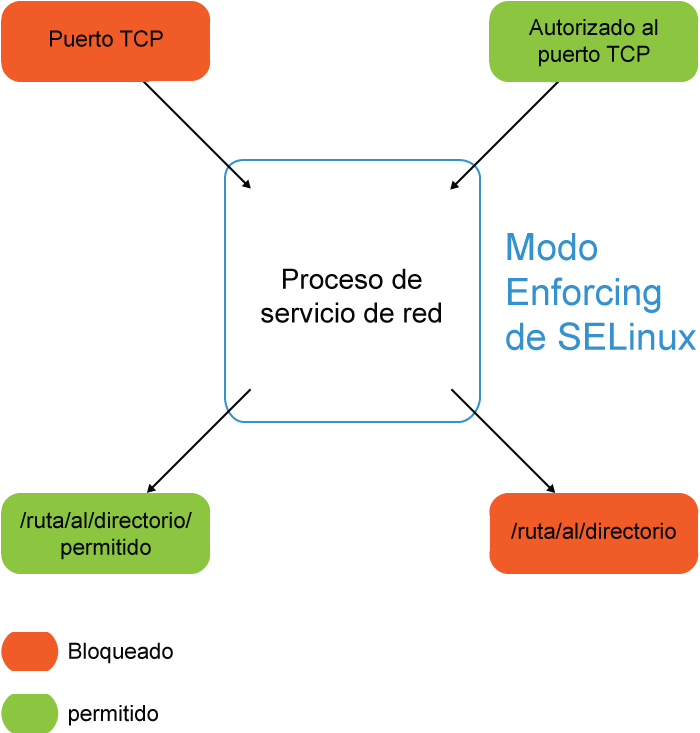

Gestió de comptes d’usuari
==========================

En un sistema Linux poden treballar molts usuaris simultàniament. Cada
un té el seu propi espai d’emmagatzematge de directoris i fitxers, com
també scripts d’inici i variables d’entorn. Les contrasenyes es trien o
s’assignen individualment i cada usuari té un conjunt de privilegis ben
definit. Sota certes circumstàncies, els comptes d’usuari poden tenir
privilegis restringits o estar bloquejades. L’usuari root (conegut com a
superusuari) té habilitats úniques, les quals haurien d’usar rarament i
amb la major precaució possible.

Aquesta secció aprofundeix amb els conceptes vists al primer bloc sobre
comptes d’usuari.

Atributs dels comptes d’usuari
------------------------------

Recordau que es defineixen a ``/etc/passwd``. Exemple

::

    ....
   beav:x:1000:1000:Theodore Cleaver:/home/beav:/bin/bash
   warden:x:1001:1001:Ward Cleaver:/home/warden:/bin/bash
   dobie:x:1002:1002:Dobie Gillis:/home/dobie:/bin/bash
   ....

On cada element (separat per ``:``) és:

-  Nom d’usuari únic

-  Contrasenya assignada (es defineix a /etc/shadow)

-  Identificador únic **UID**

-  Identificador de grup principal de l’usuari **GID**

-  Comentari o informació de contacte

-  Directori /home de l’usuari

-  Shell d’inici (/bin/bash o /bin/csh)

Creació amb useradd
-------------------

Recordau que useradd serveix per crear comptes d’usuari.

::

    $ sudo useradd stephane

Crea un compte anomenat stephane. La comanda useradd provoca
especificament això:

#. El pròxim **UID major a UID_MIN** (variable especificada a
   /etc/login.defs) s’assigna de forma predeterminada és el que
   s’assigna.

#. Es crea un grup **stephane** amb GID=UID i s’assigna com a grup
   principal de l’usuari **stephane**.

#. La shell d’inici s’assigna com a /bin/bash.

#. Es copien els continguts de /etc/skel a /home/stephane. /etc/skel
   inclou fitxers d’\ **inici de bash** i de **X Window.**

#. S’afegeix una entrada de **!!** o **!** a /etc/shadow a l’entrada
   d’stephane. Això implica que l’administrador ha d’assignar manualment
   la contrasenya a l’usuari.

Tots aquests paràmetres poden modificar-se amb opcions de la línia de
comandes:

::

    $ sudo useradd -s /bin/csh -m -k /etc/skel -c "Bullwinkle J Moose" bmoose

(Opció m implica crear el directori home si no existeix)

Modificació o eliminació
------------------------

La comanda

::

   $ sudo userdel isabelle

Elimina totes les referències d’\ **isabelle** des de /etc/passwd,
/etc/shadow i /etc/group.

No esborra el directori home, a menys que s’especifiqui l’opció **-r**.
Els fitxers de l’usuari a altres llocs queden.

**usermod** modificarà característiques del compte.

Bloquejar comptes
-----------------

Alguns comptes de Linux venen **bloquejats** per defecte. Això implica
que poden executar programes però no poden iniciar sessió al sistema.
Això és perquè no tenen cap contrasenya vàlida o la seva shell no es pot
executar.

Per exemple, algunes entrades de /etc/passwd

::

   bin:x:1:1:bin:/bin:/sbin/nologin
   daemon:x:2:2:daemon:/sbin:/sbin/nologin

La shell nologin retorna un missatge com el següent i impedeix el login:

::

    This account is currently not available.

Pot configurar-se el missatge al fitxer /etc/nologin.txt.

Aquests comptes es creen per propòsits específics, ja sigui per serveis
del sistema com per aplicacions. N’hi ha més que podeu cercar al
/etc/passwd.

Així mateix, podem **bloquejar comptes** amb la comanda:

::

    $ sudo usermod -L stephane

Amb això, l’usuari segueix al sistema però no pot iniciar sessió. Pot
desbloquejar-se amb l’opció **-U**.

Una pràctica habitual és bloquejar el compte quan deixa l’organització.

També pot bloquejar-se un compte amb **chage** i es posa una data
d’expiració de la contrasenya al passat.

::

   $ sudo chage -E 2014-09-11 isabelle

També pot modificar-se el hash de /etc/shadow de l’usuari i posar un
**!** o qualsevol altre string no vàlid.

/etc/shadow
-----------

El fitxer ``/etc/shadow`` conté un registre per cada usuari.

Exemple:

::

    
   daemon:*:16141:0:99999:7:::
   .....
   beav:$6$iCZyCnBJH9rmq7P.$RYNm10Jg3wrhAtUnahBZ/mTMg.RzQE6iBXyqaXHvxxbKTYqj.d
          9wpoQFuRp7fPEE3hMK3W2gcIYhiXa9MIA9w1:16316:0:99999:7:::

Amb camps separats per **:**. Són:

-  nom usuari únic

-  el valor hash (sha512, sha256...) de la contrasenya.

-  lastchange: amb format EPOCH de quan la contrasenya va ser canviada
   per última vegada.

-  min days: quantitat mínima de dies abans que la contrasenya pot ser
   canviada.

-  max days: quantitat màxima de dies en que la contrasenya ha de ser
   canviada.

-  warn: dies abans que s’avisarà l’usuari quan hagi de canviar la
   contrasenya

-  grace: dies de gràcia després de que la contrasenya hagi expirat.

-  expire: data en que es deshabilitarà el compte.

-  reserved: camp reservat.

Totes les dates es guarden en format EPOCH (temps que ha passat des de 1
de gener 1970).

El hash de la contrasenya és l’string ``"$6"`` (si es tracta de sha512)
seguit d’un valor *salt* de 8 caràcters, seguit per un caràcter ``$`` o
un hash de 88 caràcters (si sha512).

L’ús **/etc/shadow** permet habilitar la caducitat de les contrasenyes i
mantenir una major seguretat al hash de les contrasenyes. Els permisos
predeterminats de /etc/passwd són 644 (qualsevol pot llegir-lo).
Qualsevol usuari podria llegir els hashos si estiguessin dins aquest
fitxer i executar un programa com **CrackJohn de Ripper**.

/etc/shadow té permisos 400 i només root pot accedir-hi.

Gestió de contrasenyes
----------------------

Les contrasenyes poden canviar-se amb l’eina **passwd**. Un usuari
normal pot canviar la seva, i root de la de qualsevol (passant el nom
d’usuari com a argument). En introduir-se, no es mostra ni la
contrasenya ni els caràcters.

Generalment i en la majoria de distribucions la contrasenya és examinada
per la llibreria ``pam_cracklib``, que s’encarrega de que elegim
contrasenyes adequades.

::

    $ passwd
    Changing password for clyde
    (current) UNIX password: <clyde's password>
    New UNIX password: <clyde's-new-password>
    Retype new UNIX password: <clyde's-new-password>
    passwd: all authentication tokens updated successfully

Si root canvia la contrasenya, no demanarà introduir l’actual:

::

    $ sudo passwd kevin
    New UNIX password:  <kevin's-new-password>
    Retype new UNIX password: <kevin's-password>
    passwd: all authentication tokens updated successfully

chage: caducitat de la contrasenya
~~~~~~~~~~~~~~~~~~~~~~~~~~~~~~~~~~

És una bona pràctica de seguretat canviar periòdicament les
contrasenyes. Això limita la quantitat de temps que un intrús té per
crackejar-ne una. També pot emprar-se per bloquejar comptes. El
desaventatge és que els usuaris solen trobar molesta aquesta política.

L’eina per fer això és **chage**:

::

    chage [-m mindays] [-M maxdays] [-d lastday] [-I inactive] [-E expiredate] [-W warndays] user

Exemple:

::

   $ sudo chage -l stephane
   $ sudo chage -m 14 -M 30 kevlin 
   $ sudo chage -E 2012-4-1 isabelle
   $ sudo chage -d 0 clyde # això força l'usuari a canviar la contrasenya.

Les opcions indiquen:

-  -l: llista informació

-  -m: número mínim de dies en què l’usuari pot fer dos canvis de
   contrasenya. És a dir, si s’especifica un 14, l’usuari pot canviar la
   contrasenya, però haurà d’esperar 14 dies per poder-la tornar a
   canviar.

-  -M: número màxim de dies en què la contrasenya és vàlida.

-  -E: data en que expira la contrasenya.

-  -d: especifica els dies (en EPOCH) des de que es va canviar la
   contrasenya.

Només root pot emprar **chage**, tot i que qualsevol usuari pot fer
``chage -l`` per veure informació específica sobre el seu compte.

Shell restringida
-----------------

En Linux pot emprar-se una shell restringida. S’invoca amb:

::

    $ /bin/bash -r

o **rbash**.

Una shell restringida opera en un ambient més controlat. En particular:

-  Impedeix que l’usuari canviï a un directori fora del seu home

-  Impedeix que redefineixi les variables d’entorn **SHELL, ENV i PATH**

-  No permet que l’usuari especifiqui una ruta absoluta o noms de
   comandes executables que parteixen de /.

-  Impedeix redirecció d’E/S.

Hi ha altres restriccions que podeu consultar a **man bash**.

Compte root
-----------

El compte root hauria d’usar-se només amb propòsits administratius, quan
sigui absolutament necessari i en cap cas ser usada com un dels comptes
habituals. Els errors poden ser molt costosos per a la integritat,
estabilitat i seguretat del sistema.

Generalment l’inici de sessió remot amb root està **prohibit** per
defecte. És possible permetre inicis de sessió amb Secure Shell usant
ssh, el qual es configura a ``/etc/ssh/sshd_config`` i amb **PAM
(Pluggable Authentication Modules)**, a través del mòdul
**pam_securetty.so** i l’arxiu associat ``/etc/securetty``. L’inici de
sessió de root es permet només des dels dispositius llistats a
``/etc/securetty``.

En general es recomana que tots els accessos al compte root es realitzin
a través de **su** o **sudo** (generant un registre d’auditoria de tots
els accessos a root a través de sudo). Tingueu en compte que algunes
distribucions (com ara Ubuntu) prohibeixen iniciar sessió directament al
compte root.

PAM també pot usar-se per a restringir a quins usuaris se’ls permet fer
la seva al compte root. Podria valer la pena configurar auditd per
registrar tots els ordres executades com a root.

SSH
---

Per connectar-se a sistemes remots, recordau que existeix la comanda SSH
(Secure Shell).

Per exemple:

::

    $ ssh -l curslinux -p 10022 lois.gotes.org

Pot emprar-se també **scp** per copiar fitxers:

::

   $ scp file.txt farflung.com:/tmp
   $ scp file.tex student@farflung.com/home/student
   $ scp -r some_dir farflung.com:/tmp/some_dir

Per executar una comanda a múltiples màquines simultàniament:

::

   $ for machines in node1 node2 node3
     do (ssh $machines some_command &)
     done

Connexió SSH sense contrasenya
~~~~~~~~~~~~~~~~~~~~~~~~~~~~~~

Es pot configurar SSH per facilitar el seu ús, particularment per
permetre la connexió sense una contrasenya. Els fitxers de configuració
específics es creen baix cada directori home en el directori ocult .ssh:

::

   $ ls -l ~/.ssh
   total 20
   -rw-r--r-- 1 hilda hilda 1172 Sep 27  2014 authorized_keys
   -rw------- 1 hilda hilda  207 Aug  9  2011 config
   -rw------- 1 hilda hilda 1675 Dec  8  2010 id_rsa
   -rw-r--r-- 1 hilda hilda  393 Dec  8  2010 id_rsa.pub
   -rw-r--r-- 1 hilda hilda 1980 Apr 28 07:36 known_hosts

On:

-  ``id_rsa``: clau xifrada SSH (privada) de l’usuari

-  ``id_rsa.pub``: clau pública SSH de l’usuari

-  ``authorized_keys``: llista de claus públiques que tenen permís per
   connectar-se a aquest servidor sense contrasenya

-  ``known_hosts``: llista de hosts i la seva clau pública als quals
   s’ha connectat i s’ha confiat prèviament

-  ``config``: fitxer de configuració del client SSH específica per
   l’usuari

Per poder-nos connectar a un **servidor remot sense que ens demani
contrasenya**, hem de fer el següents passos:

#. Generar-nos, a l’ordinador client des del qual ens connectarem, i si
   no la tenim ja, la nostra parella de claus pública-privada per SSH.
   Ho farem amb:

   ::

        $ ssh-keygen

   -  Demanarà una *passphrase* (contrasenya per la clau privada) que en
      principi deixarem en blanc (pitjam enter tot el temps.

   -  Això crea una clau pública a ``.ssh/id_rsa.pub``. Aquesta podem
      compartir-la per tot.

   -  També genera una clau privada ``.ssh/id_rsa``. Aquesta no pot
      sortir d’aquest ordinador.

#. Entram dins el servidor al qual volem accedir sense contrasenya, amb
   l’usuari amb el que ens volem connectar.

#. Copiam la nostra clau pública al fitxer ``.ssh/authorized_keys``, tal
   que quedi així:

   ::

      $ cat authorized_keys

      ssh-rsa AAAAB3NzaC1yc2EAAAADAQ
      ...0000aSd...imi@ajuntament-srv1.palma.cat

#. Hem de vigilar els permisos del fitxer ``.ssh/authorized_keys``.
   Aquests han de ser sempre **0600**

#. Provau, des de l’ordinador client, de connectar-vos al servidor amb
   l’usuari indicat. Fixau-vos que, en l’ordinador client, el vostre
   usuari ha de ser l’usuari amb la parella de claus que heu generat i,
   al servidor, l’usuari amb el que vos connectau ha de ser l’usuari al
   que heu modificat el fitxer ``.ssh/authorized_keys``.

EXERCICIC PRÀCTIC - Treballant amb comptes d’usuari
~~~~~~~~~~~~~~~~~~~~~~~~~~~~~~~~~~~~~~~~~~~~~~~~~~~

#. Creau un usuari anomenat user1

#. Connectau-vos localment per ssh amb l’usuari user1. No hauríeu de
   poder perquè l’usuari encara no té contrasenya.

#. Assignau-li una contrasenya a user1 i provau-ho de nou.

#. Revisau els grups que s’han creat a /etc/passwd, /etc/group i
   /etc/shadow.

#. Revisau el fitxer /etc/default/useradd i consultau els valors per
   defecte actuals. Consultau també el fitxer /etc/login.defs.

#. Provau de crear un usuari user2 amb la shell **Korn (ksh)** per
   defecte o amb la shell C **csh**. Assignau-li una contrasenya.

#. Mirau /etc/shadow. Quina és la data d’expiració de la contrasenya del
   compte user1?

#. Emprau chage per configurar la data d’expiració de l’usuari user1 a
   Desembre 1 de 2013.

#. Mirau de nou la data d’experació de user1.

#. Emprau **usermod** per bloquejar el compte user1.

Gestió de grups
---------------

Els usuaris en Linux pertanyen a un o més grups. Això permet:

-  Que els usuaris comparteixin una àrea de treball (fitxers, directoris
   etc.)

-  Configurar permisos de fitxers per permetre l’accés als membres del
   grup però no a la resta.

-  Permetre a certs usuaris accedir a recursos específics.

Els grups i els seus membres poden ser gestionats i mantinguts amb:

-  groupadd: Afegeix un grup.

-  groupdel: Elimina un grup.

-  groupmod: Modifica les propietats del grup.

-  usermod: Modifica la pertinença a grups d’un usuari (afegeix o
   elimina).

També es pot editar directament ``/etc/group``, però és millor fer
servir l’eina ``vigr``, la qual generalment està enllaçada simbòlicament
a l’eina ``vipw``, esmentada anteriorment.

Aquestes eines de gestió de grups modifiquen ``/etc/group`` i
``/etc/gshadow`` (en cas d’existir), i només poden ser executades per
root.

Seguretat local del sistema
===========================

Els ordinadors són inherentment insegurs i necessiten ser protegits de
la gent que podria ficar-se en ells o atacar-los. Els atacants solen fer
això amb la finalitat de danyar el sistema, rebutjar serveis o robar
informació.

Cap ordinador pot ser absolutament segur. Tot el que podem fer és
alentir i desanimar els intrusos amb la finalitat que abandonin l’atac,
per buscar blancs més fàcils o per atrapar-lo a l’acte i prendre les
accions apropiades.

La seguretat pot ser definida en termes de l’habilitat del sistema per
fer el que se suposa que ha de fer, la seva integritat i exactitud, com
també en la garantia que el sistema està disponible només per als que
estan autoritzats a usar-lo.

El problema més gran és trobar l’\ **equilibri** apropiat entre
**seguretat i productivitat**; si les restriccions de seguretat
pressionen molt a l’usuari, són difícils, no estan totalment clares i
bàsicament són mesures ineficaces, els usuaris eludiran els
procediments.

Les quatre àrees que necessitem protegir inclouen la física, local,
remota i el personal. En aquesta secció no ens concentrarem en la
seguretat de la xarxa, sinó més aviat en els factors locals.

Política de seguretat
---------------------

En l’organització és important crear i donar a conèixer unes polítiques
clares de seguretat:

-  Simples i fàcils de comprendre

-  Actualitzades de forma constant

-  Constar per escrites en un document

-  Descriure tant polítiques com procediments

-  Especificar accions coercitives

-  Especificar les accions a prendre davant un incident de seguretat

Han de ser genèriques i fàcils d’entendre perquè puguin seguir-se. Han
de salvaguardar la informació que necessita ser protegida, denegar
accessos a serveis associats i protegir la privacitat.

Què incloure en una política de seguretat
-----------------------------------------

Una política de seguretat ha d’incloure **mètodes de protecció de la
informació** per evitar sigui llegida o copiada per personal no
autoritzat. També hauria d’incloure protecció perquè la informació **no
sigui alterada** o eliminada sense el permís de l’amo. Tots els serveis
haurien d’estar **protegits perquè estiguin disponibles** i no degradats
d’alguna manera sense autorització.

Aspectes essencials:

-  Confidencialitat

-  Integritat de les dades

-  Disponibilitat

-  Consistència

-  Control

-  Auditoria.

La política ha d’assegurar-se que la informació és la correcta i que el
sistema es comporta com s’espera. En efecte, hauria d’haver processos
per determinar qui està aconseguint accés al seu sistema. El factor humà
és l’enllaç més feble en la cadena de seguretat: això requereix la major
atenció a través d’una auditoria constant.

Riscos a avaluar
----------------

S’ha de realitzar un anàlisi de risc responent a tres preguntes:

#. Què vull protegir?

#. Contra qui ho vull protegir?

#. Quant diners, temps i personal es necessita per donar la protecció
   adequada?

Definir aquest anàlisi és un prerequisit per construir la política de
seguretat.

Filosofia de seguretat
----------------------

Dues filosofies bàsiques:

-  Qualsevol cosa no expressament permesa és denegada

-  Qualsevol cosa que no estigui prohibida és permesa

S’ha de decidir en cada cas quina és la millor per cada organització. La
primera és més estricta i la més emprada, ja que s’han d’anar assignant
permisos usuari per usuari. La segona és menys emprada i pot donar
problemes en situacions no controlades.

Alguns apunts generals
----------------------

#. **El factor humà és l’esglaó més dèbil**. Cal educar els usuaris i
   mantenir-los contents. El major percentatge de vulneracions són
   interns i no són maliciosos.

#. **No existeix cap entorn invulnerable**. L’únic sistema totalment
   segur és aquell que està al fons del mar.

#. **La paranoia és bona**. Sospitau, esteu atents i perseverants en
   assegurar un sistema. És un procés continu al que s’ha de prestar-li
   atenció constantment. Verificau processos, usuaris i fixau-vos amb
   tot el que sembli fora del normal.

Exemple: els usuaris mai haurien de posar el directori actual a la
variable PATH. No permeteu coses com:

::

    cat ~/.bashrc
    PATH=./:$PATH

Ja que una persona maliciosa podria reemplaçar un programa amb un altre
del mateix nom. Exemple, un script anomenat **ls** que envia el fitxer
``/etc/passwd`` a un servidor remot.

Actualitzacions i seguretat
~~~~~~~~~~~~~~~~~~~~~~~~~~~

És crític prestar atenció a les actualitzacions del la distribució i
aplicar-les tan aviat sigui possible.

La majoria dels atacs **exploten forats de seguretat coneguts** en el
període de temps entre la revelació del problema i l’aplicació dels
*parches*. Els atacs *zero day* són molt més rars; en aquest cas un
atacant usa un forat de seguretat que no ha estat descobert o per al
qual no s’ha alliberat encara cap *parche*.

Els administradors de sistemes són reticents a aplicar tals *parches*
immediatament després que han estat alliberats. Això és un por basada en
experiències negatives amb companyies de programari privatiu, on els
*parches* poden causar, en alguns casos, més problemes que solucions. No
obstant això, aquestes regressions són extremadament rares en Linux i
probablement el perill de retardar l’aplicació d’un *parche* de
seguretat no és justificable.

Accés al hardware i vulnerabilitats
~~~~~~~~~~~~~~~~~~~~~~~~~~~~~~~~~~~

En qualsevol moment el hardware pot ser compromès:

-  **Key logging**: emmagatzemar l’activitat en temps real d’un usuari
   de computador (amb un programari de tipus keylogger), incloent les
   tecles que pressiona. La informació capturada pot ser emmagatzemada
   localment o transmesa a màquines remotes.

-  Analitzador de paquets de xarxa: Captura i visualització de les dades
   a nivell de paquets de xarxa.

-  Arrencar amb un live CD/DVD de rescat.

-  Muntar el disc en un altre entorn i modificar-lo.

L’accés físic a un sistema permet als atacants aprofitar fàcilment
diferents vectors d’atac, la qual cosa torna a irrellevants totes les
recomanacions a nivell de sistema operatiu.

Per l’anterior, la política de seguretat ha de partir amb requeriments
sobre com assegurar apropiadament l’accés físic als servidors i
estacions de treball.

Directrius d’accés al hardware
~~~~~~~~~~~~~~~~~~~~~~~~~~~~~~

Els passos necessaris inclouen:

-  Assegurar les estacions de treball i servidors.

-  Protegir l’accés als enllaços de xarxa de persones a les quals no
   confia.

-  Protegir els teclats en on les contrasenyes són ingressades per
   assegurar que no puguin ser alterats.

-  Configureu protecció per contrasenya a la BIOS de manera que el
   sistema no pugui ser arrencat amb un live CD / DVD, de rescat o un
   dispositiu USB.

Per computadors d’usuari i aquells en un ambient domèstic, algunes de
les característiques esmentades (com prevenir l’arrencada de dispositius
extraïbles) poden ser excessives.

Protecció de la BIOS
~~~~~~~~~~~~~~~~~~~~

La BIOS (o més recentment la EFI) és el nivell més baix de software que
configura o manipula el seu sistema. El carregador d’arrencada accedeix
a la BIOS per determinar com arrencar la màquina. La BIOS:

-  És el nivell més baix de seguretat. La majoria permeten fer-ho des
   dels seus menús de configuració.

-  Ha de ser protegit per l’ús d’una contrasenya.

-  Ha d’estar actualitzada.

-  Definir una contrasenya a la BIOS protegeix que persones sense
   autorització canviïn les opcions d’arrencada per guanyar accés al
   sistema. No obstant això, només importa si algú pot aconseguir accés
   físic a la màquina, ja que això requereix de presència local.

També es recomana generalment que la BIOS es mantingui al dia amb
l’última versió del firmware. No obstant això, la majoria de les
actualitzacions de les BIOS no tenen relació amb el tema de seguretat i
els administradors de sistemes solen instal·lar aquests pegats amb molta
cura, ja que una peça de codi incompetent en actualitzacions
innecessàries podria inutilitzar un sistema.

Algunes opcions extres dels sistemes de fitxers
-----------------------------------------------

Quan es munta un sistema de fitxers, ja sigui des de consola o a través
d’fstab, tenim vàries opcions útils referents a la seguretat local:

-  nodev: impedeix al sistema de fitxers tenir dispositius de blocs que
   podrien ser un forat de seguretat.

-  nosuid: els bits de setUID i setGID no tenen efecte. Més endavant
   s’entrarà amb més detalls. Aquests bits podrien generar una escalada
   de privilegis.

-  noexec: restringeix l’execució directa de qualsevol binari al sistema
   de fitxers

-  ro: munta el sistema de fitxers en mode només lectura.

Exemple de muntar el sistema de fitxers en mode ro, sense permisos
d’execució i amb nodev:

::

   $ mount -o ro,noexec,nodev /dev/sda2 /mymountpt 

i l’entrada a fstab:

::

   /dev/sda2 /mymountpt ext4 ro,noexec,nodev 0 0

Bits de setUID/setGID
---------------------

Generalment, un programa corre amb els privilegis de l’usuari que el va
executar. Això significa que sense importància de qui sigui el
propietari d’aquest binari: el procés corre amb privilegis de l’usuari
actual.

Ocasionalment, és necessari que alguns usuaris tenguin capacitats
exteses com iniciar o aturar una interfície de xarxa, editar un fitxer
de configuració etc.

En configurar el bit de **setUID** (set user ID) en un fitxer
executable, es modificarà el comportament normal i s’otorgaran drets
d’accés del propietari del fitxer enlloc dels de l’usuari que executa el
programa.

Així mateix, és possible configurar el bit de **setGID** de tal manera
que el procés s’executi amb privilegis del grup del que n’és propietari
el binari enlloc dels privilegis del qui l’està corrent.

Generalment, l’ús de setUID i setGID és una **mala idea** i és
recomanable evitar-lo. Generalment és millor escriure un servei (o
*daemon*) amb menys privilegis. Alguns distribucions han deshabilitat
aquesta característica.

configuració dels bits setUID i setGID
~~~~~~~~~~~~~~~~~~~~~~~~~~~~~~~~~~~~~~

Simplement es fa:

::

   $ chmod u+s somefile
   $ chmod g+s somefile

on el primer exemple fa l’operació de **setUID** i el segon **setGID**.

En el cas dels directoris, configurar el bit de **setGID** té un altre
efecte:

::

    $ chmod g+s somedir

Els fitxers que es creïn aquí pertanyen al grup del propietari del
directori i no al grup de l’usuari que els ha creat.

El bit de **setUID** en directoris no té cap efecte.

Teniu en compte que **NO** és possible canviar el **setuid** d’un
script. No passarà res si ho feu. Això podria ser un forat gran de
seguretat ja que simplement cancel·lant l’script tendríem una escalada
de privilegis. Just es pot fer en binaris executables.

EXERCICI PRÀCTIC - Seguretat i opcions de mount
-----------------------------------------------

Muntarem una partició o dispositiu loop amb l’opció **noexec**.

#. Creau la partició amb el Virtual Box, formatau un sistema de fitxers
   ext4 i muntau-lo.

#. Copiau un fitxer executable a qualsevol banda. Per exemple: /bin/ls.

#. Muntau-lo de nou amb l’opció noexec.

#. Mirau què passa si provau d’executar l’executable.

Mòduls de Seguretat de Linux (LSM): SELinux
===========================================

Un sistema computacional modern ha de ser segur, però les necessitats
varien d’acord a la sensibilitat de la informació, nombre de comptes
d’usuari, exposició a xarxes externes, requeriments legals i altres
factors. La responsabilitat d’habilitar bons controls de seguretat recau
tant en els dissenyadors de les aplicacions, desenvolupadors i
mantenidors del nucli Linux. Per descomptat, els usuaris també han de
seguir els bons procediments establerts, però en un sistema gestionat
adequadament, els usuaris no privilegiats haurien de tenir una capacitat
molt limitada per exposar el sistema a violacions de seguretat.

En aquesta secció ens ocuparem de com el nucli Linux millora la
seguretat a través de l’ús de mòduls de Seguretat de Linux (LSM),
particularment amb la implementació de SELinux.

Moduls de Seguretat de Linux
----------------------------

Hi ha hagut un seguit d’idees sobre com incorporar un mòdul de seguretat
informàtica en Linux. La idea és implementar controls d’accés
obligatoris sobre una varietat de peticions realitzades al nucli, d’una
forma en la qual:

-  Es minimitzen els canvis al nucli.

-  Es minimitzi la sobrecàrrega sobre el nucli.

-  Permeti flexibilitat i es pugui triar entre diferents
   implementacions, cadascuna de les quals es presenta com un LSM
   autònom (Linux Security Module).

La idea bàsica és interceptar les crides al sistema; inserir codi cada
vegada que una aplicació sol·licita una transició a mode nucli per tal
de realitzar la tasca que requereix habilitats esteses. Aquest codi
s’assegura que els permisos siguin vàlids i que hi hagi protecció contra
intents malintencionats. Això es porta a terme en invocar passos de
seguretat funcionals abans i / o després que una trucada al sistema és
satisfeta pel nucli.

Algunes implementacions d’LSM són SELinux (la primera), AppArmor, Smack
o TOMOYO. Només un LSM pot ser emprat a la vegada ja que es modifiquen
les mateixes parts del kernel de **Linux**.

Ens concentrarem principalment en **SELinux**.

Resum SELinux
-------------

Desenvolupada inicialment per la NSA i ha sigut part integral de
**RHEL**. Operacionalment, SELinux és un conjunt de regles de seguretat
que s’empren per determinar quins processos poden accedir a fitxers,
ports i altres ítems.

Funciona amb tres entitats conceptuals:

#. **Contextos**: etiquetes a fitxers, processos i ports. Exemples de
   contextos són usuaris, rol i tipus.

#. **Regles**: descriu el control d’accés en termes de contextos,
   processos, fitxers, ports, usuaris, etc.

#. **Polítiques**: conjunt de regles que descriuen les decisions de
   control d’accés aplicables al sistema.

Un context de SELinux és un nom emprat per una regla per definir com els
usuaris, processos i ports interactuen entre ells. Com que la política
per defecte és denegar qualsevol accés, les regles s’empren per
descriure les accions permeses al sistema.

Modes de SELinux
----------------

SELinux pot córrer amb tres modes diferents:

-  Enforcing: tot el codi de **SELinux** està operatiu i l’accés està
   denegat d’acord a la política. Totes les violacions a la mateixa
   estan auditades i **registrades**. Vegeu a la figura
   `[fig_1] <#fig_1>`__.

-  Permissive: habilita el codi SELinux però només audita i avisa
   d’operacions que serien denegades en mode *enforcing*.

-  Disabled: deshabilita completament el codi per aplicacions i kernel.

Aquests modes se seleccionen al fitxer de configuració
``/etc/selinux/config``. Pot variar i ser ``/etc/sysconfig/selinux``. El
fitxer està autodocumentat.

   SELinux en mode Enforced. [fig_1]

L’eina **sestatus** mostra el mode i política actuals.

Per examinar o configurar el mode actual es pot emprar **getenforce** i
**setenforce**:

::

   $ getenforce

   Disabled

   $ sudo setenforce Permissive
   $ getenforce

   Permissive

**setenforce** s’empra per canviar entre mode enforcing i permissive al
moment (mentre el sistema està en marxa). No es pot habilitar o
deshabilitar el mode disabled d’aquesta manera. Per deshabilitar
**SELinux completament** hi ha dues maneres possibles:

-  **Fitxer de configuració** (generalment ``/etc/selinux/config``)
   configurau **SELINUX=disabled**. Aquest és el mode per defecte.

-  **Paràmetre del kernel**: afegint **selinux=0** a la llista de
   paràmetres.

No es recomana deshabilitar SELinux en sistemes on tornarà a ser
habilitat. És preferible el mode **Permissive** ja que reetiqueta el
sistema de fitxers sencer.

Polítiques de SELinux
---------------------

El mateix fitxer de configuració ``/etc/sysconfig/selinux`` també
**configura la política de SELinux**. Es permeten múltiples polítiques,
però només una pot estar activa a la vegada. Canviar la política pot
requerir un reinici del sistema i un reetiquetat del contingut del
sistema de fitxers, cosa que pot ser lenta. Cada política té fitxers que
han de ser instal·lats baix ``/etc/selinux/[SELINUXTYPE]``.

Les polítiques més comuns són:

-  **targeted**: la política **per defecte** en la qual SELinux és més
   restringida a processos específics. Tots els processos d’usuari i
   init no estan dins els objectius. SELinux imposa restriccions de
   memòria per a tots els processos, cosa que redueix vulnerabilitats
   davant atacs de *buffer overflow*

-  **minimum**: una modificació de targeted on només els processos
   seleccionats estan protegits.

-  **MLS**: política de seguretat de múltiples nivells molt més
   restrictiva. Tots els processos es posen en dominis de seguretat
   específics amb polítiques particulars.

Eines de context
----------------

Com hem mencionat anteriorment, els contextos són etiquetes que
s’apliquen a fitxers, directoris, ports i processos. Aquestes etiquetes
s’empren per descriure regles d’accés. Existeixen quatre contextes en
SELinux:

-  User

-  Role

-  Type

-  Level

Ens focalitzarem amb **type**, el contexte més emprat. La convenció és
que els noms d’etiquetes de context de type acabin amb **\_t** (com
kernel_t).

Eines estàndard de línia de comandes i SELinux
----------------------------------------------

Algunes comandes estàndard de la línia de comandes de Linux (com **ls**
i **ps**) s’han extès per soportar SELinux i les seccions corresponents
es varen afegir als manuals. El paràmetre Z, moltes vegades, mostra les
dades de seguretat:

::

   $ ps axZ

   LABEL PID TTY STAT TIME COMMAND
   system_u:system_r:init_t:s0 1 ? Ss 0:04 /usr/lib/systemd/systemd --switched-root ...
   system_u:system_r:kernel_t:s0 2 ? S 0:00 [kthreadd]
   ...
   unconfined_u:unconfined_r:unconfined_t:s0-s0:c0.c1023 2305 ? D 0:00 sshd: peter@pts/0
   unconfined_u:unconfined_r:unconfined_t:s0-s0:c0.c1023 2306 pts/0 Ss 0:00 -bash
   ...
   system_u:system_r:httpd_t:s0 7490 ? Ss 0:00 /usr/sbin/httpd -DFOREGROUND
   system_u:system_r:httpd_t:s0 7491 ? S 0:00 /usr/sbin/httpd -DFOREGROUND
   ...

   $ ls -Z /home/ /tmp/

   /home/:
   drwx------. peter peter unconfined_u:object_r:user_home_dir_t:s0 peter
   /tmp/:
   -rwx------. root root system_u:object_r:initrc_tmp_t:s0 ks-script-c4ENhg
   drwx------. root root system_u:object_r:tmp_t:s0 systemd-private-0ofSvO
   -rw-------. root root system_u:object_r:initrc_tmp_t:s0 yum.log

Altres eines són cp, mv, mkdir etc.

Teniu en compte que si SELinux està deshabilitat no es mostrarà
informació rellevant en aquests camps.

Preservació del context en SELinux
----------------------------------

Els fitxers nous hereden el context del directori pare. EN moure o
copiar fitxers, el context del directori font és el que es preserva.
Això pot generar problemes:

Vegem l’exemple anterior. ``tmpfile`` no ha canviat el moure el fitxer
de /tmp a /home/peter:

::

   $ cd /tmp/
   $ touch tmpfile
   $ ls -Z tmpfile

   -rw-rw-r--. peter peter unconfined_u:object_r:user_tmp_t:s0 tmpfile

   $ cd
   $ touch homefile
   $ ls -Z homefile

   -rw-rw-r--. peter peter unconfined_u:object_r:user_home_t:s0 homefile

   $ mv /tmp/tmpfile .
   $ ls -Z

   -rw-rw-r--. peter peter unconfined_u:object_r:user_home_t:s0 homefile
   -rw-rw-r--. peter peter unconfined_u:object_r:user_tmp_t:s0 tmpfile

L’exemple clàssic en el que es crea un problema en SELinux és quan els
fitxers es mouen al DocumentRoot d’un servidor **httpd** (apache). En
sistemes amb SELinux, el servidor web només pot accedir a fitxers amb
etiquetes de context adequat. Si es crea un fitxer a /tmp i es mou al
directori DocumentRoot, httpd no hi podrà accedir fins que es modifiqui
el context SELinux del fitxer.

restorecon
~~~~~~~~~~

L’eina **restorecon** restaura els contextos d’un fitxer basats en la
configuració del dcirectori pare. L’exemple següent reestableix
l’etiqueta per defecte de forma recursiva per tots els fitxers del
directori home:

::

    
   $ ls -Z
   -rw-rw-r--. peter peter unconfined_u:object_r:user_home_t:s0 homefile
   -rw-rw-r--. peter peter unconfined_u:object_r:user_tmp_t:s0 tmpfile

   $ restorecon -Rv /home/peter
   restorecon reset /home/peter/tmpfile context \
   unconfined_u:object_r:user_tmp_t:s0->unconfined_u:object_r:user_home_t:s0

   $ ls -Z
   -rw-rw-r--. peter peter unconfined_u:object_r:user_home_t:s0 homefile
   -rw-rw-r--. peter peter unconfined_u:object_r:user_home_t:s0 tmpfile

semanage
~~~~~~~~

Un altre problema és configurar el context per defecte d’un directori
nou. Es pot fer amb l’eina **semanage fcontest** (del paquet
**policycoreutils-python**). Desplega i canvia el context per defecte de
fitxers i directoris.

Només canvia la configuració per defecte, i no s’aplica a objectes ja
existents. Per això s’ha d’executar **restorecon** posteriorment.
Exemple:

::

   [root@rhel7 /]# mkdir /virtualHosts
   [root@rhel7 /]# ls -Z

   ...
   drwxr-xr-x. root root unconfined_u:object_r:default_t:s0 virtualHosts

   [root@rhel7 /]# semanage fcontext -a -t httpd_sys_content_t /virtualHosts
   [root@rhel7 /]# ls -Z

   ...
   drwxr-xr-x. root root unconfined_u:object_r:default_t:s0 virtualHosts

   [root@rhel7 /]# restorecon -RFv /virtualHosts

   restorecon reset /virtualHosts context unconfined_u:object_r:default_t:s0->system_u:object_r:httpd_sys_content_t:s0

   [root@rhel7 /]# ls -Z

   drwxr-xr-x. root root system_u:object_r:httpd_sys_content_t:s0 virtualHosts

El canvi de context des de default_t a http_sys_content_t es fa en haver
executat **restorecon**.

Booleans en SELinux
-------------------

Podeu consultar i configurar el comportament de la política en temps
d’execució sense reescriure la política. Això s’aconsegueix amb els
booleans de SELinux. Per llistar els booleans, inclosos l’estat actual i
una curta descripció, podeu fer:

::

   $ sudo semanage boolean -l

   SELinux boolean             State   Default   Description
   ftp_home_dir                  (off , off)      Allow ftp to home dir
   smartmon_3ware                (off , off)      Allow smartmon to 3ware
   mpd_enable_homedirs           (off , off)      Allow mpd to enable homedirs
   xdm_sysadm_login              (off , off)      Allow xdm to sysadm login
   xen_use_nfs                   (off , off)      Allow xen to use nfs
   squid_connect_any              (on , on)       Allow squid to connect any
   ..

Per activar o desactivar una política concreta:

::

    
   $ getsebool ssh_chroot_rw_homedirs

   ssh_chroot_rw_homedirs --> off

   $ sudo setsebool ssh_chroot_rw_homedirs on

   $ getsebool ssh_chroot_rw_homedirs

   ssh_chroot_rw_homedirs --> on

Podem fer-la permanent amb l’opció **-P**.

EXERCICI PRÀCTIC - SELinux
--------------------------

Consultau el fitxer LAB_19.1.pdf.

Permisos de fitxers i propietaris
=================================

A Linux cada arxiu té un propietari qui té privilegis per llegir i/o
escriure, i/o executar l’arxiu. Aquests permisos s’assignen de forma
independentment. Aquests permisos poden ser atorgats sobre la base de
pertinença a un grup o a tots els usuaris en el sistema. Aquest model de
permisos d’arxius i propietaris és el cor del model de seguretat de
Control d’Accés Discrecional.

Propietari, grup i others
-------------------------

Quan feim:

::

    $ ls -l a_file
    -rw-rw-r-- 1 coop aproject 1601 Mar 9 15:04 a_file

Després del primer caràcter, el qual indica el tipus de l’objecte
fitxer, hi ha nou més que indiquen els drets d’accés a potencials
usuaris de fitxer. Aquests s’agrupen en tres grups de tres caràcters:

-  propietari: l’usuari que és propietari del fitxer (també anomenat
   usuari).

-  grup: el grup d’usuaris que té accés.

-  others: la resta d’usuaris (anomenat també altres o món).

En l’exemple de dalt, l’usuari és **coop** i el grup és **aproject**.

Es poden modificar l’usuari i el grup d’un fitxer amb **chown** i
**chgrp**.

Drets d’accés
-------------

Cada tipus d’usuari (propietari, grup i altres) té activat algun
d’aquests tres bits:

-  r: lectura

-  w: escriptura

-  x: execució

Addicionalment, s’assignen els bits **setuid** i **setgid**.

Es pot modificar el *mode* d’un fitxer amb l’eina **chmod**.

umask
-----

Els permisos per defecte en crear un fitxer són lectura/escriptura per a
tothom (0666). Per un directori són lectura, modificació i execució per
a tots (0777).

Ara bé, quan creau un fitxer o un directori veureu que això es diferent:
0664 per fitxers i 0775 per directoris. Això es defineix amb
l’\ **umask**. El seu proposit és modificar és mostrar quins permisos es
deneguen.

Podeu comprovar-ho executant:

::

   $ umask

   0002

Aquest valor es combina amb els permisos per defecte amb l’operació
:math:`A AND NOT(B)`. Exemple:

::

    0666 & ~002 = 0664; i.e., rw-rw-r--

L’umask pot canviar-se:

::

    $ umask 0022

ACLs
----

Linux té una implementació completa de ACLs POSIX (llistes de control
d’accés) que extén el model simple. Es poden assignar privilegis en
particular. Es poden compartir fitxers i directoris sense emprar
permisos **777**.

Mentre que el kernel habilita l’ús de ACLs, aquest ha de ser implementat
en el sistema de fitxers en particular. Tots els sistemes de fitxers
principals incorporen extensions ACL i es poden emprar amb l’opció
**-acl** en muntar el sistema de fitxers. Durant la instal·lació del
sistema de fitxers es crea un conjunt ACL per defecte.

Llistar i mostrar configuració dels ACLs
~~~~~~~~~~~~~~~~~~~~~~~~~~~~~~~~~~~~~~~~

Per veure les ACLs:

::

    $ getfacl file|directory

Exemple:

::

   getfacl file1  

Per a configurar ACLs:

::

   $ setfacl options permissions file|directory

Exemples:

::

   $ setfacl -m u:isabelle:rx /home/stephane/file1
   $ setfacl -x u:isabelle /home/stephane/file

Els fitxers nous hereden l’ACL predeterminada des del directori on
resideixen. **mv** i **cp -p** mantenen les ACL.

Per eliminar una ACL:

::

    $ setfacl -x u:isabelle /home/stephane/file1

I per establir el valor predeterminat d’un directori::

::

   $ setfacl -m d:u:isabelle:rx somedir

Pluggable Authentication Modules (PAM)
======================================

Històricament l’autenticació d’usuaris es realitzava individualment per
les aplicacions en si: per exemple, el seu, login i ssh autenticarien i
s’establirien comptes d’usuari de forma independent una de l’altra.

Les aplicacions modernes de Linux han estat escrites o reescrites per
utilitzar PAM (Pluggable Authentication Modules), de tal manera que
l’autenticació es pot dur a terme d’una manera uniforme, usant
**libpam**.

Aquesta biblioteca de mòduls proveeix una enorme flexibilitat i
consistència en relació a l’autenticació, contrasenyes, sessió i serveis
del compte.

PAM incorpora les següents components:

-  Aplicacions que treballen amb PAM.

-  Arxius de configuració en /etc/pam.d/.

-  Mòduls PAM a les biblioteques **libpam\***, les quals es troben en
   /lib/security, /lib/x86_64-linux-gnu o /lib64/security, depenent de
   la distribució.

Cada aplicació o servei que treballa amb PAM ha de ser configurada en
relació a PAM, en un arxiu de configuració individual a /etc/pam.d.

Procés d’autenticació
---------------------

-  Un usuari invoca a l’aplicació que treballa amb PAM, tal com login,
   ssh o su.

-  L’aplicació crida a libpam

-  La biblioteca verifica si hi ha fitxer relacionats a /etc/pam.d.
   Aquests defineixen quins mòduls PAM s’invocaran, inclosos
   system-auth.

-  Cada mòdul referenciat s’executa d’acord amb les regles del fitxer de
   configuració rellevant per aquesta aplicació.

Fitxers de configuració de PAM
------------------------------

Cada fitxer a /etc/pam.d correspon a un servei i cada línia (no
comentada) del fitxer especifica una regla. El format de la regla
consisteix en una llista de tokens separats per espais:

::

    type control module-path module-arguments

A mode d’exemple, vegeu el contingut de /etc/pam.d/su a RHEL 7:

::

   #%PAM-1.0
   auth sufficient pam_rootok.so
   # Uncomment the following line to implicitly trust users in the "wheel" group.
   #auth sufficient pam_wheel.so trust use_uid
   # Uncomment the following line to require a user to be in the "wheel" group.
   #auth required pam_wheel.so use_uid
   auth substack system-auth
   auth include postlogin
   account sufficient pam_succeed_if.so uid = 0 use_uid quiet
   account include system-auth
   password include system-auth
   session include system-auth
   session include postlogin
   session optional pam_xauth.so

Regles de PAM
-------------

El mòdul **type** especifica el grup de gestió associat al mòdul:

-  **auth**: indica a l’aplicació que ha de demanar la identificació de
   l’usuari (nom usuari, contrasenya etc.). Pot configurar les
   credencials i otorgar privilegis.

-  **account**: verifica aspectes del compte d’usuari, tal com
   envelliment de contrasenya, control d’accés etc.

-  **password**: és responsable d’actualitzar el token d’autenticació de
   l’usuari (generalment contrasenya).

-  **session**: s’empra per proveir funcions abans i després de
   l’establiment de la sessió (configuració de l’ambient, inici de
   sessió etc.)

El paràmetre **control** controla com l’èxit o fracàs d’un mòdul afecta
el procés d’autenticació:

-  **required**: retorna èxit perquè s’otorgui el servei. Si és part
   d’un conjunt, la resta de mòduls seran executats. No s’informa a
   l’aplicació de quin mòdul o mòduls fallaren.

-  **requisite**: com requiret, però una falla en qualsevol mòdul acaba
   el conjunt i retorna un estat que s’envia a l’aplicació.

-  **optional**: el mòdul no és requerit. Si és l’únic, però, pot causar
   una falla.

-  **sufficient**: si acaba amb èxit, no s’executen mòduls subsequents.
   Si falla, no causa una falla general a menys que sigui l’únic.

N’hi ha d’altres, com include i substack.

**module-path** és el nom relatiu de la llibreria partint de
/lib*/security.

**module-arguments** pot ser proporcionat per modificar el comportament
de PAM.

Autenticació LDAP
-----------------

**LDAP (Protocol Lleuger d’Accés a Directoris)** és un protocol
estàndard de la indústria per utilitzar i administrar serveis de
directoris distribuïts sobre la xarxa, el qual va ser creat per ser
obert i neutral al proveïdor.

En utilitzar LDAP per autenticació centralitzada, cada sistema (o
client) es connecta a un servidor LDAP centralitzat per a l’autenticació
de l’usuari. L’ús de TLS fa que sigui una opció segura i recomanada.

LDAP utilitza **PAM** i system-config-authentication o authconfig-tui.
Cal especificar el servidor, base DN (nom de domini) i TLS (Seguretat de
la Capa de Transport). També es requereix OpenLDAP-clients, pam_ldap i
nss-pam-ldapd. Es modifiquen cinc fitxers per configurar un sistema amb
autenticació LDAP:

::

   /etc/openldap/ldap.conf
   /etc/pam_ldap.conf
   /etc/nslcd.conf
   /etc/sssd/sssd.conf
   /etc/nsswitch.conf

Poden editar-se manualment o emprar un programa dels disponibles
(system-config-authentication o authconfig-tui).

EXERCICI PRÀCTIC - PAM
----------------------

Una de les configuracions més comunes de PAM és denegar l’accés després
d’un cert número d’intents fallits. Això es fa amb el mòdul i eina
**pam_tally2**. En aquest exercici anem a denegar l’accés a través de
ssh després de tres intents fallits d’accés.

#. Editau ``/etc/pam.d/sshd`` i configurau-lo per denegar l’accés
   després de tres intents. Agregau les línies al fitxer:

   ::

      auth required pam_tally2.so deny=3 onerr=fail
      account required pam_tally2.so

#. Intentau accedir tres vegades amb un usuari en particular i escriviu
   malament la contrasenya.

#. Provau-ho de nou amb el mateix usuari però amb la contrasenya
   correcta.

#. Verificau quants inicis de sessió fallats registra l’usuari.

#. Reiniciau el comptador de logins fallats.

#. Verificau de nou quants inicis de sessió fallats registra l’usuari.

#. Intentau accedir de nou amb la contrasenya correcta.

Firewalls
=========

Un *firewall* o tallafocs és un sistema de seguretat de xarxa que
monitoritza i controla el trànsit. Aplica **regles** tant en connexions
de xarxa entrants com sortints. Els tallafocs poden estar basats en
software o hardware. Es troben tant en *routers* de xarxa com també a
ordinadors individuals o nodes de la xarxa. Molts *firewalls* tenen
també capacitats d’enrutament.

Els primers *firewalls* daten dels finals dels 80 i estaven basats en el
**filtrat de paquets**. El contingut de cada paquet era inspeccionat i
era o bé eliminat, descartat o enviat. No es tenia en compte l’estat de
la connexió ni a quin fluxe pertanyia el paquet.

La següent generació de *firewalls* sí que començà a basar-se en l’estat
dels paquets amb filtres d’estat. Miraven l’estat de la connexió: si era
nova, part d’una existent o de cap. La tercera generació s’anomena de
**capa d’aplicació** i són conscients del tipus d’aplicació i protocol
que empra la connexió. Poden bloquejar qualsevol cosa que no formi part
del fluxe normal.

Interfícies i eines del firewall
--------------------------------

Es pot configurar un firewall en Linux:

-  Amb eines de baix nivell des de la línia de comandes, combinat amb
   l’edició de varis fitxers de configuració del /etc:

   -  **iptables**

   -  firewall-cmd

   -  ufw

-  Emprant interfícies gràfiques robustes:

   -  system-config-firewall

   -  firewall-config

   -  gufw

   -  yast

En aquesta documentació farem referència a les eines de baix nivell
perquè:

-  Canvien menys freqüentment que les eines gràfiques

-  Tendeixen a tenir un conjunt més ampli de funcionalitats

-  Varien poc

firewalld
---------

En CentOS i RHEL existeix l’Administrador Dinàmic de Firewall (el
**firewalld**). Utilitza zones de xarxa que han definit nivells de
confianaça per interfícies de xarxa i connexions. Separa els canvis a la
configuració que es realitzen en temps d’execució dels persistents.
Inclou interfícies per a serveis o aplicacions. Els fitxers de
configuració es troben a ``/etc/firewalld``. L’eina es firewall-cmd.

**firewalld** és un servei hi ha d’estar en execució:

::

    
   $ sudo systemctl [enable/disable] firewalld
   $ sudo systemctl [start/stop] firewalld

   $ sudo systemctl status firewalld

ip forwarding
~~~~~~~~~~~~~

En Linux, si disposam de més d’una interfície de xarxa (física o
virtual) és important activar l’ip forwarding perquè el sistema permeti
que els paquets puguin passar d’una interfície a l’altra. Això ho feim
de dues maneres:

::

   $ sudo sysctl net.ipv4.ip_forward=1
   $ echo 1 > /proc/sys/net/ipv4/ip_forward

Ara bé, per fer-ho persistent hem de modificar /etc/sysctl.conf i posar
l’opció ``net.ipv4.ip_forward=1``.

Zones firewalld
---------------

**firewalld** treballa amb zones, amb un nivell definit de seguretat i
un cert comportament ja definit per a paquets entrants i sortints. Cada
interfície pertany a una zona en particular.

Les zones són:

#. **drop**: tots els paquets s’eliminen. Només es permeten connexions
   sortints.

#. **block**: totes les connexions entrants són descartades. Només es
   permeten les internes del sistema.

#. **public**: no confia amb cap ordinador de la xarxa. Només certes
   connexions entrants seleccionades conscientment són permeses.

#. **external**: s’empra quan el **masquerading** està en ús. Mateix
   nivell de confiança que public.

#. **dmz**: s’empra quan alguns (però no tots) els serveis estan
   permesos al públic. Es permeten només connexions entrants en
   particular.

#. **work**: confia (però no completament) amb els nodes connectats que
   no són perjudicials. Només es permeten certes connexions entrants.

#. **home**: es confia amb la majoria de nodes de la xarxa. Se
   selecciona quines connexions entrants es permeten.

#. **internal**: com work.

#. **trusted** totes les connexions es permeten.

Durant la instal·lació del sistema, totes les distribucions Linux
seleccionen la zona **pública** per defecte.

Gestió de zones
---------------

Obtenir zona per defecte:

::

   $ sudo firewall-cmd --get-default-zone
   public

Obtenir llista de zones actualment en ús:

::

   $ sudo firewall-cmd --get-active-zones
   public
     interfaces: eno16777736

Llista les zones disponibles:

::

   $ sudo firewall-cmd --get-zones
   block dmz drop external home internal public trusted work

Canviar la zona per defecte a trusted i tornar enrere:

::

   $ sudo firewall-cmd --set-default-zone=home
   success

   $ sudo firewall-cmd --set-default-zone=public
   success

Assignar una interfície a una zona en particular:

::

   $ sudo firewall-cmd --zone=internal --change-interface=eno1
   success

   $ sudo firewall-cmd --permanent --zone=internal --change-interface=eno1
   success

Això crea el fitxer /etc/firewalld/zones/internal.xml.

Determinar la zona associada a una interfície en particular:

::

   $ sudo firewall-cmd --get-zone-of-interface=eno1

   public

Obtenir detalls d’una zona en particular:

::

   $ sudo firewall-cmd --zone=public --list-all
   public (default, active)
     interfaces: eno16777736
     sources:
     services: dhcpv6-client ssh
     ports:
     masquerade: no
     forward-ports:
     icmp-blocks:
     rich rules:

Gestió de les fonts
-------------------

Qualsevol zona pot estar lligada no sols a una interfície, sinó també a
una direcció de xarxa en particular. Un paquet està associat a una zona
si

-  Prové d’una direcció IP (source-ip) ja associada a la zona

-  O prové d’una interfície associada a la zona

Si no encaixa dins cap criteri anterior se li assigna la zona per
defecte (**public** generalment)

Per assignar una font a una zona (permanentment):

::

   $ sudo firewall-cmd --permanent --zone=trusted --add-source=192.168.1.0/24
   success

Qualsevol paquet amb direcció 192.168.1.x serà afegit a la zona
**trusted**. Es pot eliminar una font prèviament assignada a una zona
amb l’opció **–remove-source** o canviar-la amb **–change-source**

Per llistar les fonts associades a una zona podeu emprar:

::

   $ sudo firewall-cmd --permanent --zone=trusted --list-sources
   192.168.1.0/24

Gestió de serveis i ports
-------------------------

Hem assignat fins ara interfícies a zones, però no hem delimitat quins
serveis i ports estan disponibles a una zona.

Per veure quins serveis hi ha disponibles:

::

   $ sudo firewall-cmd --get-services

   RH-Satellite-6 amanda-client bacula bacula-client dhcp dhcpv6 dhcpv6-client dns ftp \
   high-availability http https imaps ipp ipp-client ipsec kerberos kpasswd ldap ldaps \
   libvirt libvirt-tls mdns mountd ms-wbt mysql nfs ntp openvpn pmcd pmproxy pmwebapi \
   pmwebapis pop3s postgresql proxy-dhcp radius rpc-bind samba samba-client smtp ssh \
   telnet tftp tftp-client transmission-client vnc-server wbem-https

Consultar els que estan accesibles a una zona en particular:

::

   $ sudo firewall-cmd --list-services --zone=public
   dhcpv6-client ssh

Agregar un servei a una zona:

::

   $ sudo firewall-cmd --permanent --zone=home --add-service=dhcp

   success

   $ sudo firewall-cmd --reload

És necessari fer –reload perquè s’apliquin els canvis. També poden
afegir-se serveis editant els fitxers de /etc/firewalld/services.

La gestió de ports és similar a la dels serveis:

::

   $ sudo firewall-cmd --zone=home --add-port=21/tcp

   success

   $ sudo firewall-cmd --zone=home --list-ports

   21/tcp

EXERCICI PRÀCTIC - Firewall
---------------------------

Afegiu els serveis HTTP i HTTPS a la zona pública i verificau que es
mostren correctament.
