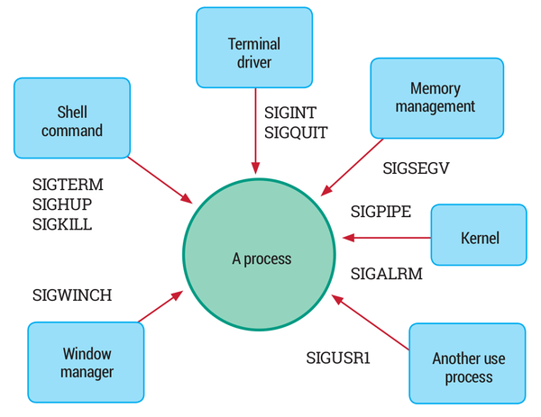

Processos
=========

Un procés és un programa en execució juntament amb els recursos associats. S’hi inclou l’entorn, els fitxers que té obert, gestors de senyals etc. El mateix programa pot ser executat més d’una vegada de forma simultània i és responsable de múltiples processos.

Al mateix temps, dos o més **fils** d’execució poden compartir recursos com espais complets de memòria (o algunes zones en particular), fitxers oberts etc. Quan hi ha qualsevol circumstància en la qual es comparteixen recursos parlam d’un procés **multifil**.

En Linux s’ha treballat molt en crear un sistema ràpid per a crear, destruir i commutador entre processos (canvi de context). Per tant, el model adopotat per aplicacions multifil és molt semblant a processos múltiples. Cada fil es programa individualment com si fos un procés independent normal. Això simplifica molt la programació dels fils d’un procés. Linux respecta també el **POSIX** i altres estàndards multifil.

El procés **init** és el primer procés d’usuari que s’executa en un sistema Linux. Té PID = 1 i s’inicia just quan el kernel ha estat inicialitzat i s’ha muntat el sistema de fitxers arrel. **init** s’executarà fins que s’apagui el sistema. Serà l’últim procés d’usuari que s’acabarà. És el procés pare primigeni de tota la resta de processos.

Alguns processos són iniciats directament pel **kernel** i no tenen l’init com a procés pare. Aquests es mostren amb un ``[]`` al seu nom en llistar-los amb **ps**.

Característiques i atributs d’un procés
---------------------------------------

Un procés és una instància d’un programa d’execució. Disposa de:

-  **pid**: process ID.

-  **ppid**: parent process ID.

-  **pgid**: process group ID.

-  Codi de programa, dades, variables, descriptors de fitxers oberts i un entorn.

Si el procés pare mor abans que el fill, el **ppid** del fill passar a ser 1: és a dir, l’init. En sistemes recents com **systemd** el ppid serà configurat amb 2, un fil intern del kernel conegut com **kthreadd**. Aquest assumeix el rol d’adoptar els fills òrfes.

Un procés fill que acaba l’execució abans que el pare es coneix com un procés **zombie**. Els processos zombies alliberen tots els recursos i es mantenen en aquest estat només per transmetre el seu estat de sortida. Una funció del procés **init** consisteix en verificar els fills adoptius i deixar que els que han acabat morin adequadament. També s’anomena de forma col·loquial, per tant, l’\ **assassí de zombies** o el **segador de nins**.

Els processos, de forma preferent, es controlen per la seva pròpia programació. Només el kernel pot interrompre un procés (la resta de processos no poden).

Per raons històriques, el PID més gran és un número de 16 bits. Màxim, per tant, 32768. Es pot modificar canviant ``/proc/sys/kernel/pid_max``, ja que el valor per defecte pot ser inadequat. Una vegada s’arribi al PID màxim, els processos començaran de nou a partir del PID 300.

Atributs d’un procés
~~~~~~~~~~~~~~~~~~~~

#. Codi de programa que està sent executat

#. Contexte (estat)

#. Permisos

#. Recursos associats

Cada procés executa qualque programa. En qualsevol moment un procés pot fer una snapshot de sí mateix capturant l’estat dels registres de la CPU, on s’executa, què té en memòria i altra informació. Això es coneix com el **context** del procés.

Els processos poden ser programats per entrar i sortir del temps compartit de la CPU amb altres. És possible emmagatzemar el context complet quan canvia la condició del procés i se reestableix la seva execució. Això és crític perquè el kernel pugui fer **canvis de context**.

Ús de ulimit
~~~~~~~~~~~~

L’eina **ulimit** permet mostrar o reestablir els lìmits de recursos associats amb processos que corren baix una shell. Si s’executa amb l’opció **-a** mostra:

::

   $ ulimit -a

   core file size             (blocks, -c) 0
   data seg size              (kbytes, -d) unlimited
   scheduling priority                (-e) 0
   file size                  (blocks, -f) unlimited
   pending signals                    (-i) 31843
   max locked memory          (kbytes, -l) 64
   max memory size            (kbytes, -m) unlimited
   open files                         (-n) 1024
   pipe size               (512 bytes, -p) 8
   POSIX message queues        (bytes, -q) 819200
   real-time priority                 (-r) 0
   stack size                (kbytes,  -s) 8192
   cpu time                  (seconds, -t) unlimited
   max user processes                 (-u) 4096
   virtual memory             (kbytes, -v) unlimited
   file locks                         (-x) unlimited

Potser ens interessa canviar els valors en algun sentit:

-  Restringir capacitats de forma que un usuari no pugui acaparar els recursos del sistema.

-  Ampliar les capacitats de tal forma que un procés no estigui limitat. Per exemple, un servidor que maneja molts clients pot necessitar més de 1024 fitxers oberts.

Hi ha dos tipus de límits:

#. **Hard**: valor màxim que es permetrà en qualsevol cas. Només root el pot configurar.

#. **Soft**: valor màxim que estableix un usuari per aquest recurs en particular. No pot superar el hard limit. Pot configurar-lo qualsevol usuari.

Ús:

::

    $ ulimit [options] [limit]

Exemple:

::

    $ ulimit -n 1600

Incrementa el número màxim permès de descriptors de fitxers oberts a 1600.

Un canvi així només afecta a la shell actual. Perquè els canvis siguin efectius per a tothom s’ha de modificar /etc/security/limits.conf i reiniciar.

Estats d’un procés
------------------

-  **En execució** (R). El procés està sent executat en una CPU o es troba en la cua d’execució esperant el seu torn per ser executat. Es reprendrà quan el planificador decideix que mereix utilitzar la CPU, o quan una altra CPU queda lliure i el planificador mou el procés a aquesta CPU.

-  **Adormit** o *sleeping* (S). El procés espera una sol·licitud (generalment d’E/S) que es va realitzar i no pot continuar fins que es completi. Quan s’hagi completat, el kernel despertarà el procés i el posarà de nou en la coa d’execució.

-  **Detingut** (T). El procés ha estat suspès. Aquest estat s’experimenta quan el programador vol examinar la memòria del programa, els registres, flags i altres atributs. Una vegada que això s’ha fet, aquest pot ser reprès. Es pot posar un programa en aquest estat executant-lo amb un **debbuger** com gdb o quan teclejam **CTRL-Z**

-  **Zombie** (Z): El procés entra en aquest estat quan acaba la seva execució i cap altre procés (generalment el pare) ha demanat sobre el seu estat de sortida. Aquests processos també es denominen difunts. Un procés zombi ha alliberat tots els seus recursos a excepció del seu estat de sortida i la seva entrada a la taula de processos. Si el pare de qualsevol procés mor, el procés és adoptat per init (PID = 1) o KThreadd (PID = 2).

-  **Adormit ininterrumpudament** (*Uninterruptible Sleep*) (D). Un procés entra en aquest estat quan, fent crides a sistema, el procés es bloqueja i no pot ser interromput fins que la crida a sistema es completa. Generalment aquestes crides a sistema es resolen molt ràpid i no són perceptibles, però quan hi ha alguns drivers de kernel defectuosos pot succeir. Un cas típic és amb **NFS**, ja que certes operacions locals d’E/S no són interruptibles (p. ex. mkdir). En una sistema de fitxers en xarxa com NFS, la crida a sistema pot bloquejar-se en fer crides RPC sobre una xarxa poc fiable.

Modes d’execució
----------------

En un moment donat un procés o fil pot ser execucitat en **mode usuari** o **mode sistema** (també mode kernel). Les instruccions (en codi màquina) que un procés pot executar depenen del mode, i aquest filtre s’aplica a nivell de hardware. Generalment, un mode no és un estat del sistema sinó de cada processador.

A mode de recordatori, el mode usuari o mode sistema no tenen res que veure amb executar amb permisos de root o permisos d’usuari.

Al món **Intel** el mode usuari s’anomena **Ring 3** i el mode sistema **Ring 0**.

Mode usuari
~~~~~~~~~~~

Els processos, menys quan fan una crida a sistema, s’executen sempre en **mode usuari**, on tenen menys privilegis.

Quan un procés s’inicia, és aïllat al seu propi espai per protegir-lo d’altres processos. Això s’anomena aïllament del procés. Un procés només pot llegir d’altres processos els espais de memòria compartida.

Mode sistema
~~~~~~~~~~~~

En mode sistema (o kernel) la CPU pot accedir a tot el hardware del sistema (perifèrics, memòria, discos etc.) Si una aplicació necessita accedir a aquest recursos ho ha de fer a través d’una **crida al sistema.** Això provoca un canvi de context des de mode usuari mode kernel. Això s’ha de fer en llegir o escriure fitxers, crear processos nous etc.

El codi de les aplicacions mai corren en mode kernel. Just les crides a sistema. El planificador, les interrupcions de hardware i altres també corren en mode sistema, i no estan executades per cap procés.

Daemons
-------

Un servei, dimoni o **daemon** és un procés que s’executa en segon pla. El seu propòsit es proveir algun servei. N’hem parlat anteriorment.

Recordau que en les darreres versions de Linux s’empra **systemd** per interactuar amb dimonis i serveis. Anteriorment s’emprava **SysVinit**.

Processos del kernel
--------------------

Aguns processos són creats directament pel kernel. Són:

-  Processos interns. Aquests s’ocupen de tasques de manteniment, com ara assegurar que els *buffers* flueixen cap als discos, que la càrrega s’equilibra de manera uniforme en les diferents CPU, que els controladors de dispositius es fan càrrec del treball que ha estat encoat per a ells, etc. Aquests processos a s’executen mentre el sistema està corrent i generalment estan dormint, llevat que tinguin alguna cosa específica que realitzar.

-  Processos externs: corrent en espai d’usuari com les apliacions normals, però són iniciats pel kernel. N’hi ha pocs i tenen una vida curta.

Per veure els processos d’aquest tipus:

::

    $ ps -elf

Es troben entre parèntesis quadrats: ``[]``. Per exemple: ``[ksoftirqd/0]``.

Creació de processos i forking
------------------------------

Un sistema Linux està constantment creant processos nous. Sovint això es denomina **forking**; el procés original pare continua executant mentre que el procés fill acabat de crear s’inicia.

Sovint, en comptes d’un fork, se segueix amb un **exec**, on el procés pare acaba i el procés fill hereta l’ID del procés pare. Els termes fork i exec s’usen tan sovint que la gent pensa que són la mateixa paraula.

Per tenir una idea de com un procés podria iniciar-se, considera un servidor web que fa servir molts clients. El servidor web pot llançar un procés nou cada vegada que un client fa una petició HTTP. D’altra banda, podria iniciar simplement un nou fil com a part del mateix procés; en Linux realment no hi ha molta diferència en l’aspecte tècnic entre crear un procés complet o només un fil nou, ja que cada mecanisme pren aproximadament el mateix temps i usa una quantitat similar de recursos.

Creació d’un procés a través de la shell
~~~~~~~~~~~~~~~~~~~~~~~~~~~~~~~~~~~~~~~~

Què passa quan un usuari executa una ordre al ’intèrpret de shell, tal com bash?

#. Un procés nou es crea, com un fork des de la shell d’inici de sessió de l’usuari.

#. Una crida al sistema d’espera posa a dormir el procés de la shell pare.

#. La comanda es carrega a l’espai del procés fill a través de la crida al sistema exec. En altres paraules, el codi de la comanda reemplaça el programa bash en l’espai de memòria del procés fill.

#. La comanda completa la seva execució i el procés fill mor a través de la crida al sistema de sortida.

#. La shell pare es desperta novament per la mort del procés fill i procedeix a crear un nou intèrpret d’ordres. Llavors la shell pare espera per la propera sol·licitud de comandament des de l’usuari, moment en el qual el cicle es repetirà.

Si una ordre s’executa en segon pla (afegint un signe ``&`` al final de la línia d’ordres), la shell pare se salta la sol·licitud d’espera i queda lliure per crear una nova shell immediatament, permetent que el procés en segon pla s’executi en paral·lel. D’altra banda, per a les sol·licituds de primer pla la shell espera fins que el procés fill s’ha completat o és detingut a través d’un senyal.

Alguns comandes shell, les comandes **integrades**, com ara **echo** i **kill**, estan construïdes en la shell mateixa i no impliquen la càrrega d’arxius de programa. Per a l’execució d’aquests ordres no s’utilitza fork ni exec.  

Ús de nice
----------

La prioritat dels processos pot ser controlada a través de les ordres **nice** i **renice**. Des dels primers dies de UNIX la idea ha estat que el procés *nice* disminueixi la seva prioritat per cedir-dels altres. Per tant, a mesura que nice és més gran, la prioritat és menor.

El rang de nice va des de -20 (la prioritat més alta) a +19 (la prioritat més baixa). La forma normal d’executar nice és la següent:

::

    $ nice -n 5 command [ARGS]
    # o
    $ nice -5 command [ARGS]

Això augmentarà el nice en 5 de la comanda que s’executarà (*command*).

Si no s’especifica cap valor, s’emprarà el predeterminat que és incrementar-lo en 10. Cap argument o opció dóna el valor actual.

Especificar valors majors que 19 o menors que -20 simplement els trunca.

renice
~~~~~~

Només root pot disminuir el valor de nice (incrementar la prioritat). És possible donar la possibilitat als usuaris de reduir el valor de nice dins d’un rang predeterminat mitjançant **ulimits**.

Per canviar el valor de nice d’un procés empram **renice**:

::

    $ renice +3 13848

Incrementarà el valor de nice en 3 del procés amb PID 13848.

Llibreries estàtiques i compartides
-----------------------------------

Els programes estan construïts usant llibreries de codi, desenvolupades amb múltiples propòsits, les quals són reutilitzades en diversos contextos.

Estàtiques
~~~~~~~~~~

El codi per a les funcions de la llibreria s’insereix en el programa en el moment de la compilació. Cada programa empra les seves llibreries pròpies integrades. Té com a avantatge que el codi és més portable, però més ineficient i ocupa més espai.

Compartides o dinàmiques
~~~~~~~~~~~~~~~~~~~~~~~~

El codi per a les funcions de la llibreria es carrega en el programa en temps d’execució, i si la llibreria es canvia en un moment posterior, el programa en execució corre amb les modificacions que s’han fet a la llibreria.

Les llibreries compartides necessiten ser versionades amb cura. Si hi ha un canvi important a la llibreria i un programa no està equipat per tractar-lo, és possible que passin problemes seriosos. Això se sol conèixer com Infern de les DLL.

Alguns proveïdors d’aplicacions usen llibreries estàtiques encastades en el programa per evitar aquests problemes. No obstant això, si hi ha millores, bugs i forats de seguretat que han estat resolts a les llibreries, no estaran disponibles a les aplicacions en un temps adequat.

Les llibreries compartides són fitxers amb l’extensió **.so**. Típicament el seu nom complet és com **libc.so.N**.

Podeu consultar-les als directoris ``/usr/lib64/`` o ``/usr/lib`` entre d’altres.

Per saber quines llibreries compartides empra un programa podem emprar l’eina **ldd**. Pot emprar-se per saber quines llibreries **manquen**. Mostra el nom i el camí complet del fitxer de la llibreria:

::

   $ ldd /usr/bin/vi
                   linux-vdso.so.1 => (0x00007fffe55dc000)
                   libselinux.so.1 => /lib64/libselinux.so.1 (0x00007f0202cc0000)
                   libtinfo.so.5 => /lib64/libtinfo.so.5 (0x00007f0202a96000)
                   libacl.so.1 => /lib64/libacl.so.1 (0x00007f020288c000)
                   libc.so.6 => /lib64/libc.so.6 (0x00007f02024cb000)
                   libpcre.so.1 => /lib64/libpcre.so.1 (0x00007f020226a000)
                   liblzma.so.5 => /lib64/liblzma.so.5 (0x00007f0202044000)
                   libdl.so.2 => /lib64/libdl.so.2 (0x00007f0201e40000)
                   /lib64/ld-linux-x86-64.so.2 (0x00007f0202f01000)
                   libattr.so.1 => /lib64/libattr.so.1 (0x00007f0201c3b000)
                   libpthread.so.0 => /lib64/libpthread.so.0 (0x00007f0201a1e000)

En l’arrancada del sistema s’execuda **ldconfig**, un programa que consulta /etc/ld.so.conf que llista els directoris on se cercaran llibreries compartides. També se cercarà qualsevol directori especificat en la variable d’entorn **LD_LIBRARY_PATH**, separats per **:**. És pot fer:

::

    export LD_LIBRARY_PATH=$HOME/foo/lib

Senyals
=======

Les senyals són un dels mètodes més antics de **Comunicació Entre-processos (IPC)** i s’empren per notificar processos sobre esdeveniments asíncrons. Per asíncron entenem que el procés o senyal pot:

-  No esperar que passi l’esdeveniments

-  Esperar l’esdeveniment, però no saber quan passarà.

P. ex. si un usuari decideix acabar un programa en execució, podria enviar la senyal a un procés a través del kernel per interrompre i finalitzar el procés.

Hi ha dues vies en què s’envien senyals als processos:

#. Kernel a un procés d’usuari com a resultat d’una excepció o d’un error de programació

#. Procés d’usuari (crida al sistema) al kernel, el qual l’enviarà a un procés d’usuari. El procés que enviï la senyal pot ser el mateix que el rebi de volta.

La figura `[fig_2] <#fig_2>`__ ho il·lustra.

   Tipus de senyals i mètodes per enviar senyals [fig_2]

Les senyals únicament poden enviar-se entre processos de propietat del mateix usuari, o des d’un procés de superusuari a qualsevol procés.

Quan un procés reb una senyal, el que farà a continuació depèn de la forma en que el programa està escrit. Pot prendre accions específiques, codificades al programa per manipular la senyal, o respondre d’acord amb els valors per defecte del sistema.

**SIGKILL** i **SIGSTOP** no poden ser manipulades i sempre finalitzen el programa.

Tipus de senyals
----------------

Hi ha una gran varietat de senyals. Generalment, s’empren per manejar dues coses: excepcions detectades pel hardware (referència il·legal a memòria) i generades per l’ambient (forçar acabada d’un programa des de la terminal, per exemple).

La comanda ``kill -l`` mostra les senyals amb el seu número corresponent:

::

   $ kill -l
    1) SIGHUP       2) SIGINT        3) SIGQUIT      4) SIGILL       5) SIGTRAP
    6) SIGABRT      7) SIGBUS        8) SIGFPE       9) SIGKILL     10) SIGUSR1
   11) SIGSEGV     12) SIGUSR2      13) SIGPIPE     14) SIGALRM     15) SIGTERM
   16) SIGSTKFLT   17) SIGCHLD      18) SIGCONT     19) SIGSTOP     20) SIGTSTP
   21) SIGTTIN     22) SIGTTOU      23) SIGURG      24) SIGXCPU     25) SIGXFSZ
   26) SIGVTALRM   27) SIGPROF      28) SIGWINCH    29) SIGIO       30) SIGPWR
   31) SIGSYS      34) SIGRTMIN     35) SIGRTMIN+1  36) SIGRTMIN+2  37) SIGRTMIN+3
   38) SIGRTMIN+4  39) SIGRTMIN+5   40) SIGRTMIN+6  41) SIGRTMIN+7  42) SIGRTMIN+8
   43) SIGRTMIN+9  44) SIGRTMIN+10  45) SIGRTMIN+11 46) SIGRTMIN+12 47) SIGRTMIN+13
   48) SIGRTMIN+14 49) SIGRTMIN+15  50) SIGRTMAX-14 51) SIGRTMAX-13 52) SIGRTMAX-12
   53) SIGRTMAX-11 54) SIGRTMAX-10  55) SIGRTMAX-9  56) SIGRTMAX-8  57) SIGRTMAX-7
   58) SIGRTMAX-6  59) SIGRTMAX-5   60) SIGRTMAX-4  61) SIGRTMAX-3  62) SIGRTMAX-2
   63) SIGRTMAX-1  64) SIGRTMAX

Les senyals de SIGRTMIN i MAX es denominen com de temps de real i són una addició recent. No tenen propòsit predefinit i difereixen en alguns aspectes amb les senyals normals. Poden ser encoades i manejades en ordre **FIFO**.

El significat implícit en el tipus de senyal indica quin event va causar que fos enviada. Els usuaris poden enviar explícitament qualsevol tipus de senyal als seus processos, però el significat implícit pot no estar relacionat amb el número o tipus de senyal.

La comanda ``man 7 signal`` dóna més informació al respecte. La taula `[taula_signals] <#taula_signals>`__ mostra cada senyal amb el seu codi, acció per defecte i descripció.

.. table:: Senyals i descripció

   ================= ========= ===================== ========= =====================================================================
   **Senyal**        **Valor** **Acció per defecte** **POSIX** **Significat**
   SIGHUP            1         Finalitzar            Sí        S’ha penjat el control de la terminal o ha mort el procés de control.
   SIGINT            2         Finalitzar            Sí        Interrupció del teclat.
   SIGQUIT           3         Bolcat de memòria     Sí        Sortida des del teclat.
   SIGILL            4         Bolcat de memòria     Sí        Instrucció ilegal.
   SIGTRAP           5         Bolcat de memòria     No        Punt d’interrupción per a la depuració.
   SIGABRT, SIGIOT   6         Bolcat de memòria     Sí        Finalització anormal.
   SIGBUS            7         Bolcat de memòria     Sí        Error de bus.
   SIGFPE            8         Bolcat de memòria     Sí        Excepció de punt flotant.
   SIGKILL           9         Finalitzar            Sí        Senyal de terminació (no pot ser capturada ni ignorada).
   SIGUSR1           10        Finalitzar            Sí        Senyal 1 definida per l’usuari.
   SIGSEGV           11        Bolcat de memòria     Sí        Referència de memoria invàlida.
   SIGUSR2           12        Finalitzar            Sí        Senyal 2 definida per l’usuari.
   SIGPIPE           13        Finalitzar            Sí        Pipe rompuda: escriure a una tuberia sense lectors.
   SIGALRM           14        Finalitzar            Sí        Senyal del temporizador de l’alarma.
   SIGTERM           15        Finalitzar            Sí        Finalització de procés.
   SIGSTKFLT         16        Finalitzar            No        Falla en stack al coprocessador matemàtic.
   SIGCHLD           17        Ignorar               Sí        Fill detingut o acabat.
   SIGCONT           18        Continuar             Sí        Continuar si és detingut.
   SIGSTOP           19        Parar                 Sí        Detenir el procés (no pot ser capturada ni ignorada).
   SIGTSTP           20        Parar                 Sí        Deté l’escriptura en la terminal.
   SIGTTIN           21        Parar                 Sí        Un procés en segon pla requereix una entrada en la terminal.
   SIGTTOU           22        Parar                 Sí        Un procés en segon pla requereix una sortida en la terminal.
   SIGURG            23        Ignorar               No        Condició urgent en socket (4.2 BSD).
   SIGXCPU           24        Bolcat de memòria     Sí        Límit de temps de CPU excedit (4.2 BSD).
   SIGXFSZ           25        Bolcat de memòria     Sí        Límit de mida de fitxer excedida (4.2 BSD).
   SIGVTALRM         26        Finalitzar            No        Rellotge d’alarma virtual (4.2 BSD).
   SIGPROF           27        Finalitzar            No        Perfil de l’alarma (4.2 BSD).
   SIGWINCH          28        Ignorar               No        Señal de redimensionamient de la finestra (4.3 BSD, Sun).
   SIGIO, SIGPOLL    29        Finalitzar            No        E/S és posible ara (4.2 BSD) (System V).
   SIGPWR            30        Finalitzar            No        Falla d’alimentació elèctrica (System V).
   SIGSYS, SIGUNUSED 31        Finalitzar            No        Error en la crida al sistema. Senyal no emprada.
   [taula_signals]                                            
   ================= ========= ===================== ========= =====================================================================

kill
----

Un procés no pot enviar directament una senyal a un altre procés. Per això ha de demanar al kernel que ho faci mitjançant l’execució d’una crida a sistema. Els usuaris poden enviar senyals a altres processos des de la línia de comandes o scripts amb l’eina **kill**. Per exemple:

::

   $ kill 1991
   $ kill -9 1991
   $ kill -SIGKILL 1991

En la comanda anterior enviam una senyal al procés amb PID = 1991. Si no es proveeix un número de senyal el valor és **SIGTERM(15)**, una senyal que pot ser manipulada: el programa pot ignorar-la. Si aquesta senyal s’ignora, sempre es pot enviar un SIGKILL(9) que no pot ser ignorada.

El nom **kill** no és adequat i sobreviu per raons històriques. Sovint s’empra per matar processos, però la funció real de la comanda és enviar qualsevol senyal, fins i tot els informatius.

killall i pkill
---------------

**killall** acaba tots els processos amb un nom donat si l’usuari té permisos. Empra un nom de comanda i no un PID. Exemple

::

   $ killall bash
   $ killall -9 bash
   $ killall -SIGKILL bash

**pkill** envia un senyal al procés emprant un criteri de selecció:

::

    $ pkill [-signal] [options] [pattern]

Exemple:

::

    $ pkill -u libby foobar

Acabarà els processos de l’usuari **libby** anomenats **foobar**.

::

    $ pkill -HUP rsyslogd

Fa que rsyslog torni a llegir el seu fitxer de configuració.

Vegeu la figura

   Ús de kill. Copyright a @b0rk [fig_1]

Monitoreig del sistema
======================

Les distribucions Linux vénen amb diverses eines estàndard instal·lades per defecte per mesurar el rendiment i visualitzar l’estat de el sistema. Moltes d’elles provenen d’altres sistemes operatius tipus UNIX, mentre que unes altres van ser desenvolupades específicament per a Linux.

La majoria d’aquestes eines fan ús dels *pseudosistemes* d’arxius muntats, especialment /proc, i /sys de forma secundària. En aquest capítol treballarem amb tots dos.

Eines de monitoreig
-------------------

Eines de processos i càrrega:

-  **top**: activitat dels processos, actualitzada dinàmicament.

-  **uptime**: temps en que el sistema ha estat en marxa i la mitjana de càrrega del sistema.

-  **ps**: informació detallada dels processos.

-  **pstree**: un arbre dels processos i connexions.

-  **iostat**: ús de la CPU i estadístiques d’E/S.

-  **sar**: mostra i recopila informació sobre l’activitat del sistema.

-  **strace**: informació sobre les crides a sistema d’un procés.

Monitoreig de memòria:

-  free: resum de l’ús de memòria.

-  vmstat: estadístiques de memòria virtual i blocs E/S.

-  pmap: Mapa de la memòria d’un procés

Monitoreig de E/S:

-  iostat: ús de CPU i estadístiques d’E/S

-  sar: mostra i recopila informació sobre l’activitat del sistema.

-  vmstat: estadístiques de memòria virtual i blocs E/S.

Monitoreig de xarxa:

-  netstat: estadístiques de xarxa

-  iptraf: obté informació d’interfícies de xarxa

-  tcpdump: anàlisi detallat de paquets de xarxa i tràfic

-  wireshark: anàlisi detallat de paquets de xarxa (gràfic)

/proc i /sys
------------

Els pseudosistemes de fitxers /proc i /sys contenen informació sobre el sistema. Moltes de les entrades en aquests arbres de directoris són escrivibles i poden usar-se per canviar el comportament de sistema; en la majoria dels casos això requereix de l’usuari root.

Aquests són pseudosistemes d’arxius perquè hi totalment en memòria; si revisau la partició del disc quan el sistema no està en execució, s’adonarà que només hi ha un directori buit, el qual s’usa com a punt de muntatge.

D’altra banda, la informació que es desplega és obtinguda només quan es llegeix; no hi ha un sondeig constant o periòdic per actualitzar les entrades.

Una ullada a /proc
~~~~~~~~~~~~~~~~~~

Els subdirectoris de /proc són un per cada procés del sistema, estiguin dormits, en execució o programats.

::

   $ ls -F /proc
   1/      11214/ 15887/ 19/    26/    3706/ 509/  614/ 7402/ asound/       modules
   10/     12/ 15891/ 1929/  260/   3707/ 510/  619/ 741/  buddyinfo     mounts@
   1017/   1284/  15896/ 1934/  26218/ 3708/ 511/  620/ 742/  bus/          mtrr
   1018/   1290/  15899/ 1959/  264/   3709/ 512/  622/ 743/  cgroups       net@
   1023/   13/    15905/ 19950/ 265/   3713/ 513/  623/ 744/  cmdline       pagetypeinfo
   ...

::

   total 0
   -r-------- 1 coop coop 0 Sep 10 18:11 auxv
   -r--r--r-- 1 coop coop 0 Sep 10 12:28 cgroup
   --w------- 1 coop coop 0 Sep 10 18:11 clear_refs
   -r--r--r-- 1 coop coop 0 Sep 10 08:30 cmdline
   -rw-r--r-- 1 coop coop 0 Sep 10 12:28 comm
   -rw-r--r-- 1 coop coop 0 Sep 10 18:11 coredump_filter
   -r--r--r-- 1 coop coop 0 Sep 10 18:11 cpuset
   lrwxrwxrwx 1 coop coop 0 Sep 10 18:11 cwd -> /usr/local/coop7/
   -r-------- 1 coop coop 0 Sep 10 18:11 environ
   lrwxrwxrwx 1 coop coop 0 Sep 10 08:30 exe -> /usr/lib64/thunderbird/thunderbird*
   dr-x------ 2 coop coop 0 Sep 10 08:30 fd/
   dr-x------ 2 coop coop 0 Sep 10 18:11 fdinfo/
   -rw-r--r-- 1 coop coop 0 Sep 10 18:11 gid_map
   -r-------- 1 coop coop 0 Sep 10 18:11 io
   -r--r--r-- 1 coop coop 0 Sep 10 18:11 latency
   -r--r--r-- 1 coop coop 0 Sep 10 18:11 limits
   -r--r--r-- 1 coop coop 0 Sep 10 08:30 maps
   -rw------- 1 coop coop 0 Sep 10 18:11 mem
   -r--r--r-- 1 coop coop 0 Sep 10 08:30 mountinfo
   -r--r--r-- 1 coop coop 0 Sep 10 18:11 mounts
   -r-------- 1 coop coop 0 Sep 10 18:11 mountstats
   dr-xr-xr-x 4 coop coop 0 Sep 10 18:11 net/
   dr-x--x--x 2 coop coop 0 Sep 10 18:11 ns/
   -rw-r--r-- 1 coop coop 0 Sep 10 18:11 oom_adj
   -r--r--r-- 1 coop coop 0 Sep 10 18:11 oom_score
   -rw-r--r-- 1 coop coop 0 Sep 10 18:11 oom_score_adj
   -r-------- 1 coop coop 0 Sep 10 18:11 pagemap
   -r-------- 1 coop coop 0 Sep 10 18:11 personality
   -rw-r--r-- 1 coop coop 0 Sep 10 18:11 projid_map
   lrwxrwxrwx 1 coop coop 0 Sep 10 18:11 root -> //
   -rw-r--r-- 1 coop coop 0 Sep 10 18:11 sched
   -r--r--r-- 1 coop coop 0 Sep 10 18:11 schedstat
   -r--r--r-- 1 coop coop 0 Sep 10 18:11 smaps
   -r-------- 1 coop coop 0 Sep 10 18:11 stack
   -r--r--r-- 1 coop coop 0 Sep 10 08:35 stat
   -r--r--r-- 1 coop coop 0 Sep 10 16:59 statm
   -r--r--r-- 1 coop coop 0 Sep 10 08:31 status
   -r-------- 1 coop coop 0 Sep 10 18:11 syscall
   dr-xr-xr-x 35 coop coop 0 Sep 10 10:10 task/
   -rw-r--r-- 1 coop coop 0 Sep 10 18:11 uid_map
   -r--r--r-- 1 coop coop 0 Sep 10 18:11 wchan

Aquest procés pertany al client de correu thunderbird. Aquest directori està ple d’informació. Per exemple, podem consultar l’estat amb:

::

   $ cat /proc/16477/status

   Name: thunderbird
   State: S (sleeping)
   Tgid: 16477
   Ngid: 0
   Pid: 16477
   PPid: 15912
   TracerPid: 0
   Uid: 500 500 500 500
   Gid: 500 500 500 500
   FDSize: 256
   Groups: 500
   VmPeak: 1262996 kB
   VmSize: 1139452 kB
   VmLck: 0 kB
   VmPin: 0 kB
   VmHWM: 241644 kB
   VmRSS: 201404 kB
   VmData: 435360 kB
   VmStk: 224 kB
   VmExe: 88 kB
   VmLib: 89756 kB
   VmPTE: 1488 kB
   VmSwap: 0 kB
   Threads: 33
   SigQ: 1/31853
   SigPnd: 0000000000000000
   ShdPnd: 0000000000000000
   SigBlk: 0000000000000000
   SigIgn: 0000000001001000
   SigCgt: 0000000f800144ef
   CapInh: 0000000000000000
   CapPrm: 0000000000000000
   CapEff: 0000000000000000
   CapBnd: 0000001fffffffff
   Cpus_allowed: f
   Cpus_allowed_list: 0-3
   Mems_allowed: 1
   Mems_allowed_list: 0
   voluntary_ctxt_switches: 590633
   nonvoluntary_ctxt_switches: 5881

La majoria de paràmetres ajustables del sistema es troben a /proc/sys.

Aquest directori conté subdirectoris amb informació i controls pels següents conceptes::

-  **abi/**. Conté fitxers amb informació binària d’aplicacions. Rarament s’empra.

-  **debug/**. Paràmetres de depuració.

-  **dev/**. Paràmetres de dispositiu, incloen subdirectoris per a cdrom, scsi, raid i parport.

-  **fs/**. Paràmetres dels sistemes de fitxers. Quotes, identificadors de fitxers emprats, informació d’inodes i directoris etc.

-  **kernel/**. Paràmetres del kernel, important.

-  **net/**. Paràmetres de xarxa. Hi ha subdirectoris per les IP, rutes, netfilter etc.

-  **vm/**. Paràmtres de memòria virtual.

Podem modificar el valor, per exemple, del número màxim de fils permesos al sistema:

::

   $ ls -l /proc/sys/kernel/threads-max
   $ cat /proc/sys/kernel/threads-max
   129498

   $ sudo bash -c 'echo 100000 > /proc/sys/kernel/threads-max'
   $ cat /proc/sys/kernel/threads-max
   100000

Això també pot fer-se amb sysctl:

::

    $ sudo sysctl kernel.threads-max=100000

Una ullada a /sys
~~~~~~~~~~~~~~~~~

El pseudosistema de fitxers sys és una part integral del que es diu el **Model Unificat de Dispositius** (Unified Device Model). Conceptualment està basat en un arbre de dispositius a través del qual es pot anar i veure els busos, dispositius, controladors, etc. També conté informació que pot o no estar relacionada estrictament als dispositius, com ara els mòduls del kernel.

Per exemple, podem veure una interfície de xarxa executant:

::

    $ ls -l /sys/class/net/eth0/

   total 0
   -r--r--r-- 1 root root 4096 Apr 30 13:43 addr_assign_type
   -r--r--r-- 1 root root 4096 Apr 30 11:38 address
   -r--r--r-- 1 root root 4096 Apr 30 11:38 addr_len
   -r--r--r-- 1 root root 4096 Apr 30 13:43 broadcast
   -r--r--r-- 1 root root 4096 Apr 30 13:43 carrier
   lrwxrwxrwx 1 root root    0 Apr 30 11:38 device -> ../../../0000:02:00.0
   -r--r--r-- 1 root root 4096 Apr 30 13:43 dev_id
   -r--r--r-- 1 root root 4096 Apr 30 13:43 dormant
   ...

sar
---

**sar** ve de Systems Activity Reporter (informador de l’activitat del sistema). És una eina multipropòsit per obtenir informació sobre l’activitat i rendiment del sistema, com també per crear informes de lectura fàcil.

En Linux **sar** empra **sadc** (recopilador d’informació d’activitat del sistema) que acumula les estadístiques. Emmagatzema la informació a ``/var/log/sa``, diàriament. La tasca de recolecció d’informació es fa amb una entrada de **cron** a ``/etc/cron.d/sysstat``.

**sar** llegeix la informació i en fa un informe.

Ús de sar:

::

    $ sar [ options ] [ interval ] [ count ]

L’informe es repeteix cada interval de segons. (1 per defecte). Per exemple:

::

   $ sar 3 3
   Linux 3.15.9 (q7) 09/26/2014 _x86_64_ (4 CPU)
   12:27:32 PM CPU %user %nice %system %iowait %steal %idle
   12:27:35 PM all  1.34  0.00    0.33    0.67   0.00 97.66
   12:27:38 PM all  7.08  0.00    2.98    0.34   0.00 89.60
   12:27:41 PM all 10.60  0.00    1.09    0.08   0.00 88.23
   Average:    all  6.32  0.00    1.46    0.37   0.00 91.85

Sense opcions, **sar** mostra un informe de l’ús de CPU. La taula `[taula_sar_options] <#taula_sar_options>`__ mostra una llista d’opcions de sar.

.. table:: Algunes opcions de sar

   ========= ===========================================================
   **Opció** **Descripció**
   -A        mostra tota la informació
   -b        E/S i estadístiques de taxa de transferència
   -B        estadístiques de paginació
   -x        activitat de dispositius de bloc
   -n        estadístiques de xarxa
   -P        estadístiques per CPU
   -q        longitud de coes (coa d’execució, processos i fils)
   -r        estadístiques d’ús de **memòria** i swap
   -R        estadístiques memòria
   -u        ús de CPU (per defecte)
   -v        estadístiques d’inodes, fitxers i identificadors de fitxers
   -w        estadístiques de canvi de context
   ========= ===========================================================

[taula_sar_options]

Per exemple, veure estadístiques de memòria:

::

   [root@foner1 ~]# sar -r
   Linux 2.6.32-279.5.2.bl6.Bull.36.x86_64 (foner1)    07/11/19    _x86_64_    (20 CPU)

   00:00:02    kbmemfree kbmemused  %memused kbbuffers  kbcached  kbcommit   %commit
   00:10:02      3794864  62151236     94,25     96580  54710260   9330120     10,31
   00:20:01      3999024  61947076     93,94     78732  54524084   9513928     10,51
   00:30:01      4226624  61719476     93,59     78308  54296596   9446764     10,44
   00:40:01      3958888  61987212     94,00     79688  54441744   9698048     10,71
   00:50:02      4099856  61846244     93,78     80476  54445252   9304832     10,28
   01:00:01      3413932  62532168     94,82     71336  54564488   9982172     11,03

o veure estadístiques d’E/S i taxa de transferència

::

   sar -b 3 3
   [root@foner1 ~]# sar -b 3 3
   Linux 2.6.32-279.5.2.bl6.Bull.36.x86_64 (foner1)    07/11/19    _x86_64_    (20 CPU)

   13:24:17          tps      rtps      wtps   bread/s   bwrtn/s
   13:24:20        39,46      0,00     39,46      0,00    489,80
   13:24:23        33,78      0,00     33,78      0,00   1177,26
   13:24:26        34,90      0,00     34,90      0,00   1578,52
   Average:        36,03      0,00     36,03      0,00   1084,62 

ps
--

**ps** és una de les eines més emprades per desplegar característiques i estadístiques associades a processos. Tot això s’obté del directori de procés dins ``/proc``.

Aquesta eina ha existit en totes les variants de **UNIX** i aquesta diversitat es reflexa en la complicada mescla d’opcions que permet la versió ps de Linux. Es divideixen en tres categories:

-  Opcions **UNIX**: precedides per ``-`` i poden estar agrupades.

-  Opcions **BSD**: **no** precedides per ``-`` i poden estar agrupades.

-  Opcions llargues **GNU**: precedides per ``--``.

Això pot resultar una mica confús, i normalment en l’ús diari es fan servir una o dues combinacions estàndard.

Alguns exemples
~~~~~~~~~~~~~~~

Ús tipic BSD:

::

   $ ps aux

   USER   PID %CPU %MEM    VSZ   RSS TTY   STAT START TIME COMMAND
   root     1  0.0  0.0 198384  6232 ?     Ss   07:14 0:01 /usr/lib/systemd/systemd --switched-root -
   root     2  0.0  0.0      0     0 ?     S    07:14 0:00 [kthreadd]
   root     3  0.0  0.0      0     0 ?     S    07:14 0:03 [ksoftirqd/0]
   ...

El conjunt d’opcions **aux** mostra tots els processos. Fixau-vos amb els processos de kernel dins ``[]``. Si n’hi ha un per cada CPU, la comanda es seguida d’un número enter que especifica la CPU en la que s’executa.

La majoria dels camps s’autoexpliquen, menys alguns:

-  **VSZ** és la mida de la memòria virtual de procés en KB

-  **RSS** és la mida de la memòria resident.

-  **STAT** descriu l’estat del procés. En l’exemple anterior veim solament S pels processos durments i R pels que estan en execució. Hi ha un caràcter addicional que pot ser:

   -  < per a prioritat alta (- *niceness*)

   -  N per a prioritat baixa

   -  L indica que té pàgines bloquejades

   -  s per el líder de la sessió

   -  I és multifil

   -  + grup de processos en primer pla

Amb l’opció -f se mostren els processos connectats per ascendència.

**RECORDATORI: Memòria Virtual vs resident vs compartida**

-  La memòria virtual és tota la memòria a la que pot accedir el procés. Memòria en swap, memòria assignada però no emprada, memòria de llibreries compartides etc.

-  La memòria resident és la memòria assignada a un procés. No inclou la memòria en swap. Inclou la memòria de llibreries compartides que ja es troben en memòria. Generalment, la **memòria física** que empra el procés.

-  La memòria compartida és la memòria que un procés comparteix amb altres processos. Inclou llibreries compartides.

Un exemple en format UNIX:

::

    ps -elf
    
   F S UID    PID  PPID C PRI  NI ADDR  SZ WCHAN  STIME TTY   TIME     CMD
   4 S root     1     0 0  80   0 -  49596 SYSC_e 07:14 ?     00:00:01 /usr/lib/systemd/systemd --switc
   1 S root     2     0 0  80   0 -      0 kthrea 07:14 ?     00:00:00 [kthreadd]
   1 S root     3     2 0  80   0 -      0 smpboo 07:14 ?     00:00:03 [ksoftirqd/0]

Es pot personalitzar la sortida de ps amb l’opció **-o** seguida d’una llista de camps identificadors separats per coma.

-  **pid**: número d’identificador del procés

-  **uid**: número identificador de l’usuari del procés

-  **cmd**: comanda amb tots els arguments

-  **cputime**: temps de CPU acumulat

::

    
   $ ps -o pid,uid,command

                  PID  UID COMMAND
        7989  500 bash
        8228  500 ps -o pid,uid,command

top
---

Quan es vol saber què està fent el sistema operatiu, la primera eina que se sol utilitzar és top. Si s’executa sense arguments mostra el següent:

::

   $ top
   top - 09:27:44 up 2:09, 4 users, load average: 1.05, 0.35, 0.11
   Tasks: 270 total, 3 running, 267 sleeping, 0 stopped, 0 zombie
   Cpu(s): 4.0%us, 1.7%sy, 0.3%ni, 90.0%id, 4.0%wa, 0.0%hi, 0.0%si, 0.0%st
   Mem: 4045232k total, 3972700k used, 72532k free, 623928k buffers
   Swap: 4642048k total, 0k used, 4642048k free, 2370804k cached
    PID USER   PR NI  VIRT  RES  SHR S %CPU %MEM     TIME+   COMMAND
   4376 root   20  0  430m  72m  10m R 48.9  1.8   8:59.68   Xorg
   4561 coop   20  0 60112 1844  752 S  9.8  0.0   0:00.14   make
   4603 coop   20  0  315m  18m 8516 R  2.0  0.5   0:16.45   gnome-terminal

Al bloc 1 ja explicàrem els detalls de **top**

free
----

**free** és una eina que mostra l’ús de memòria del sistema. Per defecte, mostrarà els valors en kilobytes. És possible passar-li una opció per a que ho mostri en unitats diferents. El més recomanable és mostrar-ho en megabytes:

::

   $ free -m
                 total        used        free      shared  buff/cache   available
   Mem:           7840        5814         361         199        1664        1656
   Swap:          8191        1368        6823

En la primera fila, es mostren certs camps sobre la memòria RAM:

-  **total**: memòria total instal·lada al sistema. MemTotal + SwapTotal de ``/proc/meminfo``

-  **used**: memòria total emprada pel sistema. És el resultat de fer: :math:`total - free - buff/cache`. Teniu en compte que la memòria **buff/cache** (buffers i caché) no es considera memòria emprada o ocupada.

-  **free**: memòria sense utilitzar.

-  **shared**: conta la memòria emprada pel tmpfs i la memòria compartida emprada amb shmget.

-  **buff/cache**: memòria emprada pels buffers del kernel i la cache de pàgines.

-  **available**: memòria disponible per ser emprada pels processos.

Teniu en compte que, per saber si un sistema va curt de memòria, no heu de fixar-vos en el camp **free**. Aquest camp només mostra la memòria que no està sent emprada, però que la memòria no estigui sent emprada pel sistema no vol dir que no estigui disponible pels processos. De fet, Linux omple els buffers i la cache de forma automàtica per fer més ràpides certes lectures de disc.

Els camps importants són els **used** i l’\ **available**. Si **used** és molt proper al **total**, o **available** és molt proper a 0, aleshores la màquina té problemes RAM.

La segona fila mostra l’estat de la memòria swap o de l’espai d’intercanvi.

vmstat
------

Eina multipropòsit que desplega informació sobre la memòria, paginació, E/S, activitat del processador i processos.

::

    $ vmstat [options] [delay] [count]

Si **delay** es proveeix en segons, l’informe es repeteix en aquest interval de temps. Si no s’especifica un **count**, vmstat entregarà estadístiques indefinidament.

::

    $ vmstat 2 4

   procs -----------memory---------- ---swap-- -----io---- -system-- ------cpu-----
   r b  swpd     free   buff   cache  si  so  bi  bo  in   cs us sy id wa st
   2 0     0  4521672 375560 1792484   0   0  49  17  363 275  3  1 95  1  0
   0 0     0  4521408 375560 1792516   0   0   0   0  490 352  1  1 98  0  0
   0 0     0  4521408 375568 1792516   0   0   0  14  436 316  1  0 99  0  0
   1 0     0  4521408 375576 1792516   0   0   0  10  452 330  1  0 98  0  0

Cadascun d’aquests camps indica el que podeu veure a la taula `[taula_vmstat] <#taula_vmstat>`__

.. table:: Camps de vmstat

   ======== =========== =============================================
   **Camp** **Subcamp** **Descripció**
   procs    r           Número de processos en espera
   procs    b           Número de processos dormint
   memory   swpd        Memòria virtual emprada (KB)
   memory   free        Memòria lliure ociosa (KB)
   memory   buff        Memòria emprada com a búffers (KB)
   memory   cache       Memòria emprada com a caché (KB)
   swap     si          Swap des de disc (KB)
   swap     so          Swap cap a disc (KB)
   I/O      bi          Blocs rebuts des de dispositius (blocs/segon)
   I/O      bo          Blocs enviats a dispositius (blocs(segon)
   system   in          Interrupcions per segon
   system   cs          Canvis de context per segon
   CPU      us          Temps de CPU executant codi d’usuari (%)
   CPU      sy          Temps de CPU executant codi de kernel (%)
   CPU      id          Temps ociós de CPU (%)
   CPU      wa          Temps d’espera per E/S (%)
   CPU      st          Temps robat des de la màquina virtual (%)
   ======== =========== =============================================

[taula_vmstat]

Podem emprar l’opció **-a** per veure informació sobre memòria activa i inactiva. Les pàgines de memòria actives són aquelles que han estat emprades recentment. Les pàgines actives poden estar *netes* o *brutes*, on *netes* implica que els continguts al disc estan actualitzats i brutes implica que els continguts difereixen del disc. Això se senyala amb el **dirty bit**.

Per altra banda, la memòria inactiva és aquella no emprada recentment.

::

   $ vmstat -a 2 4
   procs -----------memory---------- ---swap-- -----io---- -system-- ------cpu-----
    r b swpd    free   inact  active si so bi bo   in   cs us sy id wa st
    1 0    0 4448676 1034556 2153152  0  0 49 16  363  274  3  1 95  1  0
    0 0    0 4448412 1034556 2153252  0  0  0  0  736  674  2  1 97  0  0

OOMKiller
~~~~~~~~~

A causa de que Linux fa servir la tècnica **COW (copy on write)**, llevat que un dels processos modifiqui la memòria no es necessita fer cap còpia real. No obstant això el kernel ha d’assumir que podria ser necessari realitzar aquesta còpia. En aquest sentit, doncs, Linux pot proveir cert *overcommit* de memòria, fent poden assignar més RAM de la realment disponible.

Així, el kernel permet l’overcommit de memòria, però només per a pàgines dedicades a processos d’usuari; les pàgines usades en el kernel no van a l’àrea d’intercanvi i sempre s’assignen a el moment de ser sol·licitades. Es pot ajustar l’overcommit amb el valor de ``/proc/sys/vm/overcommit_memory``.

Quan la memòria s’esgota, Linux invoca l’\ **OOM-killer** (Out Of Memory) per a decidir quins processos s’han de matar per alliberar memòria. Es fan servir processos heurístics per decidir això. La idea bàsica, més que matar el millor procés, és permetre que es tanquin els processos de forma suau.

iostat
------

Els problemes de rendiment de discos poden estar estretament relacionats a altres factors, com ara memòria insuficient o maquinari de xarxa i ajustos inadequats. Solucionar aquest tipus de problemes pot ser complex.

Com a regla, un sistema pot considerar-se com encallat en E/S quan la CPU està esperant de manera ociosa que alguna operació d’E/S es completi per poder continuar. Una altra possibilitat és que la xarxa estigui esperant que els buffers es netegin.

Un cas típic és quan es posa en funcionament la memòria swap. Si la memòria RAM està completament ocupada, pujaran moltíssim les operacions d’E/S a disc. També, si els buffers de memòria s’omplen, ens pensarem que el problema està en la memòria, però el problema real és que s’estan fent massa escriptures i lectures de disc.

Tant el monitoratge en temps real com el seguiment són eines necessàries per localitzar i mitigar colls d’ampolla. No obstant això, problemes estranys o que no són reproduïbles poden fer que aquestes tasques siguin difícils d’aconseguir.

**iostat** ens permet monitoritzar l’activitat E/S del sistema. Pot generar informes amb molta informació. El contingut es controla amb opcions.

::

   $ iostat
   Linux 2.6.32-279.5.2.bl6.Bull.36.x86_64 (foner1)    08/11/19    _x86_64_    (20 CPU)

   avg-cpu:  %user   %nice %system %iowait  %steal   %idle
              5,62    0,02    2,37    0,47    0,00   91,52

   Device:            tps   Blk_read/s   Blk_wrtn/s   Blk_read   Blk_wrtn
   sda               5,94        60,75       165,30  714109014 1943029316
   dm-0              0,19         3,21         0,16   37704834    1926688
   dm-1              1,25         3,56         6,41   41831376   75373280
   sdb               7,43         4,08        72,55   47981900  852800072
   sdd               0,23         0,00         1,83      46796   21494848
   sdc               1,67        54,31       127,07  638411660 1493554464
   ...

Es dóna la informació següent:

#. Primera línia: resum breu de l’ús de la CPU

#. **tps**: transaccions E/S per segon, lògiques i reals

#. **Blk_read/s i Blk_wrtn/s**: blocs de 512 bytes llegits i escrits per segon.

#. **Blk_read i Blk_wrtn**: blocs de 512 bytes llegits i escrits totals.

La informació va dividida per particions del disc. En l’exemple, es mostra un disc amb LVM que té particions lògiques tipus **dm** (devicemapper).

Algunes opcions:

-  **-k**: mostra amb kilobytes enlloc de amb blocs.

-  **-m**: mostra amb megabytes enlloc de amb blocs.

-  **-N**: mostra informació per nom de dispositiu.

-  **-xk**: mostra un informe molt més detallat.

Sistemes de monitorització
--------------------------

Fins ara, els sistemes de monitorització que hem vist són locals i molt senzills. En l’administració de xarxes i sistemes, generalment ens serà molt important disposar d’un sistema de monitorització més complet i que permeti la monitorització de sistemes en xarxa. Alguns exemples són:

-  **Monit**: monitoritza processos en local.

-  **Nagios**: sistema molt antic i emprat. Permet la monitorització de servidors i serveis en xarxa. Té molts plugins disponibles.

-  **CheckMK**: sistema d’alertes basat en Nagios.

-  **Zenoss**: sistema de monitorització molt complet. Molt útil i molt exigent amb els recursos.

-  **Zabbix**: molt complet i usat.

-  **PandoraFMS**

-  **Prometheus**

Planificació E/S
================

El rendiment del sistema molt sovint depèn d’optimitzar l’estratègia de planificació d’E/S. Molts factors influeixen en el comportament. Això inclou minimitzar temps d’accés al hardware prioritzant les tasques importants. Linux proveeix un gran número de planificadors E/S amb paràmetres ajustables, així com eines per generar informes i analitzar el rendiment.

El planificador E/S proveeix una interfície entre la capa genèrica de blocs i els controladors de dispositius de baix nivell. Tant la VM (memòria virtual) com el VFS (sistema de fitxers virtuals) realitzen sol·licituds E/S als dispositius i és feina del planificador prioritzar i ordenar les soL·licituds.

Qualsevol algoritme de planificador satisfà:

-  Temps d’accés a hardware s’han de minimitzar. Les sol·licituds s’han d’ordenar d’acord amb la ubicació física en el disc. Això implica un esquema **ascensor** on les sol·licituds s’inserten a la cua en ordre físic.

-  Les sol·licituds s’han de mesclar en tant se pugui obtenir una regió contigua de la major mida possible.

-  Menor latència possible. Ens interessarà determinisme (tenir acotats els temps).

-  L’escriptura poden esperar i guardar-se en caché.

-  Els processos han de compartir l’ample de banda E/S de forma justa, o al menys prioritzat de forma conscient.

Alternatives
------------

Ens certs sistemes ens interessaran diferents planificadors. No és el mateix un servidor gran de base de dades que un escriptori. Un hardware específic podria ordenar una estratègia diferent.

Una manera de seleccionar l’estratègia és durant l’arrancada amb la línia de comandes del kernel, modificant l’entrada corresponent al /boot/grub/grub.cfg:

::

   linux ... elevator=[cfg|deadline|noop] 

Per exemple:

::

   linux   /boot/vmlinuz-3.19.0-26-generic \
   root=UUID=df1d3677-ef73-49e1-a17f-8354725\
   28a0b ro recovery nomodeset elevator=cfg

Tenim aquests tres planificadors per defecte al kernel: **Completely Fair Queuing**, **Deadline scheduling**, **noop** (esquema simple). Generalment, s’empren CFQ o Deadline.

Planificador E/S i SSD
----------------------

La introducció d’SSD, disc d’estat sòlid que empra memòria flash, té certes implicacions en el planificador. No és necessari en aquests casos un esquema ascensor, i se beneficien d’una tècnica coneguda com a **nivellament de desgast**, que minimitza les escriptures i borrats.

Per saber si un disc és o no SSD feim:

::

   $ cat /sys/block/sda/queue/rotational

   1

Substituïu sda pel vostre node de disc. Si 1, llavors no és SSD.

Canvi del planificador en temps d’execució
------------------------------------------

Es poden modificar els paràmetres amb el pseudosistema /sys. Es poden emprar diferents planificadors per a diferents dispositius. Pot modificar-se això amb la línia de comandes. Per saber quin planificador està emprant un disc, feim:

::

   $ cat /sys/block/sda/queue/scheduler
   noop deadline [cfq]

El senyalat amb ``[]`` és l’actiu.

Per modificar-lo, podem fer:

::

   $ echo noop > /sys/block/sda/queue/scheduler
   $ cat /sys/block/sda/queue/scheduler

   [noop] deadline cfq

Els paràmetres poden variar i els podem trobar a:

::

    /sys/block/<device>/queue/iosched

CFQ i paràmetres
----------------

**CFQ (Completely Fair Queue)** té com objectiu propagar un ample de banda E/S igual entre tots els processos. En teoria, cada procés té la seva pròpia coa E/S que treballa en conjunt en una coa de despatx que reb les sol·licituds cap al dispositiu. El número de coes es fixe.

El desencoament de sol·licituds es fa amb **round robin** entre totes les coes, cada una de les quals funciona amb ordre **FIFO**.

Per configurar els paràmetres del CFQ, el kernel defineix un valor anomenat **HZ** que correspon al número d’unitats de temps per segon (jiffies). Els paràmetres són:

-  **quantum**: longitud màxima de la coa en una ronda de servei (4 per defecte)

-  **queued**: sol·licitud mínima d’assignació per coa.

-  **fifo_expire_sync**: timeout FIFO per a sol·licituts de sincronització (per defecte HZ/2)

-  **fifo_expire_async**: timeout FIFO per a sol·licituds asíncrones (per defecte 5*HZ)

-  **fifo_batch_expire**: Vlocitat a la qual expira el FIFO (HZ/8)

-  **back_seek_max**: cerca enrere màxima en KB (16KB per defecte)

-  **back_seek_penalty**: penalització per cerca enrere (2 per defecte)

Deadline i paràmetres
---------------------

El planificador **Deadline** reordena les sol·licituds amb l’objectiu de millorar el rendiment general i preveure latències grans per a sol·licituds individuals. És a dir, limita la **inanició**.

S’especifica una **data límit** per petició. Les sol·licituds de lectura tenen més prioritat que les d’escriptura.

Es mantenen cinc coes E/S:

-  Dues llistes ordenades: una lectura i una escriptura. Ordenades per bloc d’inici.

-  Dues llistes FIFO, una per lectura i una per escriptura. Ordenades per temps d’ingrés

-  Una quinta coa conté sol·licituds que seran enviades al controlador de dispositiu.

L’essència de l’algoritme és com les sol·licituds es treuen de les quatre primeres coes i es posen a la quinta.

Els paràmetres són:

-  **read_expire**: temps en ms en que es garantitza que es farà una sol·licitud de lectura (per defecte HZ/2 o 500ms)

-  **write_expire**: temps en ms en que es garantitza que es farà una sol·licitud d’escriptura (per defecte HZ*5 o 5000ms)

-  **writes_starved**: a quantes sol·licituds de lectura es dóna preferència sobre escriptura (2 per defecte)

-  **fifo_batch**: quantes sol·licituds s’han de moure de la llista ordenada del planificador a la llista d’enviament quan han acabat els terminis (16 per defecte)

En dispositius SSD, Deadline i noop ofereixen (en línies molt generals i teòriques), cert millor rendiment de CFQ.

EXERCICI PRÀCTIC - OOMKiller
~~~~~~~~~~~~~~~~~~~~~~~~~~~~

#. Mirau quines particions de swap teniu disponibles i quant d’espai

#. Deshabilitau totes les àrees de swap amb ``$ sudo /sbin/swapoff -a``

#. Posau el sistema baix estrés amb el programa stress. ``$ stress -m 8 -t 10s``
