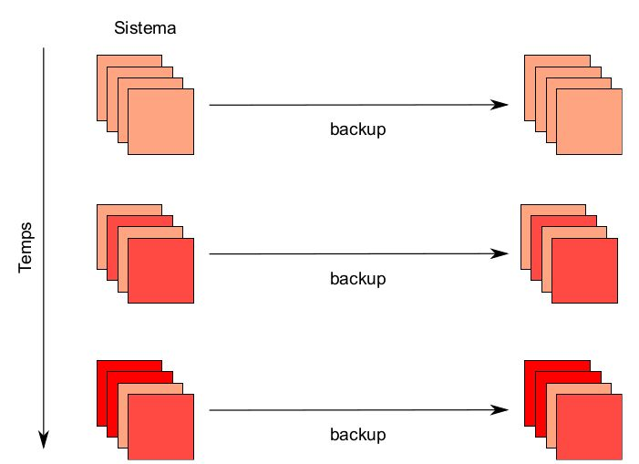

Mètodes de backup i recuperació de la informació
================================================

Els sistemes sense una estratègia ben definida de **còpies de seguretat** generalment impliquen una mala administració, independentment de si es troben en un entorn d’usuari únic o en una xarxa empresarial amb múltiples sistemes i usuaris. En algun moment la informació crítica es perdrà (si pot fallar, fallarà), per una fallada de hardware, errors de l’usuari o de l’administrador, atacs maliciosos o inclús rajos còsmics. És important ser capaç de recuperar el sistema amb la mínima pèrdua possible de forma ràpida i eficient. Emprarem el terme backup o còpia de seguretat indistintament.

Per què fer backups?
--------------------

Sempre, sigui en un entorn corporatiu o amb el PC de casa vostra, els backups són molt importants. Les raons són:

-  **Les dades són valuoses.** És molt arriscat que depenguin només d’un sol suport. Les dades són producte del vostre treball i és una mercaderia que s’ha de protegir. Recrear dades i perder-les són doblers i temps perdut.

-  **Fallades de hardware.** Encara que la tecnologia ha ajudat a augmentar la fiabilitat dels discos encara es produeixen falles impredecibles. L’ús de RAID ajuda, però és necessari també fer còpies.

-  **Fallades de software.** Cap software és perfecte i alguns bugs poden corrompre o destruir la informació.

-  **La gent comet errors.** Un error teclejant, un error d’operació o un desastre ambiental (incendi, inundació, llamps etc.) poden destruir la vostra informació.

-  **Atacs informàtics**. Un empleat descontent o un cracker extern podria voler destruir la vostra informació.

-  **Events inexplicables**. Els fitxers o la consistència de les dades pot desapareixer sense gaire explicació. Generalment, degut a efectes físics o químics: rajos còsmics, radiació, efectes quàntics etc.

-  **Les còpies de seguretat poden ser útils** no només per restaurar el sistema en cas de fallada sinó per consultar parts anteriors.

.. _deque:

De què fer backups?
-------------------

-  **Sí o sí**:

   -  Dades relacionades amb el servei (bases de dades, fotografies, codi font d’aplicacions, etc.)

   -  Fitxers de configuració del sistema (``/etc``). Encara que preferiblement emprarem **gestors de configuració [1]_**.

   -  Fitxers d’usuaris (``/home``)

-  **Probablement sí**:

   -  Directoris de coa (per imprimir, e-mail etc. ``/var/spool/``)

   -  Fitxers de log (``/var/log``)

-  **Probablement no**:

   -  Software i llibreries que es poden reinstal·lar. (En un bon sistema seria pràcticament tot). Això és directoris ``/bin/``,\ ``/usr/bin``, ``/lib``...

   -  Directori ``/tmp``

-  **En cap cas**

   -  Pseudosistemes de fitxers ``/dev/``, ``/proc``, ``/sys``.

   -  Partició o fitxer de swap.

Els fitxers essencials del sistema i de l’organització requereixen sempre ser copiats. Els fitxers de configuració i els fitxers d’usuari canvien constantment i requereixen d’una còpia també.

Els fitxers de log poden ser importants en funció del sistema per poder investigar l’historial o en cas de requeriments judicials.

Unitats de cintes
-----------------

Les unitats de cinta magnètica són uns dels suports més emprats per fer còpies de seguretat. Són relativament lentes i permeten només l’accés seqüencial, però s’empren per guardar informació a molt llarg termini (tot i que tenen un cicle de vida finit). S’empren essencialment com a emmagatzematge *offline* (es guarden fora de tot sistema informàtic) i s’empren generalment per a emmagatzemar els backups que anteriorment s’han creat a disc.

Els dispositius de cinta moderns segueixen, la majoria d’ells, l’estàndard obert **LTO (Linear Tape Open)**. Els primers formats, dels anys ’90, eren propietaris. Les darreres versions LTO, la **LTO-8**, permet emmagatzemar fins a 12TB sense compressió. Altres versions també emprades, com LTO-6 o LTO-4, permeten emmagatzemar fins a 2.5TB i 800 GB respectivament.

Com hem comentat, les cintes són còpies de la còpia de seguretat. De forma primària, el sistema ha de fer les còpies i guardar-les en un disc. Generalment, per això s’empra també un **NAS (Network Attached Storage)** o solucions al nigul. En alguns casos, es prescindeix de les cintes en favor d’aquest sistema.

.. _com:

Mètodes de backup
-----------------

Mai s’han de tenir les còpies al mateix lloc físic que els dels sistemes. Un incendi o desastre podria causar una pèrdua completa. Antigament això significava transportar físicament les cintes magnètiques a un lloc segur. Actualment, si no s’empren cintes, això en alguns casos s’automatitza transferint les còpies per la xarxa a un altre lloc. **Ara bé, mai s’ha de menysprear l’ample de banda d’un camió carregat de cintes.**

Això és important que es faci de forma segura, ja que els backups no haurien de caure en mans equivocades.

Generalment, s’utilitzen varis tipus de backups en funció de les dades i del tipus de sistema:

-  **Complet**: fa còpia de tots els fitxers del sistema. Lent i pesat.

-  **Incremental**: fa còpia de tots els fitxers que han canviat des de la darrera còpia de seguretat **incremental o completa**. Vegeu la figura `[fig_1] <#fig_1>`__. Molt ràpid de fer i lleuger. Lent de restaurar.

-  **Diferencial**: fa còpia de tots els fitxers que han canviat des de la darrera còpia de seguretat **completa** (i sols completa, sinó es incremental).

-  **Incremental inversa**. Consisteix en disposar d’un backup complet que corresponen al darrer backup del sistema i els fragments necessaris per restaurar backups anteriors. Lent de fer i lleuger, però ràpid de restaurar.

   Backups incrementals [fig_1]

Polítiques o estratègies de backup
----------------------------------

És molt important que la nostra organització (o nosaltres com a persones) tinguem controlats els backups i la política de backup que seguirem en les dades de les que som responsables. També ens feim responsables de que la recuperació funcioni correctament.

Tipus de polítiques de backup
~~~~~~~~~~~~~~~~~~~~~~~~~~~~~

Mitjançant unes regles predefinides, és necessari definir com, quan i sobre quines dades es faran els backups. Aquest conjunt de regles és coneix com a ​ política de backup​ . Alhora de dissenyar una política de backup adient per cada sistema cal tenir en compte el següent:

-  Què. Discutit a `1.2 <#deque>`__

-  Quan. Tant la freqüència amb què es farà una còpia d’un conjunt de dades com la quantitat de temps que es guardarà aquesta còpia abans de ser esborrada. És necessari fer backups diaris? És suficient fer backups mensuals?

-  On. Suport físic (disc, cinta, cloud etc.) i localització de les còpies. En funció de la velocitat en què vulguem recuperar el backup i la seva disponibilitat a curt i llarg termini, la resposta serà una o altra.

-  Com. Quin sistema dels discutits a `1.4 <#com>`__ ens convé més?

Les polítiques han de respondre preguntes com:

-  Suposant un servidor web estàtic amb pocs usuaris que tenim a casa: quins directoris del servidor cal guardar? Cal fer backups incrementals diaris? Cal guardar els backups dins cintes a dins una caixa forta? Cal guardar-ho en cintes?

-  Suposem un servidor de bases de dades amb millions de peticions per segon.

Estratègies de reaprofitament de cintes
~~~~~~~~~~~~~~~~~~~~~~~~~~~~~~~~~~~~~~~

L’estratègia més simple consisteix en crear una còpia completa una vegada i després anar fent còpies incrementals. Això potser no és necessari en totes les màquines i acabam ocupant espai indefinidament. Podem seguir altres aproximacions on anam rotant les cintes. Per exemple:

#. Cinta 1 per fer una còpia completa el divendres

#. Cintes 2-5 per incrementals de dilluns a dijous

#. Cinta 6 per còpia completa el segon divendres

#. Cintes 2-5 per a incrementals de dilluns a dijous de nou (sobreescrivim l’anterior)

#. Aquest divendres tocaria backup complet a 1, però no feim complet ni a 1 ni a 6. El feim el següent divendres.

Amb aquest sistema, podrem recuperar dues setmanes enrere.

Eines per fer còpies de seguretat
---------------------------------

Algunes eines en Linux les hem discutit amb anterioritat. Són:

-  **cpio**

-  **tar**

-  **gzip, bzip2 i xz**. cpio i tar extreuen fitxers que empaqueten fitxers. De vegades també es comprimeixen amb aquestes eines.

-  **dd**. Eina que serveix per transferir dades en brut. Permet copiar particions i discos complets.

-  **rsync**. Permet sincronitzar arbres de directoris o sistemes de fitxers complets a través d’una xarxa. Inclús permet fer-ho només copiant les diferències.

-  **dump i restore**. Eines antigues que existeixen des dels primers dies de UNIX.

-  **mt**. Software específic per a cintes.

cpio
~~~~

**cpio** (copy in and out) és una eina general de compressió d efitxers que ha existit des dels primers dies de UNIX i s’emprava inicialment per fer còpies de cintes. S’ha substituït molt per tar. Per exemple, recordau que rpm2cpio converteix RPMs en fitxers cpio per extreure’ls. El kernel de Linux empra també una versió de **cpio** interna per tractar amb el sistema de fitxers de RAM (initramfs) inicial.

Crear un fitxer de tots els fitxers del directori:

::

   $ ls | cpio --create -O ./nom_backup

Extreure un fitxer cpio:

::

   $ cpio -i -I nom_backup

Llistar un fitxer cpio:

::

   $ cpio -t -I nom_backup

EXERCICI PRÀCTIC - cpio
~~~~~~~~~~~~~~~~~~~~~~~

Creau un subdirectori amb varis fitxers i empaquetau-lo amb cpio. Extreieu-lo després a ``/tmp``.

Ús de tar
---------

**tar** ja l’hem emprat abans. A mode de recordatori:

#. En crear un fitxer tar li especificam un o més directoris com arguments. Els fitxers i subdirectoris s’inclouran.

#. En restaurar es reconstrueixen els directoris.

#. L’opció –newer permet realitzar backups incrementals.

#. Pot combinar-se amb compressors per fer comprimir el fitxer creat.

Vegeu alguns exemples:

Crear un fitxer comprimit de /root:

::

    $ tar -cvzf fitxer.tar.gz /root

Crear un fitxer comprimit en varis volums si el backup no cap en una sola cinta o dispositiu (opció –multi-volume):

::

    $ tar -cMf fitxer.tar.gz /root

Opció de verificar:

::

    $ tar -dvzf fitxer.tar.gz

Compararà els fitxers comprimits amb el que tenim descomprimit a la mateixa ruta.

Per restaurar:

::

    $ tar xvzf fitxer.tar.gz
    o
    $ tar xvzf fitxer.tar.gz -C <directori>

Per llistar

::

    $ tar tvzf fitxer.tar.gz

Backups incrementals amb tar
~~~~~~~~~~~~~~~~~~~~~~~~~~~~

Amb l’opció -N podem fer backups incrementals. Qualsevol d’aquestes opcions requereix que s’especifiqui una data o fitxer de referència.

::

   $ tar --create --newer '2011-12-1' -vf backup1.tar /var/tmp
   $ tar --create --after-date '2011-12-1' -vzf backup1.tar /var/tmp

Aquestes dues formes creen una còpia de /var/tmp de tots els fitxers posteriors a primer de desembre de 2011.

Teniu en compte que tar només revisa la data de modificació del fitxer.

Ús de dd
--------

Recordau que podem emprar **dd** de la forma següent:

Crear fitxer de 10MB ple de zeros:

::

    $ dd if=/dev/zero of=outfile bs=1M count=10

Copia dades en brut d’un disc a un altre:

::

   $ dd if=/dev/sda of=/dev/sdb

Crear una imatge d’un disc i d’una partició:

::

   $ dd if=/dev/sda of=sdadisk.img
   $ dd if=/dev/sdb1 of=bpart1.img

Ús de rsync
-----------

**rsync** serveix per transferir fitxers a través d’una xarxa. Recordau alguns exemples:

::

    $ rsync --progress -avrxH  --delete sourcedir destdir
    $ rsync file.tar someone@backup.mydomain:/usr/local

Cal anar en compte amb les localitzacions específiques, especialment si empram –delete. És recomanat utilitzar la opció –dry-run per fer una simulació abans.

**rsync** verifica fitxers locals contra els remots en trossos petits i només es copien a través de la xarxa les diferències. Per copiar directoris sencers emprarem l’opció -r (recursive).

Per copiar un directori d’un projecte farem:

::

   $ rsync -r project-X archive-machine:archives/project-X

Una estratègia de backup simple consisteix en duplicar directoris o particions a través de la xarxa amb comandes rsync.

EXERCICI PRÁCTIC - rsync
~~~~~~~~~~~~~~~~~~~~~~~~

Crearem un backup de ``/usr/include``:

::

   $ cd -
   $ rsync -av /usr/include .

Què passa si l’executam per segon pic?

::

   $ rsync -av /usr/include .

Provau ara de fer:

::

   $ rsync -av /usr/include include

Consultau el directori ``/home/imi/include/`` i reflexionau que ha passat.

Utilitzau ara l’opció –delete:

::

   $ rsync -av --delete /usr/include .

D’ara en endavant, podeu emprar un script com el següent:

::

   #!/bin/sh
   set -x
   rsync --progress -avrxH -e "ssh" --delete $1

Aquest script funciona tant en local com en xarxa. L’opció -x permet que rsync creui el sistema de fitxers.

Ús de dump ir restore
---------------------

Eines que han existit des dels primers dies d’UNIX. Llegeixen i escriuen directament al sistema de fitxers. Permet que es creïn, de forma transparent al sistema de fitxers, backups sense afectar les marques de temps.

Com a avantatges, tenim que:

-  Poden fer backups complets i incrementals

-  Entenen el format del sistema de fitxers.

-  Són eficients en crear backups

-  Es pot especificar la mida de la cinta, la densitat, la mida del bloc etc.

-  Pot exportar a qualsevol dispositiu o fitxer vàlid. Per defecte a /dev/tape.

-  Es controlen els paràmetres a través de /etc/fstab

Com a desavantatges:

-  Fa vàries passades pel sistema de fitxers.

-  Just funciona en ext2, ext3 i ext4. Altres sistemes de fitxers tenen les seves eines (xfsdump)

-  No es pot executar de forma segura en sistemes de fitxers muntats.

**dump** i **restore** són emprats en programes de backup de més alt nivell, com **Amanda**.

Alguns paràmetres de dump:

-  -0-9: nivell de dump. El nivell 0 és un backup complet. Altres números majors són incrementals.

-  -f. fitxer o dispositiu de sortida.

-  -b: mida del bloc

-  -B: registres per volum

Exemple: backup de nivell 0 de la partició muntada a /boot_master

::

     $ sudo dump -0uf /tmp/boot_backup /boot_master

Per restaurar, faríem:

::

     $ sudo restore -rvf /tmp/boot_backup

Resolució bàsica de problemes
=============================

La resolució bàsica de problemes pretén determinar si un problema prové de hardware o software, local o des d’Internet. Generalment, es requereix experiència per saber resoldre problemes, però seguir procediments bons i metòdics pot ajudar a aïllar les fonts de problemes i reproduir-los.

Tècniques bàsiques
------------------

Resoldre un problema implica realitzar una sèrie de passos que s’han de repetir de forma iterativa. Una recepta bàsica pot ser:

#. Identificar i descriure el problema

#. Reproduir el problema

#. Intentar primer les coses senzilles

#. Descartar causes d’una amb una

#. Canviar una sola cosa a la vegada. Si això no resol el problema, tornau enrere.

#. Verificar registres del sistema: ``/var/log/messages``, ``/var/log/syslog``, ``/var/log/secure`` etc.

Documentació
------------

A vegades la filosofia i metodologia vigents requereixen de seguir al peu de la lletra un procediment establert; no es recomana fer salts en funció de la intuïció. La motivació per utilitzar un procediment amb una **llista de verificació** és evitar dependre d’un expert, i assegurar que qualsevol administrador de sistemes sigui capaç de resoldre un problema si s’apega a procediments ben coneguts. Perquè en cas contrari, si l’expert deixa l’organització, no hi haurà cap persona prou capacitada per resoldre problemes complexos.

Si d’altra banda, decideix seguir la seva intuïció i verificar algunes pressentiments, assegureu recopilar informació prou ràpid per decidir si continuar o abandonar el camí de la intuïció, basat en si això sembla que va a ser productiu o no.

Si bé és cert que ignorar la intuïció pot allargar el procés de resoldre un problema, el registre de la persona que solucionava persones anteriorment és el punt de referència fonamental per determinar si es continuen invertint recursos d’aquesta forma. En altres paraules, la intuïció que resulta en alguna cosa útil no ve de forma màgica, sinó que s’obté de l’experiència.

Aspectes a verificar
--------------------

Els logs del sistema
~~~~~~~~~~~~~~~~~~~~

Generalment, un dels primers elements que consultarem per identificar el problema és consultar els fitxers de log del sistema. Els fitxers de log es troben al directori ``/var/log/``. Els fitxers més importants són:

-  ``messages`` o ``syslog``: fitxers de log generals del sistema en distribucions RHEL i Debian.

-  ``auth.log`` o ``secure``: logs d’autenticació

-  ``kern.log`` o ``dmesg``: logs del kernel

-  ``cron.log``: log dels treballs de cron

-  ``maillog``\ \|: log del correu

-  ``yum.log``: log de Yum

-  ``utmp`` o ``wtmp``: log dels intents de login

Evidentment podem trobar molts més fitxers de log al sistema. Els serveis i aplicacions poden bolcar els seus missatges a syslog o a un fitxer diferent. Per exemple, el servidor web apache guarda els logs al subdirectori ``httpd/`` i el servidor mysql al fitxer ``mysqld.log``.

Els fitxers de log no omplen el disc gràcies a l’eina **logrotate**. Aquesta eina s’executa amb un cron (especificat a ``/etc/cron.daily/logrotate)`` i neteja els fitxers de log. Els criteris en què es netegen els fitxers de log venen definits en uns fitxers de configuració a ``/etc/logrotate.d/``.

Per altra banda, les consultes als logs del sistema en SystemD poden realitzar-se també amb l’eina **journalctl**. Aquesta eina ens permet filtrar els logs del sistema amb varis criteris. Potser serà necessari especificar les opcions **-f** (follow) i **-n** (número de línies).

Podem filtrar per dates:

::

   journalctl --since "2015-01-10 17:15:00"
   journalctl --since "2015-01-10" --until "2015-01-11 03:00"
   journalctl -f -n 10 --since yesterday --until "1 hour ago"

Per servei o unitat SystemD:

::

   journalctl -u nginx.service
   journalctl -u nginx.service -u php-fpm.service --since today

Per PID, UID o GID:

::

   journalctl _PID=8088
   journalctl _UID=33 --since today

Consultau més opcions al manual de **journalctl** (``man journalctl``)

Xarxa
~~~~~

Si tenim problemes de connectivitat, hi ha algunes coses que podem fer per saber d’on ve el problema:

-  Configuració de la IP: Utilitzau eines com **ifconfig**, **ethtool** o **ip** per comprovar si la interfície està aixecada (això és, funciona i està connectada a algun lloc).

-  Controlador de xarxa. Potser si la interfície no existeix o no està aixecada no està carregat. Podeu comprovar-ho amb **lsmod**, que llistarà els mòduls del kernel associats. També podeu consultar pseudofitxers rellevants en /proc i /sys, com ara /proc/interrupts o /sys/class/net.

-  Connectivitat: comprovau amb **ping** si la xarxa és visible. Verificau el temps de resposta i si es perden paquets. Aquestes eines podrien revelar si el problema es vostre o d’algun altre extrem de la xarxa.

-  Consultau la ruta per defecte amb ``route -n``. Una taula de rutes coherent per un servidor o PC normal sol ser:

   ::

      [$ route -n
      Kernel IP routing table
      Destination     Gateway         Genmask         Flags Metric Ref    Use Iface
      10.80.80.0      0.0.0.0         255.255.255.0   U     0      0        0 eth0
      0.0.0.0         10.80.80.3      0.0.0.0         UG    0      0        0 eth0

-  Resolució de noms: provau d’executar **host** o **dig** per comprovar que el DNS funcionen.

Integritat de paquets
~~~~~~~~~~~~~~~~~~~~~

Recordau que RPM permet comparar la integritat dels paquets instal·lats.

::

    $ rpm -V paquet

Per verificar tots els paquets del sistema:

::

    $ rpm -Va

En Debian farem:

::

   $ debsums options some_package

Errors en l’arrancada
---------------------

Si el sistema falla en l’arrancada, ja sigui completament o si dóna errors, és important estar familiaritzat amb el que passa a cada etapa. Suposant que el firmware BIOS o UEFI funciona, pot succeir el següent:

-  No apareix la pantalla del bootloader: hi deu haver problemes amb la configuració del **GRUB** i s’ha de reinstal·lar.

-  El kernel no carrega. Si es produeix un **kernel panic** en l’arrancada és possible que el kernel no estigui ben configurat o se li hagin passat paràmetres incorrectes.

-  El kernel es carrega però falla en muntar el sistema de fitxers root. Això pot venir perquè el fitxer de configuració del GRUB o el fitxer ``/etc/fstab`` estan malament.

-  Falla l’\ **init**. Pot venir donat per múltiples causes i haureu de consultar els logs. Així mateix, podeu provar d’executar el sistema amb un **runlevel** menor com 3 o 1.

Corrupció i recuperació dels sistemes de fitxers
------------------------------------------------

Si algun sistema de fitxers no es pot muntar, el primer pas és consultar si /etc/fstab conté errors.

Si no, potser el sistema de fitxers està corromput. Per arreglar-lo pot emprar-se l’eina **fsck** (file system check).

::

    fsck /dev/sdXY

En alguns casos pot passar que s’hagi muntat el sistema de fitxers arrel / en mode només lectura (ro). Podem provar de remuntar-lo en mode **rw**:

::

    $ sudo mount -o remount,rw /

Eines de rescat i recuperació
-----------------------------

En la pròxima secció discutirem com emprar discos de recuperació. Aquí veurem algunes eines que aquests discos aporten. Generalment, quan arrancam des d’un CD/DVD o USB Live de la nostra distribució, podem seleccionar una opció de nom **Rescue Installed System**. Són un conjunt d’eines per arreglar problemes:

-  Eines per mantenir i arreglar discos, RAIDs i LVM (fsck, mkfs, fdisk, mdadm, pvcreate, etc.).

-  Eines de xarxa: ifconfig, route, traceroute, dig, ssh, telnet...

-  Moltes altres eines importants: bash, ps, vi, dd, chroot...

Les imatges de rescat fan una sèrie de preguntes en iniciar-se. Una d’elles és si es desitja muntar els sistemes de fitxers (si és possible). Si és així, els monten generalment a **/mnt/sysimage**.

Una de les coses més interessants de fer és canviar el punt de muntatge del sistema de fitxers arrel. Això implica, a grans trets, canviar l’arrel del sistema de fitxers (la ``/``) per un subdirectori del nostre sistema de fitxers. Això es faria de la forma següent:

::

    sudo chroot /mnt/sysimage

D’aquesta manera, el nostre kernel i la nostra CPU passaria a treballar sobre el sistema de fitxers de la màquina a recuperar. Així podem instal·lar paquets i tenir una idea més acurada del que està succeint.

RPM també permet instal·lar paquets des **de fora del chroot**:

::

    $ sudo rpm -ivh --force --root=/mnt/sysimage /mnt/source/Packages/vsftpd-2*.rpm

Rescat del sistema
==================

En algun moment ens trobarem en què un sistema tendrà una falla important i no podrà arrancar adequadament, no podrà muntar un sistema de fitxers o no podrà iniciar un entorn gràfic. Els **mitjans de rescat**, com USB o CD-ROMs Live portables poden emprar-se per això.

Aquests mitjans són útils quan el sistema no arranca perquè:

-  Fitxers de configuració corruptes, incorrectes o esborrats

-  Serveis mal configurats

-  Contrasenya de root perduda i s’ha de resetejar

-  Sistemes de fitxers corruptes

Mitjans de rescat
-----------------

La majoria de distribucions Linux permeten que els mitjans d’instal·lació i/o **Live** (CD, DVD o USB) serveixin tant per instal·lar de nou el sistema com per rescatar-lo. Hi ha, també, eines i distribucions que el seu fi particular és rescatar sistemes. Aquests mitjans proveeixen un sistema operatiu complet i arrancable que s’executa en memòria enlloc de carregar des del disc. Els usuaris poden experimentar i avaluar el sistema operatiu i/o la distribució **Linux** sense instal·lar-la realment. Aquests mitjans són únics ja que no necessiten cap disc dur per ser executats.

Per iniciar el sistema amb aquest mitjà, haurem de descarregar la **imatge iso** i gravar-la a un suport físic (USB, CD, DVD...). Llavors, haurem d’arrancar el sistema amb aquest mitjà. Podem gravar la imatge amb l’eina **dd**:

::

    $ dd if=boot.iso of=/dev/sdX

Teniu en compte que això esborrarà tot el contingut de sdX. Fixau-vos que NO s’ha d’especificar una partició, sinó que especificam tot el disc o USB (*/dev/sda*).

Tenim altres eines per gravar, com ara **livecd-tools** i **liveusb-creator** que són més versàtils i permeten no esborrar el fitxer del tot.

Mode d’emergència
-----------------

Una opció que tenim, també, per arrancar i intentar reparar un sistema és utilitzar modes d’arrancada diferents.

El **mode d’emergència** arranca en un ambient el més mínim possible. El sistema de fitxers arrel se monta com a lectura solament. No s’executen els scripts init i gairebé res està configurat.

El principal avantatge sobre el **mode monousuari** és que si el procés d’\ **init** està danyat encara es podran muntar sistemes de fitxers que podrien perdre’s.

Per entrar al mode emergència heu de seleccionar una entrada des del menú d’arrancada del **GRUB** i pitjar **e** per editar. Afegiu la paraula **emergency** a la línia de comandes del kernel abans d’indicar-li el sistema d’arrancada. Es demanarà la contrasenya de root abans de mostrar una shell.

Mode monousuari
---------------

Si el sistema arranca però no li permet entrar quan l’arrancada ha acabat, podeu utilitzar el **mode monousuari**. En aquest mode:

-  **init** és arrancat

-  Els serveis no s’inicien

-  La xarxa no s’activa

-  Es monten tots els sistemes de fitxers possibles

-  Se presenta una shell de manteniment mínima

En aquest mode, el sistema arranca en **runlevel 1** (en llenguatge SysVinit). Degut a que el mode monousuari intenta muntar els sistemes de fitxers, no es pot emprar si el sistema de fitxers root (/) està danyat o no es pot muntar satisfactòriament o **init** està danyat.

Enlloc de posar l’opció emergency, posarem **single** als paràmetres del kernel.

PRÀCTICA FINAL - Ens han atacat la nostra màquina virtual! 
===========================================================

Un cracker s’ha infiltrat a la nostra màquina virtual i ha fet un desastre! Ens ha canviat la contrasenya de root i no podem entrar. No sabem què li passa i el vostre objectiu és restaurar-la!

-  | Descarregau la màquina virtual corrupta. Enllaç:
   | https://drive.google.com/a/gotes.org/file/d/13T3t0XPJ_FIoGlNwbVlx_2H2xxeE3yYd/view?usp=sharing

-  Arrancau-la i vegeu què passa.

-  El hacker ha canviat la contrasenya!

-  Haureu d’entrar al sistema amb un disc d’arrancada.

-  Entrau amb el disc d’arrancada, resetejau la contrasenya i reiniciau el sistema. Pensau que es tracta d’un disc LVM. ATENCIÓ: SELinux ens donarà problemes si no el desactivam o reetiquetam els objectes! En reiniciar, hem de fer:

   -  Especificar paràmetre del kernel **selinux=0** pel proper boot.

   -  Una vegada haguem resolt els problemes principals que s’exposen més endavant, cream el fitxer: ``touch /.autorelabel``.

-  Entrau amb l’usuari root. El sistema es troba en mode només lectura!

-  Quin fitxer hem de modificar per veure l’estat dels sistemes de fitxers?

-  El sistema de fitxers arrel està amb mode només lectura. Com ho resolem?

-  Consultau l’activitat del hacker. Mirau que està fent i si ha iniciat processos pel seu compte. Des d’on s’executen? Aturau els processos i evitau que es tornin a executar.

-  Consultau si el hacker ha creat algun usuari i si aquest usuari fa cap activitat. Aturau l’activitat que pugui estar fent. Els administradors de xarxa ens diuen que cada minut hi ha un accés a un servidor remot estrany.

-  El hacker ens ha desinstal·lat el vim i el nano!

-  Si provau d’instal·lar-ho, el yum donarà molts errors de dependències. Compte, no les instal·leu! Sospitam que han esborrat la BBDD de l’rpm.

-  Per sort, tenim un backup de la rpmdb a /var/lib/ ;). Restaurau-la.

-  La propera vegada volem estar segurs que no perdrem les dades dels directoris més importants. Preparau un petit script que:

   -  Faci còpies de seguretat dels directoris més importants

   -  S’executi automàticament i de forma periòdica

   -  Faci servir **rsync** per copiar les dades a un servidor remot (a efectes de la pràctica podeu utilitzar el mateix localhost). Feis que no calgui contrasenya per entrar.

- Canvi contrasenya root x - Corrompre fstabx - Script al 100% de CPU constantment x - desinstal·lar vim i nano x - dpkg dependència rompuda yum x - usuari nou liantla: crontab. x

