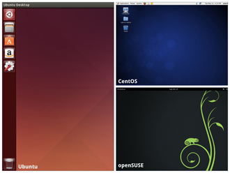
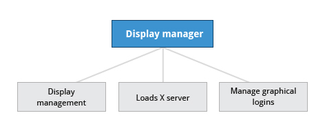
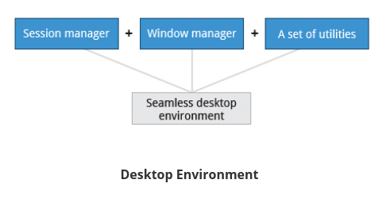
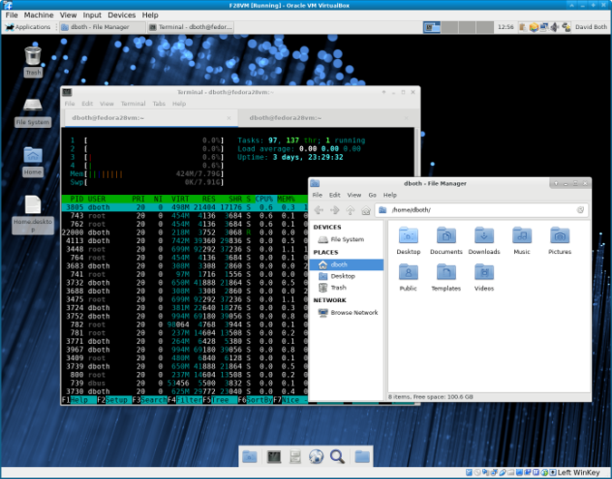
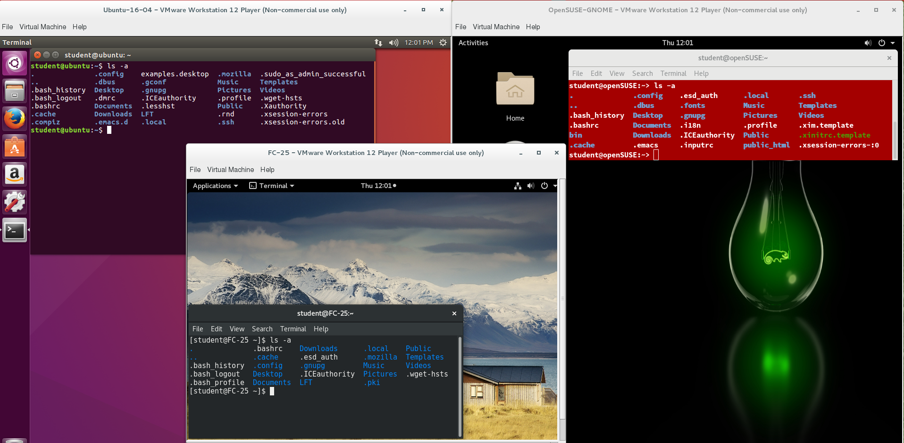
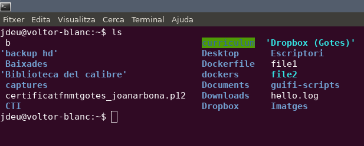
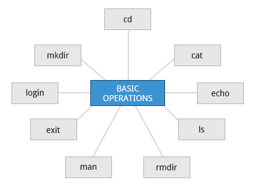
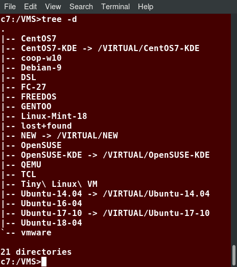

En Linux es pot emprar una interfície de línia de comandes (CLI) o una interfície gràfica d’usuari (GUI) . Per treballar amb CLI, heu de recordar quins programes i ordres s’utilitzen per realitzar tasques i com obtenir de manera ràpida i precisa més informació sobre el seu ús i opcions. D’altra banda, l’ús de la GUI sovint és fàcil i ràpid. L’ús de GUI permet interactuar amb el vostre sistema mitjançant icones gràfiques i pantalles. Per a tasques repetitives, CLI sovint és més eficient, mentre que la interfície gràfica és més fàcil de navegar si no recordeu tots els detalls o feu alguna cosa de forma puntual.

Aprendrem a gestionar les sessions mitjançant la GUI per a les tres famílies de distribució de Linux que més cobrim en aquest curs: Red Hat (CentOS, Fedora), SUSE (openSUSE) i Debian (Ubuntu, Mint). Com que utilitzem la variant basada en GNOME d’OpenSUSE en lloc de la basada en KDE, tots són realment semblants. Si utilitzeu KDE (o altres ordinadors de sobretaula de Linux com XFCE), la vostra experiència variarà molt poc de la que es mostra, ja que les interfícies d’usuari han convergit en determinats comportaments coneguts dels sistemes operatius moderns. A les seccions posteriors d’aquest curs, ens centrarem molt en la interfície de la línia de comandaments, que és gairebé igual a totes les distribucions.

A la figura `[fig_1] <#fig_1>`__ podeu veure com es veuen les interfícies de cada distribució.

   Entorns d’usuari per cada distribució [fig_1]

Sistema de finestres X i display manager
========================================

Una de les passes finals del procés d’arrancada del sistema és l’inici del X Window System. Un servei anomenat display manager té en compte les pantalles del sistema i carrega el servidor X. S’anomena així, servidor X, perquè segueix el paradigma client-servidor proveint serveis gràfics a les aplicacions que actuen com a clients X. El display manager també gestiona la pantalla de login dels usuaris i arranca l’escriptori seleccionat. La figura `[fig_2] <#fig_2>`__ mostra un esquema de les funcions d’un display manager.

   Funcions d’un display manager [fig_2]

X Window System és un sistema antic de mitjans del 80. Té certes deficiències i, de mica en mica, s’està incorporant un sistema nou anomenat Wayland. Display managers n’existeixen uns quants, com ara gdm, lightdm, kdm o xdm.

Window manager
--------------

En Linux, un entorn d’escriptori consta del session manager, que inicia i manté els components de la sessió gràfica, i el window manager, que controla la posició i moviment de les finestres, els títols de les finestres i els controls. Vegeu les seves funcions a la `[fig_3] <#fig_3>`__.

Exemples de session manager són, per exemple, el xsm i el ksmserver. Exemples de window manager són el Mutter. el Metacity o el KWin.

   Funcions d’un Window manager [fig_3]

Entorns gràfics i escriptoris
=============================

Cada distribució instal·la, generalment, un entorn d’escriptori determinat. Tot i així, algunes distribucions permeten tenir varis entorns instal·lats al mateix sistema i els usuaris poden intercanviar-los indistintament tancant la sessió.

Un dels entorns gràfics més emprats és GNOME. És l’entorn predeterminat en RHEL, Fedora, CentOS, SUSE, Debian i Ubuntu (tot i que aquest va canviar a Unity des de la versió 10.10 a la versió 17.04.

Un dels altres entorns més populars és KDE, emprat simultàniament amb GNOME en SUSE i OpenSUSE. Altres entorns populars són XFCE i LXDE per sistemes amb menys recursos de hardware. Existeixen també entorns més avançats com ara Awesome o Xmonad. Vegeu una il·lustració de l’entorn XFCE a la figura `[fig_4] <#fig_4>`__.

   Entorn XFCE [fig_4]

Un procés és simplement una **instància d’una o més tasques** relacionades que s’executen al sistema. No és el mateix que un programa o una ordre. Una sola comanda pot iniciar diversos processos simultàniament. Alguns processos són independents els uns dels altres i d’altres estan relacionats. Una fallada d’un procés pot afectar o no als altres que s’executen al sistema.

Els processos **utilitzen molts recursos del sistema**, com ara cicles de memòria, CPU (unitat central de processament) i dispositius perifèrics, com ara impressores i pantalles. El sistema operatiu (especialment el nucli) **s’encarrega d’assignar una quota adequada d’aquests recursos** a cada procés i d’assegurar-ne l’ús optimitzat global del sistema.

Línia de comandes
=================

Quan es tracta d’administració de sistemes Linux, el més probable és que l’operador es passi més temps emprant la línia de comandes que no la interfície gràfica. Linux no escatima, en cap cas, en eines per a línia de comandes, i permet fer possible gairebé qualsevol tasca. L’ús de línia de comandes té varis avantatges:

-  S’elimina la càrrega pel sistema d’emprar un entorn gràfic.

-  Virtualment totes les tasques són possibles.

-  Es poden implementar scripts per automatitzar i procedimentar tasques repetitives

-  Es pot accedir a màquines remotes a través d’Internet.

-  No varia entre distribucions Linux.

La majoria d’entorns gràfics ofereixen un emulador de terminal: això és una finestreta a l’escriptori que es comporta com si fos un terminal tipus text pur, permetent tenir-ne més d’un obert. Vegeu-ho a la figura `[fig_5] <#fig_5>`__. GNOME inclou per defecte l’aplicació gnome-terminal, però n’hi ha més com ara xterm, rxvt, konsole etc.

   Exemples d’emuladors de terminals en escriptoris [fig_5]

En Linux, per obrir un emulador de terminal i disposar d’una línia de comandes el més senzill és cercar-la entre les aplicacions del sistema. Generalment el programa s’anomena **emulador de terminal**. Una altra forma és amb la drecera de teclat CTRL+ALT+T.

Introducció a la línia de comandes
----------------------------------

Una vegada haguem obert un emulador de terminal, veurem una finestreta amb text. Veurem, inicialment, només una línia. La primera paraula indica l’usuari amb el què estam loggejats seguida d’una arroba (@) i del hostname de la màquina. Llavors, apareixen dos punts i, en algunes distribucions, el directori on ens trobam actualment. Generalment aquest directori és el directori /home de l’usuari, representat amb un símbol ``~``.

Per exemple, ens podem trobar amb el següent:

::

   jdeu@voltor-blanc:~$  

-  jdeu és el nom d’usuari amb el que estam loggejats.

-  voltor-blanc és el nom de la màquina

-  ``~`` indica el directori on ens trobam. Recordau que ``~`` és una manera d’anomenar el directori home de l’usuari.

-  Després del símbol del dolar $, introduirem les comandes i les cometrem amb la tecla enter.

Algunes de les comandes més emprades són:

#. **ls**: llista els fitxers i directoris del directori actual o d’algun altre. Vegeu la figura `[fig_6] <#fig_6>`__

#. **cd**: canvia de directori

#. **cat**: eina que s’empra per mostrar el contingut d’un fitxer (tot i que està pensada per combinar fitxers).

#. **man**: emprat per veure documentació. Per exemple man cat mostrarà la documentació del programa cat.

   Exemple d’ús de la comanda ls [fig_6]

Les comandes en la línia de comandes solen disposar de tres elements:

-  **Comanda**: nom del programa a executar

-  **Opcions**: opcions de la comanda que modifiquen el que fa el programa. Generalment comencen amb un guió si l’opció s’entra de forma abreujada o dos guions si s’entra de forma extesa.

-  **Arguments**: entitat sobre la que opera la comanda.

Es possible que de vegades no haguem d’introduir opcions o arguments.

La majoria d’aplicacions i intèrprets de línia de comandes tenen una opció molt útil d’autocompletar mitjançant la tecla tabulador. No sempre està disponible però és molt útil quan no recordam com completar alguna línia.

Execució amb privilegis d’administrador
~~~~~~~~~~~~~~~~~~~~~~~~~~~~~~~~~~~~~~~

Algunes comandes d’administració del sistema és necessari introduir-les amb el prefixe **sudo**. **sudo** és un programa que proporciona a l’usuari privilegis d’un altre usuari, per defecte el compte root (administrador o superusuari).

EXERCICI PRÀCTIC - Línia de comandes
~~~~~~~~~~~~~~~~~~~~~~~~~~~~~~~~~~~~

Obriu un terminal i feis el següent:

-  Llistau els elements del directori actual

-  Moveu-vos al directori /etc

-  Llistau el directori /var/log/syslog

-  Mirau la documentació del programa ls

Terminals virtuals
------------------

Els terminals virtuals (VT) són sessions de consola que utilitzen tota la pantalla i el teclat fora d’un entorn gràfic. Aquests terminals es consideren "virtuals" perquè, tot i que hi pot haver diversos terminals actius, només un terminal roman visible a la vegada. Un VT no és el mateix que una finestra de terminal de línia de comandes, ja que d’aquests darrers se’n poden tenir moltes alhora en un escriptori gràfic.

Un dels terminals virtuals (normalment el primer o el setè) està reservat per a l’entorn gràfic. Ubuntu utilitza VT 7, però CentOS / RHEL i openSUSE utilitzen VT 1 per a la visualització gràfica.

Un exemple de situació en què és útil utilitzar VTs és quan us trobeu **amb problemes amb l’escriptori gràfic**. En aquesta situació, podeu canviar a un dels VTs de text i solucionar problemes.

Per canviar de VT, premeu la tecla de funció **CTRL-ALT** per al VT. Per exemple, premeu CTRL-ALT-F6 per a VT 6. En realitat, només heu de prémer la combinació de tecles ALT-F6 si esteu en un VT i voleu canviar a un altre VT.

EXERCICI PRÀCTIC - Terminals virtuals
~~~~~~~~~~~~~~~~~~~~~~~~~~~~~~~~~~~~~

Entrau a un terminal virtual, logejau-vos i llistau els documents del directori /home. Llavors, desloggejau-vos i tornau a l’escriptori.

Aplicacions en línia de comandes
================================

En aquesta secció aprendrem com realitzar les operacions més bàsiques a través de línia de comandes. Això implica fer login i logout al sistema, reiniciar o aturar la màquina, localitzar aplicacions, accedir a directoris i explorar el sistema de fitxers. Les aplicacions bàsiques que solen emprar-se podeu veure-les a la figura `[fig_7] <#fig_7>`__.

   Aplicacions bàsiques en línia de comandes [fig_7]

Fer login i logout a un sistema
-------------------------------

Generalment, fer login a un sistema local és trivial ja que se’ns presentarà directament la finestra de login per introduir l’usuari i contrasenya, ja bé sigui de forma gràfica o en línia de comandes. Si estam en línia de comandes i volem simplement sortir, pitjarem la combinació de tecles CTRL+D.

Una vegada tenim la sessió oberta en un sistema, ens podrem connectar a sistemes remots mitjançant l’eina SSH. Per exemple amb la comanda ``ssh username@remote-server.com``, SSH es connectarà a la màquina remota i ens donarà accés accés a una terminal a aquest sistema.

Aturar i reiniciar el sistema
-----------------------------

Generalment, per aturar un sistema emprarem la comanda **shutdown -h now**. Per reiniciar, emprarem **shutdown -r**. Generalment, aquestes dues accions a través de línia de comandes requereixen privilegis d’administrador (root).

Trobar aplicacions
------------------

Depenent de cada distribució, els programes i paquets poden trobar-se a varis directoris. Els executables generalment es troben a /bin, /usr/bin, /sbin, /usr/sbin o inclús a /opt, /usr/local/bin, /usr/local/sbin o al /home de cada usuari.

Una manera de trobar on es troben els programes és emprar la utilitat **which**, que et diu on resideix exactament el programa:

::

   $ which diff
   /usr/bin/diff

Si which no troba el programa, també podem emprar **whereis**.

Accedir a directoris
--------------------

El primer directori on l’usuari es troba quan fa login a un sistema és el seu directori /home. Podeu saber quin és el vostre directori fent executant la comanda ``echo $HOME``. Algunes comandes útils de navegació són:

-  ``pwd``: Mostra el directori de treball actual

-  ``cd`` o ``cd ~``: Navega al directori home.

-  ``cd ..`` : Navega al directori superior

-  ``cd -`` : Navega al directori anterior on es trobava l’usuari.

Camins absoluts i relatius
--------------------------

Els directoris s’especifiquen mitjançant camins, que són la ruta des del directori arrel (/) per accedir a aquest directori en concret.

-  Els camins absoluts són aquells que **comencen amb el directori arrel** i segueix l’arbre branca a branca fins arribar al directori desitjat. Exemple /usr/bin.

-  Els camins relatius **comencen del directori actual**. Mai comencen amb /. Exemple ../../usr/bin, ./jaume/dades, jaume/dades.

Es poden especificar múltiples barres (/) entre directoris i fitxers, però només se’n compta una. Dit d’altra manera ////usr//bin equival a escriure /usr/bin.

Es poden emprar dreceres de camins, com ara . (directori present), .. (directori superior), ``~`` directori /home de l’usuari.

Explorar el sistema de fitxers
------------------------------

Podem emprar l’eina **tree** per dibuixar l’estructura del sistema de fitxers. Per exemple, ``tree -d`` mostra l’estructura de directoris a partir del directori de treball actual. Vegeu la figura `[fig_8] <#fig_8>`__ on es mostra un exemple de l’ús de tree.

   Exemple d’ús de l’eina tree [fig_8]

Altres comandes útils són:

#. ``cd /``: canvia el directori de treball actual al directori arrel.

#. ``ls``: llista els continguts del directori present.

#. ``ls -lha``: llista tots els fitxers, inclosos els ocults.

#. ``tree``: mostra una vista en forma d’arbre a partir del directori actual.

Enllaços
--------

Amb Linux hi ha dues maneres de crear enllaços (els equivalents a accessos directes en Windows):

-  Enllaços durs (hard links)

-  Enllaços febles o simbòlics (soft links)

Els primers bàsicament són una manera d’especificar dos noms pel mateix inode (l’identificador únic pels fitxers en Linux). Evidentment, qualsevol modificació a un afecta també a l’altre.

Per crear un hard link, ho podem fer de la forma següent:

::

    ln file1 file2

Podem comprovar com són el mateix fitxer si feim:

::

   $ ls -li file1 file2
   394705 -rw-r--r-- 2 ubnt ubnt 51 de ju 31 11:35 file1
   394705 -rw-r--r-- 2 ubnt ubnt 51 de ju 31 11:35 file2

Apunten al mateix inode, **394705**.

Els segon tipus d’enllaç no consisteix simplement amb un àlies del fitxer, sinó que és un fitxer nou amb un inode diferent que apunta a un fitxer específic. Podem crear un enllaç simbòlic de la manera següent:

::

   $ ln -s file1 file2
   $ ls -li file1 file2
   394705 -rw-r--r-- 1 ubnt ubnt 51 de ju 31 11:35 file1
   394682 lrwxrwxrwx 1 ubnt ubnt 5 de ju 31 11:41 file2 -> file1

El camí a file1 pot ser relatiu o absolut. Cal tenir-ho en compte per si volem moure el fitxer i l’enllaç de lloc.

Operacions bàsiques amb fitxers i directoris
--------------------------------------------

-  **cat**: emprat per concatenar fitxers. S’empra generalment per veure fitxers curts.

-  **less**: permet veure fitxers més grans perquè pausa el text quan aquest ocupa tota la pantalla i permet fer scroll. Es pot introduir el caràcter / per cercar text. El programa **more** fa gairebé el mateix i està disponible en algunes distribucions.

-  **tail i head**: permeten veure les darreres i les primeres línies d’un fitxer. Per defecte mostra les 10 primeres o darreres, però amb l’opció -n es pot especificar el número de línies.

-  **touch**: emprat per actualitzar o fixar el temps d’accés, canvi o modificació d’un fitxer. També s’empra per crear fitxers buits. Exemple: ``touch testfile``.

-  **mkdir i rmdir**: creen i esborren fitxers. Per esborrar un directori, aquest ha d’estar buit o la comanda fallarà. Es poden esborrar recursivament el directori i el seu contingut fent ``rm -rf <directori>``

-  **cp**: copia un fitxer o dirtectori. Per poder copiar un directori de forma recursiva cal emprar l’opció -r. Per exemple: ``cp -r <dir1> <dir2>``

-  **mv**: reanomena un fitxer o directori i/o el mou si s’especifica un camí diferent. Exemple: ``mv /opt/fitxer1 /usr/local/var/fitxer2`` mourà el fitxer1 a un directori diferent amb un nom diferent (fitxer2).

-  **rm**: esborra un fitxer. Amb l’opció -f es forçarà l’esborrada (COMPTE!). Per esborrar un directori, hem d’emprar l’opció -r. Per exemple: ``rm fitxer`` o ``rm -r directori/``.

Veurem aquestes operacions amb més detall al tema 4, sobre manipulació de fitxers.

.. _exercici-pràctic---línia-de-comandes-1:

EXERCICI PRÀCTIC - Línia de comandes
------------------------------------

Provau de fer el següent:

#. Creau un directori anomenat **prova**

#. Entrau dins aquest directori

#. Creau dins el directori **prova** un fitxer anomenat **fitxer1**

#. Al vostre directori /home, creau un enllaç simbòlic a fitxer1 anomenat **enllac_fitxer1**
