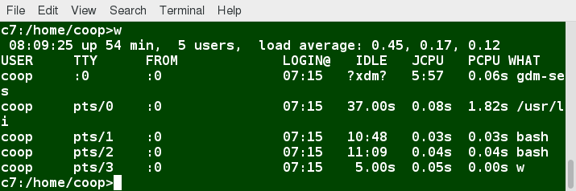
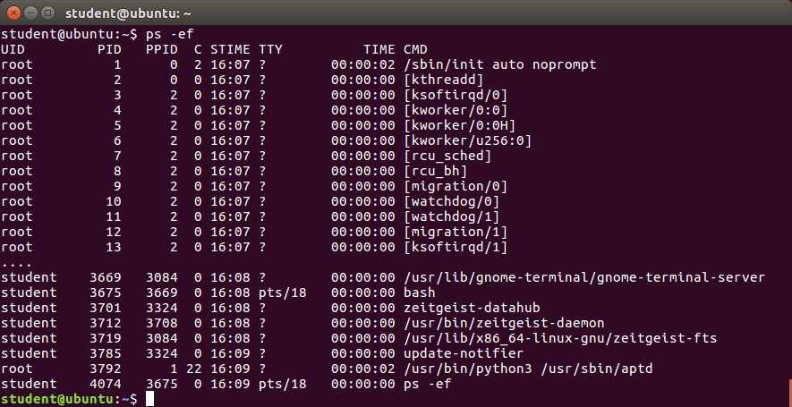
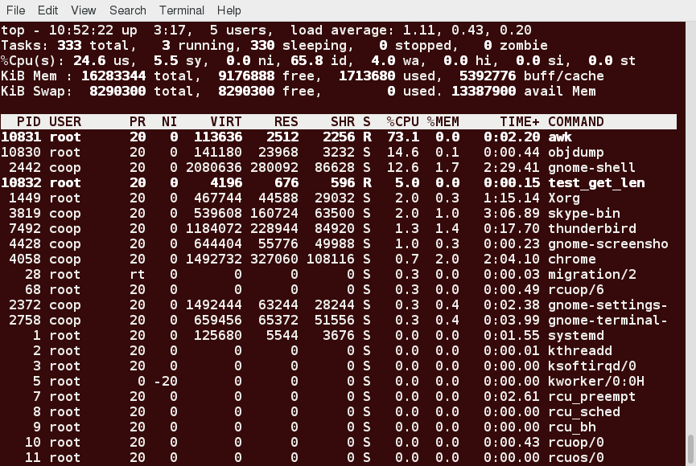
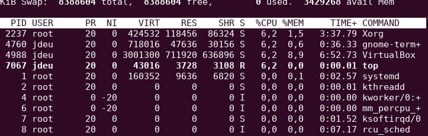
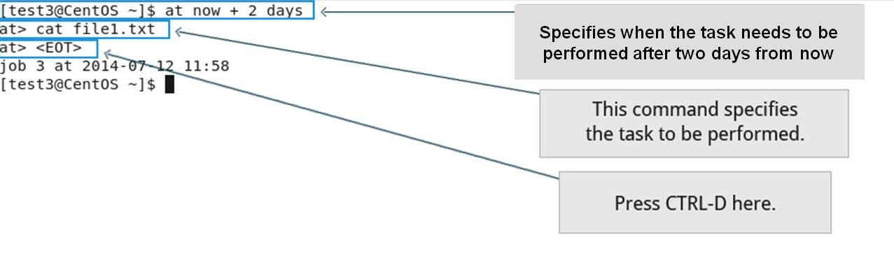

Introducció als processos
=========================

Què és un procés?
-----------------

Un procés és simplement una **instància d’una o més tasques** relacionades que s’executen al sistema. No és el mateix que un programa o una ordre. Una sola comanda pot iniciar diversos processos simultàniament. Alguns processos són independents els uns dels altres i d’altres estan relacionats. Una fallada d’un procés pot afectar o no als altres que s’executen al sistema.

Els processos **utilitzen molts recursos del sistema**, com ara cicles de memòria, CPU (unitat central de processament) i dispositius perifèrics, com ara impressores i pantalles. El sistema operatiu (especialment el nucli) **s’encarrega d’assignar una quota adequada d’aquests recursos** a cada procés i d’assegurar-ne l’ús optimitzat global del sistema.

Tipus de processos
------------------

Els processos poden ser de diferent naturalesa depenent de la tasca que duen a terme. Es poden classificar de la forma com apareix a la taula `[tipus_proces] <#tipus_proces>`__

.. table:: Tipus de processos

   ===================== =============================================================================================================================================================== ==============================
   **Tipus de procés**   **Descripció**                                                                                                                                                  **Exemple**
   Interactiu            Arrancat per l’usuari, mitjançant CLI o GUI                                                                                                                     bash, firefox, top
   Batch                 Processos automàtics programats i desconnectats de qualsevol terminal. Encoats de forma de FIFO (First-in, first-out)                                           updatedb
   Daemon                Processos de servidor que corrent contínuament. Alguns es disparen a l’inici del sistema o esperen a l’usuari                                                   httpd, xinetd, sshd
   Threads (fils)        Processos lleugers. Són tasques que corren baix un altre procés, compartint memòria i altres recursos. Un fil pot acabar sense acabar amb el process principal. firefox, gnome-terminal-server
   Kernel Threads (fils) Tasques del kernel els quals l’usuari no en té control. Són tasques de l’estil moure un fil d’una CPU a una altra o completar operacions de disc.               kthread, migration, ksoftirqd
   ===================== =============================================================================================================================================================== ==============================

[tipus_proces]

Estats dels processos
---------------------

Una funció de crítica del nucli anomenada *scheduler* o planificador desplaça constantment i desactiva els processos de la CPU. Això es fa per poder assignar el temps que cada procés passarà sent executat pel processador d’acord una prioritat relativa, el temps que necessita i el temps que ja se li ha assignat.

Quan un procés es troba en un estat de funcionament vol dir que actualment està executant instruccions en una CPU o que està esperant que se li concedeixi una part de temps (una porció de temps) per poder executar-lo. Tots els processos d’aquest estat resideixen en el que s’anomena cua d’execució i en un ordinador amb diverses CPU o nuclis hi ha una cua d’execució a cada un.

Tot i això, de vegades els processos entren en el que s’anomena estat de *sleep*, generalment quan esperen que passi alguna cosa abans que es puguin reprendre (generalment esperant la intervenció de l’usuari) En aquesta condició, un procés es troba en una cua d’espera.

Hi ha alguns altres estats de procés menys freqüents, sobretot quan aquest acaba. De vegades el procés fill es completa però el procés progenitor no ha preguntat sobre el seu estat. Se sol dir que aquest procés es troba en estat zombie; realment no està viu, però apareix a la llista de processos del sistema.

Identificadors dels processos
-----------------------------

Cada procés té assignat un identificador numèric únic anomenat PID (*Process ID*). S’empra per seguir el seu estat, la seva CPU, l’ús de memòria entre d’altres. Els PIDs s’assignen generalment de forma ascendent, sent el PID 1 el procés d’init (o systemd). El *Parent Process ID* (PPID) és el procés que ha iniciat el procés actual. El *Thread ID* és l’identificador únic de cada fil.

Un exemple d’operació que es pot fer amb el PID és eliminar un procés. Per exemple:

``kill -SIGKILL <pid>`` o ``kill -9 <pid>``

Identificadors d’usuari i de grup
---------------------------------

En un sistema Linux, molts usuaris tenen accés al sistema simultàniament i poden executar múltiples processos cada un. Per això, el sistema operatiu identifica l’usuari que ha iniciat el procés amb un **Real User ID (RUID)**.

Així mateix, l’usuari que determina els drets d’accés es coneix com a **Efective User ID (EUID)**. Poden ser el mateix o no.

El mateix succeeix amb els grups, on tenim **Real Group ID RGID** i **Efective Group ID (EGID)**

Prioritats
----------

La prioritat d’un procés es pot especificar mitjançant el valor de *niceness*. Quant menys *nice* és un procés, més prioritat té i viceversa. En Linux, un valor de *nice* de -20 implica la més alta prioritat, mentre que un valor de 19 representa la màxima.

Mètriques i control de processos
================================

Mitjanes de càrrega o *Load average*
------------------------------------

La càrrega d’un sistema són les mitjanes de càrrega d’un període de temps determinat. La mitjana de càrrega és una mètrica que té en compte:

-  Processos que corren en una CPU

-  Processos que són aptes per a ser executats però esperen a tenir una CPU disponible.

-  Processos en estat de *sleep*. Això és, que esperen algun recurs (típicament I/O).

Es pot consultar la càrrega executant les comandes ``w``, ``top`` o ``uptime``. Vegeu-ho a la figura `[fig_1] <#fig_1>`__.

   Exemple de visualització de la càrrega d’un sistema. [fig_1]

Interpretar la càrrega del sistema és prou senzill. Generalment, se’ns presenten tres valors de càrrega: un per la mitjana del darrer minut, un per la mitjana dels darrers cinc i un per la mitjana dels darrers quinze. En la figura `[fig_1] <#fig_1>`__, podem constatar que:

-  Al darrer minut, el sistema ha tengut una càrrega d’un 0.45. En un sistema amb una sola CPU, això és el mateix que dir que el sistema ha tengut una càrrega del 45%.

-  Els darrers 5 minuts, el sistema ha estat emprat en un 17%.

-  Els darrers 15 minuts, el sistema ha estat emprat en un 12%.

Si la càrrega s’apropa a 1, implica que la CPU està sobre-utilitzada perquè hi ha més processos demanant CPU que CPU disponible.

En sistemes amb múltiples CPU, s’ha de dividir el valor de la càrrega entre el número de CPUs. Un sistema amb 4 CPUs i una càrrega de 1 no està sent sobre-utilitzat, mentre que una càrrega de 4 implica que les 4 CPU estaven emprades al màxim.

Increments de càrrega en el darrer minut generalment no impliquen un problema, ja que alguns processos poden requerir molta CPU en un determinat moment. Si l’increment es manté també en els darrers 5 i 15 minuts això pot venir donat perquè el sistema està sobrecarregat.

Comanda ps
----------

La comanda ``ps`` mostra informació sobre els processos que corren al sistema. ``ps`` té multitud d’opcions. Sense arguments, la comanda mostra els processos corrent actualment baix la shell on un es troba. La opció ``-u`` mostra informació per un usuari específic. Altres opcions completes poden ser:

-  ``ps -ef``: mostra els processos del sistema amb detall.

-  ``ps aux``: mostra més informació sobre tots els processos del sistema.

-  ``ps -eLf``: mostra els processos del sistema i els seus fils.

Podeu veure un exemple de sortida de ``ps -ef`` a la figura `[fig_2] <#fig_2>`__.

   Exemple de visualització de la comanda ps. [fig_2]

Comanda top
-----------

La comanda ``top`` mostra també informació sobre els processos que corren al sistema, amb la diferència que la informació s’actualitza en temps real. Per defecte, top s’actualitza cada dos segons, però aquest valor pot ajustar-se. Vegeu l’exemple de sortida de la comanda top a la figura `[fig_3] <#fig_3>`__. A continuació es detallaran cadascun dels camps que mostra a comanda. A la taula `[tecl_int] <#tecl_int>`__ es poden veure algunes dreceres de teclat per a top.

   Comanda top. [fig_3]

.. table:: Dreceres de teclat per a top

   =========== =====================================================
   **Comanda** **Sortida**
   t           Mostra o amaga informació de resum (línies 2 i 3)
   m           Mostra o amaga informació de memòria (línies 4 i 5)
   A           Classifica llista de processos per consum de recursos
   r           Canvia *nice* (prioritat) d’un procés
   k           Mata un procés
   d           Canvia la freqüència d’actualització
   =========== =====================================================

[tecl_int]

Primera línia
~~~~~~~~~~~~~

La primera línia té la forma següent:

::

    top - 09:19:58 up 23:34,  2 users,  load average: 1,09, 0,94, 0,87

Bàsicament, mostra:

-  Temps que fa que el sistema està en marxa

-  Quants usuaris hi ha connectats

-  Càrrega mitjana

Segona línia
~~~~~~~~~~~~

Té la forma:

::

    Tasks: 214 total,   1 running, 164 sleeping,   0 stopped,   0 zombie

Mostra el número total de processos, els processos en mode running, sleeping, els aturats i els zombies. Comparant el número de processos en estat de running amb la càrrega permet determinar si el sistema està al límit o si un usuari en particular està corrent massa processos.

Tercera línia
~~~~~~~~~~~~~

Té la forma:

::

    %Cpu(s):  3,1 us,  0,9 sy,  0,0 ni, 95,9 id,  0,1 wa,  0,0 hi,  0,1 si,  0,0 st

Indica, en primer lloc, com el temps de CPU està dividit entre usuaris(us) i kernel (sy), mostrant el percentatge de CPU emprat per cada un d’ells.

``ni`` indica el percentatge de processos corrent a una prioritat menor. ``id`` indica el temps que la CPU està *idle* o en repòs, i ha de ser un valor baix si la càrrega és alta. ``wa`` indica el percentatge de treballs que esperen per I/O. Després, s’indica el percentatge d’interrupcions de hardware ``hi`` i interrupcions de software ``si``. Steal time ``st`` és generalment emprat en màquines virtuals, que tenen algun temps de CPU en repòs agafat per altres usos.

Quarta i quinta línies
~~~~~~~~~~~~~~~~~~~~~~

::

   KiB Mem :  8028200 total,   449392 free,  4340040 used,  3238768 buff/cache
   KiB Swap:  8388604 total,  8388604 free,        0 used.  3429268 avail Mem 

A la línia quatre s’indica la memòria física. A la línia cinc s’indica l’espai de swap. Ambdues mostren la memòria total, l’emprada i l’espai lliure. És important monitoritzar bé l’ús de memòria perquè el sistema funcioni correctament. Una vegada la memòria física s’ha exhaurit, el sistema començarà a emprar espai de swap accedint a disc i provocant una baixada del rendiment.

Llista de processos
~~~~~~~~~~~~~~~~~~~

La llista de processos mostra informació de cada procés. Es mostra el següent:

-  Process Identification Number (PID)

-  Process owner (USER)

-  Priority (PR) and nice values (NI)

-  Virtual (VIRT), physical (RES), and shared memory (SHR)

-  Status (S)

-  Percentage of CPU (%CPU) and memory (%MEM) used

-  Execution time (TIME+)

-  Command (COMMAND).

   Llista de processos de la comanda top. [fig_4]

EXERCICI PRÀCTIC - Mirau quina és la càrrega del sistema en aquest moment
-------------------------------------------------------------------------

EXERCICI PRÀCTIC - Amb la comanda ps, cercau un procés anomenat bash mirau quin PID té
--------------------------------------------------------------------------------------

EXERCICI PRÀCTIC - Amb la comanda top, cercau quin procés està emprant més CPU
------------------------------------------------------------------------------

Programació d’inici de processos
================================

Programant processos futurs amb at
----------------------------------

La comanda ``at`` permet programar l’execució d’una tasca en un moment precís del futur. La comanda funciona d’acord amb el que apareix a la figura `[fig_at] <#fig_at>`__

   Ús de la comanda at. [fig_at]

Programant execució de processos recurrents amb cron
----------------------------------------------------

Mentre que ``at`` permet executar un procés en un moment determinat, el programa cron permet programar l’execució d’una tasca de forma recurrent. Pot executar tasques rutinàries a un temps determinat, ja sigui a un moment específic o de forma recurrent. El programa cron funciona amb uns fitxers de configuració anomenats crontabs, el primer d’ells és ``/etc/crontab``. Existeixen fitxers crontab tant per al sistema en general com per cada usuari en particular.

La comanda ``crontab -e`` obre el fitxer de crontab de l’usuari. La comanda ``crontab -l`` llistarà el fitxer de crontab. Cada línia del fitxer de crontab té sis camps que podeu veure a la taula `[camps_crontab] <#camps_crontab>`__.

.. table:: Camps crontab

   ======== ================= ==========================================================================================
   **Camp** **Descripció**    **Valors**
   MIN      Minuts            0-59
   HOUR     Hora del dia      0-23
   DOM      Day of Month      1-31
   MON      Mes de l’any      1-12
   DOW      Dia de la setmana 0-6 (0 és diumenge). També es pot posar el dia de la setmana abreviat en angles (mon..sun)
   CMD      Comanda           Comanda a executar
   ======== ================= ==========================================================================================

[camps_crontab]

Exemples
~~~~~~~~

-  L’entrada ``* * * * * /usr/local/bin/execute/this/script.sh`` executarà script.sh cada minut de cada hora de cada dia del mes i de la setmana i de cada mes de l’any.

-  L’entrada ``30 08 10 06 * /home/sysadmin/full-backup`` executarà la comanda full-backup cada dia 10 de juny a les 8.30 am, independentment de l’any i del dia de la setmana.

-  Altres expressions són també vàlides, com per exemple ``*/`` seguit de número, que indica repetició. L’entrada ``*/5 * * * * /root/scripts/remote_ssh.sh``, que executarà la comanda ``remote_ssh.sh`` cada 5 minuts.

EXERCICI PRÀCTIC - Programar amb cron
~~~~~~~~~~~~~~~~~~~~~~~~~~~~~~~~~~~~~

Pensau com podríem executar l’script Backup_VideosMoixets.sh cada primer de mes a les 5 del matí.

``0 5 1 * * Backup_VideosMoixets.sh``
