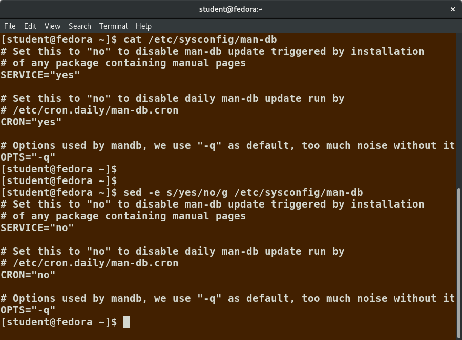

Sistemes de fitxers
===================

A Linux (i a tots els sistemes operatius com UNIX) sovint es diu que “tot és un fitxer", o almenys es tracta com a tal. Això vol dir que tant en tractar fitxers normals com en tractar amb dispositius externs interactuarem amb ells mitjançant el mateix tipus d’operacions d’entrada / sortida (E/S).

En molts sistemes (inclòs Linux), el **sistema de fitxers està estructurat com un arbre**. L’arbre és invertit i comença en el que s’anomena directori arrel. Aquest directori arrel marca el començament del sistema de fitxers jeràrquic i es denota per /. El directori arrel no és el mateix que l’usuari root. El sistema de fitxers jeràrquic també conté altres elements de la ruta (noms de directori), que estan separats per barres de correcció (/), com a ``/usr/bin/emacs``, on l’últim element és el nom real del fitxer.

En aquesta secció coneixereu alguns conceptes bàsics inclosa la jerarquia del sistema de fitxers, així com les particions de disc.

Tipus de sistemes de fitxers
----------------------------

Els sistemes de fitxers més emprats a linux són:

-  ext3 i ext4

-  squashfs

-  btrfs

Altres sistemes operatius empren també els sistemes de fitxers següents, també suportats a Linux:

-  Windows (NTFS, vfat)

-  SGI (xfs)

-  IBM (jfs)

-  MacOS (hfs, hfs+)

A més, antics sistemes com FAT també estan suportats. Cada tipus de sistema de fitxer és millor per realitzar una o altra tasca, en funció de la mida dels fitxers, la freqüència en que es modifiquen, el tipus de hardware on s’ubiquen etc. Els darrers sistemes de fitxers inclouen funcions de *journaling* com ara ext4, xfs, btrfs i jfs. Aquest tipus de tecnologies fan que sigui molt difícil corrompre les dades de forma accidental.

Particions
----------

Com ja s’ha comentat, cada sistema de fitxers ocupa una partició del disc dur. **Les particions serveixen per organitzar el contingut dels discs**. Per exemple, els programes més importants es guarden en una partició arrel (``root`` o ``/``) diferent a la partició que empren els usuaris (``/home``). Els fitxers temporals poden crear-se i destruir-se en a particions dedicades. Un avantatge d’aquest tipus de configuració és que una vegada l’espai d’una partició s’ha esgotat, això no afectarà el funcionament normal del sistema.

Una de les utilitats més emprades per **manejar particions és gparted**, que mostra un esquema de les particions del sistema. La figura `[fig_1] <#fig_1>`__ mostra un sistema amb tres sistemes operatius: Windows, RHEL i Ubuntu.

   Exemple de visualització de la utilitat gparted. [fig_1]

Punt de muntatge
~~~~~~~~~~~~~~~~

L’expressió *muntar* és l’acció de **afegir un sistema de fitxers a l’arbre del sistema de fitxers del sistema**. Es munta sempre a un directori específic de l’arbre, que s’anomena **punt de muntatge**.

Muntar un sistema de fitxers es fa de la forma següent:

::

    sudo mount /dev/sda5 /home

Aquesta comanda muntarà el sistema de fitxers del dispositiu /dev/sda5 al punt de muntatge /home.

Per desmuntar un sistema de fitxers farem:

::

    sudo umount /home

Per poder muntar sistemes de fitxers automàticament quan arranca el sistema, podem modificar el fitxer ``/etc/fstab``.

Si feim servir la comanda ``mount`` sense arguments, ens mostrarà els sistemes de fitxers muntats al sistema.

NFS i Network Filesystems
~~~~~~~~~~~~~~~~~~~~~~~~~

De vegades és necessari compartir dades entre diferents sistemes, ja es trobin a la mateixa localització o a qualsevol punt d’Internet. Els sistemes de fitxers en xarxa **permeten tenir distribuïdes les dades entre diferents màquines** o en una sola que serveix els fitxers a altres màquines. Vegeu l’esquema de la figura `[fig_2] <#fig_2>`__.

.. figure:: figura2.png
   :alt: Sistema de fitxers NFS [fig_2]
   :width: 100mm

   Sistema de fitxers NFS [fig_2]

EXERCICI PRÀCTIC - Muntar un client NFS
~~~~~~~~~~~~~~~~~~~~~~~~~~~~~~~~~~~~~~~

Emprau un client NFS per connectar-vos al servidor NFS **lois.gotes.org** al directori **nfsroot**.

::

   mkdir nfsshare
   sudo apt-get install nfs-common
   sudo mount -o hard,nolock lois.gotes.org:/nfsroot nfsshare/

Operacions bàsiques amb fitxers
===============================

En aquesta secció mostrarem les eines més emprades per treballar amb fitxers. Les comandes més emprades, a mode de recordatori, són:

-  **cat**: emprat per concatenar fitxers. S’empra generalment per veure fitxers curts.

-  **less**: permet veure fitxers més grans perquè pausa el text quan aquest ocupa tota la pantalla i permet fer scroll. Es pot introduir el caràcter / per cercar text. El programa more fa gairebé el mateix i està disponible en algunes distribucions.

-  **tail i head**: permeten veure les darreres i les primeres línies d’un fitxer. Per defecte mostra les 10 primeres o darreres, però amb l’opció -n es pot especificar el número de línies.

-  **touch**: emprat per actualitzar o fixar el temps d’accés, canvi o modificació d’un fitxer. També s’empra per crear fitxers buits. Exemple: touch testfile.

-  **mkdir i rmdir**: creen i esborren fitxers. Per esborrar un directori, aquest ha d’estar buit o la comanda fallarà. Es poden esborrar recursivament el directori i el seu contingut fent rm -rf <directori>

-  **cp**: copia un fitxer o dirtectori. Per poder copiar un directori de forma recursiva cal emprar l’opció -r. Per exemple: cp -r <dir1> <dir2>

-  **mv**: reanomena un fitxer o directori i/o el mou si s’especifica un camí diferent. Exemple: mv /opt/fitxer1 /usr/local/var/fitxer2 mourà el fitxer1 a un directori diferent amb un nom diferent (fitxer2).

-  **rm**: esborra un fitxer. Amb l’opció -f es forçarà l’esborrada (COMPTE!)

Entrada i sortides estàndards
-----------------------------

Quan alguna comanda o programa s’executa, per defecte **existeixen tres descriptors (punters) de fitxers estàndard** que sempre poden emprar-se. L’entrada estàndard (o *stdin*), la sortida estàndard (*stdout*) i la sortida estàndard d’error (*stderr*). Podeu veure-ho a la taula `[taula_stdX] <#taula_stdX>`__

.. table:: Tipus de sortides amb Linux

   ================= ================ ========= ===========================================================
   **Nom**           **Nom simbòlic** **Valor** **Exemple**
   Entrada estàndard **stdin**        0         l’usuari introdueix lletres per teclat
   Sortida estàndard **stdout**       1         el programa mostra un text a la terminal
   Sortida d’error   **stderr**       2         el programa escriu a un fitxer de log els errors d’execució
   ================= ================ ========= ===========================================================

[taula_stdX]

Normalment, *stdin* és el vostre teclat, i *stdout* i *stderr* es mostren al terminal. *stderr* sovint es redirigeix ​​a un fitxer d’errors. *stdin* és d’entrada, és a dir, el programa espera que se li proporcioni. Això es fa redirigint l’entrada que surt des d’un fitxer cap al programa o bé des de la sortida d’una comanda anterior a través d’un *pipe* (``|``). *stdout* sovint també es redirecciona a un fitxer.

Redirecció de l’entrada/sortida
-------------------------------

A través de la línia de comandes **es poden redirigir les tres sortides estàndard** de tal manera que l’entrada d’un programa sigui un fitxer o una altra comanda enlloc de directament el teclat. També podem escriure fitxers d’error i de sortida i emprar-los per comandes futures.

Si tenim un programa anomenat ``do_something`` que llegeix de *stdin* i escriu a *stdout* i *stderr*, podem canviar l’entrada emprant un símbol de ``<`` seguit del nom del fitxer d’entrada.

::

    do_something < input-file

per redirigir la sortida a un fitxer emprarem el símbol ``>``:

::

    do_something > output-file

o

::

    do_something 1> output-file

Com que la sortida d’error no és la mateixa que la sortida normal, els missatges d’error es seguiran veient a la terminal. Per poder redirigir la sortida d’error, emprarem els símbols ``2>``:

::

    do_something 2> error-file

Fins i tot podem redirigir la sortida d’error a la sortida estàndard, de forma que ho puguem redirigir tot a un fitxer:

::

    do_something > all-output-file 2>&1

o

::

    do_something >& all-output-file

EXERCICI PRÀCTIC - Redirigiu les sortides stdout i stderr de la comanda "find / -iname grub.cfg" a un fitxer
~~~~~~~~~~~~~~~~~~~~~~~~~~~~~~~~~~~~~~~~~~~~~~~~~~~~~~~~~~~~~~~~~~~~~~~~~~~~~~~~~~~~~~~~~~~~~~~~~~~~~~~~~~~~

EXERCICI PRÀCTIC - Redirigiu les sortides stdout i stderr de la comanda "find / -iname grub.cfg" al mateix fitxer
~~~~~~~~~~~~~~~~~~~~~~~~~~~~~~~~~~~~~~~~~~~~~~~~~~~~~~~~~~~~~~~~~~~~~~~~~~~~~~~~~~~~~~~~~~~~~~~~~~~~~~~~~~~~~~~~~

*Pipes* o tuberies 
-------------------

La filosofia UNIX és mantenir molts programets simples i curts que cooperin de forma conjunta per proporcionar resultats complexos. Per aconseguir això es fa un ús extensiu de les tuberies o *pipes*. Com el seu nom indica, una tuberia el que fa és **redirigir la sortida d’un programa a l’entrada d’un altre**.

Per això, empram la barra vertical (``|`` entre comandes):

::

    comanda1 | comanda2 | comanda3

L’anterior representa una *pipeline* i permet combinar vàries accions en una. Això és molt eficient perquè la comanda2 i comanda3 no han d’esperar que l’anterior comanda1 acabi per executar-se, sinó que s’executen i empren els fluxes d’inputs que l’anterior comanda els proporciona. Així mateix, no es requereix de fitxers intermedis, reduïnt espai ocupat en disc.

EXERCICI PRÀCTIC - Mostrau el contingut d’un fitxer i redirigiu-ho al programa less
~~~~~~~~~~~~~~~~~~~~~~~~~~~~~~~~~~~~~~~~~~~~~~~~~~~~~~~~~~~~~~~~~~~~~~~~~~~~~~~~~~~

::

    cat fitxer.txt | less

o bé generar string aleatori:

::

   cat /dev/urandom | head -n 1 | md5sum | head -c 16

Cerca de fitxers
----------------

Saber trobar els fitxers dins del sistema de fitxers de forma ràpida és molt útil. Les eines principals són ``locate`` i ``find``.

locate
~~~~~~

L’eina ``locate`` realitza una cerca **basant-se en una base de dades prèviament construïda.** Generalment se li proporciona un string i mostra totes les entrades amb aquest string. Vegeu la figura `[fig_9] <#fig_9>`__ per veure un exemple del seu ús. Podem emprar la comanda **grep** per filtrar:

::

    locate zip | grep bin

Mostrarà tots els fitxers i directoris amb zip i bin al seu nom.

La base de dades que empra ``locate`` és creada per una utilitat anomenada ``updatedb``. Generalment s’executa de forma automàtica un pic al dia. L’administrador pot actualitzar-la manualment executant updatedb com a usuari root.

   Exemple d’ús de l’eina locate [fig_9]

find
~~~~

``find`` és un programa molt útil i emprat per qualsevol administrador. **De forma recursiva cerca dins tot el sistema de fitxers** i troba els fitxers que compleixen les condicions especificades. Per exemple, els administradors escanegen per fitxers de log antics potencialment grans per esborrar-los.

Per exemple, per cercar fitxers i directoris anomenats ``gcc``

::

    find /usr -name gcc

Per cercar just directoris emprarem l’opció ``-type d``, i per cercar just fitxers l’opció ``-type f``.

EXERCICI PRÀCTIC - Cercau el fitxer openl2tp.so
~~~~~~~~~~~~~~~~~~~~~~~~~~~~~~~~~~~~~~~~~~~~~~~

::

    locate openl2tp.so
    find / -type f -iname openl2tp.so 2> /dev/null

Comparació de fitxers
---------------------

Una de les eines bàsiques per comparar fitxers és ``diff``. Per comparar dos fitxers diferents, farem el següent:

::

    diff [options] <filename1> <filename2>

O ``cmp`` per fitxers binaris.

Podem emprar l’eina diff3 per comparar tres fitxers diferents, agafant-ne un de referència.

::

    diff3 <filename1> <common filename> <filename2>

Moltes modificacions a codi font o fitxers de configuració es distribueixen per la xarxa mitjançant *patches*. Aquestes modificacions s’apliquen mitjançant l’eina ``patch``. Els fitxers patch inclouen les deltas (les modificacions) prenent de referència una versió més antiga del fitxer.

Per **produir** un fitxer patch farem:

::

    diff -Nur originalfile newfile > patchfile

Per **aplicar** un fitxer de patch farem:

::

    patch -p1 < patchfile

Per aplicar-ho a tot el directori o ,

::

    patch originalfile patchfile

per aplicar-ho just a un fitxer determinat.

Eina file
---------

A Linux, **l’extensió d’un fitxer no condiciona el format d’aquest.** És a dir, un fitxer .txt no té perquè ser un fitxer de text (pot ser un executable). La naturalesa d’un fitxer pot ser esbrinada amb l’eina ``file``. Ho fa examinant certes característiques del fitxer per saber si es tracta de fitxers en clar, llibreries, executables, scripts etc. Podeu veure’n un exemple a la figura `[fig_3] <#fig_3>`__

   Exemple d’ús de l’eina file [fig_3]

Còpies de seguretat
===================

Les eines més emprades per fer còpies de seguretat de fitxers són bàsicament dues: ``cp`` i ``rsync``. Les dues poden fer essencialment el mateix, però ``rsync`` és més robusta perquè pot copiar a diferents màquines a través de la xara, evitar fer còpies innecessàries i ser més ràpid.

rsync
-----

Copiar un fitxer amb rsync a una màquina diferent pot fer-se amb la comanda:

::

    rsync -r project-X maquina2:archives/project-X

Una simple còpia en local pot fer-se així:

::

    rsync -r fitxer1 /home/usuari/fitxer2

Una opció més avançada i eficaç per fer backups pot ser:

::

    rsync --progress -avrxH  --delete sourcedir destdir

O l’opció *Dark Souls*:

::

   /usr/bin/rsync -az \
   --delete \
   -e "ssh -p 10022 -i /root/.ssh/id_rsa.backupninja" \
   /var/backups/backupninja \
   root@mariamayol2.guifi.gotes.org:/var/backups/corporate/backupninja/ \
   --exclude-from=/etc/mariamayol2_sync_exclude;

-  L’opció ``a`` assegura copiar correctament els directoris, els enllaços, els permisos, els temps, els grups i els propietaris i els fitxers especials. L’opció ``z`` implica comprimir els fitxer.

-  L’opció ``--delete`` implica esborrar al directori destí els fitxers que no existeixen a l’origen.

-  L’opció ``-e`` serveix per especificar que emprarem la comanda SSH, pel port 10022 i emprant la clau privada ``id_rsa.backupninja`` per connectar-nos de forma segura.

-  ``/var/backups/backupninja`` és el directori origen.

-  ``root@mari...orate/backupninja/`` és la màquina i el directori destí.

-  ``--exclude-from=/etc/mariamayol2_sync_exclude;`` és una llista de directoris exclosos del backup de dins el directori origen.

Compressió de dades
-------------------

Generalment **les dades solen comprimir-se** per guardar espai en disc i reduir temps de transferència sobre la xarxa. Les tècniques més emprades es mostren a la taula `[compr_method] <#compr_method>`__:

.. table:: Tipus de compressió de dades en Linux

   =========== ====================================================================================
   **Comanda** **Descripció**
   gzip        La més emprada. Tan simple com fer ``gzip <fitxer>`` i ``gunzip <fitxer.gz>``
   bzip2       Comprimeix més que gzip
   xz          L’eina més eficient per comprimir en Linux.
   zip         Emprada generalment per examinar i descomprimir fitxers d’altres sistemes operatius.
   =========== ====================================================================================

[compr_method]

És important, per entendre la compressió de dades en Linux, entendre que **és diferent l’acció de comprimir un fitxer de empaquetar un directori.** Generalment, el que es coneix com *comprimir* un directori en Linux en general implica les dues accions: primer empaquetar i després comprimir.

Per això existeix, en Linux, l’eina ``tar``. El nom d’aquesta eina ve de *\|*\ tape archive\| que servia per arxivar fitxers en una cinta magnètica. Permet empaquetar fitxers en un arxiu anomenat tarball. Opcionalment també pot comprimir amb el mètode que vulguem. Alguns exemples de tar els podeu veure a la taula `[tar_example] <#tar_example>`__.

.. table:: Exemples d’ús de tar

   =============================== ===============================================================
   **Comanda**                     **Descripció**
   ``tar xvf mydir.tar``           Extreu (x) al directori mydir. f és el fitxer i v és *verbose*.
   ``tar zcvf mydir.tar.gz mydir`` Crea l’arxiu i comprimeix-lo amb gzip
   ``tar jcvf mydir.tar.gz mydir`` Crea l’arxiu i comprimeix-lo amb bz2
   ``tar Jcvf mydir.tar.gz mydir`` Crea l’arxiu i comprimeix-lo amb xz
   ``tar xvf mydir.tar.gz``        Extreu i descomprimeix el fitxer mydir.tar.gz
   =============================== ===============================================================

[tar_example]

Còpia disc a disc (dd)
----------------------

L’eina ``dd`` **serveix per copiar les dades del disc en brut**. Per exemple, serveix per copiar particions senceres o discs d’arrancada d’una distribució:

::

    dd if=ubuntu-18.04.2-desktop-amd64.iso of=/dev/sdX bs=4M

**COMPTE!** L’eina dd és molt perillosa i pot esborrar molt fàcilment un disc dur!

EXERCICI PRÀCTIC - Còpia de seguretat del directori /home
---------------------------------------------------------

Es proposa fer un petit script d’una còpia de seguretat del directori /home d’un usuari.

Solució amb compressió:

::

    #!/bin/bash
    tar cvzf /var/backups/student_backup.tar /home/student

Solució amb rsync:

::

    #!/bin/bash
   /usr/bin/rsync -az --delete /home/student /var/backups/student_backup

Editors de textos
=================

En algun moment sempre és necessari editar textos en Linux de forma manual. Ja sigui escrivint un script, modificant un fitxer de configuració d’una aplicació, desenvolupament codi font etc.

Els administradors de Linux generalment han d’encarar-se directament amb els fitxers de configuració, ja que no es desenvolupen eines gràfiques o automàtiques per modificar aquests fitxers. Els processadors de textos no són eines útils per aquest propòsit perquè tenen moltes funcionalitats de formatació.

Les eines més emprades són:

-  nano

-  gedit

-  vi i vim

-  emacs (no la cobrirem)

Les dues primeres són fàcils i intuitives d’emprar, mentre que les dues darreres estan pensades per usuaris avançats.

Crear fitxers sense editor
--------------------------

**De vegades en Linux potser no cal ni emprar cap tipus d’editor**, ja bé sigui perquè tenim pressa o bé perquè el sistema no en té cap! Hi ha dues maneres de crear un fitxer d’aquesta manera.

La primera consisteix en emprar la comanda ``echo`` repetidament:

::

    echo line one > myfile # cream el fitxer i hi posam la línia "line one"
    echo line two >> myfile # concatenam la línia "line two" al fitxer myfile
    echo line three >> myfile # concatenam la línia "line three" al fitxer myfile

Teniu en compte que el símbol major que (``>``) sobreescriurà el fitxer, mentre que dos d’ells (``>>``) no sobreescriurà sinó que concatenarà.

L’altra opció és emprar la comanda ``cat`` amb la redirecció:

::

   cat << EOF > myfile
   > line one
   > line two
   > line three
   > EOF

Ambdós sistemes crearan el mateix fitxer.

nano
----

Nano és l’editor de text per terminal més senzill i emprat. Simplement cal executar ``nano <nomfitxer``. No té més complicació que això. Les comandes més emprades són les següents:

-  ``CTRL-G``: mostra la pantalla d’ajuda.

-  ``CTRL-O``: guarda a un fitxer.

-  ``CTRL-X``: surt.

-  ``CTRL-R``: insereix continguts d’un altre fitxer a l’actual.

-  ``CTRL-C``: cancel·la comanda anterior.

Podeu veure un exemple de la interfície a la figura `[fig_4] <#fig_4>`__.

   Exemple d’ús de nano [fig_4]

EXERCICI PRÀCTIC - Creau un fitxer amb Nano
-------------------------------------------

#. Entrau a nano i creau el fitxer myfile.txt

#. Posau un nom

#. Posau la data

#. Guardau i sortiu

gedit
-----

Gedit és un **editor de text simple per a escriptori gràfic.** És semblant al Bloc de Notes de Windows, però amb més funcionalitats i plugins disponibles. Generalment, en Ubuntu o Debian el trobarem inclòs ja al sistema. La interfície es prou intuitiva i la podeu veure a la figura `[fig_5] <#fig_5>`__.

Altres distribucions inclouen altres editors de text semblants, com ara Kate en KDE o Pluma en segons quines distribucions d’Ubuntu.

   Exemple d’ús de gedit [fig_5]

Vi i Vim
--------

Els desenvolupadors i administradors més experimentats en sistemes UNIX generalment empren algun dels editors Vi o Emacs. En aquest curs ens centrarem amb el Vi, ja que es troba en totes les distribucions. Fins i tot, en algunes distribucions Vim és l’únic editor disponible. Vim és una versió millorada de Vi (Vi iMproved). Es tracta en tots els casos de editors basats en línia de comandes. **Tenen corbes d’aprenentatge molt pronunciades, però són molt més eficients d’emprar.** La figura `[fig_6] <#fig_6>`__ mostra la pantalla de benvinguda de Vim quan s’executa el programa en CLI.

   Pantalla de benvinguda de Vim. [fig_6]

Per aprendre a emprar Vim, podeu seguir el ``Vimtutor``, una comanda que executa un tutorial per a Vim. És una bona manera d’introduir-se a les comandes del programa. En tot cas, la millor manera d’aprendre és practicar molt.

Modes en Vi
~~~~~~~~~~~

Vi té tres modes de funcionament:

-  Command:

   -  Per defecte, vim s’executa en mode command.

   -  Cada tecla és una comanda.

-  Insert:

   -  Per entrar en mode insert, introduir la tecla **i** des de command mode.

   -  Serveix per inserir text a un fitxer

   -  Per retornar a mode command, pitjar la tecla **ESC**.

-  Line:

   -  Entrau-hi escrivint **:**

   -  Serveix per executar comandes externes.

   -  Per retornar a mode command, pitjar la tecla **ESC**.

Comandes bàsiques
~~~~~~~~~~~~~~~~~

La taula `[vim_basic_com] <#vim_basic_com>`__ mostra les comandes més bàsiques amb Vim. La taula `[vim_basic_curs] <#vim_basic_curs>`__ mostra les comandes per navegar per la pantalla en command mode.

.. table:: Comandes bàsiques de Vim

   ============= ================================================================================
   **Comanda**   **Descripció**
   ``vi myfile`` Inicia el vi obrint el fitxer myfile. Si no existeix el crea en guardar-lo.
   ``:r file2``  Llegeix file2 i insereix el contingut a la posició actual
   ``:w``        Guarda el fitxer
   ``:w myfile`` Guarda el contingut del fitxer a un fitxer nou anomenat myfile. (*Guardar como*)
   ``:wq``       Guarda i surt de vim
   ``:q``        Surt de vim
   ``:q!``       Surt de vim sense guardar
   ============= ================================================================================

[vim_basic_com]

.. table:: Comandes bàsiques de navegació de Vim

   ================== ====================================
   **Comanda**        **Descripció**
   Fletxes del teclat Moure amunt, avall, dreta i esquerra
   \                  Mou línia abaix
   \                  Mou línia amunt
   \                  Mou un caràcter a l’esquerra
   \                  Mou un caràcter a la dreta
   \                  Mou a l’inici de la línia
   \                  Mou al final de la línia
   \                  Mou a l’inici de la paraula
   \                  Mou a l’inici del fitxer
   \                  Mou al final del fitxer
   ================== ====================================

[vim_basic_curs]

EXERCICI PRÀCTIC - Creau un fitxer amb Vim
------------------------------------------

#. Executar ``vim fitxer``

#. Entrar en mode Insert.

#. Escriure alguna cosa.

#. Entrar en command mode.

#. Guardar el fitxer.

#. Sortir(!!)

EXERCICI PRÀCTIC - Seguiu el turial Vimtutor
--------------------------------------------

Entrau a una consola i executau la comanda ``Vimtutor``

Manipulació de text i fitxers
=============================

Tant usuaris com administradors de Linux generalment solen necessitar navegar entre fitxers, parsejar-los i extreure’n dades. Això s’anomena manipulació de text i és necessari que els administradors aprenguin les comandes bàsiques. La majoria del temps, la manipulació es fa a través de línia de comandes. Aquesta secció mostrarà algunes de les eines de manipulació de text més emprades.

cat i echo
----------

Les més comunes són ``cat`` i ``echo``. ``cat`` ve de concatenar, i inicialment s’emprava per juntar la sortida de dos fitxers. Generalment, **s’empra per veure el contingut d’aquests.** El seu ús és molt simple: ``cat fitxer``. ``tac`` fa el mateix però pinta les línies en ordre invers. Podeu veure algunes comandes bàsiques a la taula `[basic_cat] <#basic_cat>`__:

.. table:: Comandes bàsiques amb cat

   =============================== =======================================================================================================
   **Comanda**                     **Descripció**
   ``file1 file2``                 Concatena els dos fitxers i els mostra en pantalla
   ``cat file1 file2 > noufitxer`` Concatena els dos fitxers i guarda la concatenació a noufitxer
   ``cat file >> existingfile``    Escriu el contingut de file al final de tot del fitxer existingfile
   ``cat > file``                  Totes les línies que s’escriguin a continuació es guardaran al fitxer fins que s’introdueixi **CTRL-D**
   =============================== =======================================================================================================

[basic_cat]

``echo`` simplement **mostra el text passat**.

::

    echo string

``echo`` és molt útil per mostrar valors de variables. Per exemple, ``echo $USERNAME`` mostrarà el nom de l’usuari loggejat al terminal actual. Pot emprar-se ``echo`` per escriure strings a fitxers. Per exemple ``echo $USERNAME > newfile``.

EXERCICI PRÀCTIC - Mostrau el contingut de la variable d’entorn PATH
~~~~~~~~~~~~~~~~~~~~~~~~~~~~~~~~~~~~~~~~~~~~~~~~~~~~~~~~~~~~~~~~~~~~

Treballant amb fitxers grans: head i tail
-----------------------------------------

Els administradors sovint necessiten treballar amb fitxers (configuracions, textos, documentació, logs etc.) que **poden ser molt llargs o tornar grans amb el temps.** Per visualitzar correctament aquests fitxers en línia de comandes hi ha una sèrie d’eines que són necessàries.

No ens bastarà només en de forma interactiva poder moure amunt i avall el fitxer, sinó que també pot ser interessant pels administradors mantenir el fitxer obert veient en temps real els canvis que s’hi fan (sobretot per fitxers de log i de dades). Així mateix, obrir fitxers llargs sencers amb editors pot generar problemes de memòria i amb aquestes eines podem seleccionar veure només les darreres o primeres línies.

Una de les eines més emprades per visualitzar fitxers en línia de comandes és ``less``. Per exemple:

::

    less fitxer
    cat fitxer | less

Les dues formes fan el mateix.

Les pàgines de manuals (man) funcionen també amb l’eina ``less``.

Alternativament, pot emprar-se també l’eina ``more``, que fa essencialment el mateix que ``less`` però és més antiga i disposa de menys funcionalitats.

head
~~~~

``head`` **llegeix les primeres línies d’un fitxer** (10 per defecte) i les mostra a la sortida estàndard. Per exemple, per llegir les primeres 5 línies del fitxer grub.cfg faríem:

::

    head -n 5 grub.cfg

o també

::

    head -5 grub.cfg

El resultat és el que ens mostra la figura `[fig_7] <#fig_7>`__

   Exemple d’ús de l’eina head [fig_7]

tail
~~~~

``tail`` **llegeix les darreres línies d’un fitxer** (10 per defecte) i les mostra a la sortida estàndard. Per exemple, per llegir les darreres 5 línies del fitxer grub.cfg faríem:

::

    tail -n 5 grub.cfg

o també

::

    tail -5 grub.cfg

El resultat és el que ens mostra la figura `[fig_8] <#fig_8>`__

.. figure:: figura8.png
   :alt: Exemple d’ús de l’eina tail [fig_8]
   :width: 100mm

   Exemple d’ús de l’eina tail [fig_8]

Emprant l’opció ``-f`` (``tail -f fitxer``) mostrarà de forma contínua les noves línies que apareixin al fitxer. Això permet monitoritzar de forma contínua l’activitat d’un fitxer.

EXERCICI PRÀCTIC - Seguiu el fitxer de syslog del sistema
~~~~~~~~~~~~~~~~~~~~~~~~~~~~~~~~~~~~~~~~~~~~~~~~~~~~~~~~~

::

    tail -f /var/log/syslog

Veure fitxers comprimits
------------------------

Quan es treballa amb fitxers comprimits algunes comandes estàndard no poden emprar-se directament. Hi ha versions d’aquestes comandes específiques per emprar directament amb fitxers comprimits. Generalment tenen la lletra “z” davant. Per exemple, ``zcat, zless, zdiff i zgrep``. Podeu veure-ho a la taula `[zutilities_table] <#zutilities_table>`__

.. table:: Comandes bàsiques per treballar amb fitxers comprimits

   =========================== ================================
   **Comanda**                 **Descripció**
   zcat fitxer.tar.gz          Mostra el fitxer comprimit
   zless fitxer.gz             Pagina dins del fitxer comprimit
   zgrep -i less fitxer.gz     Cerca dins del fitxer comprimit
   zdiff fitxer1.gz fitxer2.gz Compara dos fitxers comprimits
   =========================== ================================

[zutilities_table]

Aquestes comandes funcionaran també dins fitxers no comprimits. També hi ha eines equivalents per a altres mètodes de compressió diferents a gzip, com ara bzcat, bzless, bzip2, xzcat...

sed i awk
---------

És molt comú en administrar sistemes crear i de forma repetida extreure o editar continguts d’un fitxer per línia de comandes. Aquestes operacions es duen a terme amb les eines ``sed i awk``.

A la vegada, apart d’aquestes eines, els administradors generalment empren també scripts amb Python i Perl. Aquestes opcions són també bones, però sed i awk són molt més simples, lleugeres i requereixen moltes menys dependències que eines o llenguatges més complexos.

sed
~~~

``sed`` és una de les eines més populars i antigues de UNIX per processar text. S’empra per modificar el contingut d’un fitxer. ``sed`` pot filtrar text també i fer substitucions. Vegeu la figura `[fig_10] <#fig_10>`__

   Exemple d’ús de l’eina sed [fig_10]

Les dades d’un fitxer d’input s’agafen i es mouen a un *working space* o espai de treball. La llista sencera d’operacions i modificacions s’apliquen sobre les dades de l’espai de treball i es mouen a la sortida estàndard.

``sed`` pot invocar-se de dues formes:

#. ``sed -e command <fitxer>``: especifica les comandes sed a la línia de comandes, opera a un fitxer i posa la sortida a la sortida estàndard.

#. ``sed -f scriptfile <fitxer>``: especifica les comandes sed a dins d’un fitxer anomenat scriptfile, opera a un fitxer i posa la sortida a la sortida estàndard.

L’opció ``-e`` pot especificar-se vàries vegades per múltiples comandes sed.

Algunes operacions bàsiques amb ``sed`` les podeu veure a la taula `[taula_sedbasic] <#taula_sedbasic>`__

.. table:: Comandes bàsiques per treballar amb sed

   ============================================== ======================================================================================
   **Comanda**                                    **Descripció**
   ``sed s/patró/string substitució/ fitxer``     Substitueix la primera ocurrència a cada línia del patró passat
   ``sed s/patró/string substitució/g fitxer``    Substitueix totes les ocurrències del patró passat
   ``sed 1,3s/patró/string substitució/g fitxer`` Substitueix totes les ocurrències del patró passat entre les línies 1 i 3
   ``sed -i s/patró/string substitució/g fitxer`` Substitueix i guarda les substitucions al mateix fitxer (compte a esborrar el fitxer!)
   ``sed s/patró/string substitució/g f1 > f2``   Substitueix i guarda les substitucions a un altre fitxer
   ============================================== ======================================================================================

[taula_sedbasic]

Exemple: converteix 01/02/... a JAN/FEB/...:

::

    sed -e 's/01/JAN/' -e 's/02/FEB/' -e 's/03/MAR/' -e 's/04/APR/' -e 's/05/MAY/' \ 
       -e 's/06/JUN/' -e 's/07/JUL/' -e 's/08/AUG/' -e 's/09/SEP/' -e 's/10/OCT/' \
       -e 's/11/NOV/' -e 's/12/DEC/'

awk
~~~

``awk`` s’empra per extreure i mostrar continguts específics d’un fitxer i sovint per fer informes. ``awk`` permet:

-  És una eina molt potent i un llenguatge de programació interpretat

-  S’empra per treure text, processar-lo i manipular fitxers de dades.

-  Funciona bé amb camps (columnes) i estructures.

Vegeu un exemple d’ús a la figura `[fig_11] <#fig_11>`__

   Exemple d’ús de l’eina awk [fig_11]

Com a ``sed``, les instruccions ``awk`` poden especificar-se des de la línia de comandes o des d’un fitxer amb l’opció -f.

``awk`` llegeix una línia en cada moment, i, per cada línia, ``awk`` fa match del patró passat i fa l’acció passada. L’opció -F permet especificar un caràcter separador dels camps. Per exemple ``/etc/passwd`` empra ``":"`` per separar.

Algunes operacions bàsiques podeu veure-les a la taula `[taula_awkbasic] <#taula_awkbasic>`__

.. table:: Comandes bàsiques per treballar amb awk

   ========================================= ===============================================
   **Comanda**                               **Descripció**
   ``awk '{ print $0 }' /etc/passwd``        Pinta el fitxer sencer
   ``awk -F: '{ print $1 }' /etc/passwd``    Pinta el primer camp (columna) de cada línia
   ``awk -F: '{ print $1 $7 }' /etc/passwd`` Pinta la primera i setena columna de cada línia
   ========================================= ===============================================

[taula_awkbasic]

EXERCICI PRÀCTIC - Parsejau el fitxer /etc/hosts amb awk
~~~~~~~~~~~~~~~~~~~~~~~~~~~~~~~~~~~~~~~~~~~~~~~~~~~~~~~~

::

    cat /etc/hosts | awk -F' ' '{ print $2 }'

EXERCICI PRÀCTIC - Substituïu totes les ocurrències d’un fitxer
~~~~~~~~~~~~~~~~~~~~~~~~~~~~~~~~~~~~~~~~~~~~~~~~~~~~~~~~~~~~~~~

Per exemple, substituïu totes les ocurrències del fitxer /boot/grub/grub.conf de l’string */boot/vmlinuz-*-generic* per */test/vmlinux-3.19.0-26-generic*.

::

    cat /boot/grub/grub.cfg |
    sed -e "s/\/boot\/vmlinuz-.*-generic/
    \/test\/vmlinux-3.19.0-26-generic/g"
    > grub.tmp

grep
----

``grep`` és una eina molt emprada per cercar text. Escaneja fitxers i pot ser emprada amb expressions regulars o strings simples. Vegeu el seu a la taula `[taula_grepbasic] <#taula_grepbasic>`__.

EXERCICI PRÀCTIC - Cercar línies amb un string determinat
~~~~~~~~~~~~~~~~~~~~~~~~~~~~~~~~~~~~~~~~~~~~~~~~~~~~~~~~~

Amb les comandes grep i cat i l’ús de *pipes*, mostrau només els missatges que inclouen l’string ``systemd`` del fitxer ``/var/log/syslog``.

.. table:: Comandes bàsiques per treballar amb grep

   ==================================================================================== ========================================================================================================================
   **Comanda**                                                                          **Descripció**
   ``grep [patró] <fitxer>``                                                            Cerca un patró i mostra les línies coincidents
   ``grep -v [patró] <fitxer>``                                                         Cerca un patró i mostra les línies **no** coincidents
   ``grep [0-9] /etc/hosts``                                                            Mostra les línies que tenen els números del 0 al 9
   ``grep -C 3 -e "vmlinuz-[0-9]*\.[0-9]*\.[0-9]*-[0-9]*-[a-z]*" /boot/grub/grub.cfg``  Mostra les línies que tenen algun nom de fitxer de kernel i mostra’n el context (tres línies amunt i tres línies avall).
                               
   ==================================================================================== ========================================================================================================================

[taula_grepbasic]

Altres eines
------------

De manipulació de fitxers:

-  ``sort``: ordena les línies d’un fitxer de text. Exemple: ``sort <fitxer>``

-  ``uniq``: elimina línies consecutives duplicades. Exemple d’ús:

   ::

      sort file1 file2 | uniq > file3

-  ``paste``: combina les columnes de dos fitxers, creant-ne un tercer amb les columnes col·locades. Vegeu la figura `[fig_12] <#fig_12>`__

-  ``join``: combina columnes de varis fitxers, emprant com a clau primària una columna repetida entre els varis fitxers.

-  ``split``: separa un fitxer gran (de més de 1000 línies) en varis fitxers més petits.

De manipulació d’strings:

-  ``wc``: compta el número de línies, bytes o paraules. Per exemple ``wc -l fitxer`` mostra el número de línies del fitxer.

-  ``cut``: separa un fitxer o string en columnes en funció d’un caràcter delimitador. Per exemple, ``cut -d" " -f3`` retallarà les línies pels espais en blanc i mostrarà la tercera columna.

-  ``tee``: si es passa l’output per pipe, mostra la sortida i l’escriu a un fitxer. Vegeu la figura `[fig_13] <#fig_13>`__ com exemple d’ús.

-  ``tr``: tradueix caràcters d’un conjunt a un altre. Exemple: ``tr [:space:] '\t'``. Tradueix espais a tabs.

   Exemple d’ús de l’eina paste [fig_12]

   Exemple d’ús de l’eina tee [fig_13]
