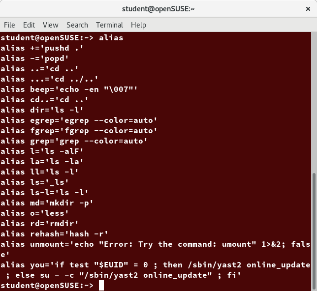
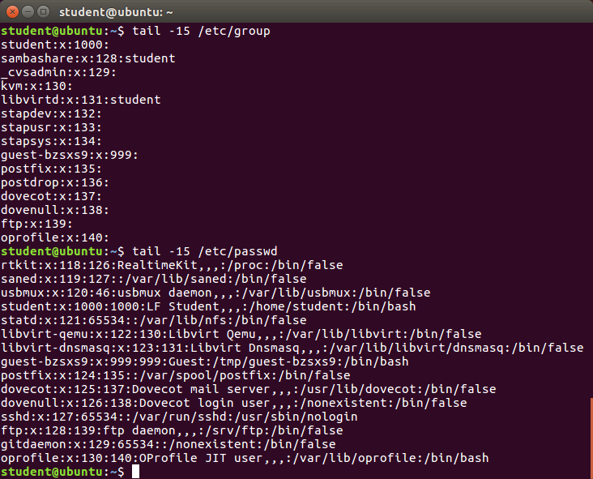
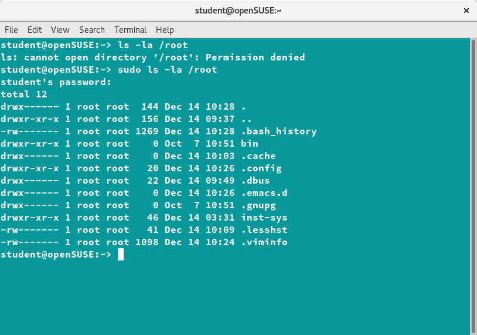
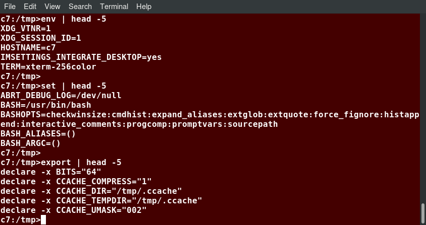
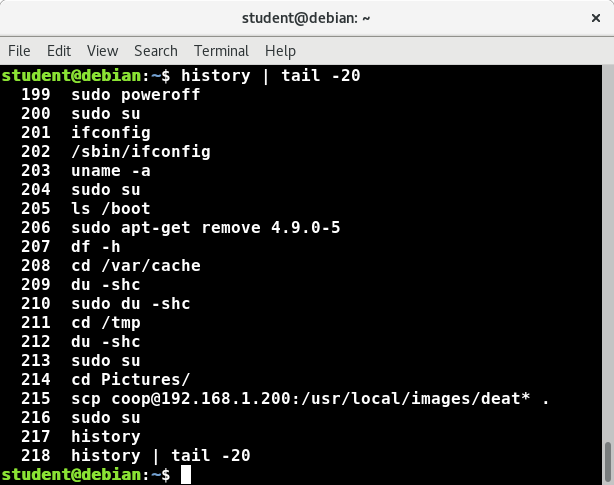

Entenem l’entorn d’usuari en Linux com tots aquelles variables i elements que configuren l’entorn en què es l’usuari interactuarà amb el sistema. Això són entendre com funcionen els comptes d’usuari, les variables d’entorn i els permisos.

Comptes, usuaris i grups
========================

Identificar l’usuari actual
---------------------------

Linux és un sistema operatiu multiusuari. Això vol dir que més d’un usuari pot tenir sessió iniciada al mateix moment.

-  Per identificar l’usuari actual, podem emprar el programa **whoami**.

-  Per saber els usuaris que actualment tenen sessió oberta al sistema, podem emprar **who**. ``who -a`` dóna més informació.

Fitxers d’inici de l’usuari
---------------------------

El programa de línia de comandes (anomenat també shell o intèrpret d’ordres, generalment el **bash**), empra varis fitxers d’inici per configurar l’entorn. Fitxers al directori ``/etc`` defineixen paràmetres de configuració globals per a tots els usuaris, mentre que els fitxers de configuració i d’inicialització al ``/home`` de l’usuari poden incloure i sobreescriure els fitxers de configuració global.

Aquests fitxers de configuració i inicialització de l’usuari permeten funcions com:

#. Personalitzar l’aspecte de la línia de comandes

#. Definir dreceres i àlies de comandes

#. Especificar l’editor de textos per defecte (vim, nano, emacs...)

#. Especificar el camí o *path* on la shell cercarà els executables i llibreries

Ordre dels fitxers d’inici
~~~~~~~~~~~~~~~~~~~~~~~~~~

L’estàndard defineix que quan un usuari inicia sessió a Linux, **el fitxer /etc/profile s’avalua**. Després se cerquen els fitxers següents en ordre:

#. ``~/.bash_profile``

#. ``~/.bash_login``

#. ``~/.profile``

``~/.`` indica el home de l’usuari. El . davant indica que el fitxer està ocult. La shell de Linux **avalua el primer d’aquests fitxers d’inici** que troba i la resta els ignora (si troba el .bash_profile ignorarà els altres dos). Diferents distribucions poden emprar diferents fitxers d’inici.

Tot i així, cada vegada que un usuari inicia una nova shell o una nova finestreta de línia de comandes no s’està realitzant realment un login de sistema complet; en aquest cas, només s’avalua un fitxer anomenat ``~/.bashrc``. Aquest fitxer ni s’avalua ni es llegeix durant un login complet, però tanmateix algun dels tres anteriors fitxers l’invoquen igualment durant el procés de login complet.

D’aquesta manera, el més comú és treballar només amb el ``~/.bashrc``, ja que s’executarà pràcticament sempre. Fins i tot, algunes distribucions ja no inclouen ni el ``~/.bash_profile`` ni el ``~/.bash_login`` i només duen el ``~/.bashrc``.

Crear àlies de comandes
~~~~~~~~~~~~~~~~~~~~~~~

Es poden crear comandes personalitzades o modificar el comportament de les comandes ja existents creant àlies de comandes. Normalment, per fer aquests àlies permanents, s’inclouen al fitxer ``~/.bashrc``. Per crear un àlies, emprarem el programa **alias** i **unalias** per eliminar-lo.

Per exemple, imaginau que volem cercar molts cops un fitxer anomenat hello al directori actual. Per això, podem fer un àlies de ``find . -iname hello -type f``, que podrem cridar simplement amb la comanda ``fh``. Per això farem:

::

   alias fh="find . -iname hello -type f 2> /dev/null"

Així, enlloc d’escriure tota la comanda completa serà suficient amb escriure fh. És important no posar espais entre el nom de l’àlies i la comanda.

Si escrivim ``alias`` sense arguments ens mostrarà els àlies configurats actualment com podeu veure a la figura `[fig_1] <#fig_1>`__.

   Àlies configurats al sistema [fig_1]

EXERCICI PRÀCTIC - Àlies i .bashrc
~~~~~~~~~~~~~~~~~~~~~~~~~~~~~~~~~~

Creau un àlies de la comanda

::

   grep -C 3 -e "vmlinuz-[0-9]*\.[0-9]*\.
   [0-9]*-[0-9]*-[a-z]*" /boot/grub/grub.cfg

i posau-lo al .bashrc. Tancau i iniciau sessió vàries vegades per comprovar que funciona.

Introducció als usuaris i grups
-------------------------------

Tots els usuaris de Linux tenen assignat un identificador d’usuari (uid) únic que és només un nombre enter. Els usuaris normals comencen amb un uid superior a 1000.

Linux utilitza grups per organitzar els usuaris. Els grups són col·leccions de comptes amb certs permisos compartits. El control de membres del grup s’administra mitjançant el fitxer ``/etc/group``, que mostra una llista de grups i els seus membres. Per defecte, cada usuari pertany a un grup predeterminat o primari. Quan un usuari inicia la sessió, l’adhesió al grup s’estableix per al seu grup principal i tots els membres gaudeixen del mateix nivell d’accés i privilegi. Els permisos de diversos fitxers i directoris es poden modificar a nivell de grup.

Els usuaris també tenen un o més identificadors de grup (gid), inclòs un predeterminat que és el mateix que l’ID d’usuari. Aquests números s’associen a noms a través dels fitxers ``/etc/passwd`` i ``/etc/group``. Els grups s’utilitzen per establir un conjunt d’usuaris que tenen interessos comuns a efectes de drets d’accés, privilegis i consideracions de seguretat. Els drets d’accés als fitxers (i dispositius) s’atorguen a partir de l’usuari i del grup al qual pertanyen.

Per exemple, ``/etc/passwd`` podria contenir

::

    george:x:1002:1002:George Metesky:/home/george:/bin/bash

i ``/etc/group`` podrien contenir

::

   george:x:1002

Vegeu un exemple d’aquests dos fitxers a la figura `[fig_2] <#fig_2>`__.

   Exemple del fitxer /etc/passwd i /etc/group [fig_2]

Afegir i eliminar usuaris
~~~~~~~~~~~~~~~~~~~~~~~~~

La majoria de distribucions tenen interfícies gràfiques que fan trivial crear usuaris, eliminar-los, crear grups, afegir-hi usuaris etc. De totes maneres, és útil saber fer-ho a través de línia de comandes i scripts. Només l’usuari root pot afegir i eliminar usuaris i grups.

Afegir usuaris es fa amb la comanda **useradd** i eliminar-los amb **userdel**. Per exemple afegir un usuari anomenat **jjartigues** es faria fent:

::

    sudo useradd jjartigues

Noti’s l’ús de **sudo** per otorgar privilegis de root.

Per defecte, **useradd** especifica el directori home de l’usuari com a ``/home/jjartigues``, el crea i l’omple de varis fitxers bàsics basant-se en el directori ``/etc/skel``. Així mateix, afegeix una línia com la següent a ``/etc/passwd``:

::

    jjartigues:x:1002:1002::/home/jjartigues:/bin/bash

Per defecte, l’intèrpret de comandes o shell és especificat com a ``/bin/bash``. Per esborrar l’usuari jjartigues hauríem de fer ``sudo userdel jjartigues`` o ``sudo userdel -r jjartigues`` per esborrar també el directori ``/home/jjartigues``.

Podem executar la comanda ``id`` o ``id <usuari>`` per tenir informació sobre l’usuari actual o l’usuari passat. Per exemple:

::

   $ id jjartigues
   uid=1002(jjartigues) gid=1002(jjartigues) groups=106(fuse),1002(jjartigues)

Afegir i eliminar grups
~~~~~~~~~~~~~~~~~~~~~~~

Afegirem un nou grup amb la comanda **groupadd**:

::

    sudo /usr/sbin/groupadd nougrup

I l’esborrarem amb **groupdel**:

::

    sudo /usr/sbin/groupdel nougrup

Afegir un usuari a un grup ja existent es fa amb usermod. Per exemple, primer per veure a quins grups ja pertany l’usuari farem:

::

    $ groups jjartigues
    jjartigues: jjartigues

i per afegir l’usuari:

::

    $ sudo /usr/sbin/usermod -a -G nougrup jjartigues
    jjartigues: jjartigues nougrup

Aquestes utilitats manipulen el fitxer ``/etc/group``. Si no s’empra l’opció -a (append) a **usermod** s’eliminarà l’usuari dels demés grups als que ja pertany! Pot emprar-se també la comanda **groupmod** per modificar les propietats del grup, com ara el gid o el nom.

Eliminar un usuari d’un grup és més complicat i ha de fer-se de forma inversa: afegint l’usuari a tots els grups menys al que el volem treure. Això ho fem simplement no afegint l’opció -a (append) a la comanda **usermod**:

::

    $ sudo /usr/sbin/usermod -G jjartigues jjartigues
    $ groups jjartigues
    jjartigues: jjartigues

El compte root
~~~~~~~~~~~~~~

El compte root té accés al sistema complet. Altres sistemes l’anomenen compte d’administrador. En Linux també s’anomena superusuari o *superuser* en anglès. S’ha de ser especialment cautelós en emprar aquest compte o tenir permisos de root i s’ha d’emprar el mínim possible i sempre de forma justificada. Els atacs externs sovint consisteixen en trucs per tenir accés de root.

Es recomana emprar al màxim possible el programa **sudo** per elevar els permisos d’un usuari a root de forma més controlada i limitada. Per exemple, de forma temporal o per un subconjunt específic de comandes.

su i sudo
~~~~~~~~~

Per tenir permisos de root, es pot emprar la comanda ``su`` (switch o substitute user) per iniciar una nova shell que s’executarà com un altre usuari. Heu d’escriure la contrasenya de l’usuari que us esteu fent. Sense arguments, aquest altre usuari és root, i la nova shell permet utilitzar privilegis elevats fins que tanquem sessió. És gairebé sempre una pràctica dolenta (perillosa tant per a la seguretat com per a l’estabilitat) emprar su per convertir-se en root. Això pot provocar la supressió dels fitxers vitals del sistema o incompliments en matèria de seguretat.

És menys perillós i més recomanable concedir privilegis amb **sudo**. De manera predeterminada, el sudo s’ha d’activar per usuari. Tanmateix, algunes distribucions (com Ubuntu) l’habiliten de manera predeterminada per a almenys un usuari principal o bé es donen com a opció d’instal·lació.

-  Per emprar **su**, simplement escriviu ``su`` i introduïu la contrasenya de root.

-  Per emprar **sudo**, heu d’escriure la comanda específica que voleu executar amb persmisos darrere: ``sudo <comanda>``. Podeu veure un exemple del seu ús a la figura `[fig_3] <#fig_3>`__.

La configuració de sudo es troba al fitxer ``/etc/sudoers`` i al directori ``/etc/sudoers.d`` (inicialment buit).

   Exemple d’ús de sudo [fig_3]

EXERCICI PRÀCTIC - Usuaris
~~~~~~~~~~~~~~~~~~~~~~~~~~

Provau de fer el següent:

#. Provau d’entrar al sistema com a usuari root amb **su**

#. Creau un usuari amb sudo

#. Creau un grup i afegiu-hi aquest usuari

#. Executau la comanda ``sudo su``. Què estam fent aquí?

Variables d’entorn
==================

Les variables d’entorn són variables que tenen valors específics que els intèrprets de comandes o shells com bash o altres utilitats i aplicacions poden emprar. Algunes variables d’entorn proporcionen valors preestablerts pel sistema (que normalment es poden substituir), mentre que d’altres s’estableixen directament per l’usuari, ja sigui a la línia d’ordres o a l’inici i a altres scripts.

Una variable d’entorn és en realitat només una cadena de caràcters que conté informació utilitzada per una o més aplicacions. Hi ha diverses maneres de visualitzar els valors de les variables d’entorn definides actualment; es poden emprar per exemple les comandes **set**, **env** o **export**. Segons l’estat del sistema, **set** pot imprimir moltes més línies que els altres dos mètodes. La figura `[fig_4] <#fig_4>`__ mostra un exemple d’ús de la comanda ``env``.

   Exemple d’ús de env [fig_4]

Especificar una variable d’entorn
---------------------------------

Per defecte les variables creades en un script o entorn només estan disponibles en aquella shell, script o entorn. Els processos fills (com sub-shells) no tenen accés a aquests valors. Per tal d’evitar això i fer-los disponibles en qualsevol entorn “fill” emprarem la comanda ``export``. Vegeu la taula `[taula_export_env] <#taula_export_env>`__ pels detalls sobre com interactuar amb les variables d’entorn

==================================== ==============================================================
**Tasca**                            **Comanda**
Mostrar el valor d’una variable      ``echo $SHELL``
Exportar (definir) una nova variable ``export VAR=valor``
Afegir permanentment una variable    #. Editar ``~/.bashrc`` i afegir la línia ``export VAR=valor``
                                    
                                     #. Nova shell o executar ``source ~/.bashrc``
==================================== ==============================================================

[taula_export_env]

La variable HOME
----------------

**HOME** és una variable d’entorn predefinida que té com a valor el camí dins del sistema de fitxers al directori home de l’usuari. La comanda ``cd`` (sense arguments) canviarà el directori actual al directori apuntat per la variable **HOME**. El caràcter ``~`` s’empra com una abreviació de **$HOME**.

La variable PATH
----------------

PATH és una llista ordenada de camins a directoris que seran escanejats quan s’invoqui una comanda per trobar el programa o script apropiat. És gràcies a aquesta variable que en la majoria de casos no hem de posar el camí complet de les aplicacions (per exemple escrivim ``ls`` i no ``/bin/ls``).

Cada directori a PATH és separat per dos punts (``:``). Un nom buit o un ``./`` indica el directori actual de treball en tot moment.

-  ``:path1:path2``

-  ``path1::path2``

En els dos casos hi ha un directori buit en diferent ordre.

Per especificar, per exemple, el directori ``/home/joan/apps`` o ``$HOME/apps`` al PATH, farem el següent:

::

    $ export PATH=$HOME/apps:$PATH
    $ echo $PATH
    /home/joan/apps:/usr/local/bin:/usr/bin:/bin/usr

Evidentment pot col·locar-se el camí nou al final de la llista de camins fent:

::

    $ export PATH=$PATH:$HOME/apps
    $ echo $PATH
    /usr/local/bin:/usr/bin:/bin/usr:/home/joan/apps

tot i que les aplicacions de ``/home/joan/apps`` seran les darreres en cercar-se.

La variable SHELL
-----------------

La variable **SHELL** apunta al programa intèrpret d’ordres o programa shell per defecte de l’usuari. Això és, el programa que empra l’usuari quan escriu comandes en línia de comandes. Generalment aquest programa es bash.

::

    $ echo $SHELL
    /bin/bash

EXERCICI PRÀCTIC - Afegir el /tmp al path
-----------------------------------------

Es proposa el següent exercici:

Creau un fitxer ``/tmp/ls`` que contengui la línia:

::

    echo HELLO, this is the phony ls program.

Feis-lo executable (ho veurem més endavant):

::

    chmod +x /tmp/ls

i,

#. Afegiu ``/tmp`` al PATH, però afegiu-lo al final. Comprovau què passa quan executau ``ls``. Quin **ls** s’executa? ``/bin/ls`` o ``/tmp/ls``?

#. Ara, afegiu ``/tmp`` al PATH però al davant i comprovau què passa.

Quins problemes de seguretat es poden donar alterant el camí d’una o altra manera?

Permisos de fitxers i directoris
================================

En Linux i els altres sistemes UNIX, els fitxers s’associen amb un usuari que n’és el propietari. Cada fitxer s’associa també a un grup propietari (conjunt d’usuaris) en que els seus usuaris tenen uns certs permisos sobre el fitxer.

Els programes següents permeten modificar l’usuari, el grup i els permisos de cada fitxer o directori:

-  **chown**. Canvia l’usuari propietari del fitxer o directori.

-  **chgrp**. Canvia el grup propietari del fitxer o directori.

-  **chmod**. Canvia els permisos d’un fitxer o directori.

Modes dels permisos del fitxer
------------------------------

Els fitxers tenen tres tipus de permisos: lectura (r, read), escriptura (w, write) i execució (x, execution), i es representen amb tres bits i de la forma **rwx**. Els permisos afecten tres grups d’usuaris: usuari propietari (u, user), grup propietari (g, group) i altres (o, others). Aquests permisos s’anomenen modes d’un fitxer.

Cadascun d’aquests tres tipus de permisos s’associa a cada grup d’usuaris. Això genera un total de 9 bits per representar els permisos de cada fitxer:

::

     u    g    o
    rwx  rwx  rwx

Els permisos poden modificar-se amb la comanda chmod. La forma més senzilla és emprant al forma ``<grup d'usuari>+-<permís>`` . Per exemple:

::

   $ ls -l somefile
   -rw-rw-r-- 1 student student 1601 Mar 9 15:04 somefile
   $ chmod uo+x,g-w somefile
   $ ls -l somefile
   -rwxr--r-x 1 student student 1601 Mar 9 15:04 somefile

En aquest exemple modificam els permisos de somefile afegint permisos d’execució (x) a l’usuari propietari (u) i others (o) i llevant el permís d’escriptura (w) al grup propietari (g).

A la vegada, chmod i altres comandes també permeten representar els permisos en forma octal, concatenant els 9 bits en tres dígits amb octal. Per exemple, si un fitxer té els permisos 755 implica que té els bits de forma següent:

::

      u   g   o
     rwx rwx rwx
     111 101 101

Això és, permisos complets per a l’usuari propietari i permisos de lectura i execució per al grup i per a la resta d’usuaris.

Pot especificar-se aquesta sintaxis també amb el chmod:

::

   $ chmod 755 somefile 
   $ ls -l somefile
   -rwxr-xr-x 1 student student 1601 Mar 9 15:04 somefile

Exemple de chown i chgrp
------------------------

Per poder canviar el propietari d’un fitxer (owner) podem emprar la comanda **chown** i és necessari tenir permisos de superusuari. Per fer-ho, executarem la comanda:

::

    chown joan <fitxer>

Així mateix, també podem modificar l’usuari i el grup propietari a la vegada:

::

    chown joan:grupjoan <fitxer>

Per altra banda, **chgrp** només canvia el grup:

::

    chgrp grupjoan <fitxer>

EXERCICI PRÀCTIC - Emprant permisos de fitxers
----------------------------------------------

#. Llistau els fitxers del directori actual

#. Creau un fitxer de nom **sample.sh**

#. Modificau els permisos de **sample.sh** deixant permisos complets per a l’usuari propietari, permís de lectura pel grup i permís de lectura i execució per la resta.

#. Modificau l’usuari i el grup de **sample.sh** a root.

Històric de comandes
====================

**bash** manté un registre molt útil de les comandes entrades amb anterioritat. Es poden veure les comandes ja emprades simplement amb les tecles **amunt** i **avall**. Per veure la llista de comnades executades, podeu emprar la comanda ``history``.

La llista de comandes es mostra amb la més recent al final de la llista. Aquesta informació està continguda al fitxer ``~/.bash_history``. Si teniu vàris terminals oberts, les comandes escrites a cada sessió no es guardaran fins que acabi la sessió.

La figura `[fig_5] <#fig_5>`__ mostra un exemple d’històric de bash.

   Exemple d’ús de l’històric de bash [fig_5]

Variables d’entorn relacionades amb l’històric
----------------------------------------------

Les següents variables d’entorn configuren l’històric de bash:

-  **HISTFILE**: on es troba el fitxer d’històric.

-  **HISTFILESIZE**: número màxim de línies a l’històric. Recoman pujar-lo al màxim!

-  **HISTSIZE**: número màxim de comandes a l’històric.

-  **HISTCONTROL**: com es guarden les comandes.

-  **HISTIGNORE**: quines comandes no es guardaran.

Executau ``man bash`` per una descripció completa.

Cercar comandes emprades prèviament
-----------------------------------

Hi ha una sèrie de dreceres de teclat per cercar comandes emprades prèviament que podeu veure a la taula `[taula_drece_teclat] <#taula_drece_teclat>`__

=========================== ===============================================
**Drecera de teclat**       **Funció**
Fletxes amunt i avall       Navega entre les comandes emprades anteriorment
!! (pronunciat *bang bang*) Executa l’última comanda introduïda
CTRL+R                      Cerca comandes per text
=========================== ===============================================

[taula_drece_teclat]

Si voleu cridar una comanda anterior però no voleu emprar les fletxes repetidament, podeu utilitzar CTRL+R per fer una cerca per text.

A mesura que començau a escriure, la cerca va enrere començant amb la primera comanda que coincideix amb les lletres introduïdes. Quant més lletres introduïu més específica serà la cerca. Pitjant CTRL+R un altre pic la cerca anirà un pas més enrere.

La taula `[taula_sintaxis_history] <#taula_sintaxis_history>`__ mostra vàries referències i variables que poden emprar-se en línia de comandes per referir-se als darrers arguments o línies emprades. Per exemple, el conjunt de comandes següent:

::

    $ ls -lha /var/log/syslog
    $ file !$
      file /var/log/syslog

Executarà realment ``file /var/log/syslog``, ja que la referència ``!$`` indicarà realment el darrer argument emprat (el camí ``/var/log/syslog``).

L’exemple següent:

::

    $ history
      1. ls /var
      2. id
      3. touch /tmp/hola
    $ !2
      id 

Executarà la línia 2 del history, això és la comanda ``id``.

L’exemple

::

    $ history
      1. ls /var
      2. id
      3. sleep 1000
      4. touch /tmp/hola
    $ !sl
      sleep 1000

Executarà la comanda sleep de l’history.

=========== ======================================================================
**Sintaxi** **Funció**
!           Comença una substitució en l’historial
!$          Es refereix al darrer argument en una línia
!n          Es refereix a línia número n de l’historial de la línia de comandes
!string     Es refereix a la comanda més recent que comença amb l’string introduït
=========== ======================================================================

[taula_sintaxis_history]

Altres dreceres de teclat
-------------------------

-  **CTRL+L**: neteja la pantalla

-  **CTRL+D**: surt de la shell

-  **CTRL+Z**: posa el procés actual en suspès i en segon pla (background)

-  **CTRL+C**: mata el procés actual

-  **CTRL+H**: esborra l’últim caràcter (fa el mateix que el *backspace*)

-  **CTRL+A**: va al principi de la línia

-  **CTRL+W**: elimina la paraula de darrere el cursor

-  **CTRL+U**: elimina des del principi de la línia fins a la posició del cursor

-  **CTRL+E**: va al final de la línia

-  **Tabulador**: autocompleta fitxers, directoris i binaris.

EXERCICI PRÀCTIC - Treballar amb l’històric
-------------------------------------------

#. Executau la comanda número 7 de l’històric

#. Cercau les comandes del vostre històric que comencen per **ls** i executau-ne alguna.

#. Executau la darrera comanda del vostre històric que comença per **man**

#. Netejau la pantalla

#. Executau sleep 50 i posau el procés en segon pla.

BONUS: En quin estat ha quedat el procés sleep? Quina comanda podem emprar per saber com es troba el procés?

Podeu emprar la comanda ``fg "sleep 50"`` per reanuadar el procés. Com ho faríem si simplement el volguéssim matar?
