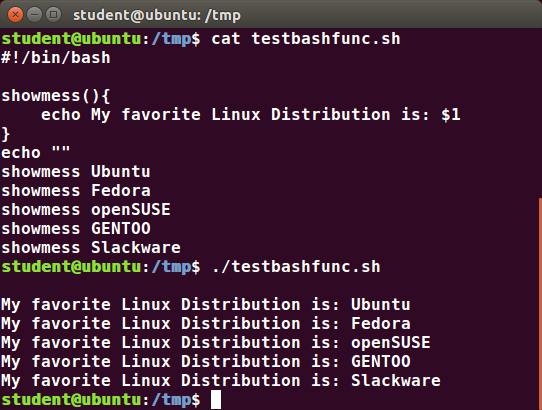
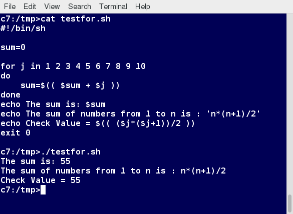

Suposem que voleu cercar un nom de fitxer, comprovar si existeix el
fitxer associat i, a continuació, respondre en conseqüència mostrant un
missatge que confirma o no confirma l’existència del fitxer. Si només
heu de fer-ho una vegada, només podeu escriure una seqüència d’ordres en
un terminal. Tanmateix, si heu de fer-ho diverses vegades,
l’automatització és el camí a seguir. Per automatitzar conjunts d’ordres
haureu d’aprendre a escriure scripts de shell generalment amb
l’intèrpret bash. El gràfic `[fig_1] <#fig_1>`__ mostra diversos dels
avantatges del desplegament de scripts.

.. figure:: figura1.png
   :alt: Avantatges dels scripts [fig_1]
   :width: 80mm

   Avantatges dels scripts [fig_1]

Introducció
===========

Selecció d’intèrpret de comandes
--------------------------------

Les instruccions de l’script es carregaran a l’intèrpret de comandes
escollit. Generalment, els intèrprets de comandes que solen emprar-se
són **/bin/sh, /bin/bash, /bin/tcsh, /bin/csh, /usr/bin/perl,
/usr/bin/python** entre d’altres. Els intèrprets de comandes o shells
disponibles es troben a ``/etc/shells``.

Escriure llargues seqüències a la finestreta del terminal pot ser
complicat i és propens a errors. Desplegar scripts és molt més eficient
per executar llargues seqüències. El fet de que es guardin a un fitxer
fa més senzill modificar-los i compartir-los amb altres usuaris.

La majoria empraran la que ve per defecte, el bash, però alguns usuaris
més avançats prefereixen emprar altres shells o emprar intèrprets més
complexos com Python o Perl.

Scripts de shell
----------------

Una shell és un intèrpret de comandes que proveeix la interfície
d’usuari per les finestres de terminal. També pot emprar-se per executar
scripts, inclòs en sessions no interactives (que no requereixen l’acció
de l’usuari i es fan automàticament), com si l’usuari les executés
directament. Per exemple, escriure ``find . -iname "*.c" -ls`` fa el
mateix que l’script següent:

::

    #!/bin/bash
    find . -iname "*.c" -ls

La primera línia ``#!/bin/bash`` és reconeguda per qualsevol que hagi
desenvolupat scripts en UNIX. Aquesta primera línia, que comença sempre
per ``#!``, conté el camí complet de l’intèrpret de comandes (en aquest
cas **/bin/bash**) que s’emprarà en l’script.

Un primer exemple
-----------------

Crearem un script molt senzill que mostra una missatge d’una línia. Una
manera de fer-ho és:

::

    cat > hello.sh
     #!/bin/bash
     echo "Hello Linux Foundation Student"

i després pitjam **ENTER** o **CTRL+D** per guardar. També podem,
simplement crear el fitxer **hello.sh** amb qualsevol editor de text.

És necessari afegir permisos d’execució a l’script després amb
``chmod +x hello.sh``.

Per executar l’script podem fer-ho executant ``./hello.sh`` o:

::

    $ bash hello.sh
      Hello Linux Foundation Student

NOTA: amb el segon mètode no cal fer l’script executable!

Exemple d’script interactiu
---------------------------

Veiem com es pot crear un exemple interactiu amb un script de bash. Se
li demanarà a l’usuari que introdueixi un valor que es mostrarà a la
pantalla. El valor s’emmagatzema en una variable temporal anomenada
**name**. Podem fer referència al valor d’una variable de shell
utilitzant un $ per davant del nom de la variable, com ara **$name**.
Per crear aquest script, cal crear un fitxer anomenat **getname.sh** amb
el vostre editor favorit amb el contingut següent:

::

   #!/bin/bash
   # Interactive reading of a variable
   echo "ENTER YOUR NAME"
   read name
   # Display variable input
   echo The name given was :$name

Feis-lo executable amb ``chmod +x getname.sh``.

Amb aquest script, quan s’executi, se li demanarà a l’usuari que
introdueixi un valor i pitgi la tecla Enter. El valor introduït es
mostrarà per pantalla.

NOTA: El símbol **#** s’empra per indicar comentaris, exceptuant la
combinació ``#!`` de la primera línia de l’script.

Valors de retorn
----------------

Tots els scripts de shell generen un valor de retorn quan s’han
executat. Aquest valor pot explicitar-se amb la comanda **exit**. Els
valors de retorn permeten monitoritzar l’estat de sortida d’un altre
process, en una relació pare-fill. Saber com ha acabat un procés fill
permet prendre certes decisions en cas de problemes.

El valor de retorn **0** implica èxit. Qualsevol altre valor generalment
implica un error. Per exemple, una manera de comprovar-ho és executant
``ls`` a un fitxer existent i a un no existent. La variable que
emmagatzema el valor de retorn és la **$?**

::

   $ ls /etc/logrotate.conf
   /etc/logrotate.conf

   $ echo $?
   0

Si l’executam a un fitxer que no existeix:

::

   $ ls /etc/idontexist
   ls: no s’ha pogut accedir a '/etc/idontexist': El fitxer o directori no existeix

   $ echo $?
   2

retornarà el valor **2**.

EXEMPLE PRÀCTIC - Crear script bàsic
------------------------------------

Creau un script que faci el següent:

#. Demani a l’usuari introduir un valor

#. Creï un directori amb el valor introduït.

#. Torni a demanar a l’usuari un altre valor

#. Creï un fitxer dins el directori introduït amb el segon valor

#. Posi l’string ``"echo Hello World"`` dins aquest fitxer

#. Faci el fitxer executable

Sintaxi bàsica
==============

Aquesta secció explicarà el llenguatge bàsic. La taula
`[taula_basic_synt] <#taula_basic_synt>`__ llista varis caràcters
especials emprats en scripts de bash. N’hi ha més que s’explicaran més
endavant.

============ ===========================================================================================
**Caràcter** **Descripció**
``#``        Emprat per comentaris, excepte quan s’empra amb la forma ``\#`` o ``!#`` a l’inici
``\``        Emprat al final d’una línia per indicar la continuació a la següent línia
``;``        Emprat per interpretar el que segueix com una comanda nova que serà executada a continuació
``$``        Emprat per referenciar el valor d’una variable d’entorn
``>``        Redirecciona sortida
``>>``       Afegeix sortida
``<``        Redirecciona entrada
``|``        Passa el valor sortint a l’entrada de la comanda següent
============ ===========================================================================================

[taula_basic_synt]

Separar comandes llargues en vàries línies
------------------------------------------

De vegades les comandes són massa llargues per escriure-les fàcilment en
una línia o per comprendre (tot i que no hi ha cap límit pràctic real a
la longitud d’una línia d’ordres).

| En aquest cas, l’operador de concatenació (
| ) s’utilitza per continuar els comandaments llargs sobre diverses
  línies.

A continuació es mostra un exemple d’una ordre que instal·la una llarga
llista de paquets en un sistema que utilitza la gestió de paquets
Debian:

::

   $ sudo apt-get install autoconf automake bison build-essential 
       chrpath curl diffstat emacs flex gcc-multilib g++-multilib \ 
       libsdl1.2-dev libtool lzop make mc patch \ 
       screen socat sudo tar texinfo tofrodos u-boot-tools unzip \ 
       vim wget xterm zip

La comanda es divideix en múltiples línies per fer-lo més llegible i
fàcil d’entendre. L’operador ``\`` al final de cada línia causa la shell
de combinar les múltiples línies i executar-les com una sola comanda.

Múltiples comandes en una sola línia
------------------------------------

De vegades pot ser útil posar vàries comandes en la mateixa línia,
inclús condicionalment executar-los basant-se en el comportament dels
operadors entre ells. Això s’anomena encadenament de comandes.

Hi ha vàries maneres de fer-ho, depenent del que es vulgui realitzar. El
punticoma ``;`` s’empra per separar comandes i executar-les
seqüencialment com si fossin línies separades. Cada comanda s’executa
independentment de si l’anterior acaba en error o no.

Per exemple,

::

    $ make ; make install ; make clean

Per altra banda, si volem que només s’executi la següent comanda quan
l’anterior hagi acabat amb èxit, podem emprar l’ampersand doble
(``&&``):

::

    $ make && make install & make clean

L’opció que ens resta és la d’executar comandes fins que alguna acaba
amb èxit. Llavors, s’acaba l’execució. Això ho podem fer amb els símbols
``||``:

::

    $ cat file1 || cat file2 || cat file3

Redirecció de la sortida i l’entrada
------------------------------------

Com ja hem vist anteriorment, podem redirigir la sortida d’una comanda a
un fitxer amb el símbol ``>``. Si posam dos símbols “major que” (``>>``)
s’afegirà la sortida al final del fitxer sense esborrar-ne el contingut.
Això també pot fer-se en scripts de bash, per exemple per guardar
informació temporal a un fitxer.

L’entrada també pot redirigir-se des d’un fitxer a una comanda amb el
símbol ``<`` o la pipe ``|``.

Comandes integrades en bash
---------------------------

Com hem comentat, els scripts executen seqüencies de comandes. Aquestes
comandes poden ser:

-  Aplicacions compilades

-  Comandes pre-definides de bash

-  Altres scripts o scripts d’altres llenguatges (com perl o Python)

Les aplicacions compilades són fitxers executables binaris que
resideixen generalment en el sistema de fitxers als directoris /usr/bin
o /bin. Els scripts de Shell sempre tenen accés a aplicacions com **rm,
ls, df, vi i gzip**, que són programes compilats a partir de llenguatges
de programació de nivell inferior com ara C. Vegeu-les a la figura
`[fig_2] <#fig_2>`__.

A més, bash té moltes comandes integrades que només es poden utilitzar
per mostrar la sortida dins d’una terminal o script de shell. De
vegades, aquestes ordres tenen el mateix nom que els programes
executables del sistema, com ara **echo**. Això pot provocar alguns
problemes de confusió. Les comandes integrades en bash són, per exemple,
**cd, pwd, echo, read, logout, printf, let i ulimit**. Així, el
comportament de la comanda integrada **echo** pot ser lleugerament
diferent del programa **/bin/echo**.

.. figure:: figura2.png
   :alt: Tipus de comandes [fig_2]
   :width: 100mm

   Tipus de comandes [fig_2]

Podeu trobar una llista completa de les comandes integrades en bash a la
pàgina d’home bash, o simplement escrivint ``help``. Vegeu el resultat
d’executar ``help`` a la figura `[fig_3] <#fig_3>`__

   Comandes integrades en bash [fig_3]

Paràmetres dels scripts
-----------------------

Generalment és necessari poder passar paràmetres als scripts, com ara el
nom d’un fitxer, una data etc. Aquests paràmetres poden ser tant strings
com text:

::

    $ ./script.sh /tmp
    $ ./script.sh 100 200

Dins l’script, el paràmetre o argument es representa amb un símbol de
dòlar **$** seguit d’un número o caràcter especial. La taula
`[taula_numeros_args] <#taula_numeros_args>`__ mostra alguns d’aquests
paràmetres.

============= =======================================
**Paràmetre** **Descripció**
``$0``        Nom de l’script
``$1``        Primer paràmetre passat a l’script
``$2,$3``     Segon paràmetre, tercer, etc.
``$*``        Tots els paràmetres
``$#``        Número de paràmetres passats a l’script
============= =======================================

[taula_numeros_args]

EXERCICI PRÀCTIC - Paràmetres dels scripts
------------------------------------------

Crea un script com el de la figura `[fig_4] <#fig_4>`__, que mostri els
primers tres paràmetres, el nom de l’script, una llista de tots els
paràmetres passats i el número de paràmetres.

.. figure:: figura4.png
   :alt: Exercici - paràmetres dels scripts [fig_4]
   :width: 100mm

   Exercici - paràmetres dels scripts [fig_4]

Substitució de comandes
-----------------------

De vegades és necessari emprar el resultat d’una comanda com a part
d’una altra comanda. Per exemple, suposem que volem consultar tots els
fitxers d’un directori que té per nom el nom de la distribució del
nostre sistema. Per això, haurem d’executar la comanda
``ls /lib/modules/<nom_distribució>/``. Aquest ``<nom_distribució>`` el
podem treure amb la comanda ``uname -a``, i pot completar-se de dues
maneres:

-  Ficant la comanda interna dins ``$( comanda )``

-  Ficant la comanda interna entre *backtics* o :literal:`\``

Per exemple, en aquest cas seria:

::

    
    $ ls /lib/modules/$(uname -r)/
    

Que, després de la substitució, executaria alguna cosa per l’estil de:

::

    
    $ ls /lib/modules/4.18.2/
    

depenent de la sortida de la comanda ``uname -a``.

Es recomana emprar la primera forma ja que la segona està amb desús. Amb
els dos mètodes, la comanda serà executada a un nou entorn de shell i la
sortida estàndard d’aquesta nova shell serà insertada al lloc on es faci
la substitució de la comanda.

Definició de variables d’entorn
-------------------------------

La majoria d’scripts empren variables amb un valor, que poden ser
emprades a qualsevol lloc de l’script. Algunes variables d’entorn ja
venen predefinides com hem parlat en temes anteriors.

Per exemple, per definir una variable farem:

::

    $ MYCOLOR=blue

És important no posar espais abans i després del ``=``.

Podeu consultar totes les variables d’entorn definides amb les comandes
``env``,\ ``set`` o ``printenv``.

Exportació de variables d’entorn
--------------------------------

Com també ja hem comentat anteriorment, les variables definides a un
script només estan disponibles en aquest script i no són visibles a
processos fills. Per tal que estiguin disponibles en processos fills les
haurem d’exportar:

::

    export VAR=valor

o bé

::

    VAR=valor; export VAR

Si els processos fills modifiquen la variable VAR els pares no veuran
aquesta modificació. Les variables es passen per valor i no per
referència.

Definició de funcions
---------------------

Una funció és un bloc de codi que implementa un conjunt d’operacions.
Les funcions són útils per executar procediments vàries vegades. Per
definir una funció, la sintaxi és:

::

   function_name () {
      command...
   }

Per exemple, definim una funció anomenada **display**:

::

    display () {
    
       echo "This is a simple function"
    
    }

L’exemple de la figura `[fig_5] <#fig_5>`__ mostra la definició d’una
funció que escriurà per pantalla un text i, a més, el primer paràmetre
passat a la funció.

   Exemple de funció en bash [fig_5]

EXERCICI PRÀCTIC - Treballant amb fitxers i directoris en un script
-------------------------------------------------------------------

Escriviu un script que:

#. Demana a l’usuari per un directori i llavors el creï amb mkdir

#. Canvia al nou directori i escriu on es troba amb la comanda pwd

#. Emprant touch, crea varis fitxers buits i empra ls sobre ells per
   verificar que estan buits.

#. Escriu contingut a ells emprant echo i redireccions.

#. Mostra el seu contingut amb cat.

#. Escriu per la pantalla “Adéu” a l’usuari i esborra tot el que ha
   creat.

Solució
~~~~~~~

::

   #!/bin/bash

   # Prompts the user for a directory name and then creates it  with mkdir.

   echo "Give a directory name to create:" 
   read NEW_DIR

   # Save original directory so we can return to it (could also just use pushd, popd)

   ORIG_DIR=$(pwd)

   # check to make sure it doesn't already exist!

   [[ -d $NEW_DIR ]] && echo $NEW_DIR already exists, aborting && exit 
   mkdir $NEW_DIR

   # Changes to the new directory and prints out where it is using pwd.  

   cd $NEW_DIR
   pwd

   # Using touch, creates several empty files and runs ls on them to verify they are empty.

   for n in 1 2 3 4
   do 
       touch file$n 
   done

   ls file?

   # (Could have just done touch file1 file2 file3 file4, just want to show do loop!)

   # Puts some content in them using echo and redirection.

   for names in file?  
   do 
       echo This file is named $names > $names
   done

   # Displays their content using cat

   cat file?

   # Says goodbye to the user and cleans up after itself 

   cd $ORIG_DIR 
   rm -rf $NEW_DIR 
   echo "Goodbye My Friend!"

EXERCICI PRÀCTIC - Arguments en scripts
---------------------------------------

Escriviu un script que agafa un sol argument i l’escriu per pantalla. Si
l’usuari no introdueix cap argument, l’script ha de mostrar un missatge
sobre com emprar l’script.

.. _solució-1:

Solució
~~~~~~~

::

   #!/bin/bash
   #
   # check for an argument, print a usage message if not supplied.
   #
   if [ $# -eq 0 ] ; then
         echo "Usage: $0 argument"
         exit 1
   fi
   echo $1
   exit 0

EXERCICI PRÀCTIC - Variables d’entorn en scripts
------------------------------------------------

Escriviu un script que:

#. Demani a l’usuari que introdueixi un número que ha de ser 1 o 2.
   Qualsevol altre entrada ha de ser considerada error i ha d’acabar
   l’script.

#. Defineix una variable d’entorn que serà “Yes” si el valor és 1 o “No”
   si el valor és 2.

#. Exporta la variable d’entorn i la mostra per pantalla.

.. _solució-2:

Solució
~~~~~~~

::

   #!/bin/bash

   echo "Enter 1 or 2, to set the environmental variable EVAR to Yes or No"
   read ans

   # Set up a return code
   RC=0

   if [ $ans -eq 1 ]  
   then 
       export EVAR="Yes"
   else
       if [ $ans -eq 2 ]
       then
       export EVAR="No"
       else
   # can only reach here with a bad answer
       export EVAR="Unknown"
       RC=1
       fi    
   fi
   echo "The value of EVAR is: $EVAR"
   exit $RC

EXERCICI PRÀCTIC - Treballant amb funcions
------------------------------------------

Escriviu un script que:

#. Demani a l’usuari pel número 1,2 o 3.

#. Cridi a una funció amb el número al nom. La funció ha de mostrar un
   missatge amb el nom inclòs.

.. _solució-3:

Solució
~~~~~~~

::

   #!/bin/bash

   # Functions (must be defined before use)
   func1() {
   echo " This message is from function 1"
   }
   func2() {
   echo " This message is from function 2" 
   }
   func3() { 
   echo " This message is from function 3" 
   }

   # Beginning of the main script

   # prompt the user to get their choice
   echo "Enter a number from 1 to 3"
   read n

   # Call the chosen function
   func$n
    

Estructures de control
======================

Com tot llenguatge de programació, bash incorpora vàries estructures de
control del flux del programa.

Condicionals
------------

Bash empra la declaració **if** per al condicional com qualsevol altre
llenguatge. La sintaxi per fer una construcció d’aquest estil és:

::

    if TEST-COMMANDS; then CONSEQUENT-COMMANDS; fi

També pot escriure’s de la forma següent:

::

   if TEST-COMMANDS
   then 
     CONSEQUENT-COMMANDS
   else
     CONSEQUENT-COMMANDS
   fi

En l’exemple següent, una declaració **if** comprova si un fitxer
existeix. Si existeix, mostra un missatge d’èxit o d’error.

::

   if [ -f "$1"]
   then
      echo file "$1 exists"
   else
      echo file "$1 does not exist"
   fi

En realitat, també hauríem de comprovar si l’argument ``$1`` existeix o
no i, si no existeix, abortar.

Fixau-vos amb els claudàtors ``[]`` per delinear la condició. Es poden
emprar molts altres tipus de tests. De vegades, en els scripts també
s’empren dobles claudàtors ``[[ -f /etc/passwd ]]`` per evitar alguns
errors subtils com referències a variables buides.

Així mateix, podem emprar **elif** dins l’estructura condicional:

::

   if [ sometest ]
   then 
     CONSEQUENT-COMMANDS
   elif [ someothertest ] 
   then
     CONSEQUENT-COMMANDS
   fi

Condicions amb fitxers
----------------------

Bash proveeix un conjunt de condicionals o tests relacionats amb
fitxers, que podeu veure a la taula
`[taula_condfitx] <#taula_condfitx>`__. Aquests condicionals tenen que
veure amb existència de fitxers o directoris i amb permisos. Un exemple
de condicional o test seria:

::

   if [ -x /etc/passwd ] ; then
       ACTION
   fi

Notau que moltes vegades se sol posar el ``; then`` a la mateixa línia.

Aquest script comprova si el fitxer /etc/passwd és executable.

Podeu consultar tots els condicionals o tests amb la comanda
``man 1 test``.

============= ==========================================================================================
**Condició**  **Descripció**
``-e fitxer`` Comprova si el fitxer existeix
``-d fitxer`` Comprova si el fitxer és un directori
``-f fitxer`` Comprova si el fitxer és un fitxer regular (no és un enllaç ni un dispositiu ni directori)
``-s fitxer`` Comprova si el fitxer no està buit
``-g fitxer`` Comprova si el fitxer té el bit **set gid** activat
``-u fitxer`` Comprova si el fitxer té el bit **set uid** activat
``-r fitxer`` Comprova si el fitxer té permisos de lectura
``-w fitxer`` Comprova si el fitxer té permisos d’escriptura
``-x fitxer`` Comprova si el fitxer té permisos d’execució
============= ==========================================================================================

[taula_condfitx]

Expressions booleanes
---------------------

Les expressions booleanes poden ser certes o falses i els resultats
s’obtenen amb els operadors clàssic (AND, OR, NOT) que podeu veure a la
taula `[taula_op_bool] <#taula_op_bool>`__.

| p2cm p2cm p7.5cm **Operador** & **Operació** & **Descripció**
| ``&&`` & AND & L’acció es farà si les dues condicions són certes
| ``||`` & OR & L’acció es farà alguna de les dues condicions són certes
| ``!`` & NOT & L’acció es farà si la condició es falsa.

[taula_op_bool]

Com podeu imaginar, les operacions booleanes poden agrupar-se per formar
operacions més complexes. Cal tenir en compte que el processament acaba
tan aviat com la condició es compleix. És a dir, si tenim la sentència
``A && B && C`` i A és cert però B és fals, C mai s’avaluarà. El mateix
passarà amb l’operador OR.

Comparació d’strings
--------------------

Podem emprar **if** per comparar strings amb l’operador ``==`` (dos
signes d’igual). La sintaxi és:

::

    if [ string1 == string2 ] ; then
       ACTION
    fi

Un sol signe ``=`` funcionarà, però és obsolet i gens recomanable. Vegeu
alguns exemples a la figura `[fig_6] <#fig_6>`__

.. figure:: figura6.png
   :alt: Exemples de comparació d’strings [fig_6]
   :width: 120mm

   Exemples de comparació d’strings [fig_6]

Tests númerics
--------------

Amb el cas dels números hem d’emprar els operadors de la taula
`[taula_op_num] <#taula_op_num>`__. Un exemple seria:

::

    if [ 34 -gt $1 ]; then
       echo "34 és més gran que $1"
    fi

============ ===============================================
**Operador** **Descripció**
``-eq``      Igual a (*equal*)
``-ne``      Diferent de (*not equal*)
``-gt``      Més gran que (*greather than*)
``-lt``      Més petit que (*less than*)
``-ge``      Més gran o igual que (*greather than or equal*)
``-le``      Més petit o igual que (*less than or equal*)
============ ===============================================

[taula_op_num]

A la figura `[fig_7] <#fig_7>`__ teniu un exemple d’script que agafa per
paràmetre l’edat de l’usuari i mostra un missatge en funció de l’edat en
que es troba.

.. figure:: figura7.png
   :alt: Exemples de comparació de números [fig_7]
   :width: 120mm

   Exemples de comparació de números [fig_7]

Expressions aritmètiques
------------------------

Les expressions aritmètiques poden avaluar-se de tres maneres:

#. Emprant l’eina **expr**. Aquest programa és estàndard però una mica
   obsolet. La sintaxi funcionaria de la forma:

   ::

         echo $(expr 8+8)

#. Emprant la sintaxi ``$((...))``. És la forma més estàndard i
   implementada en bash per defecte. La sintaxi seria:

   ::

         echo $((x+1))

   on x és el nom d’una variable amb un número

#. També pot emprar-se **let**:

   ::

         let x=( 1 + 2 ); echo $x

EXERCICI PRÀCTIC - Aritmètica i funcions 
-----------------------------------------

Escriviu un script que faci de calculadora. L’script ha de poder sumar,
restar, multiplicar i dividir.

-  Cada operació ha de tenir la seva pròpia funció

-  Podeu emprar qualsevol dels mètodes especificats

-  L’usuari ha de passar tres arguments: el primer han de ser les
   lletres a (add), s(sub), m(mult), d(div) per especificar l’operació.
   El segon i el tercer arguments seran els números a operar.

-  L’script ha de detectar valors d’input erronis.

Solució:

::

    #!/bin/bash

   # Functions.  must be before the main part of the script

   # in each case method 1 uses $((..))
   #              method 2 uses let
   #              method 3 uses expr

   add() {
       answer1=$(($1 + $2))
       let answer2=($1 + $2)
       answer3=`expr $1 + $2`
   }
   sub() {
       answer1=$(($1 - $2))
       let answer2=($1 - $2)
       answer3=`expr $1 - $2`
   }
   mult() {
       answer1=$(($1 * $2))
       let answer2=($1 * $2)
       answer3=`expr $1 \* $2`
   }
   div() {
       answer1=$(($1 / $2))
       let answer2=($1 / $2)
       answer3=`expr $1 / $2`
   }
   # End of functions
   #

   # Main part of the script

   # need 3 arguments, and parse to make sure they are valid types

   op=$1 ; arg1=$2 ; arg2=$3

   [[ $# -lt 3 ]] && \
       echo "Usage: Provide an operation (a,s,m,d) and two numbers" && exit 1

   [[ $op != a ]] && [[ $op != s ]] && [[ $op != d ]] && [[ $op != m ]] && \
       echo operator must be a, s, m, or d, not $op as supplied

   # ok, do the work!

   if [[ $op == a ]] ; then add $arg1 $arg2
   elif [[ $op == s ]] ; then sub $arg1 $arg2
   elif [[ $op == m ]] ; then mult $arg1 $arg2
   elif [[ $op == d ]] ; then div $arg1 $arg2
   else
   echo $op is not a, s, m, or d, aborting ; exit 2 
   fi

   # Show the answers
   echo $arg1 $op $arg2 :
   echo 'Method 1, $((..)),' Answer is  $answer1
   echo 'Method 2, let,    ' Answer is  $answer2
   echo 'Method 3, expr,   ' Answer is  $answer3

Case
----

La sentència **case** s’empra en escenari on el valor d’una variable pot
canviar l’execució del programa. Generalment s’empren per gestionar les
opcions o arguments introduïts per línia de comandes. Els avantatges
d’emprar case són:

#. Més fàcils de llegir i escriure

#. Bona alternativa als blocs **fi-then-else-fi**

#. Permet comparar el valor d’una variable contra varis valors a la
   vegada

#. Redueix la compleixtat del programa

La sintaxi de **case** és:

::

    case expression in
      pattern1) execute commands;;
      pattern2) execute commands;;
      pattern3) execute commands;;
      pattern4) execute commands;;
      * )       execute some default commands or nothing ;;
   esac

   Exemple d’ús de **case** [fig_8]

EXERCICI PRÀCTIC - Ús de case
~~~~~~~~~~~~~~~~~~~~~~~~~~~~~

Escriviu un script que agafa com a argument un mes en la seva forma
númerica (entre 1 i 12), el tradueix en el nom del mes i el mostra per
pantalla. Si no s’introdueix argument, l’script reporta un error i surt.

::

    #!/bin/bash

   # Accept a number between 1 and 12 as
   # an argument to this script, then return the
   # the name of the month that corresponds to that number.

   # Check to see if the user passed a parameter.
   if [ $# -eq 0 ]
   then
     echo "Error. Give as an argument a number between 1 and 12."
     exit 1
   fi

   # set month equal to argument passed for use in the script
   month=$1

   ################################################
   # The example of a case statement:

   case $month in

     1)  echo "January"   ;;
     2)  echo "February"  ;;
     3)  echo "March"     ;;
     4)  echo "April"     ;;
     5)  echo "May"       ;;
     6)  echo "June"      ;;
     7)  echo "July"      ;;
     8)  echo "August"    ;;
     9)  echo "September" ;;
     10) echo "October"   ;;
     11) echo "November"  ;;
     12) echo "December"  ;;
     *)
        echo "Error. No month matches: $month"
        echo "Please pass a number between 1 and 12."
        exit 2
        ;;
   esac
   exit 0

Bucles
------

Emprant bucles, podeu executar una o més línies de codi repetitivament,
generalment en una selecció de valors com fitxers individuals.

S’empren tres tipus de bucles:

-  **for**

-  **while**

-  **until**

For
~~~

El bucle **for** opera sobre cada element d’una llista d’ítems. La
sintaxi és:

::

   for variable-name in list
   do
       execute one iteration for each item in the list until the list is finished
   done

   Exemple d’ús de bucle for [fig_9]

Per no haver d’escriure tots els números, podem emprar la comanda
**seq** per especificar un rang numèric:

::

    for i in $(seq 1 10); do 
      echo $i; 
    done

Per iterar entre tots els fitxers d’un directori (p. ex ``/opt``), un
mètode és:

::

    for f in /opt/*; do 
      echo $f; 
    done

While
~~~~~

El bucle **while** repeteix un conjunt d’instruccions sempre i quan la
condició sigui certa. La sintaxi és:

::

   while condition is true
   do
       Commands for execution
       ----
   done

Podeu emprar qualsevol comanda o operador com a condició. Normalment la
condició es posa entre ``[]``

La figura `[fig_10] <#fig_10>`__ mostra un exemple d’ús de **while** que
calcula el factorial d’un número. Sabríeu dir perquè la computació de
:math:`21!` dóna un resultat erroni?

   Exemple d’ús de bucle while [fig_10]

Until
~~~~~

El bucle **until** repeteix un conjunt d’instruccions mentre la condició
sigui falsa. És l’oposat al **while**. La sintaxi és:

::

   until condition is false
   do
       Commands for execution
       ----
   done

La figura `[fig_11] <#fig_11>`__ fa el mateix que el bucle **while**
però amb **until**.

   Exemple d’ús de bucle until [fig_11]

Manipulació d’strings
=====================

Una variable string conté una seqüència de caràcters. Lletres números,
símbols i signes de puntuació. Per exemple,
``abcde, 123, abcde 123, abcde-123, &acbde=%123``.

Els operadors d’string inclouen aquells que fan comparacions,
ordenacions i mirar-ne la longitud. La taula
`[taula_op_string] <#taula_op_string>`__ mostra l’ús de varis operadors
d’string.

============================ ===============================================================
**Operador**                 **Descripció**
``[[ string1 > string2 ]]``  Compara si un string és més llarg que l’altre
``[[ string1 == string2 ]]`` Compara si un string és igual que l’altre caràcter per caràcter
``myLen1=${#string1}``       Guarda la longitud d’un string a la variable **myLen1**.
============================ ===============================================================

[taula_op_string]

Es poden especificar parts d’un string de vàries maneres. Per exemple,
per extreure els primers n caràcters d’un string podem especificar
``${string:0:n}``. El 0 indica on es començarà a contar i n és el número
de caràcters a extreure. També poden extreure’s els caràcters després
d’un punt o d’un caràcter arbitrari amb l’expressió ``{${string#*.}``.
Per exemple:

::

    NAME=Eddie.Haskel
    first=${NAME:0:5}; echo first name = $first
    first name = Eddie
    last=${NAME#*.}; echo last name = $last
    last name = Haskel

EXERCICI PRÀCTIC - Manipulació d’strings
----------------------------------------

Escriviu un script que llegeixi dos strings com arguments i:

#. Comprovi si el primer és de longitud 0 i si el segon és de longitud
   diferent de zero, mostrant a l’usuari els dos resultats.

#. Determini la longitud de cada string i mostri quin és més gran o
   indiqui que els dos són d’igual longitud.

#. Compari els dos strings per veure si són el mateix i mostri el
   resultat.

La solució és:

::

   #!/bin/bash

   # check two string arguments were given
   [[ $# -lt 2 ]] && \
       echo "Usage: Give two strings as arguments" && exit 1

   str1=$1
   str2=$2

   #------------------------------------
   ## test command

   echo "Is string 1 zero length? Value of 1 means FALSE"
   [ -z "$str1" ]
   echo $?
   # note if $str1 is empty, the test [ -z $str1 ] would fail
   #                              but [[ -z $str1 ]] succeeds
   #         i.e., with [[ ]] it works even without the quotes

   echo "Is string 2 nonzero length? Value of 0 means TRUE;"
   [ -n $str2 ]
   echo $?

   ## comparing the lengths of two string

   len1=${#str1}
   len2=${#str2}
   echo length of string1 = $len1, length of string2 = $len2

   if [ $len1 -gt $len2 ]
   then
       echo "String 1 is longer than string 2"
   else
       if [ $len2 -gt $len1 ]
       then
       echo "String 2 is longer than string 1"
       else
       echo "String 1 is the same length as string 2"
       fi
   fi

   ## compare the two strings to see if they are the same

   if [[ $str1 == $str2 ]]
   then
       echo "String 1 is the same as string 2"
   else
       if [[ $str1 != $str2 ]]
       then
       echo "String 1 is not the same as string 2"
       fi
   fi

Debugging
=========

Sovint treballant amb scripts i comandes cometrem errors. Poden ser
errors de sintaxi, fitxers no existents, permisos insuficients etc.
Cadascun d’aquests errors es reporten amb un codi d’error, però de
vegades la informació que ens dóna el sistema és insuficient i confusa.
D’això tracta aquesta secció: de diagnosticar i resoldre aquests tipus
d’errors, que és una de les tasques més importants que realitza un
administrador de sistemes.

Executar script en mode debug
-----------------------------

Abans d’arreglar un error o bug és vital saber el seu origen.

Podeu executar un script en mode debug escrivint ``bash -x ./script.sh``
o, dins l’script, posant les comandes a debuggejar entre les
instruccions ``set -x`` i ``set +x``.

El mode debug ajuda a identificar els errors perquè:

-  Fa seguiment de totes les comandes executades i les mostra amb el
   caràcter ``+``

-  Mostra cada comanda abans d’executar-la

-  Permet només debuggejar certes parts de l’script.

La figura `[fig_12] <#fig_12>`__ mostra l’execució d’un script en mode
debug.

   Exemple d’execucio d’un script en mode debug. [fig_12]

Redirecció d’errors a un fitxer i a la pantalla
-----------------------------------------------

Com ja sabeu, en linux podem redireccionar les sortides estàndard i
d’error a un o a varis fitxers separats per fer-ne un anàlisi posterior.
La figura `[fig_13] <#fig_13>`__ mostra l’execució d’un script amb un
bug simple. La sortida d’error és bolcada al fitxer **error.log**. Amb
**cat** o **less** podem visualitzar aquest fitxer. Sabeu com arreglar
l’script?

   Exemple de redirecció de sortida d’error en un script. [fig_13]

Utilitats addicionals
=====================

En aquesta secció mostrarem algunes utilitats que vos poden ser útils a
l’hora de preparar els vostres scripts.

Crear fitxers i directoris temporals
------------------------------------

Considerau una situació on vulgueu extreure 100 entrades d’un fitxer amb
10000 entrades. Necessitareu un fitxer auxiliar o temporal on guardar
aquesta informació per fer un processament posterior.

Els fitxers i directoris temporals són emprats per guardar dades durant
un curt període. Normalment, aquests fitxers són esborrats quan l’script
que els empra acaba. Per evitar possibles problemes de seguretat és una
bona pràctica crear fitxers amb noms aleatoris i impredictibles. Podem
emprar la utilitat **mktemp** per aquest propòsit.

**mktemp** crea el fitxer amb el nom que se li passa per paràmetre. Al
paràmetre se li especifiquen vàries ``X`` per tal d’indicar quants
caràcters aleatoris tendrà el nom. Per exemple:

::

    TEMP=$(mktemp /tmp/tempfile.XXXXXXXX) 
    echo $TEMP

crearà un fitxer temporal que pot tenir de nom, per exemple,
``/tmp/tempfile.PVIBW30K``. Es posa la sortida de la comanda ``mktemp``
dins una variable d’entorn per saber el nom exacte d’aquest fitxer.

Amb l’opció ``-d`` es poden crear també directoris:

::

    TEMPDIR=$(mktemp -d /tmp/tempdir.XXXXXXXX) 

Descartar sortida amb /dev/null
-------------------------------

Algunes comandes com **find** produeixen un gran número de línies de
sortida que poden molestar-nos en la visualització de la terminal. Podem
redirigir la sortida que no ens interessa a un fitxer especial anomenat
``/dev/null``. Aquest pseudo-fitxer s’anomena *bit bucket* o forat
negre.

Totes les dades escrites a aquest fitxer són descartades i mai retorna
un error de sortida. Redirigint la sortida de certes comandes en aquest
fitxer, poden fer desaparèixer-ne la sortida. Per exemple:

::

    ls -lR /tmp > /dev/null

En la comanda de dalt, la sortida és ignorada, però es mostren els
errors. Si per contra feim:

::

    ls -lR /tmp >& /dev/null

tant stdout com stderr seran descartades.

EXERCICI PRÀCTIC - Descartar sortida amb /dev/null
~~~~~~~~~~~~~~~~~~~~~~~~~~~~~~~~~~~~~~~~~~~~~~~~~~

Provau d’executar el programa **find** per trobar tots els fitxers dins
del vostre sistema de fitxers (això és, començant per l’arrel ``/``)que
contenen, al seu nom, la paraula *gnutls*. A la vegada, procurau que en
la sortida no vos surtin missatges d’errors per tal de que sigui
legible.

NOTA: En la comanda find potser heu d’incloure l’string gnutls entre
asteriscs ``*`` per tal de que vos cerqui per expressió regular
(``*gnutls*``)

Solució:

::

    find / -iname gnutls 2> /dev/null

Números aleatoris
-----------------

Ens interessarà en molts casos generar números aleatoris i dades
aleatòries quan facem tasques per l’estil de:

-  Tasques relacionades amb seguretat

-  Reinicialitzar dispositius d’emmagatzematge

-  Esborrar o ocultar dades existents

-  Generar dades sense significat per realitzar proves

Aquests números aleatoris poden generar-se amb la variable d’entorn
``$RANDOM``. Aquesta variable es deriva del generador de números
aleatoris del kernel de Linux o bé també de la llibreria OpenSSL.

EXERCICI PRÀCTIC - Números aleatoris
~~~~~~~~~~~~~~~~~~~~~~~~~~~~~~~~~~~~

Generau un senzill script que creï cinc directoris que tenguin per nom
un número aleatori.

Generació de números aleatoris
------------------------------

Alguns servidors tenen generadors de números aleatoris que prenen com a
entrada diferents tipus de senyals, com ara el soroll tèrmic i l’efecte
fotoelèctric. Un transductor converteix aquest soroll en un senyal
elèctric, que es converteix de nou en un número digital mitjançant un
conversor analògic-digital. Aquest nombre, per tant, es considera
aleatori. Tot i això, la majoria d’ordinadors habituals no contenen
aquest maquinari especialitzat i, en canvi, depenen d’esdeveniments
creats durant l’arrencada per crear la “llavor” necessària.

Independentment de quina d’aquestes dues fonts s’utilitzi, el sistema
manté un conjunt anomenat entropia d’aquests números digitals / bits
aleatoris. A partir d’aquest conjunt d’entropies es creen números
aleatoris.

El kernel de Linux proveeix els fitxers de dispositiu (*device nodes*)
``/dev/random`` i ``/dev/urandom``, que empren l’entropia del sistema
per proveir números aleatoris.

-  ``/dev/random`` proporciona un grau de aleatorietat molt alt, però és
   més lent. De fet, si el conjunt d’entropia (*entropy pool*) del
   sistema està buida, aquest node es bloqueja fins que el sistema té
   més soroll ambiental per generar-ne més.

-  ``/dev/urandom`` proporciona un menor valor d’aleatorietat, però és
   més ràpid i és suficient per la majoria d’aplicacions. Encara que el
   conjunt d’entropia estigui buit, aquest node el reutilitzarà.

.. _exercici-pràctic---números-aleatoris-1:

EXERCICI PRÀCTIC - Números aleatoris
~~~~~~~~~~~~~~~~~~~~~~~~~~~~~~~~~~~~

Escriviu un script que:

#. Agafa una paraula com a argument

#. Hi afegeix un número aleatori

#. Mostra el resultat en pantalla

Solució:

::

    #!/bin/bash
   ##
   # check to see if the user supplied in the parameter.

   [[ $# -eq 0 ]] && echo "Usage: $0 word" && exit 1

   echo "$1-$RANDOM"
   exit 0

Alguns exemples d’scripts
=========================

Aplica una configuració remota
------------------------------

Script que es connecta a un router i hi aplica una configuració

::

    
   #!/bin/bash

   # Sensible default values
   DEFAULT_ROUTEROS_SSH_PORT="10022"
   DEFAULT_ROUTEROS_USER="ansible"
   DEFAULT_SSHKEY_PATH="~/.ssh/id_rsa"

   set -e # Exit on first error

   function help() {
       cat << EOF
   Usage: mktapply -i IP [-p port] [-c] [-k identity_file]
   Execute script passed by stdin to RouterOS device in IP
   All the arguments are mandatory.
       -i, --ip        IP to be given to the user
       -p, --port      SSH Port of the device. Default is 10022.
       -c, --clean     If set, the device will be reset \
       to its defaults and then the script will be applied.
       -k, --keys      PATH of the public and private \
       key used to login into the device. Default is ~/.ssh/id_rsa
       -u, --user      Username to log on the device. Default is ansible.
   Example:
   cat script.rsc | mktapply -i 10.91.9.254
   EOF
   }
   # now enjoy the options in order and nicely split until we see --
   while [ $# -ge 1 ]
   do
       case "$1" in
           -h|--help)
               help
               exit 0
               ;;
           -i|--ip)
               ip="$2"
               shift 2
               ;;
           -p|--port)
               port="$2"
               shift 2
               ;;
           -c|--clean)
               cl="true"
               shift 1
               ;;
           -k|--keys)
               idfile=$2
               shift 2
               ;;
           -u|--user)
               user=$2
               shift 2
               ;;
           *)
               help
               echo -e "\n\nUnkown argument."
               exit 1
               ;;
       esac
   done
   if [ -z "$ip" ]
   then
       help
       echo -e "\n\nMissing arguments."
       exit 1
   fi

   if [ -z "$port" ]
   then
       port=$DEFAULT_ROUTEROS_SSH_PORT
   fi

   if [ -z "$idfile" ]
   then
       idfile=$DEFAULT_SSHKEY_PATH
   fi

   if [ -z "$user" ]
   then
       user=$DEFAULT_ROUTEROS_USER
   fi

   # Generam fitxer temporal on guardar l'script
   seedn=$(cat /dev/urandom | tr -dc 'a-z0-9' | fold -w ${1:-8} | head -n 1)
   # Llegim script d'stdin
   while read line
   do
       echo "$line" >> /tmp/mktrsc-"$seedn".rsc
   done < "${1:-/dev/stdin}"

   # Copiam l'script al router
   scp -i $idfile -P $port /tmp/mktrsc-$seedn.rsc $user@$ip:mktrsc-$seedn.rsc

   if [ -z "$cl" ]
   then
   # Si cl no està habilitat
       # Executam script
       ssh -i $idfile -p $port $user@$ip "/import verbose=yes mktrsc-$seedn.rsc"
   else
       echo 
       echo "!!! CAUTION !!!"
       echo "FLAG -c IS GOING TO ERASE ALL CONFIGURATION ON DEVICE $ip.\
       YOU HAVE 5 SECONDS TO ROLLBACK BEFORE IT GETS APPLIED."
       echo 
       sleep 5
       echo "ssh -i $idfile -p $port $user@$ip \"/system reset-configuration \
       no-defaults=yes run-after-reset=mktrsc-$seedn.rsc\";"
       ssh -i $idfile -p $port $user@$ip "/system reset-configuration no-defaults=yes \
       run-after-reset=mktrsc-$seedn.rsc";
   fi

   rm /tmp/mktrsc-$seedn.rsc

Esborra fitxers no modificats
-----------------------------

Script que esborra els fitxers no modificats durant n dies d’un
directori

::

   #!/bin/bash
   # Esborra el contingut anterior a N dies i no usat de /data/scratch

   fInf=/tmp/InformeEsborratScratch`date +%Y-%m-%d`.txt
   if [[ $1 =~ ^[0-9]+$ ]]; then   
       
       find /data/scratch/ -type f -ctime +$1 -fprint $fInf
       echo "Esborrant scratch..."
       find /data/scratch/ -type f -ctime +$1 -exec rm -rf {} \;
       find /data/scratch/ -mindepth 1 -type d -empty -delete
       echo "Fet."
   else
       echo "Ús: ./rmscratch N."
       echo "N: Número enter. S'esborraran els fitxers i directoris \
       buits de /data/scratch no emprats anteriors a N dies"
   fi
    
    

Monitorització espai en disc
----------------------------

::

   #!/bin/bash
   # 
   # monit_quota.sh [-d PATH] [-l LIMIT] [-m MAIL_LIST]
   # Script que monitoritza l'ús en disc del 
   # directori passat per paràmetre.
   # Envia un e-mail a les direccions indicades 
   # separades per coma quan sobrepassa el límit.
   #
   # DESCRIPCIÓ
   #        -d|--dest PATH
   #           Directori a monitoritzar
   #
   #        -l|--limit LIMIT
   #           Limit d'espai al que botarà l'email           
   #
   #        -m|--emails
   #           Llista de e-mails als que enviar una alarma quan sobrepassi el límit

   set -e # Exit on first error

   myconvert(){
     sed '
         s/\([0-9][0-9]*\(\.[0-9]\+\)\?\)K/\1*1/g;
         s/\([0-9][0-9]*\(\.[0-9]\+\)\?\)M/\1*1000/g;
         s/\([0-9][0-9]*\(\.[0-9]\+\)\?\)G/\1*1000000/g;
         s/\([0-9][0-9]*\(\.[0-9]\+\)\?\)T/\1*1000000000/g;
         s/\([0-9][0-9]*\(\.[0-9]\+\)\?\)P/\1*1000000000000/g;
         s/\([0-9][0-9]*\(\.[0-9]\+\)\?\)E/\1*1000000000000000/g
     ' </dev/stdin | bc | sed 's/\..*$//' # Final sed to remove decimal point
   }

   function help() {
      cat << EOF
   monit_quota.sh [-h] [-d PATH] [-l LIMIT] [-m MAIL_LIST]
   Script que monitoritza l'ús en disc del \
   directori passat per paràmetre.
   Envia un e-mail a les direccions indicades \
   separades per coma quan sobrepassa el límit.

   DESCRIPCIÓ
           -d|--dir PATH
              Directori a monitoritzar

           -l|--limit LIMIT
              Limit d'espai al que botarà l'email           

           -m|--emails
              Llista de e-mails als que enviar una alarma quan sobrepassi el límit

   EOF
   }

   while [ $# -ge 1 ]
   do
       case "$1" in
           -h|--help)
               help
               exit 0
               ;;
           -d|--dir)
               dir="$2"
               shift 2
               ;;
           -l|--limit)
               limit="$2"
               shift 2
               ;;
           -m|--emails)
               str_emails=$2
               shift 2
               ;;
           *)
               help
               echo -e "\n\nUnkown argument."
               exit 1
               ;;
       esac
   done
   if [ -z "$dir" ] || [ -z "$limit" ] || [ -z "$str_emails" ]
   then
       help
       echo -e "\n\nMissing arguments."
       exit 1
   fi

   echo DIR: $dir   
   echo EMAILS: $str_emails

   limit_kb=$(echo $limit|myconvert)

   disk_usage=$(du -sh $dir | cut -d'  ' -f1)
   disk_usage_kb=$(echo $disk_usage | myconvert)

   echo "disk_usage: $disk_usage"
   echo "disk_usage_kb: $disk_usage_kb"

   echo "limit: $limit"
   echo "limit_kb: $limit_kb"

   str_disk_usage="$disk_usage""B"
   str_limit="$limit""B"
   if [ $disk_usage_kb -gt $limit_kb ]
   then

      mail -s "[FONER] Quota d'espai de directori excedida" \
      -r disk-monitor@foner.sint.uib.es $str_emails << EOF
   Benvolgut/benvolguda,
       
   El directori $dir registra una ocupació de $str_disk_usage. \
   Per favor, alliberau espai fins arribar a $str_limit el més aviat possible.

   Atentament,
   Administració del clúster Foner
   EOF
      emails=$(echo $str_emails | tr "," "\n")

      for addr in $emails
      do
         echo "> [$addr]"
      done
   fi
