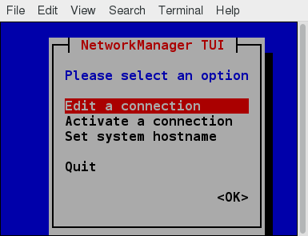

Introducció
===========

Una xarxa és un grup d’ordinadors i dispositius informàtics connectats
entre si a través de canals de comunicació, com ara cables o suports
sense fil. Els ordinadors connectats a una xarxa poden estar ubicats a
la mateixa zona geogràfica o distribuir-se arreu del món.

Una xarxa serveix per:

-  Permetre que els dispositius connectats es comuniquin entre ells

-  Habilitar diversos usuaris per compartir dispositius a la xarxa, com
   ara impressores i escàners

-  Compartir i gestionar la informació a través d’ordinadors fàcilment.

La majoria d’organitzacions tenen una xarxa interna i una connexió a
Internet perquè els usuaris es puguin comunicar amb màquines i persones
alienes a l’organització. Internet és la xarxa més gran del món i es pot
anomenar “la xarxa de xarxes”.

Adreces de xarxa i DNS
======================

Adreces IP
----------

Els dispositius connectats a una xarxa han de tenir almenys un
identificador d’adreça de xarxa únic conegut com a adreça IP (*Internet
Protocol*). La figura `[fig_1] <#fig_1>`__ mostra un esquema de dos
dispositius amb una adreça IP cadascun. L’adreça és essencial per
encaminar paquets d’informació a través de la xarxa.

L’intercanvi d’informació a la xarxa requereix utilitzar fluxos de
paquets petits, cadascun dels quals conté una informació que va d’una
màquina a una altra. Aquests paquets contenen *buffers* de memòria
intermèdia juntament amb capçaleres que contenen informació sobre on va
i d’on ve del paquet, i on s’adapta a la seqüència de paquets que
constitueixen el flux. Els protocols i programes de xarxa són més aviat
complicats degut a la diversitat de màquines i sistemes operatius que
han de tractar, així com al fet que s’han de suportar estàndards molt
antics.

.. figure:: figura1.png
   :alt: Adreces IP. [fig_1]
   :width: 100mm

   Adreces IP. [fig_1]

IPv4 i IPv6
-----------

Hi ha dos tipus diferents d’adreces IP disponibles: IPv4 (versió 4) i
IPv6 (versió 6). L’IPv4 és més antic i és molt més utilitzat, mentre que
l’IPv6 és més recent i està dissenyat per superar les limitacions
inherents a l’estàndard més antic i proporcionar moltes més adreces
possibles.

IPv4 utilitza 32 bits per a adreces; Només hi ha disponibles 4.300
milions d’adreces úniques. A més, s’administren i es reserven moltes
adreces, però no s’utilitzen realment. IPv4 es considera que no és
adequat per satisfer les necessitats futures, perquè el nombre de
dispositius disponibles a la xarxa global ha augmentat enormement en els
darrers anys.

IPv6 utilitza 128 bits per a adreces; això permet adreces úniques de
:math:`3.4\cdot10^{38}`. Si teniu una xarxa d’ordinadors més gran i
voleu afegir-ne més, potser vos interessarà passar a IPv6, ja que
proporciona adreces més úniques. Tot i això, pot ser complex migrar a
IPv6; els dos protocols no sempre funcionen bé. Per tant, el trasllat
d’equips i adreces a IPv6 requereix un esforç important i no ha estat
tan ràpid com es tenia previst inicialment.

Una de les raons per les quals l’IPv4 no ha desaparegut és que hi ha
maneres de fer efectives moltes més adreces mitjançant mètodes com ara
NAT (traducció de l’adreça de xarxa). NAT permet compartir una adreça IP
entre molts equips connectats localment, cadascun dels quals té una
adreça única només vista a la xarxa local. Encara que s’utilitza en
configuracions organitzatives, també s’utilitza en xarxes domèstiques
simples. Per exemple, si teniu un enrutador connectat al proveïdor
d’Internet (com ara un sistema de cable), us proporciona una adreça
visible externament, però envia a cada dispositiu de casa una adreça
local individual.

Decodificar una adreça IPv4
---------------------------

Una adreça IPv4 consta de 32 bits, dividits amb 4 octets (o bytes) de 8
bits cadascun. Per exemple:

-  Adreça IP :math:`\rightarrow` 172.16.31.46

-  En bits és :math:`\rightarrow` 10101100.00010000.00011111.00101110

Les adreces de xarxa es classifiquen en 5 classes: A,B,C,D i E, com es
mostra a la figura `[fig_2] <#fig_2>`__.

-  **Classe A, B i C**: es classifiquen en dues parts: l’adreça de xarxa
   (Net ID) i l’adreça de host (Host ID). L’adreça de xarxa identifica
   la xarxa a la que pertanyen els hosts. L’adreça de host identifica el
   dispositiu en la xarxa. Classe A implica que l’adreça de xarxa està
   al primer octet. Classe B que està als dos primers i classe C als
   tres.

-  **Classe D**: s’empra per aplicacions especials de multicast (s’envia
   la informació a varis dispositius a la vegada).

-  **Classe E**: reservada per usos futurs.

   Decodificació d’adreces IP. [fig_2]

Classe A
~~~~~~~~

Les adreces de classe A utilitzen el primer octet d’una adreça IP com a
identificació de la xarxa i utilitzen els altres tres octets com a
identificador de host. El primer bit del primer octet sempre es defineix
en zero. Així, només podeu fer servir 7 bits per a números de xarxa
exclusius. Com a resultat, hi ha un màxim de 126 xarxes de classe A
disponibles (les adreces 0000000 i 1111111 estan reservades). No en va,
això només era factible quan hi havia molt poques xarxes úniques amb
gran quantitat d’amfitrions. A mesura que s’utilitzava l’ús d’Internet,
es van afegir les classes B i C per donar cabuda a la creixent demanda
de xarxes independents.

Cada xarxa de classe A pot tenir fins a 16,7 milions de hosts únics a la
seva xarxa. El rang d’adreces de host és de 1.0.0.0 a 127.255.255.255.

Vegeu un exemple d’adreça de classe A (10.233.45.23) a la figura
`[fig_3] <#fig_3>`__. En aquest cas, el primer octet (10) identifica la
xarxa. La resta (.233.45.23) identifica el host de la xarxa.

.. figure:: figura3.png
   :alt: Exemple adreça classe A. [fig_3]
   :width: 100mm

   Exemple adreça classe A. [fig_3]

Nota: el valor d’un octet o de 8 bits pot oscil·lar entre 0 i 255.

Classe B
~~~~~~~~

Les adreces de classe B utilitzen els dos primers octets de l’adreça IP
com a identificació de xarxa i els dos últims octets com a identificador
de host. Els dos primers bits del primer octet sempre estan configurats
en 10 binaris, de manera que hi ha un màxim de 16.384 xarxes de classe B
(14 bits). El primer octet d’una adreça de classe B té valors de 128 a
191. La introducció de xarxes de classe B va ampliar el nombre de
xarxes, però aviat va quedar clar que caldria un nivell més.

Cada xarxa de classe B pot suportar un màxim de 65.536 hosts únics a la
seva xarxa. El rang d’adreces de host és de 128.0.0.0 a 191.255.255.255.

Vegeu un exemple d’adreça de classe B (135.201.18.1) a la figura
`[fig_4] <#fig_4>`__. En aquest cas, el primer i segon octets (135.201)
identifica la xarxa. La resta (.18.1) identifica el host de la xarxa.

   Exemple adreça classe B. [fig_4]

Classe C
~~~~~~~~

Les adreces de classe C utilitzen els primers tres octets de l’adreça IP
com a identificació de xarxa i l’últim octet com a identificador de
host. Els primers tres bits del primer octet estan configurats en 110
binaris, de manera que hi ha disponibles gairebé 2,1 milions de xarxes
de classe C (21 bits). El primer octet d’una adreça de classe C té
valors de 192 a 223. Aquests són més habituals per a xarxes més petites
que no tenen molts hostes únics.

Cada xarxa de classe C pot suportar fins a 256 (8 bits) hosts únics. El
rang d’adreces de host és des de 192.0.0.0 a 223.255.255.255.

Vegeu un exemple d’adreça de classe C (192.33.84.156) a la figura
`[fig_5] <#fig_5>`__. En aquest cas, el primer, segon i tercer octets
(192.33.84) identifica la xarxa. El darrer (.156) identifica el host de
la xarxa.

   Exemple adreça classe C. [fig_5]

Assignació d’IPs
----------------

Típicament, l’administrador de xarxa de la vostra organització
sol·licita un conjunt d’adreces IP al proveïdor de serveis d’Internet
(ISP). Sovint, l’elecció de quina classe d’adreça IP us proporciona
depèn de la mida de la vostra xarxa i de les necessitats de creixement
previstes. Si teniu NAT està en funcionament, com en una xarxa
domèstica, només obtindreu una adreça visible externament.

Podeu assignar adreces IP a ordinadors d’una xarxa de forma manual o
dinàmica. L’assignació manual afegeix adreces estàtiques (que no canvien
mai) a la xarxa. Les adreces assignades dinàmicament poden canviar cada
vegada que es reinicien o fins i tot més sovint; el *Dynamic Host
Configuration Protocol* (DHCP) s’utilitza per assignar adreces IP
automàticament.

Resolució de noms
-----------------

La resolució de noms (popularment conegut com a DNS), converteix una
adreça IP en un format fàcilment llegible anomenat *hostname*. Per
exemple, la IP 104.95.85.15 és la IP del hostname **whitehouse.gov**. El
hostname és més fàcil de recordar!

Donada una IP, pot obtenir-se el hostname. Accedir a la màquina des de
la xarxa és més senzill amb el hostname.

Per veure el hostname del sistema en Linux, escriurem ``hostname``. Si
se li dóna un argument, el sistema intentarà canviar el nom tot i que es
necessiten privilegis de superusuari per poder-ho fer.

Hi ha un hostname en tots els sitemes Linux especial anomenat
**localhost**. Està associat a l’adreça IP 127.0.0.1, i apunta sempre a
la màquina actual.

EXERCICI PRÀCTIC - IPs i resolució de noms 
-------------------------------------------

#. Mostrau el contingut del fitxer /etc/hosts

#. Amb l’eina **host**, cercau la IP associada al hostname
   linuxfoundation.org i imi.palma.cat

Eines i configuració de xarxes
==============================

Fitxers de configuració
-----------------------

Per tal de configurar els diferents dispositius i paràmetres de xarxa,
Linux disposa d’un conjunt de fitxers de configuració. Aquests fitxers
es troben al directori /etc. Els fitxers canvien en funció de la
distribució en particular.

Per exemple, en les famílies Debian, els fitxers de configuració es
troben a /etc/network. En famílies Fedora, SUSE o RHEL es troben a
/etc/sysconfig/network.

Els sistemes més nous molts pics encoratgen a emprar el **Network
Manager**, que té tant una versió gràfica com una versió per CLI. Les
versions gràfiques s’integren i es veuen de forma diferent a cada
distribució, però la utilitat per línia de comandes (**nmtui**, com es
mostra a la figura `[fig_6] <#fig_6>`__) és compartida per a totes les
distribucions. Inclús existeix una versió encara més simple del Network
Manager anomenada nmcli.

   Eina **nmtui**. [fig_6]

Interfícies de xarxa
--------------------

Les interfícies de xarxa són un canal de connexió entre un dispositiu i
una xarxa. Físicament, les interfícies de xarxa poden procedir
mitjançant una targeta d’interfície de xarxa (NIC) o es poden
implementar de forma més abstracta a través de software. Podeu tenir
diverses interfícies de xarxa que funcionin alhora. Les interfícies
específiques es poden activar o desactivar en qualsevol moment.

La informació sobre una interfície de xarxa determinada o totes les
interfícies de xarxa es pot consultar amb les utilitats **ip** i
**ifconfig**. És possible que s’hagin d’executar amb privilegis de root,
o, com a mínim, donar la ruta completa (és a dir ``/sbin/ifconfig`` en
algunes distribucions. **ip** és més recent que ifconfig i té moltes més
capacitats, però la manera amb què distribueix la sortida per pantalla
és més difícil de visualitzar per a l’ull humà. Algunes noves
distribucions de Linux no instal·len el paquet anterior d’eines net al
qual pertany **ifconfig**, de manera que haureu d’instal·lar-lo si voleu
utilitzar-lo. Podeu veure un exemple de l’execució d’aquestes dues eines
a la figura `[fig_7] <#fig_7>`__.

   Exemple d’\ **ifconfig** i **ip**. [fig_7]

L’eina ip
---------

Per consultar l’adreça IP del vostre equip, executau:

::

    $ /sbin/ip addr show

Per veure informació de l’enrutament, executau:

::

    $ /sbin/ip route show

L’eina **ip** pot fer moltes coses. Altres eines com **ifconfig** o
**route** s’empren per fer el mateix.

L’eina ping
-----------

**ping** s’empra per comprovar si una màquina pot emetre i rebre dades.
És a dir, confirma que el host està online i respon.

L’execució és:

::

    ping <hostname|ip>

Un exemple real seria:

::

    $ ping -c 10 linuxfoundation.com
    $ ping 8.8.8.8

**ping** s’empra freqüentment per testejar la xarxa. De totes maneres,
pot provocar un augment del tràfic considerable. Podeu abortar
l’execució de **ping** simplement pitjant CTRL+C. L’opció -c limita el
número de pings que s’executaran.

Rutes
-----

Una xarxa requereix la connexió de varis nodes. Les dades per
transmetre’s han de passar des de l’origen fins al destí a través d’un
conjunt de routers i potencialment entre vàries xarxes. Els servidors
mantenen taules de rutes contenint les adreces de cada node. Els
routers, mitjançant protocols d’enrutament, permeten construir unes
taules de rutes que correlacionen tots els possibles destins d’internet
amb el pròxim salt a realitzar.

L’eina **route** o la més recent **ip route** permet veure o canviar les
taules de rutes per afegir, eliminar o modificar rutes específiques a
hosts o xarxes. Vegeu un exemple de la visualització a la figura
`[fig_8] <#fig_8>`__. A la taula `[tau_rutes_com] <#tau_rutes_com>`__
s’expliquen algunes comandes que poden emprar-se per gestionar la taula
de rutes.

.. figure:: figura8.png
   :alt: Eines d’enrutament [fig_8]
   :width: 100mm

   Eines d’enrutament [fig_8]

======================== ===============================================
**Tasca**                **Comanda**
Mostra la taula de rutes ``route -n`` o ``ip route``
Afegeix ruta estàtica    ``route add -net <address>`` o ``ip route add``
Elimina ruta estàtica    ``route del -net <address>`` o ``ip route del``
======================== ===============================================

[tau_rutes_com]

traceroute
----------

**traceroute** s’empra per inspeccionar la ruta que un paquet pren per
arribar al host de destí. Serveix sobretot per diagnosticar problemes i
retrassos en la xarxa i saber exactament a quin tram de la xarxa s’han
produït.

El seu ús és simplement ``traceroute <address>``

EXERCICI PRÀCTIC - Ús de ping, route i traceroute
-------------------------------------------------

#. Confirmau que el host google.com es troba online i respon. Compte,
   pot ser el vostre firewall o el corporatiu bloqueja els pings.

#. Mostrau la vostra taula d’enrutament

#. Provau un traceroute cap a google.com i cap a la UIB (uib.cat).

Altres eines de xarxa
---------------------

Vegeu un conjunt d’altres eines de xarxa a la taula
`[tau_eines_varies] <#tau_eines_varies>`__.

=========== ===========================================================================================================================================================
**Eina**    **Descripció**
**ethtool** Fa consultes a les interfícies de xarxa i permet especificar paràmetres (com la velocitat)
**netstat** Mostra totes les connexions actives del sistema i les taules de rutes. Útil per monitoritzar rendiment i diagnosticar problemes i connexions no desitjades.
**nmap**    Scaneja ports oberts a una xarxa. Important per anàlisi de seguretat.
**tcpdump** Mostra el tràfic de xarxa d’una o vàries interfícies per tasques d’anàlisi.
**iptraf**  Monitoritza el tràfic de xarxa en mode text
**mtr**     Combina **ping** i **traceroute** i mostra una visió contínua
**dig**     Testeja un servidor DNS. Un substitut de **nslookup** i **host**.
=========== ===========================================================================================================================================================

[tau_eines_varies]

EXERCICI PRÀCTIC - Ús d’altres eines
------------------------------------

#. Emprau ethtool per mirar informació sobre la vostra interfície de
   xarxa

#. Monitoritzau les connexions que teniu obertes amb netstat. Provau amb
   les opcions ``-putan``.

#. Intentau resoldre el nom www.uib.cat amb **dig**
   (``dig @<servidordns> <hostname>``). Pensau quin servidor DNS
   emprareu.

#. Pregunta *master and commander*: amb **dig** trobau la IPv6 associada
   a la web de la UIB.

#. Pregunta *h4x0r*: amb **nmap**, escanejau el servidor lois.gotes.org

COMPTE amb nmap! Emprau-lo només amb servidors que siguin vostres!

Navegadors
==========

Gràfics i CLI
-------------

Linux empra navegadors gràfics i no gràfics. Els gràfics més comuns són
els que ja coneixem: Firefox, Google Chrome, Chromium, Konqueror
(entorns KDE) i, inclús, alguns pensats per entorns lleugers com Midori.

Pel que fa a navegadors per CLI, en Linux també en podem trobar uns
quants. Poden ser útils en certs entorns on necessites accedir a algun
recurs de la web però no tenim accés a cap entorn gràfic. Alguns d’ells
són:

#. Lynx: configurable, basat en text i el més antic de tots.

#. ELinks: basat en Lynx i permet mostrar taules i *frames*.

#. w3m: un altre navegador de text amb vàries funcionalitats.

wget
----

En alguns casos necessitarem poder descarregar fitxers i informació,
però un navegador serà una mala elecció. Això pot ser perquè necessitam
descarregar múltiples fitxers o directoris o volem fer-ho de forma
no-interactiva des d’un script. **wget** és una eina CLI que permet
descarregar fitxers d’Internet amb les següents circumstàncies:

-  Descàrrega de fitxers grans d’Internet

-  Descàrregues recursives, on una pàgina en referencia una altra

-  Descàrregues que requereixen autenticació

-  Descàrregues de múltiples fitxers

Per descarregar una pàgina web, simplement heu d’executar ``wget <url>``
i podreu llegir la pàgina descarregada com un fitxer local amb el
navegador que vulgueu.

curl
----

A més de descarregar, potser vos interessarà també en algun moment
obtenir informació sobre una URL com ara el codi font emprat. Amb
**curl** podeu llegir aquesta informació. També permet guardar el
contingut com **wget**.

| Per emprar-lo, heu d’executar-lo amb ``curl <URL>``. Per exemple
| ``curl https://www.linuxfoundation.org/``. D’aquesta manera, el
  contingut es mostrarà per pantalla. Per guardar-los a un fitxer heu
  d’emprar l’opció ``-o``: ``curl -o saved.html http://www.mysite.com``.
  Vegeu la figura `[fig_9] <#fig_9>`__ per veure un exemple.

   Exemple d’ús de **curl** [fig_9]

EXERCICI PRÀCTIC - Ús de wget i curl
------------------------------------

#. Descarregau amb **wget** el FAQ de la Linux Foundation:
   http://www.linuxfoundation.org/about/faq

#. Llegiu informació de la url https://lwn.net amb **curl** i guardau-ho
   a un fitxer anomenat lwn.out.

#. Intentau llegir la web http://lois.gotes.org al port 10085. Com ho
   podeu fer per autenticar-vos?

Transferència de fitxers
========================

En estar connectats a una xarxa potser haureu de transferir fitxers
d’una màquina a una altra. El *File Transfer Protocol* (FTP) és un
mètode molt conegut i popular per transferir fitxers entre ordinadors
que utilitzen Internet. Aquest mètode es basa en un model
client-servidor. FTP es pot utilitzar des d’un navegador o amb programes
client específics.

L’FTP és un dels mètodes més antics de transferència de dades en xarxa
que data de principis dels anys 70. Com a tal, es considera insuficient
per a les necessitats modernes a més de ser intrínsecament insegur.
Tanmateix, encara s’utilitza i quan la seguretat no és una preocupació
(com per exemple amb l’anomenat FTP anònim) pot tenir sentit. Tot i
això, molts llocs web, com kernel.org, han abandonat el seu ús.

Clients FTP
-----------

Els clients FTP us permeten transferir fitxers des de i a equips remots
mitjançant el protocol FTP. Aquests clients poden ser eines gràfiques o
CLI. Filezilla, per exemple, permet fer *drag and drop* per transferir
fitxers entre hosts. Tots els navegadors web admeten FTP i tot el que
heu de fer és proporcionar una URL com a ftp://ftp.kernel.org (on
l’habitual ``http://`` es converteix en ``ftp://``.

Alguns clients FTP són:

-  ftp

-  sftp

-  ncftp

-  yafc

El FTP ha estat reemplaçat en els sistemes moderns ja que és
intrínsecament insegur. Les contrasenyes són credencials d’usuaris que
es poden transmetre sense xifratge i, per tant, propenses a ser
interceptade. S’ha anat eliminant FTP en favor d’\ **rsync** i l’accés
https per a navegador web. Com a alternativa, **sftp** és un mode de
connexió molt segur, que utilitza el protocol Secure Shell (ssh), del
qual parlarem en breu. **sftp** xifra les seves dades i, per tant, la
informació sensible es transmet de manera més segura. Tanmateix, no
funciona amb els anomenats FTP anònims (amb credencials d’usuaris
convidats).

EXERCICI PRÀCTIC - Clients FTP
------------------------------

Connectau-vos a un lloc FTP anònim. Per exemple:
`ftp.gnu.org <ftp.gnu.org>`__ amb el client CLI **ftp**. L’usuari és
*anonymous*. Potser demana contrasenya, però és indiferent el què poseu.
Primer executau ``ls`` per veure els fitxers disponibles i demanau, amb
la comanda **get**, el fitxer ``welcome.msg``.

SSH: execució remota de comandes
--------------------------------

Secure Shell (SSH) és un protocol criptogràfic de xarxa usat per a la
comunicació segura de dades. També s’utilitza per a serveis remots i
altres serveis segurs entre dos dispositius de la xarxa i és molt útil
per administrar sistemes als quals no s’hi pot accedir a treballar
físicament però als quals teniu accés remot per xarxa.

Per iniciar la sessió a un sistema remot amb el mateix nom d’usuari,
només cal escriure ``ssh <hostname>`` i prémer Enter. **ssh** us
demanarà la contrasenya remota. També podeu configurar **ssh** per
permetre l’accés remot de manera segura sense escriure una contrasenya
cada vegada.

| Si voleu executar com a altre usuari, podeu fer
  ``ssh -l <usuari> <hostname>`` o
| ``ssh <usuari>@<hostname>``. Per executar una ordre en un sistema
  remot mitjançant SSH, al símbol de comanda, podeu escriure
  ``ssh <usuari>@<hostname> <comanda>``.

SCP: còpia segura de fitxers
----------------------------

També podem emprar Secure Copy (scp) entre dos hosts. **scp** empra el
protocol SSH per transferir dades.

Per copiar un fitxer local a un sistema remot, cal executar:

::

    scp <localfile> <user@remotesystem>:/home/user/

Com SSH, vos demanarà una contrasenya, tot i que també pot configurar-se
el servidor remot per tal que no en demani.

EXERCICI PRÀCTIC - Ús de SSH
----------------------------

#. Provau de connectar-vos per SSH al vostre mateix sistema (localhost).

#. Provau de connectar-vos a un servidor SSH remot: lois.gotes.org.
   Usuari: test

EXERCICI PRÀCTIC - Diagnòstic de problemes de xarxa
---------------------------------------------------

El diagnòstic de problemes de xarxa és una qüestió que en algun moment
haureu d’abordar si encara no ho heu fet. Practicarem algunes de les
eines anteriorment comentades que us poden ajudar a aïllar i solucionar
problemes a la vostra xarxa.

Suposem que cal realitzar una cerca a Internet però el vostre navegador
web no pot trobar google.com dient que el host és desconegut. Procedim
pas a pas per solucionar-ho.

#. Comprovau que la xarxa està ben configurada. Comprovau que el
   dispositiu de xarxa es troba UP i en marxa. Executau **ifconfig** o
   **ip addr show**. Assegurau-vos que la IP és vàlida (una classe C,
   normalment) com ara 192.168.1.14. Si no apareix cap dispositiu amb
   IP, potser heu de reiniciar o iniciar el Network Manager. Pot ser
   algun dels següents:

   ::

      student:/tmp> sudo systemctl restart NetworkManager
      student:/tmp> sudo systemctl restart network
      student:/tmp> sudo service NetworkManager restart
      student:/tmp> sudo service network restart                                                                                                                                                                                                                                                                

   Potser també cal demanar de nou la IP per dhcp amb
   ``sudo dhclient eth0``.

#. Comprovau la ruta per defecte amb ``ip route show`` (la marcada com a
   default)

#. Si la ruta és correcte, la interfície està UP i té IP però tot i així
   no podeu arribar a google.com, comprovau que teniu un hostname vàlid
   amb la comanda **hostname**.

   ::

       student:/tmp> hostname

   Molt probablement aquí no hi haurà problema.

#. Comprovau que el dns està ben configurat i que teniu accés per xarxa
   a google.com:

   ::

         student:/tmp> sudo ping -c 3 google.com

   -  Si apareix el missatge ``ping: unknown host google.com`` és que el
      DNS no està ben configurat.

   -  Comprovau-ho amb ``host google.com`` o ``dig google.com``. Provau
      de fer la consulta amb el DNS de google
      ``dig @8.8.8.8 google.com``

#. Si és un problema del DNS, hi ha varis motius possibles:

   -  El servidor DNS no funciona. En aquest cas, la consulta amb el DNS
      de google (8.8.8.8) hauria d’haver funcionat (sempre i quan no
      tingueu bloquejades per Firewall les connexions DNS a altres
      servidors).

   -  El DNS pot estar funcionant, però pel motiu que sigui la màquina
      no hi arriba. Per exemple, la ruta no és correcta.

#. Si el servidor DNS funciona però no hi arribau, podeu confirmar-ho
   fent-hi un ping.
