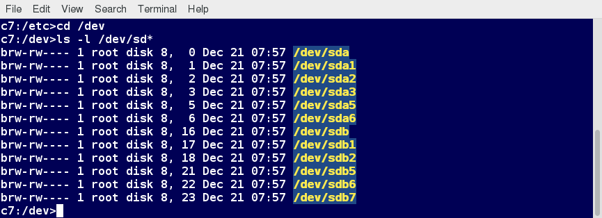

Seguretat en Linux
==================

Comptes d’usuari
----------------

El kernel de Linux permet als usuaris autentificats adequadament accedir
a fitxers i aplicacions. Si bé cada usuari s’identifica amb un nombre
enter únic (l’ID d’usuari o l’UID), una base de dades separada associa
un nom d’usuari a cada UID. Després de la creació del compte, s’afegeix
nova informació d’usuari a la base de dades d’usuaris i es crea el seu
directori personal omplint-lo amb alguns fitxers essencials. Els
programes de línia de comandaments com useradd i userdel, així com les
eines GUI, s’utilitzen per crear i eliminar comptes.

El fitxer ``/etc/passwd`` emmagatzema set camps referents als comptes
d’usuari, que són els següents:

-  | ``Username``: nom de l’usuari. Ha de ser d’entre 1 i 32 caràcters

-  | ``Contrasenya``: Generalment serà una x ja que es guarda a
     /etc/shadow xifrada. Normalment no es mostra en Linux quan s’escriu

-  | ``User ID (UID)``: Obligatori & UID 0 per a root, UID 1-99 estan
     reservats per comptes predefinits, UID 100-999 estan reservats pel
     sistema, UID :math:`\ge` 1000 per usuaris normals

-  | ``Group ID (GID)``: GID primari. Els GID es troben a
     ``/etc/group``. N’hem parlat al tema de processos

-  | ``User Info``: Opcional. Permet inserir informació extra. Exemple:
     Maria F. Enganxa Coll

-  | ``Directori Home``: Camí absolut al directori home. Exemple:
     ``/home/maria``

-  | ``Shell``: Ubicació de la shell per defecte .Exemple:
     ``/bin/bash``. Si posau ``/dev/null`` es desactiva el compte

La figura `[fig_1] <#fig_1>`__ mostra un exemple de fitxer
``/etc/passwd``.

.. figure:: figura1.png
   :alt: Fitxer /etc/passwd [fig_1]
   :width: 100mm

   Fitxer /etc/passwd [fig_1]

Tipus de comptes
----------------

Per defecte, Linux distingeix entre tipus de comptes per aïllar
processos i càrregues. Hi ha quatre tipus de comptes:

-  root

-  System

-  Normal

-  Network

Per tenir un entorn segur, és recomanable **donar els mínims privilegis
possibles i necessaris als comptes**, així com esborrar comptes
inactius. La utilitat **last** (`[fig_2] <#fig_2>`__) permet mostrar la
darrera vegada que un usuari ha entrat al sistema i pot ser emprat per
identificar comptes potencialment inactius candidats a ser eliminats.

Les pràctiques en sistemes professionals multi-usuari han de ser més
estrictes que en ordinadors personals d’escriptori que només afecten a
un usuari, sobretot amb seguretat.

   Exemple d’ús de last [fig_2]

Compte root
-----------

root és el compte més privilegiat d’un sistema Linux o UNIX. Aquest
compte té la possibilitat de dur a terme totes les facetes de
l’administració del sistema, incloses l’addició de comptes, el canvi de
contrasenyes d’usuari, l’examen de fitxers de log, la instal·lació de
programari, etc. Cal tenir molta cura quan s’utilitza aquest compte. No
té imposada cap restricció de seguretat.

Quan teniu la sessió iniciada com a usuari root, el símbol del símbol de
visualització es mostra “``#``” (si feu servir bash i no heu
personalitzat la consola). Aquesta convenció està destinada a
proporcionar-vos una advertència sobre el poder absolut d’aquest compte.

Operacions que requereixen root
-------------------------------

Les operacions que requereixen root són:

-  Crear, eliminar i gestionar comptes

-  Gestionar paquets de programari

-  Eliminar i modificar fitxers de sistema

-  Reiniciar serveis del sistema (i reiniciar o aturar el sistema en
   sí!)

-  En alguns casos, consultar fitxers de log

De vegades, els usuaris normals de Linux poden tenir permès també
instal·lar paquets i actualitzar algunes configuracions, emprar
dispositius externs etc. Ara bé, els permisos per això s’assignen des
del compte de root.

Operacions que no requereixen root
----------------------------------

Les següents operacions estan disponibles des dels comptes normals:

#. Executar un client de xarxa. Per exemple, compartir fitxers en xarxa.

#. Emprar dispositius (com USBs, CDs, impresores etc.). Per exemple,
   imprimir en xarxa.

#. Operacions sobre fitxers i directoris que l’usuari hi té accés.

#. Executar aplicacions i fitxers que tenen el bit de Set-UID activat.
   Per exemple, reiniciar el sistema o executar programes com
   **passwd**.

El bit de Set-UID (*Set Owner UID upon execution*, similar al Windows
*run as*) és un tipus especial de permís donat a un fitxer. Set-UID
provoca que, de forma temporal, quan un usuari executa un fitxer, es
faci amb els permisos del propietari del fitxer (que pot ser root)
enlloc dels permisos inherents a l’usuari inicial.

-  Assignar el bit de Set-UID es fa amb la comanda ``chmod +s <fitxer>``

-  Set-UID a directoris NO té efecte

-  Set-UID només pot aplicar-se a fitxers binaris executables, MAI en
   scripts!

sudo i su
=========

sudo vs su
----------

Emprar sudo o su té diferents efectes, tot i que ambdós donen a l’usuari
permisos de root. La taula `[tau_suvssudo] <#tau_suvssudo>`__ mostra
aquestes diferències.

+-------------------------------------------------------------------------------------------------------------------------------------------+-------------------------------------------------------------------------------------------------------------------------------------------------------------------------------------------------------------------------------------------------------------------------------------------------------------------+
| su                                                                                                                                        | sudo                                                                                                                                                                                                                                                                                                              |
+===========================================================================================================================================+===================================================================================================================================================================================================================================================================================================================+
| En elevar els privilegis haureu d'introduir la contrasenya de root. No heu de donar mai la contrasenya de root a un usuari normal.        | En elevar els privilegis, haureu d'introduir la contrasenya de l'usuari i no la de root.                                                                                                                                                                                                                          |
+-------------------------------------------------------------------------------------------------------------------------------------------+-------------------------------------------------------------------------------------------------------------------------------------------------------------------------------------------------------------------------------------------------------------------------------------------------------------------+
| Una vegada hagueu elevat els privilegis amb su, l'usuari podrà fer el que vulgui amb root sense tornar a ser demanat per una contrasenya. | Ofereix més funcions i es considera més segur i configurable. Es pot controlar i limitar amb exactitud el que es permet fer a l’usuari. Per defecte, l'usuari sempre haurà de seguir donant la seva contrasenya per fer altres operacions amb sudo, o pot evitar fer-ho durant un interval de temps configurable. |
+-------------------------------------------------------------------------------------------------------------------------------------------+-------------------------------------------------------------------------------------------------------------------------------------------------------------------------------------------------------------------------------------------------------------------------------------------------------------------+
| La comanda té funcionalitats de log limitades.                                                                                            | La comanda té funcionalitats de log més àmplies.                                                                                                                                                                                                                                                                  |
+-------------------------------------------------------------------------------------------------------------------------------------------+-------------------------------------------------------------------------------------------------------------------------------------------------------------------------------------------------------------------------------------------------------------------------------------------------------------------+

Funcionalitats de sudo
----------------------

sudo té la capacitat de fer un seguiment dels intents infructuosos de
tenir accés i permisos de root. L’autorització dels usuaris per
utilitzar sudo es basa en la configuració del fitxer ``/etc/sudoers`` i
al directori ``/etc/sudoers.d``.

Un missatge com el següent apareixerà en un fitxer de registre del
sistema (generalment ``/var/log/safe``) quan s’intenti executar
``sudo bash`` sense autenticar correctament l’usuari:

::

   authentication failure; logname=op \
   uid=0 euid=0 tty=/dev/pts/6 ruser=op rhost= user=op
   conversation failed
   auth could not identify password for [op]
   op : 1 incorrect password attempt ;
   TTY=pts/6 ; PWD=/var/log ; USER=root ; COMMAND=/bin/bash

sudoers
-------

Sempre que s’invoqui sudo, un *trigger* consultarà el fitxer
``/etc/sudoers`` i els fitxers de ``/etc/sudoers.d`` per determinar si
l’usuari té autorització per utilitzar sudo i quin és l’abast del seu
privilegi. Es denuncien sol·licituds d’usuari desconegudes per fer
operacions no permeses per a l’usuari, fins i tot amb sudo. Podeu editar
el fitxer sudoers mitjançant **visudo**, que assegura que només una
persona està editant el fitxer alhora, té els permisos adequats i es
nega a escriure el fitxer si hi ha un error en els canvis realitzats.

L’estructura bàsica d’una entrada sudo és:

::

    <qui> <on> = (<com qui>) OPCIONS: <què>

-  Qui: quins usuaris o grups inclou aquesta sentència. Un grup
   s’especifica amb un % davant,

-  On: a quins hosts es permet això. Poden ser hostnames, adreces IP
   específiques o una xarxa sencera.

-  Com qui: entre parèntesis, usuari i grup amb els quals podrà
   intercanviar privilegis l’usuari.

-  Opcions: seguit sempre de dos punts. Les més importants són NOPASSWD
   (no demanarà introduir contrasenya) i SETENV (per permetre l’usuari
   especificar variables d’entorn.

-  Què: quines comandes podrà executar amb aquests privilegis.

Per exemple:

::

   %sudo ALL=(ALL:ALL) ALL 
   # Qui: els membres del grup sudo
   # On: tots els hosts
   # Com qui: qualsevol usuari i grup (ALL:ALL) que desitgi
   # Què: qualsevol programa

En aquest exemple, si des d’un usuari del grup **sudo** feim
``sudo <el que sigui>`` executarà el programa com a usuari **root**
demanant contrasenya.

::

   monitor ALL=(slurm) NOPASSWD:/usr/bin/srun
   # Qui: Usuari monitor
   # On: tots els hosts
   # Com qui: usuari slurm (només usuari, no grup)
   # Opcions: NOPASSWD, no demanarà contrasenya per
   #          executar aquesta elevació de privilegis.
   # Què: només la comanda /usr/bin/srun

Si des de l’usuari **monitor** feim ``sudo /usr/bin/srun`` executarà el
programa com a usuari **slurm** sense demanar contrasenya.

Una manera de permetre a l’usuari **joan** executar sudo sense demanar
contrasenya pot ser:

::

   joan ALL=(ALL:ALL) NOPASSWD: ALL 

El fitxer té documentació en el seu interior sobre com personalitzar-lo.
La majoria de distribucions Linux actuals prefereixen que s’afegeixi el
fitxer al directori ``/etc/sudoers.d`` amb el mateix nom de l’usuari
(p.ex ``/etc/sudoers.d/joan``. Aquest fitxer conté configuració de sudo
per a l’usuari. La configuració mestre, és a dir, el fitxer
``/etc/sudoers``, es recomana que no es toqui.

logging de comandes
-------------------

Per defecte, les comandes i errades detectades per **sudo** es loggegen
a ``/var/log/auth.log`` a Debian i a ``/var/log/messages`` o
``/var/log/secure`` en altres sistemes. Això és un aspecte important per
fer seguiment de l’ús de sudo. Una entrada conté:

-  Nom d’usuari que ha fet sudo

-  Informació del terminal emprat

-  Directori de treball

-  A quin compte d’usuari s’ha intentat escalar

-  Comanda que s’ha intentat executar

Per exemple, la comanda ``sudo whoami`` produeix la següent línia:

::

    Dec 8 14:20:47 server1 sudo: op : TTY=pts/6 \
    PWD=/var/log USER=root COMMAND=/usr/bin/whoami

Aïllament de processos
----------------------

Linux es considera més segur que molts altres sistemes operatius perquè
els processos estan aïllats de manera natural els uns dels altres. Un
procés normalment no pot accedir als recursos d’un altre procés, fins i
tot quan aquest procés s’executa amb els mateixos privilegis d’usuari.
Així, Linux fa difícil (tot i que no impossible) que els virus i les
explotacions de seguretat accedeixin i ataquin a recursos aleatoris en
un sistema.

Els mecanismes de seguretat addicionals més recents que limiten els
riscos són:

-  Grups de control (**cgroups**): permeten als administradors del
   sistema agrupar processos i associar recursos finits a cada cgroup.

-  Contenidors: permeten executar diversos sistemes aïllats de Linux
   (contenidors) en un sol sistema fent servir la tecnologia de cgroups.

-  Virtualització: el maquinari s’emula de manera que no només es poden
   aïllar els processos, sinó que els sistemes sencers s’executen
   simultàniament com a sistemes aïllats (màquines virtuals) en un host
   físic.

Accés al hardware
-----------------

Linux limita l’accés dels usuaris al maquinari que no és de xarxa de
manera molt similar a l’accés regular als fitxers. Les aplicacions
interactuen mitjançant la capa del sistema de fitxers (independent del
dispositiu o del maquinari on el fitxer resideix). Aquesta capa obrirà
llavors un fitxer especial del dispositiu (sovint anomenat node del
dispositiu) al directori /dev, que correspon al dispositiu al qual
s’accedeix. Cada fitxer especial del dispositiu té els permisos de
propietari, grup i altres. La seguretat s’aplica de forma natural igual
que quan s’accedeix als fitxers estàndard.

Els discs durs, per exemple, es representen com a /dev/sd\* (vegeu la
figura `[fig_3] <#fig_3>`__. Mentre que un usuari arrel pot llegir i
escriure al disc de manera bruta, per exemple, fent alguna cosa com:

::

    $ echo hello world > /dev/sda1 

els permisos estàndard tal com es mostra a la figura fan que els usuaris
habituals ho puguin fer. Escriure a un dispositiu d’aquesta manera pot
també eliminar fàcilment el sistema de fitxers que s’hi emmagatzema de
manera que no es pugui reparar sense esforços importants. La lectura i
escriptura normal de fitxers del disc dur per part de les aplicacions es
fa a un nivell més alt a través del sistema de fitxers i mai mitjançant
un accés directe al node del dispositiu.

   Llista de fitxers especials de dispositiu a /dev/ [fig_3]

Mantenir el sistema actualitzat
-------------------------------

Quan es descobreixen problemes de seguretat al kernel de Linux o a les
aplicacions i biblioteques, les distribucions de Linux tenen un
mecanisme de reacció ràpida per actualitzar els seus repositoris de
programari i enviar notificacions per actualitzar el sistema
immediatament. El mateix passa amb les correccions d’errors o bugs i les
millores de rendiment que no estan relacionades amb la seguretat.

Tanmateix, és ben sabut que molts sistemes no s’actualitzen amb prou
freqüència i els problemes que ja han estat resolts podran romandre als
ordinadors durant molt de temps. Això és particularment cert amb els
sistemes operatius propietaris en què els usuaris no són informats o
desconfien de la política de revisió del venedor, ja que de vegades les
actualitzacions poden causar nous problemes i trencar les operacions
existents. Molts dels vectors atacs més reeixits provenen de
l’explotació de forats de seguretat dels quals ja es coneixen les
solucions, però no es despleguen de manera universal.

Així doncs, la millor pràctica és aprofitar el mecanisme de distribució
de Linux per a les actualitzacions automàtiques i no ajornar-les mai. És
extremadament rar que una actualització causi nous problemes.

EXERCICI PRÀCTIC - Ús de sudo
-----------------------------

#. Creau un usuari nou amb **useradd** i donau-li una contrasenya
   inicial amb **passwd**.

#. Configurau l’usuari per poder emprar sudo correctament,

#. Loggejau-vos amb aquest usuari i provau d’executar sudo (p. ex.
   ``su`` o ``ls /root``)

Contrasenyes
============

El sistema verifica l’autenticitat i identitat emprant credencials
d’usuari.

Originalment, es guardaven les contrasenyes a ``/etc/passwd``, que era
llegible per a tothom. Això feia més fàcil crackejar les contrasenyes.

Actualment, les contrasenyes es guarden xifrades a un fitxer anomenat
``/etc/shadow``. Només root pot modificar o llegir aquest fitxer.

Algoritme de xifrat
-------------------

Protegir les contrasenyes dels usuaris d’un sistema és crucial. La
majoria de contrasenyes avui en dia es guarden amb un algoritme de
xifratge modern anomenat SHA-512 (Secure Hashing Algorithm 512 bits)
desenvolupat per la NSA.

Aquest algoritme és emprat abastament amb altres aplicacions de
seguretat i protocols. Alguns d’ells són TLS, SSL, PHP, SSH, S/MIME o
IPSec. SHA-512 és un dels algoritmes de hash més provats.

Podeu provar-ho amb la utilitat **sha512sum**. Per codificar la paraula
“test” farem:

::

    echo -n test | sha512sum
    ee26b0dd4af7e749aa1a8ee3...

Bones pràctiques en la gestió de contrasenyes
---------------------------------------------

Els professionals de les TI segueixen diverses bones pràctiques per
assegurar les dades i les contrasenyes de tots els usuaris.

-  L’\ *aging* de contrasenyes és un mètode per obligar als usuaris a
   canviar una contrasenya després d’un període determinat. Això pot
   assegurar que les contrasenyes només es podran utilitzar durant un
   temps limitat. Aquesta funcionalitat s’implementa mitjançant l’eina
   **chage**, que configura la caducitat de la contrasenya per a un
   usuari. Vegeu la figura `[fig_4] <#fig_4>`__.

-  Un altre mètode és obligar els usuaris a establir contrasenyes fortes
   mitjançant mòduls d’autenticació (*Pluggable Authentication Module* o
   PAM). Es pot configurar PAM per verificar automàticament que una
   contrasenya creada o modificada mitjançant la utilitat **passwd**
   sigui prou forta. La configuració PAM s’implementa mitjançant una
   biblioteca anomenada **pam_cracklib.so**, que també es pot substituir
   per **pam_passwdqc.so** entre d’altres.

-  També es poden instal·lar programes de cracking de contrasenyes, com
   **John The Ripper**, per assegurar el fitxer de contrasenyes i
   detectar contrasenyes febles. Es recomana obtenir l’autorització per
   escrit de l’usuari abans d’instal·lar aquestes eines en qualsevol
   sistema.

   Exemple d’ús de chage [fig_4]

EXERCICI PRÀCTIC
----------------

Amb l’usuari anteriorment creat, mirau la caducitat de la contrasenya.

Modificau-ne la data d’expiració al passat i mirau què succeeix.
Consultau de nou la caducitat de la contrasenya.

Seguetat en arrancada i en el hardware
======================================

Contrasenya al bootloader
-------------------------

Es pot securitzar el procés d’arrancada del sistema amb una contrasenya
per prevenir que algú pugui intentar manipular la màquina físicament.

Amb màquines amb el bootloader GRUB de versió inferior a la 1 podeu
invocar el programa **grub-md5-crypt**, que demanarà una contrasenya
abans d’encriptar-lo. Després s’ha d’editar el fitxer
``/boot/grub/grub.conf`` i afegir la línia:

::

    password --md5 $1$74r8m1$NmkE69eAjXre.oF1k0cyk/

Es poden forçar contrasenyes per només algunes entrades de boot.

En la versió 2 del grub, la qüestió es complica. Es poden especificar
contrasenyes específiques per usuari i es modifiquen els fitxers de
/etc/grub.d, emprant després l’eina **update-grub** per consolidar
aquests canvis.

Més informació a l’enllaç
https://help.ubuntu.com/community/Grub2/Passwords.

Vulnerabilitats de hardware
---------------------------

Una màquina accessible físicament pot gairebé considerar-se una màquina
exposada. Els possibles vectors d’atacs són:

-  **Keyloggers**: guarden l’activitat en temps real de l’ordinador,
   incloent les tecles pitjades. Aquestes dades poden ser guardades
   localment o transmeses a màquines remotes.

-  **Sniffing de xarxa**: captura i posterior anàlisi de les dades
   transmeses per la xarxa.

-  Arrancar amb un sistema operatiu Live, de rescat o per xarxa.

-  Remuntar el disc i modificar el contingut

La política de seguretat IT ha de contemplar mesures per securitzar
l’accés físic a servidors i ordinadors d’escriptori. L’accés físic fan
possibles atacs de molt baix nivell i fa les recomanacions de seguretat
a nivell de sistema irrellevants.

Algunes bones pràctiques són:

#. Tenir tancats els ordinadors d’oficina i servidors baix pany i clau.

#. Protegir les troncals i enllaços de la xarxa fent-los no accessibles
   per a qualsevol.

#. Protegir els teclats i assegurar-se de que no estan sent compromesos.

#. Assegurar la BIOS del sistema de forma que impedeixi arrancar-lo amb
   un sistema operatiu Live.

Pot semblar exagerat per PCs d’un sol usuari (oficina etc.), però el
cert és que un bon vector d’atac sol ser l’enginyeria social. L’accés no
autoritzat a les oficines i els descuits (contrasenyes en postits,
revelar informació per telèfon) poden ser un problema. Es recomana
aplicar bones pràctiques en general.

Vulnerabilitats de software
---------------------------

Com a qualsevol altre sistema, sovint es descobreixen vulnerabilitats en
el software de l’ecosistema Linux. L’avantatge de Linux i de la
comunitat Open Source és que aquestes vulnerabilitats són exposades i
corregides de forma ràpida. És un mite, per tant, l’afirmació de que les
aplicacions de codi lliure són més insegures.
