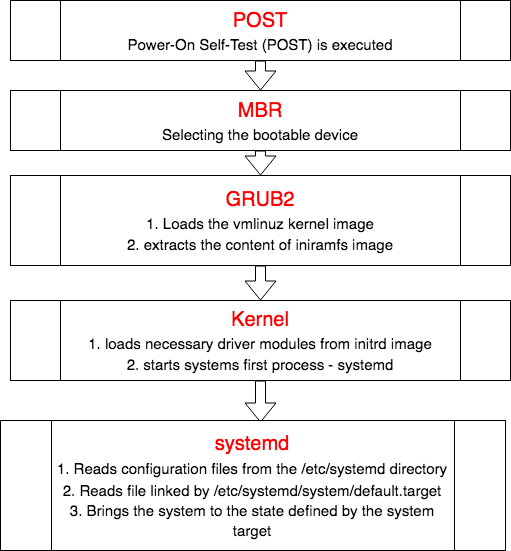
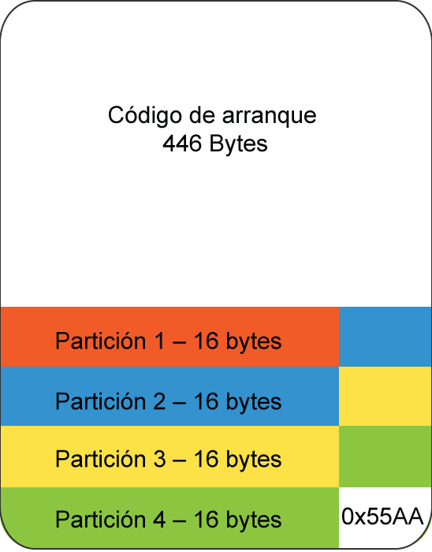
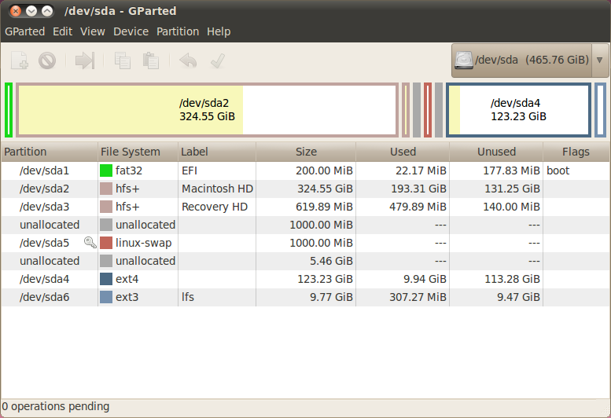

Inici i apagat del sistema
==========================

El procés d’arrancada o boot és el procediment per iniciar el sistema.
Arrancar un sistema x86 basat en Linux involucra varis passos. En
aquesta primera secció els analitzarem i en veurem els aspectes més
importants.

Podeu veure un esquema de l’arrancada del sistema a la figura
`[fig_1] <#fig_1>`__.

   Procés d’arrancada del sistema. [fig_1]

Entorns BIOS/MBR
----------------

Un entorn **BIOS**\ (Basic Input/Output System)/MBR(Master Boot Record)
és el que es coneix com a l’entorn on el procés d’arrancada fa servir el
*firmware* BIOS. La BIOS és firmware d’arrancada encastat dins les
plaques base antigues.

El bootloader de fase 1 és un firmware en codi màquina que està inclòs a
l’inici de l’MBR. En Linux, tenim varis bootloaders de fase 1
disponibles. El més important és **GRUB (Stage 1)**, però n’hi ha
d’altres com LILO, efilinux o Das U-Boot en sistemes encastats. El
bootloader de fase 1 també es coneix com a bootloader intermedi.

L’MBR són els primers 512 bytes del disc dur. Aquests 512 bytes
inclouen:

-  Els primers 446 bytes inclouen el bootloader, generalment s’anomena
   **bootloader de fase 1**. És a dir, el codi màquina per començar a
   arrancar el sistema.

-  Els següents 64 bytes inclouen la taula de particions, que veurem amb
   més detall en el tema de particionat.

-  Els darrers 2 bytes són un número especific anomenat *magic number*,
   que sempre té el valor hexadecimal 0x55AA.

Podeu veure l’estructura del Master Boot Record a la figura
`[fig_2] <#fig_2>`__.

   Estructura del MBR. [fig_2]

Procés d’arrancada en entorns BIOS/MBR
--------------------------------------

Quan s’encén l’ordinador, un *firmware* anomenat **BIOS** o **UEFI** (en
els ordinadors més moderns), que es troba incrustat en la placa base,
inicialitza el hardware i fa un test de la memòria RAM. Aquest procés
s’anomena **POST** (Power On Self Test).

Bootloader de fase 1
~~~~~~~~~~~~~~~~~~~~

El bootloader de fase 1 és el programa que serveix per arrancar el
sistema en primera instància. El procés consisteix en:

#. El firmware de la BIOS cerca, dins l’MBR (els 512 primers bytes del
   disc dur) el bootloader de fase 1.

#. El control del sistema passa a aquest bootloader de fase 1,
   generalment el **GRUB (Stage 1)**

Bootloader de fase 2
~~~~~~~~~~~~~~~~~~~~

Una vegada el bootloader de fase 1 està carregat en RAM, ens topam amb
un problema. 446 bytes per emmagatzemar un programa capaç de llegir
sistemes de fitxers complexos és insuficient. Per això, hem de carregar
un bootloader més complet, anomenat **bootloader de fase 2**. Tot i ser
petit, el bootloader de fase 1 és capaç de llegir particions senzilles
que ens permetran trobar el bootloader de fase 2.

El procés és:

#. El bootloader de fase 1 examina la taula de particions del disc i
   cerca una partició marcada com a *bootable*

#. Cerca el bootloader de fase 2.

#. Carrega el bootloader de fase 2 en memòria RAM i l’executa,

#. Podria ser que el bootloader de fase 2 estés en una partició no
   llegible pel bootloader de fase 1, per exemple, si la partició de
   /boot està sistemes de fitxers o hardware específics. En aquests
   casos, el bootloader de fase 1 pot passar abans pel bootloader de
   fase 1.5, amb capacitat per llegir particions més complexes.

Arrancada del kernel
~~~~~~~~~~~~~~~~~~~~

Una vegada carregat el bootloader final, que pot presentar una
interfície d’usuari amb diferents opcions (com es veu a la figura
`[fig_3] <#fig_3>`__), aquest descomprimirà i carregarà la imatge del
kernel i una imatge de la memòria RAM inicial amb els sistemes i drivers
necessaris per arrancar el sistema.

.. figure:: figura3.png
   :alt: Imatge del procés d’arrancada quan el sistema ha carregat el GRUB de fase 2. [fig_3]
   :width: 100mm

   Imatge del procés d’arrancada quan el sistema ha carregat el GRUB de fase 2. [fig_3]

Entorns UEFI
------------

En entorns UEFI (*Unified Extensible Firmware Interface*), UEFI és un
firmware encastat dins les plaques base més modernes que realitza
tasques més complexes que el firmware BIOS. UEFI pot llegir particions i
sistemes de fitxers, per exemple. UEFI és capaç de muntar sistemes de
fitxers i carregar aplicacions UEFI, que són les que arrancaran el
sistema.

UEFI empra taules de particions de tipus GPT, que són més complexes i
versàtils que les taules MBR. Les taules de particions GPT en entorns
UEFI inclouen una partició específica d’arrancada anomenada **EFI
Partition**. Podeu veure un exemple de l’estructura a la figura
`[fig_4] <#fig_4>`__. Fixau-vos en la partició /dev/sda1, la EFI
Partition.

El sistema de fitxers d’aquesta partició EFI està basat en FAT. El
firmware UEFI és capaç de llegir aquestes particions. Inclou una
estructura de directoris com la següent:

::

    /EFI
       /Boot
       /Microsoft/
       /ubuntu
       /refind

Com es pot deduir, cada sistema operatiu en entorns UEFI disposa del seu
propi bootloader (per exemple GRUB en sistemes Linux, que s’anomena
*grubx64.efi*). Aquest bootloader pot mostrar algun tipus de menú i
d’arrancar un sistema operatiu.

Els entorns UEFI inclouen també compatibilitat amb entorns BIOS/MBR.
Això ho fan incloent un sector MBR anomenat *Protective MBR* a l’inici
del disc.

   Estructura d’un disc amb entorn UEFI. [fig_4]

Procés d’arrancada en entorns UEFI
----------------------------------

El firmware UEFI encastat dins el sistema no necessita d’un bootloader
de fase 1. Aquest firmware ja és capaç de llegir sistemes de fitxers
complexos i pot carregar directament el bootloader final de fase 2.

#. El firmware UEFI munta la partició EFI, marcada com a *bootable*.

#. Llegeix la partició EFI, que conté l’estructura mostrada
   anteriorment, amb aplicacions UEFI (bootloaders) per cada sistema
   operatiu instal·lat.

#. Mostra (o no) a l’usuari la possibilitat de carregar un o altre
   bootloader. Quan aquest es carrega, el procés segueix el mateix curs
   que el bootloader de fase 2 en entorns BIOS/MBR.

#. El bootloader de fase 2 final carrega el kernel i la imatge de la
   memòria RAM (initrd o initramfs) incial.

Initial RAM Disk (initramfs)
----------------------------

L’initial RAM Disk o **initramfs** es tracta d’una imatge que conté els
programes i binaris que fan les accions necessàries per muntar el
sistema de fitxers arrel i proveeixen les funcionalitats per llegir el
hardware extern. La lectura d’aquest hardware es fa amb una eina
anomenada udev (user device) que cerca quins dispositius són presents,
en localitza els drivers i els carrega. Una vegada troba el sistema de
fitxers arrel en cerca errors i el munta.

El programa **mount** instrueix al SO que un sistema de fitxers pot ser
emprat i l’associa amb un punt de muntatge de la jerarquia del sistema
de fitxers. Si aquesta operació funciona correctament, s’esborra
l’initramfs de la RAM i s’executa el programa init (/sbin/init) a
l’arrel del sistema de fitxers.

Login
-----

Una vegada arrencat el sistema, el procés init inicia vàries
**terminals** de login en mode text (Virtual Terminals). Aquestes
permeten entrar al sistema amb l’usuari i contrasenya i al final
aconseguir una línia de comandes.

GRUB
====

Pràcticament tots sistemes basats en x86 de Linux (deixant de banda
l’esfera dels sistemes encastats) **usen GRUB** actualment (Grand
Unified Bootloader) per manejar les primeres fases d’arrencada del
sistema. Altres plataformes poden tenir altres equivalents, com ELILO,
utilitzat en sistemes EFI com IA64 (Itanium) i Das O-BOOT utilitzat en
moltes configuracions de sistemes encastats.

Característiques de GRUB
------------------------

-  Sistemes operatius alternatius poden ser elegits en el moment de
   l’arrencada.

-  Els kernels alternatius o els initramfs inicials poden ser elegits
   durant l’arrencada per a un determinat sistema operatiu.

-  Poden modificar-se paràmetres d’arrancada fàcilment sense haver
   d’editar fitxers de configuració prèviament.

Distribucions antigues de Linux (p.ex. RHEL 6) empren una versió antiga
de GRUB(1.0), però la més recent és **GRUB 2**.

El fitxer de configuració bàsic d’arrancada de GRUB 2 es troba a
``/boot/grub/grub.cfg`` o ``/boot/grub2/grub.cfg``.

Aquest fitxer és **autogenerat** amb **update-grub** o
**grub2-mkconfig** a RHEL 7 bastant-se en els fitxers de configuració
del directori /etc/grub.d i /etc/default/grub. Mai s’ha d’editar a mà.

En GRUB 1, el fitxer de configuració era ``/boot/grub/grub.cfg`` o
``/boot/grub/menu.lst``. Es recomana no editar-los a mà.

Seleccions interactives amb GRUB
--------------------------------

A l’arrencada del sistema, després de les etapes inicials del POST i
BIOS, GRUB s’executarà i mostrarà el menú de la figura
`[fig_3] <#fig_3>`__.

Aquest pot o no tenir gràfics en ell (almenys per al fons de pantalla de
splash). El menú conté una llista d’imatges d’arrencada d’un o més
sistemes operatius o distribucions de Linux. A GRUB 2 també poden
haver-hi submenús amb encara més opcions.

Usant les fletxes amunt i avall i la tecla Enter, podeu seleccionar
l’opció d’arrencada o pot esperar durant un període de temps
configurable abans d’entrar en l’opció per defecte.

No obstant això, és possible fer molt més. Després de seleccionar una
entrada, pot escriure, editar i entrar en una *shell* interactiva. En
aquesta *shell*, pot modificar la secció a l’arxiu de configuració que
descriu aquesta opció d’arrencada particular. En general, això es fa per
**modificar els paràmetres d’arrancada del kernel**; per exemple,
afegint la paraula ``single`` al final de la línia d’ordres farà que el
sistema arrencada en mode **monousuari**.

Recordeu que qualsevol canvi que realitzi en la configuració no és
persistent i es perdrà en el següent inici. Per realitzar canvis
permanents, cal modificar els arxius en el sistema, usant les eines
adequades.

També és possible obtenir una shell de GRUB en lloc d’editar una secció
en particular. Podeu executar una sèrie d’ordres diferents i fins i tot
tractar de reinstal·lar o reparar GRUB. Si hi ha problemes seriosos, com
no trobar un fitxer de configuració, GRUB torna a la línia d’ordres i
podríeu rescatar el sistema sense haver de recórrer als mitjans físics
(DVDs).

Instal·lació de GRUB
--------------------

Instal·lar GRUB es pot entendre de 3 formes diferents:

-  Instal·lar el paquet GRUB i les seves eines i utilitats associades
   (``$ sudo yum install grub``)

-  Instal·lar els fitxers de GRUB que es necessiten per executar el
   bootloader de fase 2. És a dir, els fitxers de /boot/grub i
   /boot/grub2.

-  Instal·lar GRUB de fase 1 a l’MBR.

Generalment, les dues darreres opcions es duen a terme amb la comanda:

::

    $ sudo grub2-install /dev/sda

Aquesta comanda instal·la tant el GRUB de fase 1 (al MBR de /dev/sda)
com el GRUB de fase 2 al directori /boot/grub.

Nomenclatura dispositius GRUB
-----------------------------

En totes les versions de **GRUB**, el primer disc s’anomena **hd0**, el
segon **hd1** etc. La partició en concret s’afegeix amb una coma. Per
exemple:

-  sda1 és hd0,1

-  sdc4 és hd2,4

Al fitxer de configuració, cada secció especifica la partició **arrel**.
Això és diferent al directori arrel del sistema. En aquest context,
significa la partició que conté el kernel. En molts casos, la partició
/boot està separada (per exemple /dev/sda1). D’aquesta manera, la
partició arrel seria hd0,1.

També veurem en alguns casos una nomenclatura de l’estil:

::

    hd0,msdos1

**msdosX** fa referència a que es tracta de taules de partició DOS (o
MBR). En aquest cas, la partició DOS 1 del disc 0.

Personalitzant GRUB
-------------------

Per editar GRUB no s’ha de modificar grub.cfg directament. Podem
modificar /etc/default/grub o també /etc/grub.d/, que inclou un conjunt
de fitxers interpretats en ordre ascendent.

EXERCICI PRÀCTIC - GRUB
-----------------------

-  Reiniciau la màquina virtual i anau a la consola interactiva de GRUB.
   Heu d’entrar a un entorn com el que es mostra a la figura
   `[fig_5] <#fig_5>`__. Pensau que el compte enrere vos arrancarà la
   màquina si no pitjau cap tecla. Pitjau les tecles d’amunt i avall
   perquè es quedi en aquest menú.

   .. figure:: figura5.png
      :alt: Grub de la màquina virtual. [fig_5]
      :width: 100mm

      Grub de la màquina virtual. [fig_5]

-  Arrancau el sistema operatiu en runlevel 5. Per això, heu d’afegir un
   5 al final de la línia on s’especifiquen els paràmetres del kernel.

-  Comprovau que ho heu fet bé entrant al sistema i executant
   ``$ runlevel``.

-  Reiniciau de nou i tornau a comprovar el runlevel.

init: SystemV, Upstart, Systemd
===============================

El bootloader carrega tant el kernel com l’initramfs a la memòria, de
forma que l’initramfs pot ser emprat pel kernel directament. Quan es
carrega el kernel en RAM, automàticament prepara la memòria i comença
l’execució dels processos. El primer procés que carrega és /sbin/init,
que comença sent el procés inicial que posteriorment arrancarà tota la
resta.

La majoria dels altres **processos del sistema** tenen per origen aquest
procés **init**, però alguns altres processos anomenats de kernel són
executats pel **kernel directament**.

A més de començar el sistema, init és responsable de **mantenir el
sistema en marxa i de tancar-lo** netament. Una de les seves
responsabilitats és actuar quan sigui necessari com a gestor de tots els
processos que no siguin del nucli; els neteja després d’haver completat
la seva tasca i reinicia els serveis d’inici de sessió de l’usuari.

System V
--------

Tradicionalment, l’inici d’aquest procés es feia mitjançant convencions
que es remuntaven als anys vuitanta i la varietat SystemV d’UNIX. Aquest
procés en sèrie fa que el sistema passi a través d’una seqüència de
nivells d’execució que contenen col·leccions de scripts que inicien i
aturen els serveis. Cada nivell d’execució suporta un mode diferent
d’executar el sistema. Dins de cada nivell d’execució, els serveis
individuals poden configurar-se en funcionament o tancar-los en cas de
funcionar.

Tot i això, totes les principals distribucions recents s’han allunyat
d’aquest mètode d’execució de nivell seqüencial d’inicialització del
sistema, tot i que generalment admeten les convencions del System V amb
finalitats de compatibilitat.

De vegades ens referirem indistitament a SystemV com a SysVinit.

Runlevels de SystemV
~~~~~~~~~~~~~~~~~~~~

Un sistema SysVinit s’inicia a través d’una seqüència de *runlevels*
(nivells d’execució) que defineixen diferents estats del sistema; estan
numerats del 0 al 6.

El nivell d’execució 0 està reservat per a l’apagat del sistema, el
nivell d’execució 1 per al mode monousuari i el nivell d’execució 6 per
reiniciar el sistema.

Els altres runlevels s’usen per definir quins serveis estan executant-se
en un sistema normal; segons el cas, les distribucions ho defineixen de
forma diferent. Per exemple, en sistemes basats en Red Hat, runlevel 2
es defineix com un sistema en funcionament sense xarxa ni servidor X,
nivell d’execució 3 inclou suport de xarxa, i nivell d’execució 5 inclou
xarxa i X. Vegeu-ho a la taula `[taula_runlevel] <#taula_runlevel>`__.

============ ==========================================================
**Runlevel** **Descripció**
S,s          Igual que 1
0            Apagat del sistema
1            Mode monousuari
2            Mode multiusuari, sense NFS i login de text solament
3            Mode multiusuari, amb NFS i xarxa i login de text solament
4            No emprat
5            Mode multiusuari, amb NFS i xarxa i entorn gràfic amb X
6            Reinici
============ ==========================================================

[taula_runlevel]

El runlevel actual pot consultar-se amb:

::

    $ runlevel

I pot canviar-se el runlevel actual amb:

::

    $ sudo /sbin/telinit 5

Scripts d’inici SysVInit
~~~~~~~~~~~~~~~~~~~~~~~~

El mètode tradicional és que primer s’executi l’script ``rc.sysinit``,
el qual realitza nombroses funcions, com iniciar LVM, muntar sistemes
d’arxius, etc. Aquest script resideix en el directori /etc, però
probablement el trobareu a /etc/rc.d amb un enllaç simbòlic a /etc.

A continuació, s’executa l’script **rc** (en el mateix directori) amb el
nivell d’execució desitjat com a argument. Això fa que el sistema vagi
al directori rc.d/rc[0-6].d i executi tots els scripts que són allà:

::

    $ ls  -lF /etc/rc.d/rc5.d
   total 0
   lrwxrwxrwx. 1 root root 14 Sep 3 10:05 K05pmcd -> ../init.d/pmcd*
   lrwxrwxrwx. 1 root root 14 Sep 3 10:05 K05pmie -> ../init.d/pmie*
   lrwxrwxrwx. 1 root root 18 Sep 3 10:05 K05pmlogger -> ../init.d/pmlogger*
   lrwxrwxrwx. 1 root root 15 Sep 3 10:05 K05pmmgr -> ../init.d/pmmgr*
   lrwxrwxrwx. 1 root root 17 Sep 3 10:05 K05pmproxy -> ../init.d/pmproxy*
   lrwxrwxrwx. 1 root root 16 Sep 3 10:05 K05pmwebd -> ../init.d/pmwebd*
   ...

L’script rc.local pot ser emprat per iniciar aplicacions específiques
del sistema.

-  Tots els scripts reals estan a /etc/init.d. Dins cada directori
   d’execució només hi ha enllaços.

-  Els scripts d’inici comencen amb **s**

-  Els scripts de detenció comencen amb **k**

Per tal de generar aquests enllaços i habilitar que un servei s’executi
en l’arrancada o no, empram l’eina **chkconfig**.

Per exemple:

Veure serveis configurats per córrer en cadascun dels runlevels:

::

    $ chkconfig --list

Configurar un servei perquè s’executi al pròxim reinici:

::

   $ sudo chkconfig some_service on

Configurar un servei perquè no s’executi al pròxim reinici:

::

   $ sudo chkconfig some_service off

Això en sí mateix no arranca un servei. Per arrancar serveis amb
SysVInit empram la comanda **service**. Per exemple, per posar en marxa,
aturar, veure l’estat, reiniciar etc. un servei podem fer:

::

   $ sudo service some_service [ stop | start | status | restart | reload ]

Per exemple:

::

   $ sudo service network status
   $ sudo service vsftpd restart

SystemD
-------

SysVinit intepretava l’inici com un procés en sèrie, dividit en una
sèrie d’etapes seqüencials. Cada etapa necessitava completar-se abans
que pogués continuar la següent. Així, el procés d’inici no implementava
processament paral·lel que es podia fer en diversos processadors o
nuclis.

A més, en l’època del sistema SysVInit tancar i reiniciar el sistema era
un event rar. Això ja no és cert, sobretot en dispositius mòbils i
sistemes Linux incrustats. Alguns mètodes moderns, com l’ús de
contenidors, poden requerir temps d’inici gairebé instantanis. Per tant,
ara els **sistemes requereixen mètodes amb capacitats més ràpides** i
millorades. Finalment, els mètodes anteriors requerien scripts d’inici
bastant complicats, que eren difícils de mantenir entre versions de
distribució, versions del nucli, arquitectures i tipus de sistemes. Les
dues principals alternatives desenvolupades van ser:

-  Upstart: desenvolupat per Ubuntu el 2006 però que ja ha estat
   abandonat.

-  Systemd: adoptat el 2011 per Fedora. Ha suscitat controvèrsia però
   finalment ha estat implementat a totes les distribucions.

Característiques de SystemD
~~~~~~~~~~~~~~~~~~~~~~~~~~~

-  Els complexos scripts d’inici han estat substituits per fitxers de
   configuració.

-  El procés d’inici (anteriorment /sbin/init) ara apunta a
   /lib/systemd/systemd.

-  És compatible amb els scripts de sysvinit.

-  Inicia més ràpid que els sistemes anteriors.

-  Proveeix altes capacitats de paral·lelització.

-  Reemplaça scripts de shell scripts amb programes.

-  Ofereix inici de *daemons* sobre demanda.

-  Realitza seguiment dels processos usant cgroups.

-  Suporta la creació de snapshots i restauració de l’estat del sistema.

-  Manté punts de muntatge i automuntatge.

-  Implementa una elaborada lògica de control de servei basada en
   dependència transaccional.

En molts casos, es manté la compatibilitat amb la sintaxi de SysVInit.
L’eina **service** ara invoca a systemd.

systemctl
~~~~~~~~~

**systemctl** és l’eina principal per manejar serveis. La sintaxi bàsica
és:

::

    $ systemctl [options] command [name]

Alguns exemples:

-  Veure l’estat de tot el que controla **systemd**

   ::

        $ systemctl

-  Veure tots els serveis disponibles (no cal ser root)

   ::

        $ systemctl list-units -t service --all

-  Mostrar serveis actius solament (no cal ser root)

   ::

        $ systemctl list-units -t service

-  Iniciar o activar una o més **unitats** (servei o socket)

   ::

        $ sudo systemctl start foo
        $ sudo systemctl start foo.service
        $ sudo systemctl start /path/to/foo.service

-  Per aturar un servei

   ::

        $ sudo systemctl stop foo.service

-  Per habilitar o deshabilitar (fer que arranqui o no en l’inici)

   ::

        $ sudo systemctl enable sshd.service
        $ sudo systemctl disable sshd.service

EXERCICI PRÀCTIC - Afegir un servei nou amb systemd
---------------------------------------------------

Seguiu el PDF LAB_4.2.pdf.
